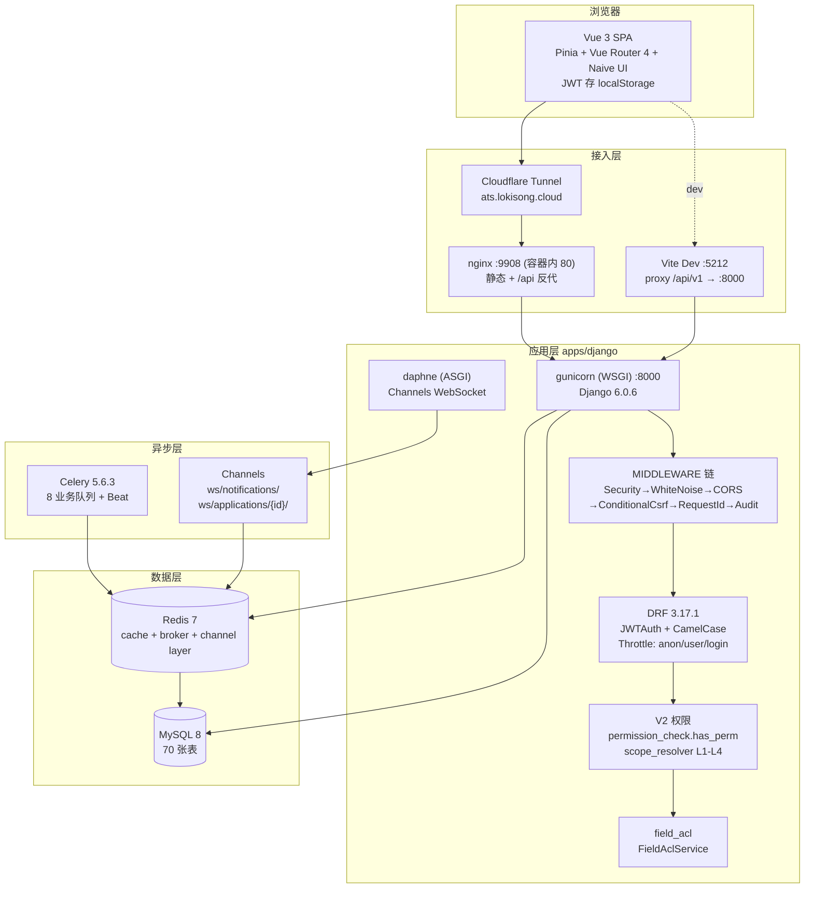

# 02 - 整体架构

## 1. 架构总图



## 2. 请求生命周期

一次典型 API 请求（`POST /api/v1/applications/{id}/transition/`）：

```
浏览器 (axios, JWT Bearer)
  → Vite dev proxy / nginx 反代
  → gunicorn (WSGI)
  → MIDDLEWARE 链（见 §3）
  → DRF 路由（config/urls.py → apps/application/urls.py → ApplicationViewSet）
  → 认证：SimpleJWT Authentication（从 Authorization header 解出 user）
  → 节流：ScopedRateThrottle（anon 60/min, user 1000/min, login 5/min）
  → 权限：V2Permission.has_perm(resource_code) （超管 bypass）
  → ViewSet action → Service 层（业务事务）
      ↳ FSM @transition 校验状态流转
      ↳ field_acl 序列化期字段过滤
      ↳ audit 信号写审计日志
  → CamelCase JSON 渲染返回
```

关键设计：

- **FSM 保护**：所有状态字段 `FSMField(protected=True)`，直接赋值会抛 `AttributeError`，必须走 `@transition` 方法（详见 [04-数据模型与状态机](./04-数据模型与状态机.md)）。
- **服务层模式**：ViewSets 薄、Services 厚。跨模型事务统一放 `apps/*/services/`。
- **审计**：`AuditMiddleware` 记录非 GET 写操作与 5xx 响应，含失败计数、日志降级与熔断保护（写审计失败不阻断业务）。

## 3. 中间件链（顺序敏感）

`config/settings/base.py:150-166`：

| 顺序 | 中间件 | 说明 |
|---|---|---|
| 1 | `django.middleware.security.SecurityMiddleware` | 安全头 |
| 2 | `whitenoise.middleware.WhiteNoiseMiddleware` | 静态文件服务（含前端 dist） |
| 3 | `corsheaders.middleware.CorsMiddleware` | 跨域（须在 Common 之前） |
| 4 | `django.contrib.sessions.middleware.SessionMiddleware` | 会话（admin 用） |
| 5 | `django.middleware.common.CommonMiddleware` | 通用 |
| 6 | `apps.core.middleware.ConditionalCsrfMiddleware` | **自定义**：API 路径（JWT）豁免 CSRF，`/admin/` 等仍走标准 CSRF |
| 7 | `django.contrib.auth.middleware.AuthenticationMiddleware` | 会话认证 |
| 8 | `django.contrib.messages.middleware.MessageMiddleware` | 消息框架 |
| 9 | `django.middleware.clickjacking.XFrameOptionsMiddleware` | 点击劫持防护 |
| 10 | `apps.core.middleware.RequestIdMiddleware` | **自定义**：注入 X-Request-ID（日志串联） |
| 11 | `apps.audit.middleware.AuditMiddleware` | **自定义**：审计写操作 |

条件插入：`PROMETHEUS_ENABLED=true` 时首尾插入 `django_prometheus` 前后中间件。

## 4. DRF 全局配置

`config/settings/base.py:278-328`：

| 配置项 | 值 |
|---|---|
| 默认认证 | `rest_framework_simplejwt.authentication.JWTAuthentication` |
| 默认权限 | `rest_framework.permissions.IsAuthenticated`（login/health 等显式豁免） |
| 分页 | `apps.common.pagination.StandardResultsSetPagination` |
| 过滤 | `django_filters.rest_framework.DjangoFilterBackend` + 排序 |
| 渲染/解析 | `djangorestframework-camel-case`（前端 camelCase ↔ 后端 snake_case 自动转换） |
| 异常处理 | `apps.common.exceptions.custom_exception_handler` |
| 节流 | 匿名 60/min、登录用户 1000/min、login 端点 5/min |
| API Schema | drf-spectacular（`/api/schema/` `/api/docs/` `/api/redoc/`） |

## 5. 异步架构

### 5.1 Celery

入口 `apps/django/celery_app.py`：

```python
app = Celery('ats')
app.config_from_object('django.conf:settings', namespace='CELERY')
app.autodiscover_tasks()

# 任务路由：按业务域分流队列
app.conf.task_routes = {
    'apps.time_limit.tasks.*':  {'queue': 'time_limit'},
    'apps.automation.tasks.*':  {'queue': 'automation'},
    'apps.notification.tasks.*':{'queue': 'notification'},
    'apps.analytics.tasks.*':   {'queue': 'analytics'},
    'apps.application.tasks.*': {'queue': 'application'},
    'apps.gdpr.tasks.*':        {'queue': 'gdpr'},
    'apps.invitation.tasks.*':  {'queue': 'invitation'},
    'apps.talent_pool.tasks.*': {'queue': 'talent_pool'},
}
app.conf.task_queue_max_priority = 10   # 优先级队列
app.conf.task_default_priority = 5
app.conf.task_acks_late = True          # 执行完才 ack（防丢）
app.conf.worker_prefetch_multiplier = 1 # 公平分发
```

- **Beat 定时任务**：统一在 `config/settings/base.py` 的 `CELERY_BEAT_SCHEDULE` 定义（单一真源），调度器为 `DatabaseScheduler`（django-celery-beat）。典型任务：`check-stage-time-limit`（阶段超时巡检）、`auto-advance-scheduler`（自动推进）等。
- **任务可靠性**：`apps/common/celery_utils.py` 提供 `retryable_scheduled_task` 装饰器——统一处理 DB/网络异常重试、业务异常分类、失败计数、fatal failure 告警通知。

### 5.2 Channels（WebSocket）

ASGI 入口 `config/asgi.py`：

```
ProtocolTypeRouter
├── http → Django（同 WSGI）
└── websocket
    → AllowedHostsOriginValidator
    → JWTAuthMiddleware（WS 握手时解 JWT）
    → URLRouter
        ├── ws/notifications/          → NotificationConsumer（按 user 推送）
        └── ws/applications/{id}/      → ApplicationUpdateConsumer（按申请推送）
```

`apps/core/routing.py` 同时提供同步推送工具 `push_to_user()` / `push_to_application()`，供服务层在事务后调用。Channel layer 后端为 `channels-redis`。

### 5.3 SSE

`apps/add_candidate/views.py` 提供 `GET /api/v1/candidates/add-candidate/scoring/stream/`，以 `text/event-stream` 流式推送简历评分进度（配合 `apps/add_candidate/sse.py`）。

## 6. 配置体系（环境矩阵）

```
config/settings/
├── base.py   # 公共基座：apps、middleware、DRF、Celery、JWT、缓存、日志
├── dev.py    # DEBUG=True、CORS 全放开、CSRF/限流关闭、可挂 debug_toolbar、SQLite 兜底
├── prod.py   # 启动时强校验（secret/allowed_hosts/DB），HTTPS 安全头、Sentry、Redis 强制
└── test.py   # SQLite、弱密码哈希、限流关闭、Celery eager、locmem 邮件、测试加密 key
```

- 环境变量读取统一走 `django-environ`；`config/wsgi.py` / `asgi.py` 显式设 `DJANGO_SETTINGS_MODULE=config.settings.prod`，**避免默认回落 dev**（R3 修复项）。
- `.env` 模板见 `apps/django/.env.example`（完整变量表见 [07-部署与运行](./07-部署与运行.md)）。

## 7. 静态资源与 SPA 托管

- 前端 `web/app/dist` 通过 `STATICFILES_DIRS` 引入，由 whitenoise 从 `/static/*` 提供。
- `config/urls.py` 末尾的 `spa_fallback` 正则将一切非 `api/ health/ static/ media/ __debug__/` 路径回退到 `index.html`，交由 vue-router 处理 history 模式深链。
- Django admin 挂在随机 token 路径 `{ADMIN_URL_TOKEN}/`（env 控制，默认 dev 值 `ops-dashboard-7f3b9c2e`），避免暴露。

## 8. 分层依赖规则（后端）

```
config (settings/urls)
   ↓
apps/*/views.py (ViewSet, 薄)
   ↓
apps/*/services/ (业务事务, 厚)  ←→  apps/*/models.py (FSM + 表)
   ↓                                     ↑
apps/*/tasks.py (Celery)          apps/common (基类 FullAuditModel、工具)
   ↓
Celery / Channels
```

- **models 层**：继承 `apps/common/models.py` 的 `FullAuditModel`（created_at/updated_at/created_by/updated_by 等审计字段）。
- **跨 app 依赖**：以 Django FK 字符串引用（如 `'application.Application'`），避免循环 import；服务层用延迟 import。
- **前端依赖后端**：仅通过 REST API（`/api/v1/`），无共享代码；camelCase 转换由 DRF 中间件层完成。
