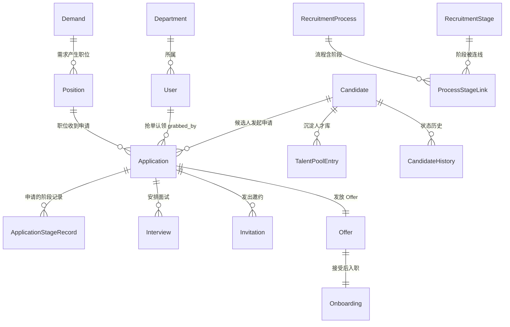
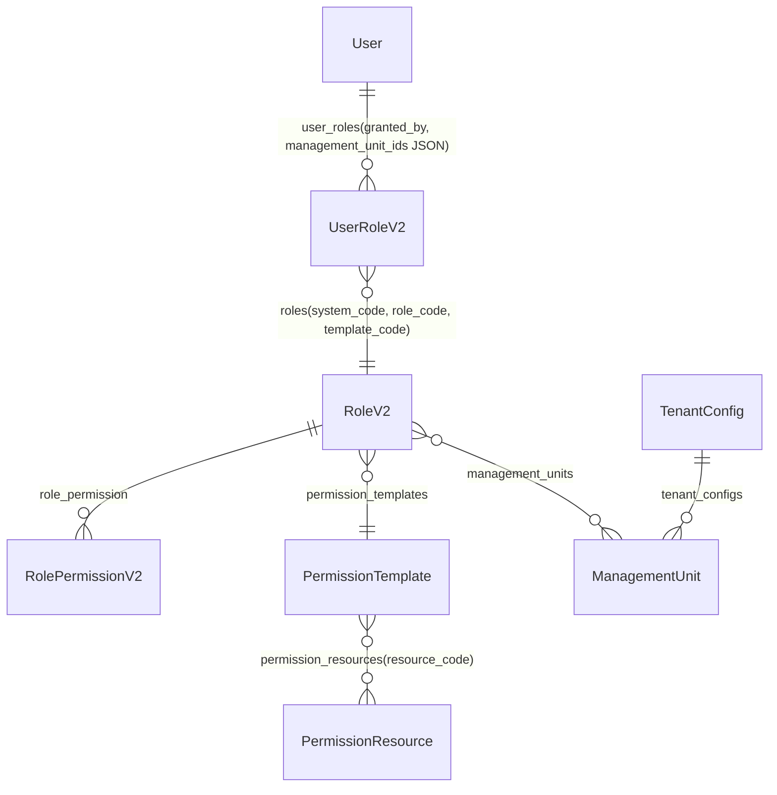

# 04 - 数据模型与状态机
> 最后更新：2026-09-07（依据 git 最后提交）

## 1. 核心实体关系



> 所有业务表显式 `db_table=` 命名（如 `candidates` / `applications` / `demands`），共 70 张表（含 V2 权限 9 表 + V1 备份 4 表）。

## 2. 公共审计基类

所有业务模型继承 `apps/common/models.py` 的 **`FullAuditModel`**，统一携带创建/更新审计字段（时间 + 操作人），配合 `apps/audit` 实现追溯。

主键统一为 `CharField(max_length=32, default=gen_id)` 生成的短 ID（nanoid 风格）。

## 3. 七个 FSM 状态机

技术选型：`django-fsm==3.0.1`。所有状态字段均为 `FSMField(protected=True)`——**直接赋值会抛 `AttributeError`**，必须通过 `@transition` 装饰的方法流转；服务层/测试中刷新对象需重新 `get()` 而非 `refresh_from_db()`。

### 3.1 Candidate（候选人，9 态）— `apps/candidate/models.py`

```
                    ┌──────────────── TALENT_POOL ────────────────┐
                    │                                              │
APPLIED ──enter_process──► IN_PROCESS ──send_offer──► OFFER_SENT ─┼─► PENDING_ONBOARDING ──mark_onboarded──► ONBOARDED
   │                         │    │                                │
   │                    pause │    │ mark_process_failed            │
   │                         ▼    ▼                                │
   └────── withdraw ──► PROCESS_PAUSED  PROCESS_FAILED ◄────────────┘
                    (resume_process 回 IN_PROCESS)        WITHDRAWN ◄── withdraw（各态）
```

| 状态 | 含义 |
|---|---|
| `APPLIED` | 已投递（默认初始态） |
| `IN_PROCESS` | 流程中 |
| `OFFER_SENT` | 已发 Offer |
| `PENDING_ONBOARDING` | 待入职 |
| `ONBOARDED` | 已入职（终态） |
| `PROCESS_FAILED` | 本流程未通过 |
| `WITHDRAWN` | 候选人主动撤回 |
| `TALENT_POOL` | 公共人才库 |
| `PROCESS_PAUSED` | 流程暂停 |

主要 `@transition`：`enter_process` / `send_offer` / `move_to_pool` / `mark_onboarded` / `withdraw` / `mark_process_failed` / `pause_process` / `resume_process`（BUG-5 补齐后 5 个）。

### 3.2 Application（申请单，9 态）— `apps/application/models.py`

```
PENDING ──start──► ACTIVE ──send_offer_state──► OFFER_SENT ──accept_offer──► OFFER_ACCEPTED ──mark_onboarded──► ONBOARDED
  │                  │ │                                                              │
  │             pause │ │ mark_rejected                                               │
  │                  ▼ ▼                                                              │
  └── withdraw ──► PAUSED  REJECTED ◄──────────────────────────────────────────────────┘
                     │            TIMEOUT ◄── timeout_archive（time_limit 巡检触发）
                     └ resume       WITHDRAWN ◄── withdraw
```

| 状态 | 含义 |
|---|---|
| `PENDING` | 待启动（默认） |
| `ACTIVE` | 流程中 |
| `PAUSED` | 流程暂停 |
| `OFFER_SENT` / `OFFER_ACCEPTED` | Offer 阶段 |
| `ONBOARDED` | 已入职（终态） |
| `REJECTED` | 本流程未通过 |
| `WITHDRAWN` | 候选人撤回 |
| `TIMEOUT` | 超时归档（Celery 巡检） |

附属：`ApplicationStageRecord.StageState`（10 态枚举，非 FSMField）：`NOT_STARTED / PENDING / TO_BE_SCHEDULED / PROCESSING / PASSED / FAILED / SKIPPED / REJECTED / TIMEOUT / ARCHIVED`。

### 3.3 Demand（招聘需求，8 态）— `apps/demand/models.py`

```
DRAFT ──submit──► PENDING ──approve──► APPROVED ──► RECRUITING ──► COMPLETED
                     │                    │             │
                 reject                (撤回)          pause/cancel
                     ▼                    ▼             ▼
                 REJECTED                            PAUSED / CANCELLED
```

`DRAFT → PENDING → APPROVED → RECRUITING → COMPLETED` 主线；旁路 `REJECTED / PAUSED / CANCELLED`。

### 3.4 Position（职位）— `apps/position/models.py`

`DRAFT → PENDING_PUBLISH → PUBLISHED → RECRUITING → …`（含 `PAUSED → RECRUITING` 恢复、关闭等），字段含 headcount 计划/已招与 `process_version`。

### 3.5 Offer（11 态）— `apps/offer/models.py`

```
DRAFT ──► PENDING_APPROVAL ──► PENDING_SEND ──► SENT ──► ACCEPTED ──► PENDING_ONBOARDING ──► ONBOARDED
             │                   │              │ │
          reject              (撤回)      negotiate  reject_by_candidate
             ▼                   ▼              ▼       ▼
         REJECTED           WITHDRAWN    NEGOTIATING  REJECTED_BY_CANDIDATE
```

### 3.6 Onboarding（入职，7 态）— `apps/onboarding/models.py`

```
PENDING ──► PREPARING ──► COMPLETED ──► PROBATION ──► REGULARIZED
   │           │
 delay      (延期)
   ▼           ▼
DELAYED   RESIGNED_DURING_PROBATION
```

| 状态 | 含义 |
|---|---|
| `PENDING` | 待入职（默认） |
| `PREPARING` | 入职准备中 |
| `DELAYED` | 已延期 |
| `COMPLETED` | 已完成（入职手续） |
| `PROBATION` | 试用中 |
| `REGULARIZED` | 已转正（终态） |
| `RESIGNED_DURING_PROBATION` | 试用期离职 |

### 3.7 Invitation（邀约，5 态）— `apps/invitation/models.py`

```
PENDING ──► INVITING ──► SUCCESS
               │  │
            fail  timeout
               ▼  ▼
            FAILED TIMEOUT
```

## 4. V2 权限数据模型（9 表）

`apps/core/models_permission_v2.py`（T01.1 真实建表，含 4 张 V1 备份表作救援路径）：



| 表 | 关键列 | 说明 |
|---|---|---|
| `roles` | system_code / role_code / role_name / template_code / default_data_scope_type | 角色定义（11 列） |
| `user_roles` | granted_by_id / management_unit_ids(JSON) | 用户-角色授予（10 列） |
| `permission_resources` | resource_code | 资源码注册表（11 列） |
| `permission_templates` | 模板 | 角色权限模板（10 列） |
| `role_permission` | role ↔ resource | 授权关系（5 列） |
| `management_units` | 管理单元 | 数据范围载体（9 列） |
| `tenant_configs` | 租户配置 | 全局 scope 默认（6 列） |

判断链路：`has_perm(user, resource_code)` → 查 `user_roles` → `role_permission` 是否含资源码；数据范围 `resolve_scope()` 输出 `ALL/DEPT/UNIT/SELF` 级查询集过滤条件。

## 5. 敏感数据设计

| 数据 | 方案 | 位置 |
|---|---|---|
| 身份证号 | 明文 Fernet 加密 + `id_card_hash` 不可逆哈希（查重用，BUG-1 修复） | `apps/candidate/models.py` |
| PII 字段 | `EncryptedCharField`（Fernet，key 来自 env） | `apps/common/encryption.py` |
| 集成凭证 | `encrypt_secret/decrypt_secret`（Fernet） | `apps/integration/crypto.py` |
| 展示脱敏 | masking 工具 + field_acl 序列化过滤 | `apps/common/masking.py`、`apps/field_acl` |
| GDPR 验证码 | 仅存 hash，timing-safe 比对 | `apps/gdpr/services.py` |
