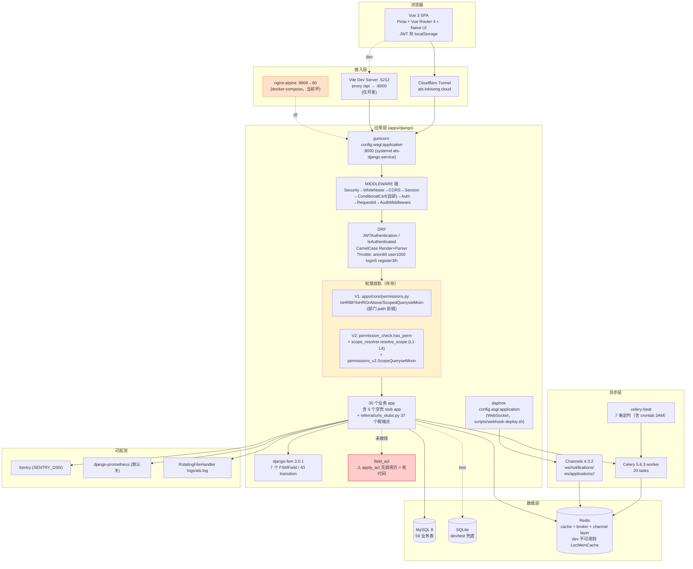

# ATS-NEW 深度架构与代码分析报告

> **分析者**: 高见远（架构师）
> **分析日期**: 2026-08-03
> **分析对象**: `/Users/loki/WorkBuddy/招聘助手/ATS-NEW` @ `5121985` (main)
> **方法**: 实际读代码 + grep + 真跑 pytest / vitest / vue-tsc / manage.py migrate，**不采信文档自述**

---

## 一、执行摘要

**总体健康度评级：🔴 高风险（不可上生产）**

1. 项目"骨架"确实完成度不低——30 个 Django app、59 张业务表、56 个 ViewSet、148 条路由、前端 27 个 API 客户端 + 68 个页面文件，Vue 侧 132 个 vitest **实测全过**，说明前端工程化基础扎实。
2. **但后端当前处于"根本跑不起来"的状态**：`apps/candidate/migrations/0004_candidate_drop_plaintext_id_card.py:33` 使用了 `models.CharField` 却只 `from django.db import migrations`，缺 `models` 导入 → migration 图加载即 `NameError`，`manage.py migrate` 直接崩，**60 个后端测试 100% ERROR**（不是 fail，是连测试库都建不起来）。
3. 这直接推翻文档"39 pytest 全过"的说法：实际 `tests/` 下是 **60 个用例，0 通过**；而且 `pytest.ini` 的 `testpaths = tests` 让 `apps/*/tests/` 下 **另外 127 个测试（含全部 V2 权限/IDOR 回归）从未被 CI 收集过**。
4. **最严重的合规问题不是审计报告里那 23 条，而是审计报告本身写错了**：`FieldAclService.apply_acl()` 在整个 `apps/` 里**没有任何一处业务调用**（只有 `tests/test_field_acl.py` 调），即字段级脱敏是**完全未接线的死代码**；`CandidateSerializer` 直接把 `phone / email / id_card_no` 明文吐给任何登录用户。审计报告 S3 声称"当前缓解：FieldAclService 在 view 层做 mask"——**该缓解不存在**。
5. 依赖管理已失控：`requirements.txt` 的 `==` 锁版本与 `.venv` 实际安装**大面积漂移**（django-fsm 2.8.1→3.0.1、celery 5.4→5.6.3、redis 5.0.4→8.0.1、pytest 8.2→9.1.1、reportlab 4.2→5.0…），且 `django-cryptography 1.1` 装在环境里却**没写进 requirements.txt**。CI 按 requirements 装 → 与本地是两套环境。
6. 容器编排是坏的：`ops/docker-compose.yml` **没有 redis 服务**（而 `prod.py:93` 强制 Redis 可达否则 `ImproperlyConfigured`），环境变量名也对不上（传 `JWT_SECRET`/`CORS_ORIGIN`，Django 读 `DJANGO_SECRET_KEY`/`CORS_ALLOWED_ORIGINS`），并且仍在 expose 旧 Express 端口 `5125`。`docker compose up` 必然启动失败。
7. 文档腐烂已被证实且比线索描述的更广：`technical.md` §2.1–§7 整段仍是 Prisma/nodemon/`node src/app.js`/端口 5125；`requirements.md` 第 3 行与第 18 行对 P3 完成度自相矛盾；`Makefile:36/47` 与 `RUNBOOK.md:55` 指向不存在的 `/api/v1/health/`（真实路径是 `/health/`）。
8. 结论：**架构选型合理、模块划分清晰、前端质量尚可，但工程可靠性与安全合规存在 P0 级阻断项**。当前状态既不能部署，也不应被当作"P0/P1 全部 done"来汇报。

---

## 二、技术栈核实表（文档声明 vs 代码实际）

### 2.1 后端

| 组件 | 文档声明 | `requirements.txt` 声明 | `.venv` **实际安装** | 差异判定 |
|---|---|---|---|---|
| Python | 3.14+ (RUNBOOK) | — | **3.14.6**（venv）；系统 `python3` 是 3.13.12 | ⚠️ 双解释器，易踩坑 |
| Django | 6.0.6 | `>=6.0,<7` | **6.0.6** | ✅ 一致 |
| DRF | 3.15 | `>=3.15,<4` | **3.17.1** | ⚠️ 文档写死 3.15，实际 3.17.1 |
| django-fsm | 2.8.1（"已废弃，迁 viewflow"） | `==2.8.1` | **3.0.1** | 🔴 锁版本与实装不符 |
| viewflow.fsm | "文档称正迁往" | 未声明 | **未安装、代码零引用** | 🔴 纯文档臆想，无迁移动作 |
| Celery | 5.4 | `==5.4.0` | **5.6.3** | 🔴 漂移 |
| Redis(py) | 5.0.4 | `==5.0.4` | **8.0.1** | 🔴 跨大版本漂移 |
| Channels | 4.1 | `==4.1.0` | **4.3.2** | 🔴 漂移 |
| simplejwt | ✓ | `>=5.3` | **5.5.1** | ✅ |
| drf-spectacular | — | `==0.27.2` | **0.29.0** | 🔴 漂移 |
| django-filter | — | `==24.2` | **25.2** | 🔴 漂移 |
| django-extensions | — | `==3.2.3` | **4.1** | 🔴 漂移 |
| reportlab | 4.2（PDF） | `==4.2.0` | **5.0.0** | 🔴 漂移 |
| affinda | 4.0（简历解析） | `==4.0.0` | **4.28.9** | 🔴 漂移 |
| gunicorn | 22 | `==22.0.0` | **26.0.0** | 🔴 漂移 |
| cryptography | 42.0.7 | `==42.0.7`（含长注释解释冲突） | **49.0.0** | 🔴 漂移（注释里的 hermes venv 借用问题仍在） |
| PyMySQL | 1.1.1 | `==1.1.1` | **1.2.0** | 🔴 漂移 |
| pytest | 8.2 | `==8.2.0` | **9.1.1** | 🔴 跨大版本漂移 |
| **django-cryptography** | 未提及 | **未声明** | **1.1 已安装** | 🔴 幽灵依赖（虽然代码走自研 `apps/common/encryption`，但环境不干净） |
| MySQL / SQLite | MySQL 8 生产 / SQLite dev | PyMySQL + psycopg2 | dev 环境 `.env` 实际连的是 **MySQL**（`manage.py check` 日志可见 `SELECT VERSION()`），不是文档说的 SQLite | ⚠️ |
| Elasticsearch | — | 已注释 | 未装 | ✅ 未启用 |

> **要害**：CI (`.github/workflows/ci.yml:42`) 执行 `pip install -r requirements.txt`，会装到 `==` 锁的**旧版本**；开发者本地是**新版本**。两套环境跑同一份代码，"本地过 CI 挂"或反之都是必然。

### 2.2 前端

| 组件 | 文档声明 | `package.json` 实际 | 判定 |
|---|---|---|---|
| Vue | 3 | `^3.4.0` | ✅ |
| Vite | 5 | `^5.0.0` | ✅ |
| Pinia | 2 | `^2.1.0` | ✅ |
| Vue Router | 4 | `^4.2.0` | ✅ |
| Naive UI | 2.44 | `^2.44.1` | ✅ |
| UnoCSS | ✓ | `^66.7.0` | ✅ |
| TypeScript | strict | `^5.3.0`，`tsconfig.json: strict:true` 但 `noUnusedLocals:false` / `noUnusedParameters:false` | ⚠️ 名义 strict |
| Vitest | ✓ | `^2.1.9` | ✅ |
| Playwright | ✓ | `^1.49.1`，15 个 spec | ✅ |
| ESLint | — | `^9.39.4` + typescript-eslint 8 | ✅ |

> 前端依赖声明与实际**基本一致**，这是全项目最干净的一块。

### 2.3 规模数字核实

| 指标 | 文档自称 | 实测 | 证据 |
|---|---|---|---|
| Django apps | 28 | **30** | `settings/base.py:98-135` LOCAL_APPS 计数 |
| 数据表 | 78 | **59 张业务表**（`db_table=` 计数），63 个 model 类；加 Django 内建/celery/token_blacklist 约 78-85 | `grep -rh "db_table = "` |
| API 端点 | 60+ | app 级 `path()` **148 条** + 49 个 `router.register`（每个再展开 CRUD） | 实际远超 60，但含大量 alias/stub |
| 状态机 | 9 | **7 个 `FSMField`**，43 个 `@transition` | candidate/offer/position/application/demand/invitation/onboarding |
| pytest | 39 全过 | **60 个用例，60 ERROR**（另有 127 个 app 内测试未纳入收集） | 实跑 |
| vitest | 132 全过 | **132 passed / 29 files** ✅ | 实跑 |
| Celery 任务 | — | **20 个** `@shared_task` | `grep tasks.py` |

---

## 三、系统架构图（真实形态）



**关键路径说明**

- SPA 深链由 `config/urls.py:145` 的 `re_path(r'^(?P<path>(?!api/|health/|static/|__debug__/).*)$', spa_fallback)` 兜底回 `web/app/dist/index.html`，即**同域单体部署**（whitenoise 托管前端产物）。
- `config/settings/__init__.py` 是 re-export shim：`DJANGO_SETTINGS_MODULE=config.settings` 会**命中"unknown settings module → 回落 dev"**。而 `config/wsgi.py:5` 与 `apps/django/Dockerfile:15` 默认值正是 `config.settings`。**即：不显式设 prod，gunicorn 就以 DEBUG=True + CORS_ALLOW_ALL_ORIGINS=True 起生产**（`ops/scripts/deploy.sh:42`、`docker-compose:50` 有显式覆盖，但 Dockerfile 默认 CMD 与 RUNBOOK §1 的启动命令没有）。

---

## 四、后端模块地图

### 4.1 30 个 app（`settings/base.py:98-135` 顺序）

| 分层 | app | 职责 | 规模 (py/LOC/model) | 关键文件与备注 |
|---|---|---|---|---|
| **核心** | `core` | User/Department/Role，V1+V2 权限，认证，健康检查，WS 路由 | 52 / 4553 / 7 | `permission_check.py`(31L)、`scope_resolver.py`(83L)、`permissions.py`(188L, V1)、`permissions_v2.py`(64L)、`models_permission_v2.py`(197L)、`urls_permission_v2.py` |
| | `field_acl` | 字段级 ACL 规则 CRUD + 脱敏服务 | 9 / 239 / 2 | 🔴 `services.py:32 apply_acl` **零业务调用** |
| | `audit` | 审计日志 + 中间件 + 清理任务 | 12 / 617 / 1 | `middleware.py` 已挂 MIDDLEWARE |
| | `notification` | 站内信/通知 | 10 / 687 / 3 | |
| | `gdpr` | 数据主体请求、验证码、匿名化、留存清理 | 11 / 762 / 3 | 🔴 `models.py:48` 验证码明文存储（审计 S2，未修） |
| | `integration` | 外部集成配置（Fernet 加密凭据） | 11 / 721 / 3 | `INTEGRATION_FERNET_KEY` 未配则运行期 RuntimeError |
| | `common` | 基类模型/分页/异常/mixins/加密工具 | 11 / 756 / 4 | `encryption.py` 自研 `EncryptedCharField` + `hash_for_search` |
| **流程域** | `process` | 招聘流程/阶段/链接/规则/表达式 | 26 / 3184 / **10** | 全项目 model 最多；`urls_stage/process/link/rule/expression` 5 套路由 |
| | `entry_condition` | 进入条件规则 | 9 / 1024 / 6 | |
| | `time_limit` | 阶段限时 + 定时扫描 | 10 / 596 / 1 | beat: 每 30min |
| | `automation` | 自动化规则引擎 | 12 / 1175 / 2 | beat: 每 15min |
| **业务域** | `candidate` | 候选人主档 + FSM(9 态) | 13 / 1873 / 4 | `models.py:53` id_card_no 已加密；🔴 `:116 __str__` 仍返明文手机号 |
| | `add_candidate` | V2 新建候选人流程（Affinda 解析/评分/批量） | 25 / 3099 / 1 | 8 个测试文件（**未纳入 CI 收集**） |
| | `application` | 申请单 + 阶段流转 | 15 / 3280 / 4 | `services/stage_transitions.py`；`serializers.py:92` 是**全项目唯一真实生效的脱敏** |
| | `demand` | 招聘需求 + FSM | 9 / 622 / 3 | |
| | `position` | 职位 + FSM | 9 / 466 / 2 | |
| | `offer` | Offer + FSM + PDF | 9 / 457 / 2 | reportlab |
| | `onboarding` | 入职 + FSM | 9 / 393 / 2 | |
| | `invitation` | 面试邀约 + FSM + 过期清理 | 10 / 471 / 2 | beat: 每 1h |
| | `interview` | 面试安排/评价 | 9 / 437 / 4 | |
| | `referral` | 内推 | 12 / 1102 / 3 | 🔴 **寄放了 `urls_stubs.py`(609L)**，与内推业务无关 |
| | `talent_pool` | 人才库 + 推荐 | 14 / 674 / 2 | beat: 每 1h |
| | `channel` | 招聘渠道 | 10 / 339 / 2 | |
| | `analytics` | 数据分析/导出 | 13 / 693 / 3 | 🔴 `tasks.py:56` path traversal（审计 M3，未修） |
| | `mou` | MOU 大客户协议 | 10 / 605 / 4 | 挂在 `/api/v1/permissions-v2/`（**命名与语义严重错配**） |
| **空壳/半成品** | `library` | 院校/公司库 | 9 / 180 / 2 | ReadOnly + 注释"真实 CRUD 留给 G41" |
| | `scraped_resume` | RPA 简历抓取 | 6 / 83 / **0 model** | 明写"无 model 桩"，retrieve 返 404 |
| | `external_sync` | 外部系统同步 | 6 / 96 / **0 model** | 全返空数组 |
| | `duplicate_check` | 简历查重 | 6 / 68 / **0 model** | `check` 返 `[]` + "暂不实际比较" |
| | `data` | 数据中心 | 6 / 118 / **0 model** | 注释"实际应走 analytics/" |

### 4.2 路由与视图组织

- **入口**：`config/urls.py`，`api_v1_patterns` 手工维护，含大量历史 alias（`recruitment-processes/` ↔ `processes/`、`entry-condition-rules/` ↔ `recruitment-rules/entry-conditions/`、`referral/` ↔ `referrals/`）。
- **注册顺序是脆弱的隐式契约**：`urls.py:22` 把 `urls_stubs` 挂在 `core.urls` 之前，`:27` 再把 `urls_permission_v2` 插在中间，注释里明写"否则被 `router.register(r'permissions')` 抢先吃掉"。**任何人调整顺序就会静默改变 API 行为**。
- **风格混用**：56 个 ViewSet（49 个走 router）+ 43 个 `@api_view` 函数视图，其中 37 个函数视图集中在 stub 文件。
- **命名错配**：MOU 业务挂在 `/api/v1/permissions-v2/`（`urls.py:81`），而真正的 V2 权限在 `/api/v1/permissions/...`。新人极易误读。

### 4.3 权限模型（V1 / V2 双轨并存）

**V2 资源级**（`core/permission_check.py`）：
```
has_perm(user, resource_code):
  未登录 → False；superuser → True
  UserRoleV2.filter(user_id).values_list('role_code')   # query 1
  RolePermissionV2.filter(role_code__in=…, resource_code=…).exists()  # query 2
  OperationalError/ProgrammingError → False（保守 deny）
```
- 注释首行明写 **"无 cache，每个请求重查"** → 每个受保护端点固定 +2 次 DB 查询。

**V2 数据级 4 层 scope**（`core/scope_resolver.py`）：
| 层 | 来源 | 行号 |
|---|---|---|
| L1 | `user_role.management_unit_ids` 非空 | :26-43 |
| L2 | `role.default_data_scope_type == 'ALL'` | :48-52 |
| L3 | `TenantConfig['GLOBAL_DEFAULT_DATA_SCOPE'] == 'ALL'` | :63-66 |
| L4 | 兜底 SELF → `qs.filter(created_by=user)` | :69 |

🔴 **`scope_resolver.py:53-55` 存在明确逻辑缺陷**：
```python
if scope_type == 'DEPT':
    _ = _dept_ids(user)          # 算了部门树，然后丢弃
    return {'management_unit_ids': []}
```
返回空列表会被 `permissions_v2.py:49` 判为"SELF 兜底"，**配置了 DEPT 数据范围的角色实际只能看到自己创建的记录**。这类"看起来配了权限但数据是空的"问题，RUNBOOK §4 已经把它当"常见 FAQ"在教人排查——说明团队把 bug 当成了特性。

🔴 **V1 未删干净**：`core/permissions.py:114 ScopedQuerysetMixin`（部门 path 前缀过滤）与 `core/permissions_v2.py:30 ScopeQuerysetMixin`（management_unit 过滤）**同名近似、语义不同、同时存在**。业务 ViewSet 用的是 V2（11 处 import），V1 的 `ScopedQuerysetMixin` 已无引用但仍保留，且 V1 的权限类 `IsHRBP/IsHROrAbove/UserViewPermission/MOUVIEWSetPermission` 仍在被 `field_acl/views.py` 等处使用。**一字之差的两个 Mixin 并存是高危可读性陷阱**。

`V2Permission.has_permission` 还有个宽松点（`permissions_v2.py:22-24`）：view 未声明 `permission_required` **默认放行**，仅依赖 ScopeQuerysetMixin 兜底。若某 ViewSet 既没声明又没混入 Mixin，即为无差别开放。

### 4.4 Stub 端点真实规模

| 类别 | 数量 | 证据 |
|---|---|---|
| `referral/urls_stubs.py` `path()` 条目 | **74** | 每端点含 带/不带斜杠 两份 |
| **唯一 stub 端点** | **37** | 去重后 |
| 文件规模 | **609 行** | 审计报告写 550 行，已增长 |
| 真正带 `X-Stub` header 的 | **仅 `_ok()` / `_empty_list()` 两个构造器** | `X-Stub` 全文只出现 4 次 |
| **直接 `return Response(...)` 绕过 X-Stub 的** | ≥ 8 处 | `login_alias:88/90`、`permissions_roles_list:289`、`permissions_user_roles:307`、`permissions_user_info:325`、`permissions_mous_list:360`、`permissions_user_mous:375/380`、`permissions_list_by_type:400/425`、`permissions_functions:448`、`permissions_menus:471` |
| 完整 stub app（0 model） | **4 个** | `data` / `duplicate_check` / `external_sync` / `scraped_resume` |

> 审计 M1 声称"**全部**加 `X-Stub: true` header"——**不成立**。上面 8+ 处是真实业务查询混在 stub 文件里，既不打 header 也没被当作正式代码管理；`login_alias` 甚至连 `_log_stub_hit` 都没调，是一条**没有限流保护的隐藏登录端点**（`urls_stubs.py:81-97`，对比 `views_auth.py` 的 `LoginRateThrottle 5/min`）。

🔴 **`POST /api/v1/auth/register`（`urls_stubs.py:65`）返回 `{success:true, id:'user-stub-xxx'}` 但不建账号；`POST /api/v1/auth/change-password`（`:73`）返回"密码已更新 (stub)"但不改密码。** 这两条已经挂在生产可达路由上。

### 4.5 旧栈残留 / 死代码

| 残留 | 位置 | 说明 |
|---|---|---|
| Express 端口 5125 | `ops/docker-compose.yml:40,48`、`Makefile:36`、`technical.md:232,239,246,259,264` | Django 实际 8000 |
| Prisma/nodemon 目录树 | `technical.md:110-140` | 描述 `prisma/schema.prisma`、`nodemon.json`、`backend/src/app.js` |
| Node webhook | `scripts/webhook.js` + `webhook.service` | commit `3de4e35` 声称"删弃用 webhook receiver"，**文件仍在** |
| 空 `node_modules/` | 项目根 | 空目录，无用 |
| `create_tables_sql.py` | 审计 L9 提及 | 与 migrate 功能重复 |
| 前端 legacy 组件 | `web/app/src/pages/candidate/AddCandidateModal.legacy.vue` (586L)、`settings/Placeholder.vue` | 未删 |
| 重复工具实现 | `src/utils/debounce.ts` + `debounce.mjs`、`request-dedup.ts` + `request-dedup.mjs` | 双份 |
| V1 权限死代码 | `core/permissions.py:114 ScopedQuerysetMixin` | 零引用 |

---

## 五、前端结构地图

```
web/app/
├── src/
│   ├── api/          27 个 .ts（2957 行）+ __tests__/3
│   │   └─ 最大：recruitment-process.ts(349) dashboard.ts(291) auth.ts(226)
│   ├── pages/        68 文件，14 个业务域目录
│   │   ├─ settings/  ← 最重：ProcessDetailModal.vue(2289!) MouManagement.vue(1398)
│   │   │              StageRuleConfigModal.vue(1014) UserManagement.vue(766)
│   │   ├─ candidate/ ├─ demand/ ├─ offer/ ├─ interview/ ├─ onboarding/
│   │   ├─ invitation/├─ position/├─ referral/├─ resume/ ├─ scraped/
│   │   ├─ screening/ ├─ talent/  ├─ notification/
│   │   └─ Dashboard.vue / Layout.vue / Login.vue / Forbidden.vue
│   ├── components/   38 文件（23 个 .vue），common/ + dashboard/
│   ├── stores/       4 个 Pinia store（user / demand / department / addCandidate）
│   ├── router/       index.ts(215) — 集中式路由 + routeGuard
│   ├── utils/        role.ts / debounce.{ts,mjs} / request-dedup.{ts,mjs} / condition-expression.ts
│   ├── config/       index.ts（端口/超时/分页单一真源）
│   └── locales/ plugins/ styles/
├── e2e/              15 个 Playwright spec
└── dist/             已 gitignore（.gitignore:28）
```

**质量观察**

| 项 | 实测 | 评价 |
|---|---|---|
| vitest | **132 passed / 29 files / 5.27s** | ✅ 真过，文档数字准确 |
| 未被执行的测试 | `debounce.test.mjs`、`request-dedup.test.mjs` | 🔴 `vitest.config.ts:19 include: ['src/**/*.{test,spec}.ts']` 不含 `.mjs`，**2 个测试文件永远不跑** |
| vue-tsc | **3 个 TS error** | 🔴 `npm run build`(= `vue-tsc && vite build`) **必定失败**；CI 用 `build:nocheck` 绕过（`ci.yml:72`） |
| TS error 明细 | `MouManagement.vue:1120` ×2（`Property 'map' does not exist on type '{}'`、隐式 any）；`PermissionManagement.test.ts:60` ×1 | |
| `any` 使用 | **348 处**（排除测试） | 🔴 strict 名存实亡 |
| `console.*` | **49 处**（排除测试） | 生产未 strip（审计 L3） |
| TODO/FIXME | 仅 3 处（`utils/role.ts:26,45`、`api/dict.ts:18`） | ✅ |
| 组件复用 | 23 个 common 组件 vs 2289 行单文件组件 | ⚠️ 抽象不足，settings 域是巨石 |
| e2e | 15 spec，CI 中 `needs: [test-backend, test-frontend]` | 🔴 因 backend job 必挂 → **e2e 从未运行过** |

**路由与 RBAC**（`src/router/index.ts:168-211`）
- 守卫逻辑本身写得不错：用 `to.matched.some()` 处理父路由 meta 继承（注释:177-181 记录了这个真实 bug 的修复）。
- token 读取有 **3 级 fallback**：`userStore.accessToken` → `localStorage['accessToken']` → `localStorage['token']`（:173-175），注释说"兼容 27 个 API 文件"——说明 API 层未统一。
- 角色白名单只在 6 条路由上声明（`user-management` / `field-acl` / `permissions` / `recruitment-process` 等），**绝大多数业务路由无 `meta.roles`**，纯靠后端兜底。
- 🔴 代码内文档腐烂：`:117` 注释"删 `/settings/permission` 路由 + 删 `PermissionManagement.vue`"，而 `:127` 又注册了 `PermissionManagement`。
- JWT 存 `localStorage` → XSS 可直接窃取，配合无 CSP（审计 L1）风险叠加。

---

## 六、代码质量量化

| 维度 | 实测值 | 文档声称 | 差异 |
|---|---|---|---|
| 后端测试用例（`tests/`） | **60**，**0 passed / 60 ERROR** | "39 全过" | 🔴 数量错 + 状态错 |
| 后端测试用例（`apps/*/tests/`） | **127**（25 个文件） | 未提及 | 🔴 `pytest.ini:testpaths=tests` **不收集**，CI 也不跑 |
| 后端测试总量 | 187 | — | 其中 68% 从未进 CI |
| 前端 vitest | **132 passed / 29 files** | 132 | ✅ |
| 前端测试文件总数 | 31（2 个 `.mjs` 被 include 规则排除） | — | 🔴 |
| e2e spec | 15 | — | 因依赖 backend job 而从未执行 |
| vue-tsc error | **3** | "TypeScript strict 全过" | 🔴 |
| 唯一 stub 端点 | **37**（74 个 path） | "20+" | 🔴 低报 ~85% |
| 空壳 stub app | **4 个 0-model app** | 未量化 | |
| 后端 TODO/FIXME | **1**（`application/tasks.py:191`） | — | ✅ 意外地干净 |
| 后端 `except Exception` | **103** | 审计 M2 称"21 处" | 🔴 低报 ~5 倍 |
| `except ...: pass` 静默吞 | **12** | — | |
| 前端 `any` | **348** | — | |
| 前端 `console.*` | **49** | — | |
| 前端 TODO | 3 | — | ✅ |
| 最大 Python 文件 | `core/models.py` 324L；`core` app 4553L / 52 文件 | — | 尚可 |
| 最大 Vue 文件 | `ProcessDetailModal.vue` **2289L** | — | 🔴 god component |

### 6.1 文档腐烂实例（逐条给路径 + 行号）

| # | 文件:行 | 文档说 | 代码实际 |
|---|---|---|---|
| D1 | `technical.md:110-140` | 后端结构含 `prisma/schema.prisma`、`nodemon.json`、`backend/src/` | 实际 `apps/django/{config,apps}/`，Django ORM，45 个 migration |
| D2 | `technical.md:232,239,246,259,264` | 后端端口 **5125**，`Express Server`，`SQLite 文件 prisma/dev.db` | 实际 **8000**，gunicorn/Django，MySQL 8 |
| D3 | `technical.md:237` | 后端配置在 `backend/src/config/index.js` | 实际 `apps/django/config/settings/{base,dev,prod,test}.py` |
| D4 | `technical.md:276,291` | 启动 `node src/app.js` | 实际 `gunicorn config.wsgi:application` |
| D5 | `technical.md:55` | django-fsm **2.8.1** | 实装 **3.0.1** |
| D6 | `requirements.md:3` & `:7` vs `:18` | "P3 5/5 ✅ 全部 done" | 同文件 `:18` 表格 "P3 数据治理 5 项 ⬜"；且 P3 对应的 4 个 app 是 0-model 空壳 |
| D7 | `RUNBOOK.md:55` | `http://localhost:8000/api/v1/health/` → `{"status":"ok"}` | 健康检查挂在 **`/health/`**（`config/urls.py:125`）；`/api/v1/health/` 返 404 |
| D8 | `Makefile:47` | `curl .../api/v1/health/` 做 status 检查 | 同上，**`make status` 永远报 404** |
| D9 | `Makefile:36` | "Backend :5125 (gunicorn in container)" | 旧 Express 端口 |
| D10 | `Makefile:20,31` | `pnpm install` / `pnpm dev` | 仓库里是 `package-lock.json`（npm），CI 用 `npm ci` |
| D11 | `RUNBOOK.md:11` | Python **3.14+**，`.venv 已就绪` | venv 确为 3.14.6，但系统 `python3` 是 3.13.12，`make install` 用 `python3 -m venv` 会造出 3.13 环境 |
| D12 | `RUNBOOK.md:78,83` | "后端 39 tests / 前端 132 tests，预期全过" | 后端 60 个全 ERROR |
| D13 | `RUNBOOK.md:37` | dev 用 `DATABASE_URL=sqlite:///db.sqlite3` | 当前 `.env` 实连 MySQL（`manage.py check` 输出 `SELECT VERSION()` MySQL 方言） |
| D14 | `COMPLIANCE_AUDIT:54` | "当前缓解: FieldAclService 在 view 层做 mask" | 🔴 `apply_acl` **无任何业务调用方** |
| D15 | `COMPLIANCE_AUDIT:74,81` | stub "20+ 端点"，"已做: 全部加 X-Stub" | 实际 37 个，且 ≥8 处未加 |
| D16 | `COMPLIANCE_AUDIT:85` | `except Exception` "21 处" | 实际 103 处 |
| D17 | `router/index.ts:117` | 注释"删 PermissionManagement.vue" | `:127` 仍在注册该路由，文件仍存在 |
| D18 | `docs/README.md:65`、`ARCHITECTURE.md:147`、`CHANGELOG.md:54` | "迁 viewflow.fsm" | 代码零引用，未安装 |

### 6.2 安全核查

| 项 | 状态 | 证据 |
|---|---|---|
| SECRET_KEY 硬编码 | ⚠️ dev 默认 `insecure-dev-key-change-me`（`base.py:58`），prod.py:27 强校验 50+ 字符 → **prod 路径安全，但默认 settings 回落 dev 时无校验** | |
| admin URL token | ✅ 已 env 化（`urls.py:111`），但 fallback 仍是硬编码 `ops-dashboard-7f3b9c2e` | |
| CORS | 🔴 `dev.py:19 CORS_ALLOW_ALL_ORIGINS = True` + settings 默认回落 dev → 生产可能全放开 | |
| JWT lifetime | 🔴 access **60 分钟** / refresh 7 天（`base.py:319-323`），审计 M9 未修 | |
| JWT 存储 | ⚠️ localStorage（XSS 可窃），无 CSP | |
| CSRF | 自研 `ConditionalCsrfMiddleware` 对 `/api/` 豁免（`base.py:149`），JWT 无状态可接受 | |
| 限流 | ✅ login 5/min、register 3/h、change_password 5/min | 🔴 但 `urls_stubs.py:81 login_alias` **无 throttle**，绕过 5/min |
| PII 加密 | 🟡 `id_card_no` 已 `EncryptedCharField`；**phone/email 仍明文**（`candidate/models.py:38,44`） | |
| PII 脱敏 | 🔴 **未接线**（`field_acl/services.py` 死代码）；唯一生效的是 `application/serializers.py:92` 的列表页手机号 | |
| PII 日志泄露 | 🔴 `candidate/models.py:116 __str__` 返明文手机号（审计 M7 未修） | |
| 脱敏白名单键名错配 | 🔴 `field_acl/services.py:26` 写 `'id_card'`，model 字段是 `id_card_no`；`'current_salary'` 在 Candidate 上不存在（实际是 `expected_salary`）→ **即便接线也 mask 不到** | |
| GDPR 验证码 | 🔴 明文存储（审计 S2 未修） | |
| Path traversal | 🔴 `analytics/tasks.py:56` 未过滤 `task.entity`（审计 M3 未修，10 分钟工作量） | |
| 演示弱密码 | 🔴 `init_demo_data.py:272` 硬编码 `admin123`（审计 M4 未修） | |
| 权限绕过 | ⚠️ `V2Permission` 未声明 `permission_required` 默认放行；`scope_resolver` DEPT 分支返空 → 过严（拒绝）而非过松，方向安全但功能坏 | |
| 启动期探活 | 🔴 `base.py:380-390` + `prod.py:86-97` socket 探活阻塞（审计 M5 未修） | |
| `AppConfig.ready()` 查 DB | 🔴 已复现：`manage.py check` 输出 `RuntimeWarning: Accessing the database during app initialization is discouraged` + 6 条 SELECT（审计 M6 未修） | |
| Trivy 扫描 | ⚠️ `ci.yml:230 exit-code: '0'` → **永不阻断** | |
| Lint | ⚠️ `ci.yml:80 npm run lint \|\| true` → **永不阻断** | |

---

## 七、Top 风险清单（按严重度排序）

| # | 严重度 | 风险 | 证据路径 | 影响 |
|---|---|---|---|---|
| **R1** | 🔴🔴 **P0 阻断** | **migration 图加载即崩** — `models` 未导入 | `apps/django/apps/candidate/migrations/0004_candidate_drop_plaintext_id_card.py:10`（只 import `migrations`）vs `:33`（用 `models.CharField`） | `manage.py migrate` NameError；60/60 测试 ERROR；CI `test-backend` + `test-migrations` + `e2e` 三个 job 必挂；**全新环境无法部署**。修复 = 加一行 `from django.db import models`（5 秒） |
| **R2** | 🔴🔴 **P0 安全** | **字段级脱敏完全未接线** | `apps/field_acl/services.py:32 apply_acl` 全仓库仅被 `tests/test_field_acl.py` 调用；`apps/candidate/serializers.py:69-70` 直出 `phone/email/id_card_no` | 任意登录用户（含面试官、内推人）拉候选人详情即得完整 PII。违反 PIPL/GDPR。**测试通过 = 虚假安全感**（单测服务，不测集成） |
| **R3** | 🔴 **P0** | **默认 settings 回落 dev** | `config/settings/__init__.py:12-15`（未知模块 → dev）；`config/wsgi.py:5` 与 `Dockerfile:15` 默认 `config.settings`；`RUNBOOK.md:48` 启动命令未设环境变量 | 生产以 `DEBUG=True` + `CORS_ALLOW_ALL_ORIGINS=True` 运行；异常页泄露 SECRET_KEY/SQL/路径 |
| **R4** | 🔴 **P0** | **docker-compose 无法启动** | `ops/docker-compose.yml`：无 redis 服务，但 `prod.py:93` Redis 不可达即 `ImproperlyConfigured`；传 `JWT_SECRET`/`CORS_ORIGIN`，Django 读 `DJANGO_SECRET_KEY`/`CORS_ALLOWED_ORIGINS`；`expose 5125` 但 Dockerfile CMD 绑 8000；无 celery-worker/beat | 容器路径完全不可用；nginx `depends_on: backend` 连锁失败 |
| **R5** | 🔴 高 | **37 个 stub 端点在生产可达，含注册/改密** | `apps/referral/urls_stubs.py:65,73`（register/change-password）；`config/urls.py:22` 已挂载 | 用户注册"成功"实际无账号；改密"成功"实际未改 → 用户以为换了密码，旧密码仍有效 |
| **R6** | 🔴 高 | **隐藏无限流登录端点** | `apps/referral/urls_stubs.py:81-97 login_alias`，无 `@throttle_classes`，对比 `views_auth.py:14 LoginRateThrottle 5/min` | `POST /api/v1/login` 可无限撞库，绕过所有登录限流 |
| **R7** | 🟠 中高 | **68% 后端测试从未进 CI** | `apps/django/pytest.ini:11 testpaths = tests`；`ci.yml:51 pytest tests/`；`apps/*/tests/` 下 127 个用例（含 `test_idor_v2.py`、`test_scope_v2_regression.py`、`test_permissions_v2.py`） | 全部 V2 权限/IDOR 回归测试是"写了但从不跑"，权限改动无护栏 |
| **R8** | 🟠 中高 | **DEPT 数据范围逻辑坏** | `apps/core/scope_resolver.py:53-55`（算完 `_dept_ids` 丢弃，返空 list）→ `permissions_v2.py:49` 判为 SELF | 配 DEPT scope 的角色只能看自己创建的数据；RUNBOOK §4 把它当 FAQ 而非 bug |
| **R9** | 🟠 中高 | **依赖锁与实装大面积漂移 + 幽灵依赖** | `requirements.txt` 15+ 个 `==` 与 `.venv` 不符（fsm/celery/redis/pytest/reportlab/affinda/gunicorn/cryptography…）；`django-cryptography 1.1` 已装未声明 | CI 与本地是两套环境；"本地过、CI 挂"不可复现；重建环境行为漂移 |
| **R10** | 🟠 中 | **`npm run build` 必失败 + CI 刻意绕过类型检查** | `package.json:10 "build": "vue-tsc && vite build"`；实跑 vue-tsc 3 error；`ci.yml:72` 用 `build:nocheck` | 类型安全形同虚设；正式 build 命令没人能跑通 |
| **R11** | 🟠 中 | **CI 三道质量门全部无效** | `ci.yml:80 lint \|\| true`；`:230 trivy exit-code: '0'`；`:72 build:nocheck`；`e2e` 因 needs backend 而永不执行 | 绿色 CI ≠ 质量保证 |
| **R12** | 🟠 中 | **权限检查零缓存，每请求 +2 查询** | `apps/core/permission_check.py:1` 注释"无 cache, 每个请求重查"；`:19,:29` 两次查询 | 列表页 N 个受保护端点 → 线性放大；`PERFORMANCE.md` 目标 P95 200ms 难达成 |
| **R13** | 🟠 中 | **103 处 `except Exception` / 12 处静默 pass** | `apps/core/scope_resolver.py:31,37,57,59`（连续 4 个裸 catch）；全仓 grep | 权限解析异常被吞 → 静默降级到"返空数据"，前端显示正常但数据错 |
| **R14** | 🟠 中 | **路由注册顺序是隐式契约** | `config/urls.py:19-30` 三段注释解释"必须挂在 core.urls 之前否则被 router 抢" | 任何人重排 urlpatterns 都会静默改变 API 语义；无测试保护 |
| **R15** | 🟡 中低 | **PII 未加密 + `__str__` 泄露** | `candidate/models.py:38,44`（phone/email 明文）；`:116 __str__` 返明文手机号 | DB 泄露/admin 下拉/日志均暴露 |
| **R16** | 🟡 中低 | **god component + 死代码** | `ProcessDetailModal.vue` 2289L、`MouManagement.vue` 1398L；`AddCandidateModal.legacy.vue` 586L；`debounce.{ts,mjs}` 双份；`core/permissions.py:114` 零引用 Mixin | 维护成本、误改风险 |
| **R17** | 🟡 中低 | **命名/语义错配** | MOU 挂 `/api/v1/permissions-v2/`（`urls.py:81`）；`ScopedQuerysetMixin` vs `ScopeQuerysetMixin` 一字之差 | 新人极易误用 |
| **R18** | 🟡 低 | **未修的审计遗留** | S2 GDPR 验证码明文（`gdpr/models.py:48`）、M3 path traversal（`analytics/tasks.py:56`）、M4 `admin123`（`init_demo_data.py:272`）、M5 启动探活、M6 ready() 查 DB、M9 JWT 60min | 审计报告标 ❌/🟡 的 10 项，本次复核**无一已修** |

---

## 八、分阶段改进路线图

### Phase 0 — 止血（0~3 天，必须先做）

| 项 | 动作 | 工作量 | 验收 |
|---|---|---|---|
| P0-1 | `candidate/migrations/0004:10` 补 `from django.db import models` | **5 分钟** | `manage.py migrate --plan` 无异常 |
| P0-2 | 跑通 `pytest tests/`，把真实失败逐个修掉 | 1 天 | 60/60 绿 |
| P0-3 | `pytest.ini` 改 `testpaths = tests apps`，把 127 个 app 内测试纳入 | 0.5 天 | 187 用例全收集 |
| P0-4 | `config/wsgi.py` / `asgi.py` / `Dockerfile` 默认值改 `config.settings.prod`；或让 `settings/__init__.py` 在未知模块时**抛错而非回落 dev** | 1 小时 | 误配即启动失败 |
| P0-5 | 生产环境立即下线 `auth/register` + `auth/change-password` 两个 stub（改返 501） | 1 小时 | 不再有"假成功" |
| P0-6 | 删 `urls_stubs.py` 的 `login_alias` 或给它加 `LoginRateThrottle` | 30 分钟 | 无绕过限流的登录入口 |

### Phase 1 — 30 天：真实性与安全底线

| 项 | 动作 | 工作量 |
|---|---|---|
| 1-1 | **接线 FieldAclService**：在 `common/mixins.py` 加 `FieldAclSerializerMixin`，在 `CandidateSerializer.to_representation` / ViewSet `finalize_response` 统一调用；同时修 `DEFAULT_SENSITIVE_FIELDS` 键名（`id_card` → `id_card_no`，去掉不存在的 `current_salary`）；补**集成测试**（真发 HTTP 请求断言 masked） | 3 天 |
| 1-2 | 依赖治理：`pip freeze > requirements.lock.txt`，requirements.txt 改 `>=x,<x+1` 区间，补 `django-cryptography`；CI 改用 lock 安装 | 1 天 |
| 1-3 | 修 `scope_resolver` DEPT 分支（真正返回部门 id 集合），补回归测试 | 1 天 |
| 1-4 | 修 docker-compose：补 redis + celery-worker + celery-beat 服务；env 名对齐（`DJANGO_SECRET_KEY`/`CORS_ALLOWED_ORIGINS`）；端口 5125→8000 | 1 天 |
| 1-5 | CI 收紧：`lint \|\| true` 去掉 `\|\| true`；trivy `exit-code: 1`（CRITICAL）；`build:nocheck` 换回 `build` 并修 3 个 TS error | 1 天 |
| 1-6 | 清审计遗留快项：M3 path traversal（10min）、M4 `admin123`（10min）、M7 `__str__` mask（5min）、M9 JWT 15min/1d（5min） | 0.5 天 |
| 1-7 | 修 S2 GDPR 验证码 hash 化 + 过期 + 用后清空 | 0.5 天 |
| 1-8 | 文档止血：`technical.md` §2~§7 全段重写；`requirements.md` 消除 P3 自相矛盾；`Makefile`/`RUNBOOK` 健康检查路径改 `/health/`；`Makefile` pnpm→npm | 1 天 |

### Phase 2 — 60 天：补齐 stub 与可观测

| 项 | 动作 | 工作量 |
|---|---|---|
| 2-1 | **stub 清单化治理**：建 `docs/STUB_REGISTRY.md` 列 37 个端点 + 负责人 + 目标日期；给 `_ok`/`_empty_list` 之外的 8 处也统一走 stub 构造器 | 1 天 |
| 2-2 | 按业务价值补真实实现：`candidates/batch/*`（5 个）→ `bulk-create` → `upload-and-parse` → `scoring/start` → `offer-templates` | 8~12 天 |
| 2-3 | 把 `permissions_*` 那批"其实是真实现"的 view 从 `urls_stubs.py` **搬回 `apps/core/views.py`**（它们不是 stub，放这里是误导） | 1 天 |
| 2-4 | 4 个 0-model app（`data`/`duplicate_check`/`external_sync`/`scraped_resume`）：要么补 model 要么整体下线路由 | 5 天 |
| 2-5 | 权限缓存：`has_perm` 加 per-request memo + Redis 缓存（role_code→resources，TTL 60s，角色变更主动失效） | 2 天 |
| 2-6 | 异常治理：103 处 `except Exception` 分类（可恢复 → `logger.warning`，未知 → `logger.exception` + Sentry） | 2 天 |
| 2-7 | 启动期探活改懒连接 + circuit breaker（M5）；`AppConfig.ready()` 查询挪到 `post_migrate`（M6） | 1 天 |
| 2-8 | e2e 真正跑起来（backend job 修好后验证 15 个 spec） | 1 天 |

### Phase 3 — 90 天：架构收敛与长期质量

| 项 | 动作 | 工作量 |
|---|---|---|
| 3-1 | **权限单轨化**：删 `core/permissions.py` 的 `ScopedQuerysetMixin`；把剩余 V1 权限类（`IsHRBP`/`IsHROrAbove`/`UserViewPermission`/`MOUVIEWSetPermission`）迁到 V2 `resource_code` 声明式；`V2Permission` 默认改为 **deny**（未声明 `permission_required` 则拒绝），逐个 view 补声明 | 8 天 |
| 3-2 | **路由重构**：消除 alias（`recruitment-processes`/`entry-condition-rules`/`referral` 单数等），MOU 从 `/permissions-v2/` 挪到 `/mou/`；加路由快照测试锁定 URL→view 映射，消除"注册顺序隐式契约" | 5 天 |
| 3-3 | PII 全量加密：phone/email 走 AES-SIV deterministic encryption（保留查重/filter 能力），下线 `phone_hash`/`email_hash` 双写 | 5 天 |
| 3-4 | django-fsm → viewflow.fsm 迁移（7 个 FSMField / 43 transition，注意 3.0.1 已在 import 时打 deprecation warning） | 8 天 |
| 3-5 | 前端拆分 god component：`ProcessDetailModal.vue`(2289) / `MouManagement.vue`(1398) / `StageRuleConfigModal.vue`(1014) 拆到 <400 行；删 `.legacy.vue`、`Placeholder.vue`、重复 `.mjs` | 6 天 |
| 3-6 | 消灭 `any`：348 → <50；`tsconfig` 开 `noUnusedLocals`/`noUnusedParameters`；vitest include 加 `.mjs` 或删除那两个文件 | 5 天 |
| 3-7 | 覆盖率门禁：`pytest --cov` 后端 ≥60%、vitest ≥50%，CI 阻断 | 2 天 |
| 3-8 | 性能基线：locust 压测，记录 P95/P99；验证 `ATS_BASE.AUTO_ADVANCE_P95_TARGET_MS=200` 是否达成 | 3 天 |
| 3-9 | 文档自动化：`drf-spectacular` schema 快照进 CI（端点变更需 review）；README/ARCHITECTURE 加"最后校验日期 + 校验脚本" | 3 天 |

---

## 九、待确认问题（给主理人/用户）

1. **R1（migration 崩溃）是否已知？** 这是 5 秒可修的问题却导致全线阻断，需要确认：当前生产环境是**已经跑过 0004 之前的 migration 并在运行**，还是**根本没部署过**？如果生产已在跑，说明生产库与代码库的 migration 状态已经分叉。
2. **生产环境实际用哪条启动路径？** `ops/scripts/deploy.sh`（显式 prod）/ `scripts/webhook-deploy.sh`（daphne）/ systemd `ats-django.service` / docker-compose？只有前两条设了 `DJANGO_SETTINGS_MODULE=config.settings.prod`，需确认线上没走默认回落 dev。
3. **`docs/COMPLIANCE_AUDIT_2026-08-03.md` 的"✅ 已修"结论谁复核过？** 本次抽查 S1/S4 属实，但 M1 的"全部加 X-Stub"不属实、S3 的"view 层已 mask"不属实。建议该文档的所有 ✅ 都重新验证。
4. **37 个 stub 端点里，哪些已经被真实用户调用过？** 建议先从生产日志 grep `STUB endpoint called` 拉一周统计，按调用量排补全优先级——特别是 `auth/register` / `auth/change-password` 是否已有真实用户中招。
5. **`apps/*/tests/` 下 127 个测试（尤其 V2 权限/IDOR）当初是在什么环境验证通过的？** `pytest.ini` 的 `testpaths=tests` 从未收集它们，需确认是"写完手动跑过一次"还是"从未跑过"。
6. **PII 合规的法律口径**：候选人 phone/email 明文存储 + 无脱敏，是否已有法务/DPO 评估？如果系统已在处理真实候选人数据，R2 属于需要立即上报的数据保护事件级别。
7. **`viewflow.fsm` 迁移是决策还是设想？** 4 份文档都写了但零代码动作，且 `requirements.txt` 锁 2.8.1 而实装 3.0.1，需确认是否要立项。
8. **前端 `PermissionManagement.vue` 的去留**：`router/index.ts:117` 注释说删了、`:127` 又注册了，且 `MouManagement.vue` 里也有角色管理 tab——两处功能是否重复？
9. **`config.json` / `.agents` / `docs/superpowers/` 这些 AI 协作产物是否要进正式仓库？** 目前 `docs/superpowers/plans/` 下 10+ 份 2026-06 的旧计划文档仍在，是文档腐烂的重要来源。
10. **本次分析的优先级预期**：Phase 0 的 6 项（合计 ~2.5 人天）能把项目从"跑不起来"救回"能跑"，是否可以立即排期？

---

## 十、结论

项目的**架构设计本身是合格的**：分层清晰、Django app 按业务域切分合理、V2 权限模型（资源码 + 4 层数据范围）的设计思路正确、前端工程化（Vite + TS + Pinia + 132 个真实通过的单测 + 15 个 e2e）在同类项目中属中上水平。

但**工程可靠性与文档可信度已经崩塌**：一个 5 秒可修的 import 缺失让整个后端无法启动却无人发现（因为 CI 的 backend job 挂了也没人看、e2e 因依赖而从未运行）；一个"已实现"的安全能力（字段脱敏）实际是死代码却有单测护航制造虚假安全感；一份 2026-08-03 刚写的合规审计报告里，多条"已修"结论经不起复核。

**根因不是能力问题，是反馈回路断裂**：CI 的三道质量门（lint / trivy / type-check）全部被 `|| true`、`exit-code: 0`、`:nocheck` 主动废掉，测试只跑 32%，文档靠人工同步。**建议 Phase 0 之后立刻优先做 Phase 1-5（CI 收紧）**——在反馈回路修好之前，任何功能补全都会以同样的方式再次腐烂。

**评级：🔴 高风险。当前代码库不具备生产部署条件。**

---

IS_PASS: YES
