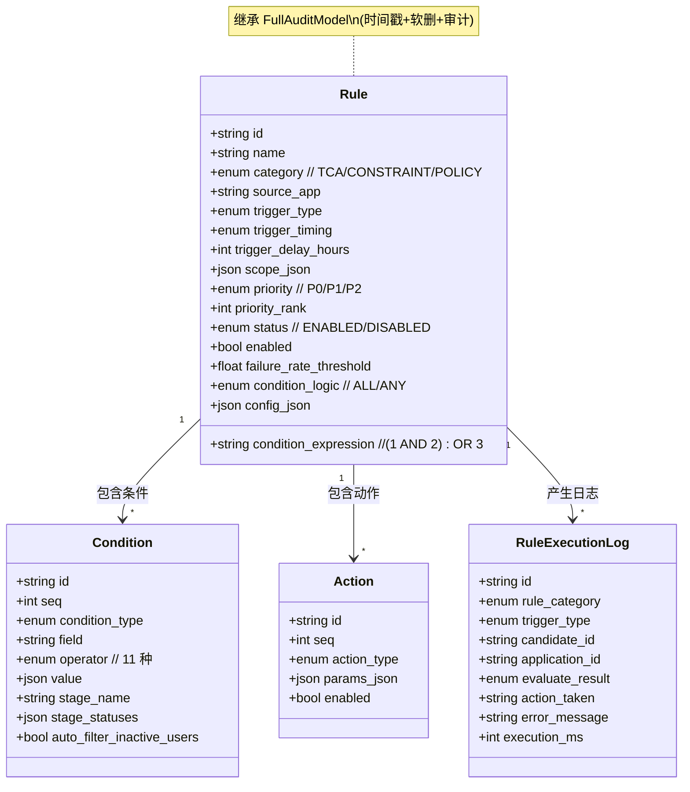
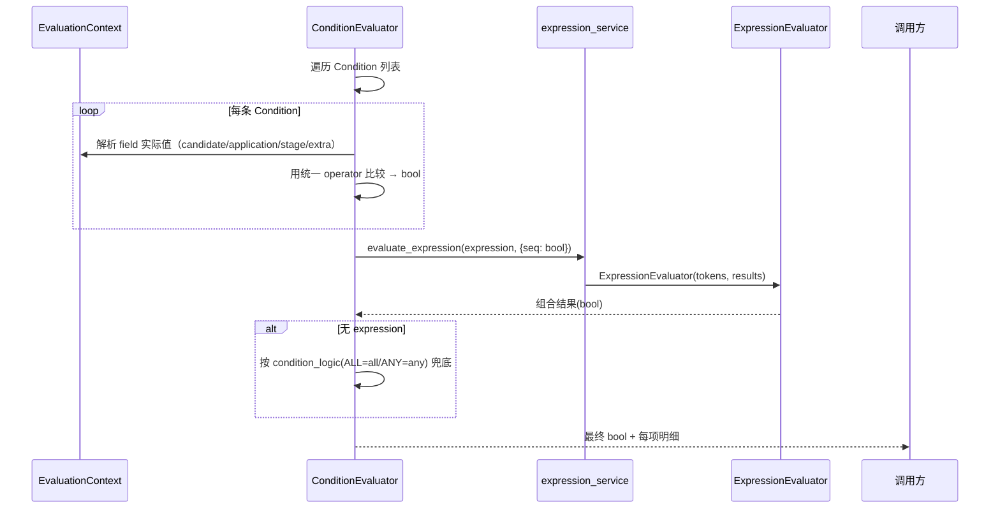
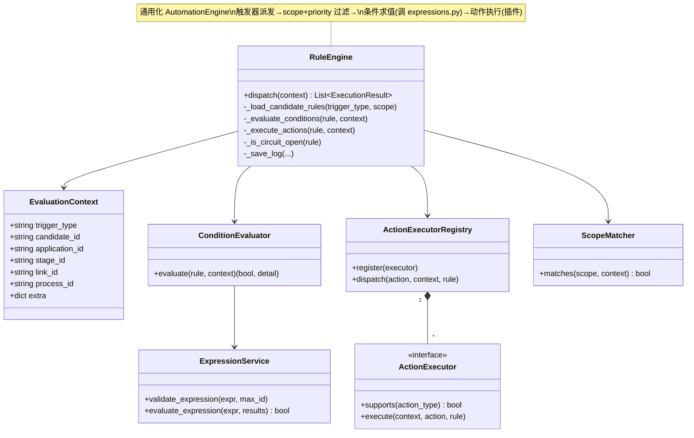
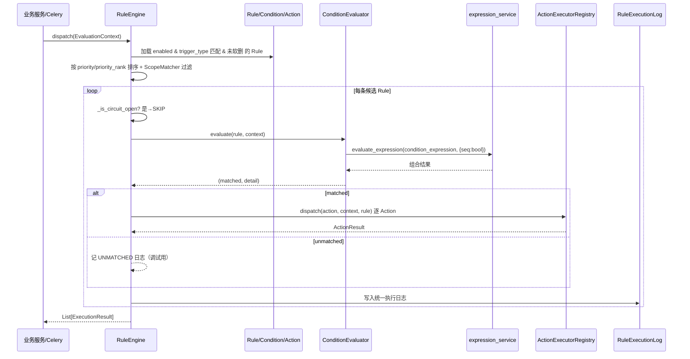

# 统一规则引擎（Unified Rule Engine）设计文档

> **文档状态**：设计稿 v1（仅设计，不落地业务代码）
> **作者角色**：软件架构师（Bob）
> **面向读者**：产品经理（PM）、技术负责人、各模块 Owner
> **配套源码事实来源**：`apps/django/apps/*`（只读调研已核实，见第 1 节）

---

## 0. 范围声明

| 项 | 内容 |
|----|------|
| **本轮目标** | 产出「统一规则引擎」的设计方案 + 数据模型设计，供 PM 评审范围 |
| **本轮交付物** | 本文档（仅文档，不修改任何业务代码 / 模型 / 端点） |
| **包含** | 统一核心抽象、各现有模块接入策略、引擎架构、API 表面、迁移阶段、待确认项 |
| **不包含（本轮）** | 任何 `rule_engine` app 代码、migration、序列化器、视图、Celery 任务实现 |
| **必须遵守的既有约束** | `SoftDeleteModel(deleted_at)`、`FullAuditModel`（时间戳+软删+`created_by`/`updated_by`）、DRF、JWT、复用 `process/expressions.py` 作为唯一条件求值底座 |

---

## 1. 现状盘点（已核实的关键事实）

通过对 `apps/django/apps/*` 的只读调研，确认现有规则设施如下（模型、字段、触发器、条件、动作、日志、端点均已落地）：

| 设施（app） | 核心模型（db_table） | 触发器语义 | 条件表达 | 动作语义 | 日志模型 | 现有端点前缀 |
|---|---|---|---|---|---|---|
| **automation** | `AutomationRule`(`automation_rules`) | `trigger_type`：STAGE_ENTERED/STATE_CHANGED/EVALUATION_SUBMITTED/SCHEDULED；`trigger_timing`：IMMEDIATE/DELAY/WORKING_DAYS + `trigger_delay_hours` | `condition_logic`(ALL/ANY) + `condition_json`(list of {field,operator,value}) | `action_type`：AUTO_ADVANCE/SKIP_TO/REMIND/REJECT_TO_POOL + `next_stage`/`skip_check` | `AutomationLog`(`automation_logs`) | `/api/v1/automation-rules/`（含 `/logs/`） |
| **entry_condition** | `EntryConditionRule`(`entry_condition_rules`) + `ConditionItem`(`condition_items`) | 隐式「进入阶段时评估」（FK `link→ProcessStageLink`），按 `rule_seq` 顺序 | `expression`(`(1 AND 2) OR 3`) 引用 `ConditionItem.item_seq`；`match_type` | 命中任一规则即**放行**，否则**拦截 + reject_message** | `EntryConditionLog`(`entry_condition_logs`) | `/api/v1/recruitment-rules/entry-conditions/` |
| **time_limit** | `TimeLimitRule`(`stage_time_limit_rules`) | 隐式「阶段停留超时 / 进入时计算锁定」 | `conditions`(JSON list) 默认 AND 组合 | **锁定**(lock_duration) / 加时(extension_per_person) / `effective_scope`(ALL/NEW_ONLY) | （无独立日志，复用调用方） | `/api/v1/time-limit-rules/` |
| **campus_control** | `ControlRule`(`control_rules`) + `ControlDimension`/`ControlIndicator`/`Person` | 隐式「提交 Offer 时校验」 | 维度/指标/占比，非字段运算符 | **硬约束**(抛异常) / **软约束**；`target`(占比)/`annual_target`/`monthly_targets` | （无统一日志，calc 纯函数） | `/api/v1/campus/`（dimensions/indicators/rules/persons） |
| **process.StageRule** | `StageRule`(`stage_rules`) + `ProcessStageLink`(`process_stage_links`) | 无（阶段级配置，非事件触发） | `entry_rule_expression`(`(1 AND 2) OR 3`) 缓存 | `auto_advance_*` / `auto_skip_n_plus_two` / `time_limit*` / `default_handler_*`（硬编码在阶段上） | 无 | `/api/v1/process-stage-links/`、`/api/v1/expressions/` |
| **mou** | `AutomationRule`(`mou_automation_rules`) ⚠️**命名冲突** | `trigger_event`（自由字符串，如 stage-entered） | `conditions`(JSON dict) | `actions`(JSON dict)，**无独立 evaluator** | 无 | `/api/v1/permissions-v2/` |
| **field_acl** | `FieldACL`(`field_acls`) | 无（访问控制，序列化层生效） | entity/field/role_code 三元组 | `permission`：READ/MASK/NONE | 无（仅有 audit 视图） | `/api/v1/field-acl/` |

### 1.1 关键复用点（必须复用，禁止再造）

- **唯一条件求值底座**：`apps/django/apps/process/expressions.py`
  - 提供 `tokenize` / `Parser` / `validate_syntax` / `extract_used_ids` / `evaluate` / `ExpressionEvaluator`（Shunting-Yard 逆波兰）。
  - 语法：`条件编号 1..N` + `AND`/`OR` + `()`，优先级 **括号 > AND > OR**。
  - 已被 `entry_condition` 复用；且存在**稳定包装层** `apps/process/services/expression_service.py`（`validate_expression` / `evaluate_expression` / `extract_ids`）。**统一引擎应调用 `expression_service`，而非直接 import expressions 内部**。
- **统一基类**：`apps/common/models.py` 中 `TimestampedModel`（时间戳）、`SoftDeleteModel`（`deleted_at` + `soft_delete/restore`）、`FullAuditModel`（= 时间戳 + 软删 + `created_by`/`updated_by` FK→`core.User`）、`UUIDModel`（nanoid 主键）。
- **现有引擎范式**：`apps/automation/services.py` 的 `AutomationEngine`（`find_candidate_rules` → `evaluate_rule`[scope→conditions] → `execute_rule`[action 插件] → `_save_log` → `_is_circuit_open` 熔断）是通用化的蓝本。

### 1.2 ⚠️ 命名冲突

- `automation.AutomationRule`（`automation_rules` 表）**与** `mou.AutomationRule`（`mou_automation_rules` 表）**类名完全相同**，且 `mou` 版无软删/审计、条件与动作为 JSON dict、无独立 evaluator。
- 统一时**必须重命名** `mou.AutomationRule`（见 3.6）。

---

## 2. 统一核心抽象（A）

### 2.1 范式统一：三大规则族

现有设施看似各异，本质可收敛为 **三个规则族（Rule Family）**：

| 规则族 | 范式 | 涵盖现有设施 | 是否走「触发→条件→动作」主链路 |
|---|---|---|---|
| **TCA（Trigger–Condition–Action）** | 事件触发 → 条件求值 → 执行动作 | automation、entry_condition、time_limit、mou | ✅ 是（主战场） |
| **CONSTRAINT（约束校验）** | 事件触发 → 条件/占比校验 → 放行/拦截 | campus_control（占比约束） | ⚠️ 是，但「条件」为领域语义（维度/指标/占比），动作仅 拦截/放行 |
| **POLICY（访问控制）** | 主体 → 资源 → 效果 | field_acl（字段权限） | ❌ 否（在序列化层生效，不按事件派发；仅统一「管理面 + 审计」） |

> **设计原则**：统一引擎提供 **通用骨架**（Rule / Condition / Action / Scope / Log / Engine / 插件注册），各家族通过 **category 区分 + 适配器/插件** 接入，而非为每族建一套平行模型。

### 2.2 统一数据模型（ER 风格）

> 新建 app 建议命名 **`rule_engine`**（理由见 7.3）。所有模型继承 `FullAuditModel`（已含软删+审计），满足既有约定。

#### 2.2.1 实体对照表

**Rule（统一规则主表，`rule_engine_rules`）** — 收敛所有家族的「规则头」

| 字段 | 类型 | 说明 | 来源映射 |
|---|---|---|---|
| `id` | CharField(32) PK | nanoid | 各 app 主键约定 |
| `name` | CharField(50) | 规则名称 | 各 app `rule_name`/`name` |
| `category` | CharChoices | **TCA / CONSTRAINT / POLICY** | 新抽象 |
| `source_app` | CharField | automation/entry_condition/time_limit/campus_control/mou/field_acl/process | 溯源 + 适配器路由 |
| `trigger_type` | CharField | 统一 TriggerType 枚举（见 2.4） | automation `trigger_type`、entry/time_limit 隐式、mou `trigger_event` |
| `trigger_timing` | CharField(null) | IMMEDIATE / DELAY / WORKING_DAYS | automation |
| `trigger_delay_hours` | Integer(null) | DELAY 延迟小时 | automation |
| `trigger_delay_working_days` | Integer(null) | WORKING_DAYS 工作日 | automation |
| `scope_json` | JSONField | **标准 scope 结构**（见 2.6） | automation `scope_json`、campus `bu/position/level`、process |
| `priority` | CharChoices | P0 / P1 / P2 | automation；time_limit int priority 归一 |
| `priority_rank` | Integer | 细粒度排序（time_limit 的 int priority） | time_limit |
| `status` | CharChoices | ENABLED / DISABLED | entry_condition `status` |
| `enabled` | Boolean | 启用开关 | automation/time_limit `enabled` |
| `failure_rate_threshold` | Float(default 0.5) | 熔断失败率阈值 | automation |
| `condition_expression` | CharField(500) | `(1 AND 2) OR 3` 引用 Condition.seq | entry_condition `expression`、process `entry_rule_expression` |
| `condition_logic` | CharChoices | ALL / ANY（无 expression 时兜底） | automation `condition_logic` |
| `config_json` | JSONField | **家族专属逃逸字段**（campus 的 target/strength、mou 原始 conditions/actions、field_acl 的 permission、StageRule 的 handler 配置等） | 各领域差异 |
| `created_by` / `updated_by` / `created_at` / `updated_at` / `deleted_at` | — | 来自 `FullAuditModel` | 既有约定 |

**Condition（统一条件项，`rule_engine_conditions`）** — 收敛 `ConditionItem` / automation `condition_json` 元素 / time_limit `conditions` / mou `conditions`

| 字段 | 类型 | 说明 |
|---|---|---|
| `id` | CharField(32) PK | nanoid |
| `rule` | FK→Rule | 所属规则 |
| `seq` | Integer | 规则内序号（供 `condition_expression` 引用，对齐既有 `1..N` 习惯） |
| `condition_type` | CharChoices | STAGE_STATUS / CANDIDATE / DEMAND / CUSTOM |
| `field` | CharField(64) | 字段名 |
| `operator` | CharChoices | **统一 11 种运算符**（见 2.3） |
| `value` | JSONField | 比较值 |
| `stage_name` / `stage_statuses` | CharField / JSONField | 阶段条件专用 |
| `auto_filter_inactive_users` | Boolean | 需求中人员字段专用 |
| `meta_json` | JSONField | 扩展（如 BETWEEN 的 min/max） |

**Action（统一动作项，`rule_engine_actions`）** — 收敛 automation `action_type` / entry「放行-拦截」/ time_limit「锁定」/ campus「硬-软约束」/ StageRule handler

| 字段 | 类型 | 说明 |
|---|---|---|
| `id` | CharField(32) PK | nanoid |
| `rule` | FK→Rule | 所属规则 |
| `seq` | Integer | 执行顺序 |
| `action_type` | CharChoices | 统一 ActionType 枚举（见 2.5） |
| `params_json` | JSONField | 动作参数（next_stage_id / skip_check / message / lock_duration / extension_per_person / effective_scope / strength / permission / handler_type / handler_user_ids 等） |
| `enabled` | Boolean | 动作开关 |

**RuleExecutionLog（统一执行日志，`rule_engine_execution_logs`）** — 替代分散的 `AutomationLog` / `EntryConditionLog`

| 字段 | 类型 | 说明 |
|---|---|---|
| `id` | CharField(32) PK | nanoid |
| `rule` | FK→Rule | 来源规则（含 category 冗余便于查询） |
| `rule_category` | CharChoices | TCA / CONSTRAINT / POLICY（冗余，免 join） |
| `trigger_type` | CharField | 触发类型 |
| `candidate_id` / `application_id` / `stage_id` / `link_id` / `process_id` | CharField | 上下文定位 |
| `evaluate_result` | CharChoices | MATCHED / UNMATCHED / ERROR / ALLOWED / REJECTED / BLOCKED / SKIPPED / LOCKED |
| `action_taken` | CharField(200) | 实际执行动作摘要 |
| `action_type` | CharField | 执行的动作类型 |
| `skip_reason` / `error_message` | CharField / Text | 跳过/异常原因 |
| `execution_ms` | Integer | 耗时 |
| `actor_id` | CharField | 触发人（系统=Celery 则为 null） |
| `triggered_at` | DateTime | 触发时间 |

> **OperatorCatalog / TriggerCatalog**：枚举建议直接用 `TextChoices`（与现有各 app 一致），暂**不**建独立表，降低复杂度；若 PM 要求运行时可配置触发源，再升级为 `TriggerDefinition` 表（见 7.6）。

#### 2.2.2 ER 图（Mermaid classDiagram）



### 2.3 Condition 统一表达（**复用 expressions.py，禁止再造**）

**统一表达 = 结构化 Condition 列表 + 可选 expression 字符串（ALL/ANY 兜底）。**

- 每条 `Condition` 是原子条件（field / operator / value），`seq` 从 1 起。
- `Rule.condition_expression` 用 `(1 AND 2) OR 3` 引用 `seq`，**语法 100% 复用 `process/expressions.py`**。
- 求值流程：



**统一运算符枚举（11 种，合并 automation 的 10 种 + entry_condition 的 BETWEEN）**：

`EQ / NEQ / GT / GTE / LT / LTE / BETWEEN / IN / NOT_IN / IS_EMPTY / IS_NOT_EMPTY`

> 注意：automation 当前少 `BETWEEN`，统一后 operator 集合以 11 种为准；既有 automation 数据不受影响（它只用其中子集）。

### 2.4 Trigger 统一抽象

**统一 TriggerType 枚举 + 触发源约定（谁在何时调用 `RuleEngine.dispatch`）**：

| 统一 trigger_type | 语义 | 来源 |
|---|---|---|
| `STAGE_ENTERED` | 进入阶段 | automation、entry_condition（隐式）、time_limit（隐式） |
| `STATE_CHANGED` | 状态变更 | automation |
| `EVALUATION_SUBMITTED` | 评价提交 | automation |
| `SCHEDULED` | 定时巡检（Celery 每 15 分钟） | automation |
| `STAGE_DWELL_TIMEOUT` | 阶段停留超 `time_limit` | time_limit（新增触发源，由定时任务或停留计时触发） |
| `OFFER_SUBMITTED` | 提交 Offer | campus_control（新增触发源） |
| `BUSINESS_EVENT` | 业务事件（自由 event 名） | mou（`trigger_event` 映射） |

**触发源约定**：
- 同步事件（STAGE_ENTERED / STATE_CHANGED / EVALUATION_SUBMITTED / OFFER_SUBMITTED）：由对应业务服务在事务提交后调用 `RuleEngine.dispatch(context)`。
- 定时事件（SCHEDULED / STAGE_DWELL_TIMEOUT）：由 Celery beat 调度，构造对应 trigger 的 context 后派发。
- 自由事件（BUSINESS_EVENT）：mou 保留其 `trigger_event` 字符串，存于 `config_json.event`，通过 `source_app=mou` + `trigger_type=BUSINESS_EVENT` 路由到 mou 适配器。

### 2.5 Action 统一抽象

**统一 ActionType 枚举 + ActionExecutor 插件接口（替换 automation 内 `_action_*` 硬编码）**：

| 统一 action_type | 语义 | 来源 | 参数(params_json) |
|---|---|---|---|
| `AUTO_ADVANCE` | 自动推进下一阶段 | automation | `skip_check` |
| `SKIP_TO` | 跳到指定阶段 | automation | `next_stage_id`, `skip_check` |
| `REMIND` | 发提醒 | automation | `remind_to`, `message`, `custom_user_ids` |
| `REJECT_TO_POOL` | 入公共人才库 | automation | — |
| `ALLOW` | 放行 | entry_condition | — |
| `REJECT` | 拦截 + 提示 | entry_condition | `message`(reject_message) |
| `LOCK` | 锁定阶段 | time_limit | `lock_duration`, `extension_per_person`, `effective_scope` |
| `UNLOCK` | 解锁 | time_limit | — |
| `BLOCK_HARD` | 硬约束拦截（抛异常） | campus_control | `message` |
| `BLOCK_SOFT` | 软约束提示 | campus_control | `message` |
| `ASSIGN_HANDLER` | 指派处理人 | process.StageRule | `handler_type`, `handler_fields`, `handler_user_ids` |
| `SET_PERMISSION` | 设置字段权限 | field_acl(POLICY) | `entity`, `field`, `role_code`, `permission` |

**ActionExecutor 插件接口（伪代码，仅示意，本轮不实现）**：
```
interface ActionExecutor:
    supports(action_type) -> bool
    execute(context, action: Action, rule: Rule) -> ActionResult
```
- 引擎持有一个 `ActionExecutorRegistry`，按 `action_type` 分发；新增动作类型只需注册新 executor，符合「开闭原则」。
- 现有 automation 的 `_action_auto_advance` 等逻辑迁移为独立 executor。

### 2.6 Scope 统一抽象

**标准 `scope_json` 结构（兼容各 app 现有表达）**：

```json
{
  "bu": "..." | null,                 // campus_control.bu
  "position": "..." | null,           // campus_control.position
  "level": "..." | null,              // campus_control.level
  "positions": ["pos_id_1", ...],     // automation.scope_json.positions
  "priority": ["P0", ...],            // automation.scope_json.priority（需求优先级）
  "referral_type": ["...", ...],      // automation.scope_json.referral_type
  "departments": ["...", ...],        // 部门维度
  "stages": ["stage_id", ...],        // process 阶段
  "process": "process_id" | null,     // 流程维度
  "custom": {}                        // 各 app 私有（如 remind_to / 候选人属性）
}
```

- 提供 `ScopeMatcher.matches(scope, context) -> bool`，统一判断规则是否适用于当前上下文。
- **向后兼容**：legacy 的 `scope_json` 形状由各自适配器归一化为上述结构，不强制旧表改字段。

### 2.7 规则生命周期（统一）

| 维度 | 统一方案 | 现状差异处理 |
|---|---|---|
| 启用/停用 | `enabled`(bool) + `status`(ENABLED/DISABLED) 并存 | automation/time_limit 用 enabled；entry_condition 用 status；归一为「enabled=status==ENABLED」 |
| 优先级 | `priority`(P0/P1/P2) + `priority_rank`(int) | time_limit 用 int priority → 映射到 priority_rank，priority 取默认 P1 |
| 软删除 | 继承 `SoftDeleteModel`(`deleted_at`) | 全部统一，查询均过滤 `deleted_at__isnull=True`（现状已多处依赖此约定） |
| 审计 | 继承 `FullAuditModel`（created_by/updated_by + 时间戳） | field_acl 当前仅 TimestampedModel（无软删/审计）→ 迁移时补全 |
| 熔断 | `failure_rate_threshold`(默认 0.5) + 复用 `_is_circuit_open` 逻辑 | 从 automation 抽取为引擎级能力，跨 TCA 家族共享 |
| 版本/草稿/AB | **本轮暂不纳入**（见 7.4） | 预留 `config_json` 扩展位 |

---

## 3. 现有模块迁移 / 接入策略（B）

> 总原则：**Strangler（绞杀者）模式 + 适配器 + 双写**，保证现有功能零中断。先建统一核心与 evaluator 接入，再逐 app 迁移，最后下线旧 evaluator。

### 3.1 各 app 映射与迁移方式一览

| 现有 app | 映射到统一模型 | 接入方式 | 渐进路径 | 主要风险 |
|---|---|---|---|---|
| **automation** | 原生 **TCA 规则**（最贴近统一模型） | **直接重构 + 双写** | Rule/Condition/Action 取代 AutomationRule 字段；AutomationEngine 委托 RuleEngine；AutomationLog→RuleExecutionLog | 低（范式一致）；需保证双写期间两表一致 |
| **entry_condition** | 原生 **TCA 规则**（trigger=STAGE_ENTERED，action=ALLOW/REJECT） | **适配器先行 → 双写** | 先用 `EntryConditionAdapter` 把旧模型呈现为统一 Rule（只读）；后写路径迁入 Rule/Condition/Action | 中（expression 引用 item_seq，需保证 seq 不变） |
| **time_limit** | 原生 **TCA 规则**（trigger=STAGE_DWELL_TIMEOUT，action=LOCK） | **适配器先行 → 双写** | 新增 `STAGE_DWELL_TIMEOUT` 触发源；conditions→Condition，lock→Action(LOCK) | 中（锁定/加时计算逻辑迁入 ActionExecutor 需谨慎） |
| **campus_control** | **CONSTRAINT 家族**（保持领域模型） | **仅复用 evaluator + 注册校验器** | ControlRule 数据保留；通过 `ConstraintAdapter` 在引擎中呈现为 Rule(category=CONSTRAINT)；引擎委派 `campus_control.calc` 校验；统一写 RuleExecutionLog | 中（占比数学复杂，不应强行塞入 TCA 表） |
| **process.StageRule** | 部分（rule-like 字段）纳入 TCA；其余（处理人/抢单/面试）**保留** | **拆分委托** | 见 3.5 | 高（StageRule 是阶段核心配置，改动面大） |
| **mou（AutomationRule）** | 原生 **TCA 规则**（family=MOU） | **重命名 + 适配器** | 见 3.6 | 中（命名冲突 + 无 evaluator，需补 MouConditionAdapter） |
| **field_acl** | **POLICY 家族**（轻量接入） | **统一管理面 + 审计** | 保留 FieldACL 模型；以 Rule(category=POLICY) 外壳呈现；评估仍在序列化层 | 低（不进触发主链路） |

### 3.2 automation —— 直接重构 + 双写

- `AutomationRule` 的 `trigger_type/condition_logic/condition_json/action_type/next_stage/skip_check/scope_json/priority/enabled/failure_rate_threshold` **逐一对应** 统一 Rule/Condition/Action 字段。
- `AutomationEngine` 改为「薄外观」：`run()` 内部委托 `RuleEngine.dispatch()`。
- 双写期：写操作同时落 `automation_rules` 与 `rule_engine_rules`，读取逐步切到统一表；校验一致后停写旧表。

### 3.3 entry_condition —— 适配器先行

- `EntryConditionRule.expression`（`(1 AND 2) OR 3`）与 `ConditionItem.item_seq` 天然映射为 `Rule.condition_expression` + `Condition.seq`。
- 动作语义：命中 → `Action(ALLOW)`；未命中 → `Action(REJECT, message=reject_message)`。
- 先用只读 `EntryConditionAdapter` 让 `/rule-engine/rules/` 能看到这些规则；写路径迁移时保留 `rule_seq` 语义（`ordering=['link','rule_seq']`）。

### 3.4 time_limit —— 新增触发源

- 新增 `STAGE_DWELL_TIMEOUT` 触发类型；定时任务或停留计时触发后，`RuleEngine` 加载 scope 匹配的规则，condition 命中则执行 `Action(LOCK)`。
- `lock_duration`/`extension_per_person`/`effective_scope` 落入 `Action.params_json`；原 `calc_time_limit`/`compute_locked_until` 逻辑迁入 `LockActionExecutor`。

### 3.5 process.StageRule —— 拆分委托（重点）

`StageRule` 字段可分为两类：

| 类别 | 字段 | 处理建议 |
|---|---|---|
| **规则-like（应纳入统一引擎）** | `auto_advance_type`/`auto_advance_timing`/`auto_advance_days`、`auto_skip_n_plus_two`、`time_limit`/`time_limit_scope`、`default_handler_type`/`default_handler_fields`/`default_handler_user_ids` | 在**模板应用 / 阶段配置保存**时，物化为绑定到该 `ProcessStageLink` 的统一 Rule（如 AUTO_ADVANCE / SKIP_TO / LOCK / ASSIGN_HANDLER），由 RuleEngine 派发 |
| **流程配置（非规则，保留）** | `processing_rule`/`processor_order`/`current_processor_index`、`is_grab_mode`/`grab_threshold`、面试相关、`data_source`/`data_field`、`inherit_prior_consensus`、`legacy_*` | **留在 StageRule**，不属于触发-条件-动作范式 |

- 建议：`StageRule` 保留为「阶段快捷配置」；其规则-like 字段在保存时**同步生成/更新**对应的统一 Rule（双写），底层委托 RuleEngine 执行。原 `legacy_time_limit_days`/`legacy_grab_threshold` 已标注废弃，不再纳入。

### 3.6 mou.AutomationRule —— 命名冲突处理

- **重命名** `mou.AutomationRule` → `mou.MouRule`（Python 类名），**db_table 保持 `mou_automation_rules`** 以避免迁移抖动；更新 `mou` 内所有引用。
- 其 `conditions`/`actions` 为 JSON dict，无独立 evaluator：提供 `MouConditionAdapter` 将 dict 翻译为统一 Condition 列表（或暂存 `config_json` 由 MouActionExecutor 自行解析）。
- 长期：MOU 规则迁入统一 Rule（category=TCA, source_app=mou）。

### 3.7 field_acl —— 轻量接入

- `FieldACL(entity, field, role_code, permission)` 是 (subject, resource, effect) 策略；评估发生在 API 序列化层（脱敏/隐藏），**不进触发主链路**。
- 统一方式：保留 `FieldACL` 模型，额外以 `Rule(category=POLICY)` 外壳供统一「规则管理列表 / 审计日志」展示；权限实际判定仍由 field_acl 层负责。
- 补全审计：当前 `FieldACL` 仅 `TimestampedModel`，迁移时补 `created_by`/`updated_by`/`deleted_at` 以符合 `FullAuditModel` 约定（或显式标注为「有意例外」）。

---

## 4. 引擎 / 求值架构（C）

### 4.1 统一 Engine 类结构（Mermaid classDiagram）



### 4.2 执行时序（Mermaid sequenceDiagram）



### 4.3 与 Celery 定时触发的整合点

- 现有 `apps/automation/tasks.py` 的 `run_scheduled_rules`（Celery beat 每 15 分钟，已用 `@retryable_scheduled_task` 包装）→ 改为 `RuleEngine.dispatch(SCHEDULED context)`。
- 新增 `STAGE_DWELL_TIMEOUT` 的定时扫描任务（复用同一 `RuleEngine.dispatch`，仅 trigger_type 不同）。
- `check_automation_failure_rate` 升级为引擎级 `check_failure_rate`（跨 TCA 家族扫描 RuleExecutionLog 计算失败率并告警）。

### 4.4 日志 / 可观测性

- **统一 `RuleExecutionLog`** 替代 `AutomationLog` / `EntryConditionLog`，所有家族共用，便于跨规则审计、熔断统计、排障。
- 字段含 `rule_category`/`trigger_type`/`evaluate_result`/`execution_ms`/`error_message`，支持按规则、候选人、时间窗检索。
- 建议后续接入监控：失败率告警、慢规则（execution_ms 阈值）、未匹配率。

---

## 5. API 表面（D）

### 5.1 统一端点规划（新增 `/api/v1/rule-engine/`）

| 端点 | 方法 | 说明 |
|---|---|---|
| `/rule-engine/rules/` | GET/POST | 统一规则列表/创建（过滤 `?category=&trigger_type=&enabled=&source_app=`） |
| `/rule-engine/rules/{id}/` | GET/PUT/PATCH/DELETE | 规则详情/更新/**软删** |
| `/rule-engine/rules/{id}/conditions/` | GET/POST | 条件子资源 |
| `/rule-engine/rules/{id}/actions/` | GET/POST | 动作子资源 |
| `/rule-engine/triggers/` | GET | 触发类型目录（含各 trigger 的触发源说明） |
| `/rule-engine/operators/` | GET | 运算符目录（11 种 + 说明） |
| `/rule-engine/evaluate/` | POST | **dry-run**：`{trigger_type, context}` → 返回匹配规则 + 条件明细 + 拟执行动作（**无副作用**，供前端预览/校验） |
| `/rule-engine/dispatch/` | POST | 显式触发派发（内部/Celery 调用入口） |
| `/rule-engine/scope/preview/` | POST | 测试 scope 是否匹配给定上下文 |
| `/rule-engine/logs/` | GET | 统一执行日志（替代 `/automation-rules/logs/`） |

### 5.2 兼容 / 弃用策略

| 阶段 | 策略 |
|---|---|
| **Phase 0–2** | 新增 `/rule-engine/*` 为**增量**；所有 legacy 端点**保持不变**，现有前端无感知 |
| **Phase 3+** | legacy 端点（如 `/automation-rules/`）变为**薄外观**，底层读写统一表（双写过渡） |
| **Phase 6** | legacy 端点标记 `Deprecation` 响应头，仍返回 200，引导前端迁移 |
| **Phase 7** | 移除 legacy 端点 + 旧 db 表（双写验证通过、数据回填完成、回归测试全绿后） |

> 表达式校验端点 `/api/v1/expressions/` 继续保留（已是统一 evaluator 的门户），`rule_engine` 复用之。

---

## 6. 迁移与落地阶段（E）

> 强调顺序：**先建统一核心 + evaluator 接入 → 逐 app 迁移 → 最后下线旧 evaluator**。每阶段独立可发布、可回滚。

| 阶段 | 产出 | 双写 | 主要风险 & 缓解 |
|---|---|---|---|
| **Phase 0：统一核心** | 新建 `rule_engine` app（仅模型 + 枚举 + `RuleEngine`/`ConditionEvaluator`/`ScopeMatcher`/`ActionExecutorRegistry` 骨架 + 复用 `expression_service`）；**不改任何业务调用**；单元测试 | 否 | 低风险；纯新增，零行为变化 |
| **Phase 1：适配器（读）** | `AutomationAdapter`/`EntryConditionAdapter`/`TimeLimitAdapter`/`ConstraintAdapter`/`MouAdapter`/`PolicyAdapter`；`/rule-engine/rules/` 能列出 legacy 规则（只读呈现） | 否 | 适配器映射错误 → 用 evaluate dry-run 对比旧/新结果 |
| **Phase 2：automation 迁移** | automation 写路径落统一表；`AutomationEngine` 委托 `RuleEngine`；`AutomationLog`→`RuleExecutionLog` | **是** | 双写不一致 → 校验脚本比对两边；保留回滚开关 |
| **Phase 3：entry_condition + time_limit 迁移** | 两 app 写路径迁统一表；evaluator 委托引擎；日志入 `RuleExecutionLog`；新增 `STAGE_DWELL_TIMEOUT` | **是** | seq/expression 一致性；锁定计算边界 → 充分单测 |
| **Phase 4：campus + mou** | campus 注册 `ConstraintValidator` + 统一日志；mou 重命名 `MouRule` + `MouConditionAdapter` 接入 | 部分（仅日志双写） | campus 占比数学保留原 calc；mou 补 evaluator |
| **Phase 5：process.StageRule 拆分** | rule-like 字段物化为统一 Rule（模板应用时双写）；其余保留 | **是（仅 rule-like 部分）** | 改动面大 → 灰度单阶段；保留 StageRule 原字段作回退 |
| **Phase 6：field_acl 轻接入** | 补审计字段；以 `Rule(POLICY)` 外壳统一管理与审计 | 否 | 低 |
| **Phase 7：下线旧设施** | 移除 legacy 端点、旧 evaluator、旧 db 表（回填+回归通过后） | 否 | 必须全量回归 + 数据校验报告 |

---

## 7. 待确认项（Open Questions，F）

1. **评分规则家族**：现状调研未触及「评分规则」，用户提及"评分规则家族是否本轮纳入" —— 是否纳入统一引擎范围？若纳入，其条件/动作语义如何映射？
2. **campus_control 占比约束**：是**塞进统一引擎**（建 CONSTRAINT 专用子表）还是**保持 campus_control 领域模型 + 适配器**（本文档默认后者，因占比数学复杂）？
3. **引擎落点**：统一引擎放在**新 app `rule_engine`** 还是**扩展 `automation`**？（本文档默认新 app，避免污染 automation 语义；见 2.2）
4. **规则版本/草稿/AB**：是否需要版本管理、草稿态、A/B 对照？（本文档预留 `config_json` 扩展位，本轮暂不实现）
5. **field_acl 是否进触发引擎**：仅统一"管理面+审计"，还是也要纳入 `RuleEngine.dispatch` 主链路？（默认仅管理面）
6. **Condition 表达形态**：继续用 `(1 AND 2) OR 3` 字符串，还是升级为**结构化表达式树**（更易前端可视化编辑/校验）？字符串方案已 100% 复用 `expressions.py`，推荐先维持。
7. **Action 参数存储**：高频动作（AUTO_ADVANCE/SKIP_TO/LOCK）是否建**专用字段**而非全塞 `params_json`？（默认 `params_json` 以保持模型稳定，必要时再提升）
8. **priority 语义归一**：P0/P1/P2 与 time_limit 的 int priority 如何统一排序（本文档用 `priority`+`priority_rank` 双字段）？
9. **熔断跨家族**：`failure_rate_threshold` 是否对所有家族共享？campus 硬约束失败是否也计入熔断？
10. **双写一致性保障**：legacy↔unified 双写期间，如何保证一致性与可回滚（开关、校验脚本、回填方案）？

---

## 7.1 决策记录（PM 已确认，2026-08-30）

> 以下决策已与 PM 对齐，作为 Phase 0 起实现的硬约束。未列项维持本文档默认方案。

| # | 决策点 | 结论 | 影响 |
|---|--------|------|------|
| D1 | 评分规则家族是否纳入 | **暂不纳入**本轮统一引擎；留作后续独立模块 | Phase 0–7 范围聚焦 automation / entry_condition / time_limit / campus_control / mou / field_acl 六类 |
| D2 | 引擎落点 | **新建 `rule_engine` app** | 不污染 automation 语义；现有 app 经适配器/双写渐进接入（Strangler 模式） |
| D3 | campus_control 占比约束接入方式 | **保持领域模型 + `ConstraintAdapter`** | ControlRule 数据保留，引擎内以 `Rule(category=CONSTRAINT)` 呈现；校验仍委派 `campus_control.calc`，占比数学不强行塞 TCA 表 |
| D4 | Condition 表达形态 | **维持 `(1 AND 2) OR 3` 字符串** | 100% 复用 `process/expressions.py` 求值底座，零新增风险；结构化表达式树作为后续可选升级 |

### 其余 Open Questions 的默认方案（未异议即按此执行）

- **Q4 版本/草稿/AB**：本轮暂不做，预留 `config_json` 扩展位。
- **Q5 field_acl 主链路**：仅统一管理面 + 审计，不进 `RuleEngine.dispatch` 主链路。
- **Q7 Action 参数**：高频动作参数统一存 `params_json`，不单建专用字段（必要时再提升）。
- **Q8 priority 归一**：`priority`(P0/P1/P2) + `priority_rank`(int) 双字段；time_limit 的 int priority → `priority_rank`，`priority` 取默认 P1。
- **Q9 熔断跨家族**：`failure_rate_threshold` 作为引擎级能力，从 automation 抽取后跨 TCA 家族共享；campus 硬约束失败**不**计入熔断（其语义为校验拦截，非执行失败）。
- **Q10 双写一致性**：每阶段双写配「开关 + 一致性校验脚本 + 数据回填方案」；校验通过后停写旧表，Phase 7 才下线旧设施。

---

## 8. 下一步实现清单草案（确认后）

> 以下为**确认范围后**的落地清单草案（本轮不执行）：

- [ ] **脚手架**：`apps/django/apps/rule_engine/`（apps.py / models.py / services.py / urls.py / admin.py / migrations / tests）
- [ ] **模型**：`Rule` / `Condition` / `Action` / `RuleExecutionLog`（均继承 `FullAuditModel`）
- [ ] **枚举**：`RuleCategory` / `UnifiedTriggerType` / `UnifiedActionType` / `UnifiedOperator`（11 种）
- [ ] **求值层**：`EvaluationContext` / `ConditionEvaluator` / `ScopeMatcher`，包装 `process.services.expression_service`
- [ ] **引擎**：`RuleEngine`（dispatch / load / evaluate / execute / circuit-break / log）
- [ ] **动作插件**：`ActionExecutor` 接口 + `ActionExecutorRegistry` + 基础 executors（AUTO_ADVANCE / SKIP_TO / REMIND / REJECT_TO_POOL / ALLOW / REJECT / LOCK 等）
- [ ] **适配器**：automation / entry_condition / time_limit / campus_control / mou / field_acl（读路径）
- [ ] **API**：DRF serializers + ViewSets + 路由（`/api/v1/rule-engine/`）
- [ ] **Celery**：`run_scheduled_rules` / `STAGE_DWELL_TIMEOUT` 扫描 / `check_failure_rate` 接入引擎
- [ ] **迁移脚本**：legacy 数据回填 unified；双写开关；一致性校验脚本
- [ ] **测试**：各家族 dry-run 新旧结果对比；回归现有 `/automation-rules/`、`/recruitment-rules/entry-conditions/`、`/time-limit-rules/`、`/campus/`、`/field-acl/` 行为

---

## 附录 A：复用的表达式引擎 API 速查

| 函数 | 位置 | 用途 |
|---|---|---|
| `validate_expression(expr, max_id)` | `process/services/expression_service.py` | 语法 + 编号范围校验，返回 `{valid,error,error_pos,suggestion,used_ids,max_id}` |
| `evaluate_expression(expr, {seq:bool})` | 同上 | 返回组合后 bool |
| `extract_ids(expr)` | 同上 | 提取引用的条件编号 |
| `tokenize` / `Parser` / `ExpressionEvaluator` | `process/expressions.py` | 底层词法/语法/求值（统一引擎不直接依赖，走 expression_service） |

## 附录 B：术语表

- **TCA**：Trigger–Condition–Action，事件驱动规则范式。
- **Strangler（绞杀者）**：逐步用新实现替换旧模块、旧模块并行运行直至下线的迁移模式。
- **双写**：写操作同时落新旧两张表，用于平滑迁移与回滚。
- **适配器（Adapter）**：将 legacy 模型在读取时呈现为统一模型，不改旧表。
- **evaluator**：条件求值器（本项目中特指 `process/expressions.py` 体系）。
