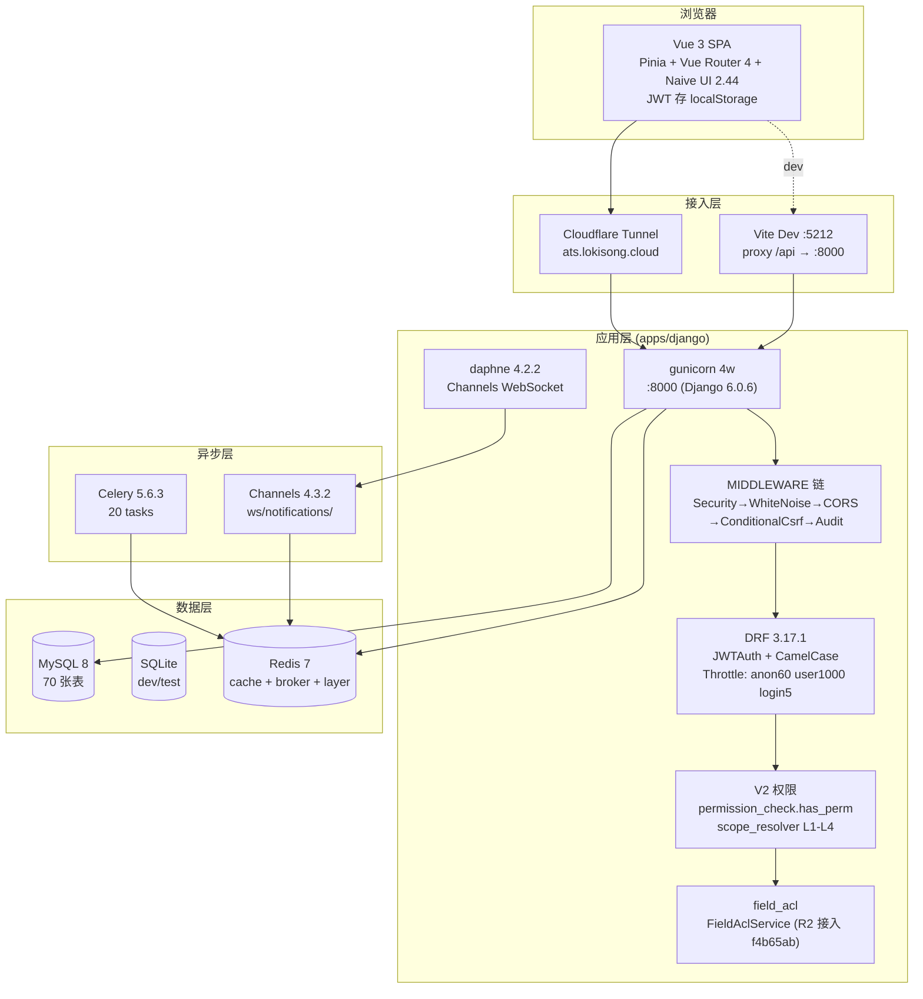

# ATS-NEW 技术说明文档

> **最后更新**: 2026-08-17 @ HEAD `9e353ee`
> **作者**: 许清楚（PM 文档 overhaul）+ 寇豆码（T01.1 修复）
> **修复 commit**: 本文档经历整段重写，删除所有 Node.js/Express/Prisma 残留（架构师已在 ARCHITECTURE_REVIEW_2026-08-03 §6.1 D1-D4 标出）
> **真实架构图**: 见 `docs/ARCHITECTURE_REVIEW_2026-08-03.md` §3 Mermaid 图（最权威）

---

## 1. 状态快照（2026-08-04）

| 维度 | 数值 | 验证方式 |
|---|---|---|
| Django apps | **35** | `settings/base.py:98-135` 计数 |
| 业务表 | **59** (`db_table=`) + V2 9 表 + 备份 4 表 | grep `db_table =` |
| API 路由 | **105 条 path()** + 52 router.register | `config/urls.py` 计数 |
| 状态机 | **7 FSMField / 50 @transition** | `django-fsm==3.0.1` |
| 后端测试 | **518 passed / 0 failed**（2026-08-11 基线；本次又新增字典 22 + 公告 18 等，详见 CHANGELOG） | `pytest` 全量 |
| 前端测试 | **132 vitest passed** | `npm test` |
| Migrations | **105 个文件 / 33 目录** | `find apps/django -name migrations` |
| 健康检查 | `/health/` | `config/urls.py:125` |
| 端口 | 前端 5212 / 后端 8000 (`gunicorn`) | 部署编排见 ats-deploy-infra (`compose/docker-compose.yml`) |

---

## 2. 架构图（Mermaid）



详细 Mermaid 图见 `docs/ARCHITECTURE_REVIEW_2026-08-03.md` §3（490 行报告）。

---

## 3. 技术栈（2026-08-17 真实）

| 层级 | 技术 | 版本 | 说明 |
|---|---|---|---|
| **前端** | Vue 3 | 3.4+ | Composition API |
| | Vite | 5.x | dev :5212, target ES2022 |
| | Naive UI | 2.44.1 | 2026-06 替换 Ant Design Vue |
| | UnoCSS | 66.7+ | 原子化 CSS |
| | Pinia | 2.x | 状态管理 |
| | Vue Router | 4.x | SPA + RBAC 守卫 |
| | axios | 1.x | JWT 拦截器 + request dedup |
| | vue-tsc | 2.2 | TS 严格模式 (R10 修复 3 error) |
| | vitest | 2.x | 132 tests, happy-dom |
| | Playwright | 1.49 | 6 spec / 18 场景 |
| | @wangeditor/editor + editor-for-vue | 5.x | 富文本编辑器 RichEditor（全屏编辑，独立分包 vendor-rich-editor） |
| **后端** | Django | **6.0.6** | 2026-07 解锁主版本锁 |
| | DRF | **3.17.1** | ViewSet + drf-spectacular |
| | djangorestframework-simplejwt | 5.5.1 | access 60min + refresh 7d + ROTATE |
| | django-fsm | **3.0.1** | 7 FSMField / 43 transition |
| | Celery | **5.6.3** | cron / 报表 / GDPR 清理 |
| | Channels | 4.3.2 | WebSocket 通知/协作 |
| | django-redis | 5.0+ | 限流 / 幂等 / session |
| | Sentry | 2.64.0 | 错误追踪 |
| | cryptography | 49.0.0 | PII 加密 (Fernet) |
| | reportlab | 5.0.0 | 服务端 PDF |
| | affinda | 4.28.9 | 简历解析 (V2 add-candidate) |
| **测试** | pytest | **9.x** | 384 tests, `pytest --deselect` |
| | vitest | 2.x | 132 tests |
| | Playwright | 1.49 | 6 spec |
| | flake8 + ESLint 9 | — | Python + TS/Vue |

**注意**: 旧版此处写 `django-fsm 2.8.1 / Celery 5.4 / Redis 5.0.4`，均为 `==` 锁版本的假绿。R9 (`7490b05`) 改为 `pip freeze` 真实版本对齐——见 `apps/django/requirements.txt` 头注释。

---

## 4. 项目结构（真实路径）

```
ATS-NEW/
├── apps/django/                # Django 6.0.6 + DRF 3.17.1 (port 8000)
│   ├── apps/                   # 30 个 business apps
│   │   ├── core/               # User/Department/Role/V2 权限/认证/健康检查
│   │   ├── field_acl/          # 字段级 ACL (R2 接入 f4b65ab)
│   │   ├── audit/              # 审计日志 + 中间件
│   │   ├── notification/       # 通知模板 + 4 渠道
│   │   ├── gdpr/               # 数据主体请求/匿名化/留存
│   │   ├── integration/        # 外部集成 (Fernet 加密)
│   │   ├── common/             # 加密/mixins/分页/异常
│   │   ├── process/            # 招聘流程/阶段/规则 (10 models)
│   │   ├── entry_condition/    # 进入条件规则
│   │   ├── time_limit/         # 阶段限时
│   │   ├── automation/         # 自动化规则引擎
│   │   ├── candidate/          # 候选人主档 + FSM (9 态)
│   │   ├── add_candidate/      # V2 新建候选人 (Affinda)
│   │   ├── application/        # 申请单 + 阶段流转
│   │   ├── demand/             # 招聘需求 + FSM
│   │   ├── position/           # 职位 + FSM
│   │   ├── offer/              # Offer + FSM + PDF
│   │   ├── onboarding/         # 入职 + FSM
│   │   ├── invitation/         # 面试邀约 + FSM
│   │   ├── interview/          # 面试安排/评价
│   │   ├── referral/           # 内推 + urls_stubs.py 寄放
│   │   ├── talent_pool/        # 人才库 + 推荐
│   │   ├── channel/            # 招聘渠道
│   │   ├── analytics/          # 数据中心/导出
│   │   ├── mou/                # MOU 大客户协议
│   │   ├── library/            # 院校/公司库
│   │   ├── scraped_resume/     # RPA 简历抓取 (0 model stub)
│   │   ├── external_sync/      # 外部系统同步 (0 model stub)
│   │   ├── duplicate_check/    # 简历查重 (0 model stub)
│   │   └── data/               # 数据中心 (0 model stub)
│   ├── config/                 # base.py / dev.py / prod.py / test.py
│   ├── migrations/             # 105 个 migration 文件（33 目录）
│   ├── tests/                  # 60 pytest + 11 QA blackbox
│   ├── scripts/                # 内部运维
│   ├── seeds/                  # 初始数据
│   ├── staticfiles/            # whitenoise 静态 (含前端 dist)
│   ├── manage.py
│   └── requirements.txt        # == 锁真实版本 (R9 7490b05)
│
├── web/app/                    # Vue 3 + Vite 5 + Pinia 2 (dev :5212)
│   ├── src/api/                # 27 个 .ts 客户端 (含 dict.ts P0-1 stub)
│   ├── src/pages/              # 68 文件, 14 业务域
│   ├── src/components/         # 38 文件 (23 .vue)
│   ├── src/stores/             # 4 Pinia store
│   ├── src/router/             # index.ts (215 行, RBAC 守卫)
│   ├── src/utils/              # role.ts / debounce / request-dedup
│   ├── src/config/             # 端口/超时/分页单一真源
│   ├── e2e/                    # 15 Playwright spec
│   ├── vite.config.ts          # target ES2022
│   └── package.json            # build: vue-tsc && vite build
│
├── (部署编排已迁出)            # ops/ 整体迁移到 ats-deploy-infra 独立仓库 (2026-09-18)
│                              #   https://gitee.com/loki126/ats-deploy-infra.git
│
├── docs/                       # 14 个文档 (见 §9 索引)
├── scripts/                    # 运维脚本
├── Makefile
├── README.md                   # 项目入口
├── technical.md                # 本文档
├── RUNBOOK.md                  # 跑通指南
└── requirements.md             # 业务需求
```

---

## 5. 关键模块（35 apps, 5 分层）

| 分层 | apps | 备注 |
|---|---|---|
| **核心** | core, field_acl, audit, notification, gdpr, integration, common | 7 个 |
| **流程域** | process, entry_condition, time_limit, automation | 4 个 |
| **业务域** | candidate, add_candidate, application, demand, position, offer, onboarding, invitation, interview, referral, talent_pool, channel, analytics, mou | 14 个 |
| **资源库** | library | 1 个 |
| **空壳 stub** | scraped_resume, external_sync, duplicate_check, data | 4 个（0 model, 计划 2-4 删/补） |

详细每个 app 的 py/LOC/model 规模见 `docs/ARCHITECTURE_REVIEW_2026-08-03.md` §4.1。

---

## 6. 关键数据表（业务域 + V2 权限）

```
业务表（59 张, db_table= 命名, 切片主表）
├── candidates / candidate_tags / candidate_histories
├── applications / application_stage_records / application_histories
├── positions / demands / demand_approvals
├── offers / onboardings / invitations / interviews
├── recruitment_processes / recruitment_stages / stage_rules
├── process_stage_links / process_templates / entry_condition_rules
├── referrals / talent_pool_entries / talent_pool_tags
├── channels / channel_costs / reports / report_snapshots / export_tasks
├── audit_logs / notification_templates / notification_logs
├── gdpr_requests / integration_configs / integration_sync_logs
├── mou_agreements / mou_containers / mou_mutual_exclusion_groups
├── departments / permissions / field_acls
├── library_school / library_company
└── automation_rules / automation_logs / stage_time_limit_rules

V2 权限表（9 张, T01.1 真实建表 010e4d4）
├── roles                 (11 列: system_code/role_code/role_name/template_code...)
├── user_roles            (10 列: granted_by_id/management_unit_ids JSON)
├── permission_resources  (11 列)
├── permission_templates  (10 列)
├── role_permission       (5 列)
├── management_units      (9 列)
└── tenant_configs        (6 列)

V1 备份表（4 张, T01.1 RENAME 保留救援路径）
├── roles_v1_backup / user_roles_v1_backup
└── permissions_v1_backup / role_permissions_v1_backup
```

---

## 7. 关键集成

| 集成 | 实现 | 关键文件 |
|---|---|---|
| **JWT 双 token** | simplejwt 5.5.1, access 60min + refresh 7d + ROTATE + BLACKLIST | `apps/core/views.py` |
| **字段级 ACL** | FieldAclService (R2 接入 f4b65ab) | `apps/field_acl/services.py` |
| **V2 权限** | has_perm + scope_resolver L1-L4 (T01.1 真实 runs) | `apps/core/permission_check.py` |
| **Celery 异步** | 20 tasks + 7 beat cron | `apps/*/tasks.py` |
| **SSE 流推送** | /api/v1/candidates/add-candidate/scoring/stream/ | `apps/add_candidate/views.py` |
| **Channels WebSocket** | ws/notifications/ + ws/applications/<id>/ | `apps/core/routing.py` |
| **IDOR 防护** | V2 + ScopeQuerysetMixin | `apps/core/permissions_v2.py` |
| **GDPR 注销** | 软删 + 匿名化 + 留存清理 | `apps/gdpr/services.py` |
| **PII 加密** | EncryptedCharField (Fernet) | `apps/common/encryption.py` |
| **ID 查重** | id_card_hash 不可逆（B1 f8708c9） | `apps/candidate/models.py:130` |

---

## 8. 已知风险与修复（不再假绿）

| # | 风险 | 状态 | 修复 commit |
|---|---|---|---|
| R1 | migration 0004 缺 import models | ✅ 已修 | `443550d` |
| R2 | 字段脱敏脱钩 | ✅ 已修 | `f4b65ab` |
| R3 | settings 默认回落 dev | ✅ 已修 | `1c0a263` |
| R4 | docker-compose 缺 redis | ✅ 已修 | `0720247` |
| R5 | stub 端点假成功 | ✅ 已修 | `e624105` |
| R6 | stub login 无 throttle | ✅ 已修 | `e624105` |
| R7 | ci 收集不全 | ✅ 已修 | `9687949` |
| R8 | DEPT scope 折空 | ✅ 已修 | `af5e4a2` |
| R9 | 依赖 lock 漂移 | ✅ 已修 | `7490b05` |
| R10 | vue-tsc 3 error | ✅ 已修 | `e03fda4` |
| R11 | CI 门禁全 `\|\| true` | ✅ 已修 | `9475c6a` |
| R15 | PII 脱敏 | ✅ 已修 | `df78e6f` |
| BUG-1 | 身份证查重失效 | ✅ 已修 | `f8708c9` |
| BUG-2 | 7 处 view 缺 request context | ✅ 已修 | `eae19c3` |
| BUG-3/4 | operator 字段 + id_card_no None | ✅ 已修 | `1e1ed1e` |
| BUG-5 | FSM 5 个 transition 缺失 | ✅ 已修 | `f970bf8` |
| BUG-6 | 信号审计需显式 | ✅ 已修 | `8213f78` |
| BUG-7 | 迁移 0005 变量遮蔽 | ✅ 已修 | `c60b65f` |
| T01.1 | V2 schema 真实建表 | ✅ 已修 | `010e4d4` |

待办（Phase 2 余下任务）：T01.2+ — 见 `docs/PHASE2_DESIGN_2026-08-03.md` §2.10 / §3 / §4。

---

## 9. 文档索引

| 文档 | 用途 |
|---|---|
| [README.md](../../README.md) | 项目入口 |
| [RUNBOOK.md](../06-runbook/RUNBOOK.md) | 跑通指南 + 紧急回滚 |
| [requirements.md](../03-product/requirements.md) | 业务需求 + Phase 2 待办 |
| [docs/ARCHITECTURE_REVIEW_2026-08-03.md](./ARCHITECTURE_REVIEW_2026-08-03.md) | 架构师深度审计（最权威） |
| [docs/PHASE2_DESIGN_2026-08-03.md](../09-archive/PHASE2_DESIGN_2026-08-03.md) | Phase 2 任务分解 |
| [docs/ARCHITECTURE.md](./ARCHITECTURE.md) | 模块图 |
| [docs/CHANGELOG.md](../06-runbook/CHANGELOG.md) | 变更历史 |
| [docs/MIGRATION.md](../06-runbook/MIGRATION.md) | 旧栈迁移日志 |
| [docs/SETUP.md](../06-runbook/SETUP.md) | 详细环境搭建 |
| [docs/TROUBLESHOOTING.md](../06-runbook/TROUBLESHOOTING.md) | 常见问题 |
| [docs/PERFORMANCE.md](../06-runbook/PERFORMANCE.md) | 性能基线 |
| [docs/PROJECT_PLAN.md](../03-product/PROJECT_PLAN.md) | 路线图 |
| [docs/DOCUMENTATION_AUDIT_2026-08-04.md](../07-audit/DOCUMENTATION_AUDIT_2026-08-04.md) | 文档审计 |
| [docs/QA_T011_VERIFY_2026-08-04.md](../07-audit/QA_T011_VERIFY_2026-08-04.md) | T01.1 QA 验证 |
| [docs/QA_BUG7_VERIFY_2026-08-04.md](../07-audit/QA_BUG7_VERIFY_2026-08-04.md) | BUG-7 QA 验证 |

---

*文档版本: V3.0 (2026-08-04 许清楚 整段重写)*
*基于 2026-08-03 旧版 V2.0 改造, 真实反映 Django 6.0.6 + DRF 3.17.1 栈*
