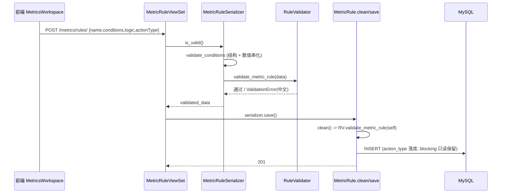
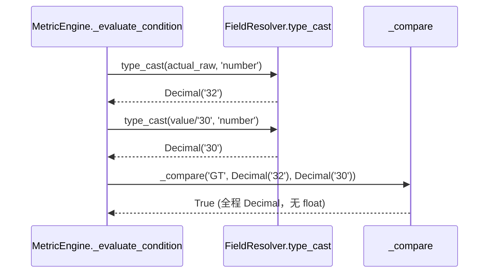
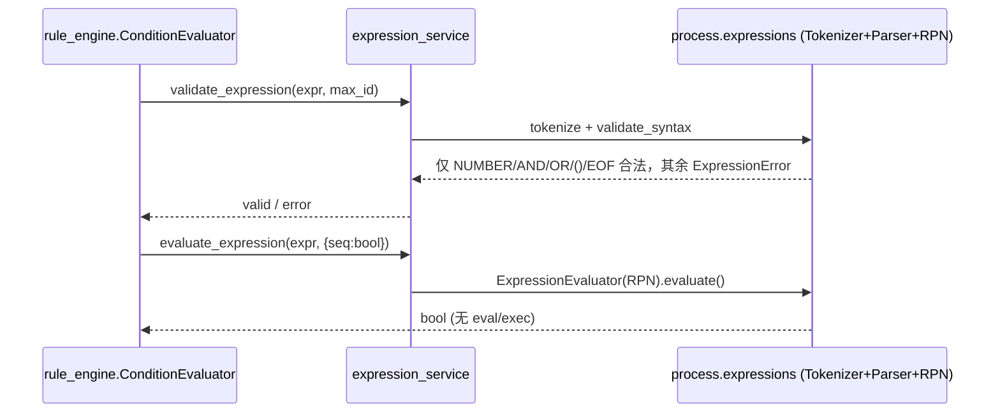
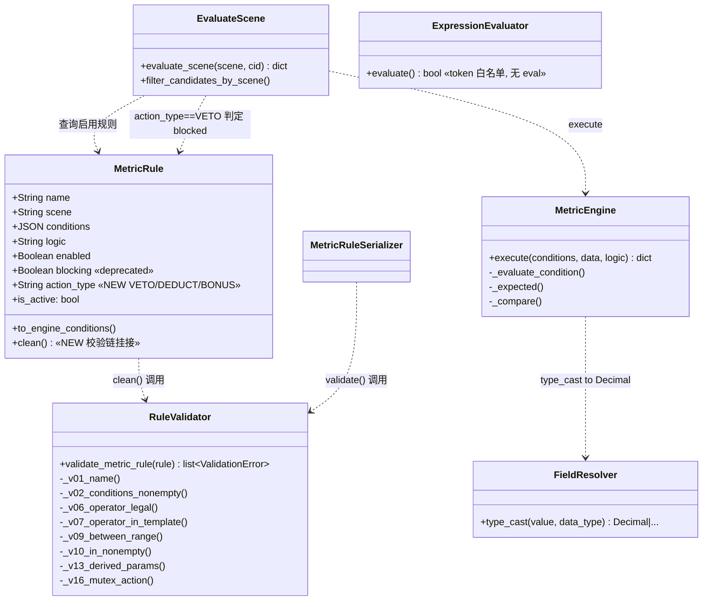

# 智能筛选规则中台 · Phase 1 增量设计 + 有序任务清单

> 作者：软件架构师「高见远」｜意图：参考 + 渐进增强（不推倒重写）｜技术栈：Django+DRF / Vue3+TS+Vite+**Naive UI**（无 Pinia/无 Element Plus）
> 本设计已基于现有源码逐文件核对，所有改动面均贴合既有实现，未做凭空设计。

---

## 0. 已核实事实（设计依据，避免空谈）

| # | 事实 | 来源 | 对设计的影响 |
|---|---|---|---|
| F0-1 | 指标/规则层已落地：`AtomicMetric / DerivedMetric / MetricTemplate / MetricRule`、`derived_registry`（input_kind/output_type/unit/param_schema + fail-loud）、`metric_engine`、`rule_trigger` | `apps/metrics/*` | 增量增强，不重写 |
| F0-2 | **条件表达式引擎 `apps/process/expressions.py` 已实现手写 tokenizer + 递归下降解析器 + Shunting-Yard RPN 求值器，全程无任何 `eval`/`exec`/`compile`/`pickle`** | 已读源码 + 正则扫描确认 0 命中 | **P1-C 无需重写**，仅审计 + 回归测试锁死白名单 |
| F0-3 | `MetricRule` 走自身 `logic`（AND/OR）字段，**不经过** `condition_expression`；后者仅 `rule_engine.Rule` 使用 | `metric_engine.py` / `rule_engine/models.py` | P1-C 审计目标主要是 `process.expressions` + `rule_engine` 链路 |
| F0-4 | `blocking` 字段仅存在于 metrics app 内部：`models.py:242`、`serializers.py:144`、`rule_trigger.py`（11/12/13/55/97/111/120/121/127/134/136）、`tests/test_trigger.py`；`talent_pool/views.py:59` 仅为注释，实际只消费 `evaluate_scene()['blocked']` | grep 全仓 | P1-D 爆炸半径可控；`talent_pool` 集成边界由 `evaluate_scene` 返回结构稳定保证 |
| F0-5 | 后端 `CamelCaseJSONRenderer` 仅转 JSON body，不转 query string；前端 query 已兼容 snake/entityId | 项目纪律 | 本阶段无新增 query 参数，保持即可 |
| F0-6 | `type_cast`（field_resolver.py:49）当前 NUMBER 分支返回 `int`/`float`，**存在 float 精度风险** | field_resolver.py | P1-B 改造点 |
| F0-7 | `MetricRule.conditions` 为 JSONField，数值 `value` 当前以 JSON number 入库 | models.py:229 | P1-B 需改为字符串存储 |

---

## 1. 范围说明与风险分级

| 任务 | 内容 | 风险 | 收益 | 批次建议 |
|---|---|---|---|---|
| **P1-C** | 表达式引擎安全审计 + 白名单回归测试 | **极低**（已实现 token 白名单，仅补测试） | 中（安全合规闭环，消除"是否用 eval"的悬疑） | **先行**（安全高收益） |
| **P1-A** | 16 校验门（V01–V16）落地为「保存前服务端校验链」 | **低**（纯增量，fail-safe，不破坏现有逻辑） | 高（防脏规则入库，呼应规格书 §14） | **先行** |
| **P1-E** | 业务语言映射走 i18n（action_type 等标签） | **极低**（仅增 i18n key） | 中（用户可读语义） | **先行** |
| **P1-D** | `MetricRule` 动作类型枚举（VETO/DEDUCT/BONUS）替代单一 `blocking` | **中**（模型迁移 + backfill + 触发点语义重构 + 前端） | 高（表达力强，对齐规格书） | **谨慎批次**（独立 PR + 迁移验证） |
| **P1-B** | 数值比较 Decimal 化 + JSON 字符串存储 | **高**（触碰所有数值比较链路 + 序列化约定 + 前端 value 形态） | 高（消除 float 精度类隐蔽 bug） | **谨慎批次**（全量回归 + 灰度） |

> 排序原则（已与你确认）：先安全项 P1-A / P1-C / P1-E，后谨慎项 P1-B / P1-D。P1-D 的互斥动作校验（V16）与 P1-A 的校验链同源，故 V16 在 P1-D 落地时一并升级到 `action_type` 维度，P1-A 阶段先以 `blocking` 维度实现互斥骨架。

---

## 2. 涉及文件清单（新增 / 修改，相对项目根）

### 2.1 新增文件

| 路径 | 职责 |
|---|---|
| `apps/django/apps/metrics/services/rule_validators.py` | **16 校验门唯一真相源**：`validate_metric_rule(rule) -> list[ValidationError]`，纯函数，被 serializer 与 model.clean 共用 |
| `apps/django/apps/metrics/tests/test_rule_validators.py` | V01–V16 各门单测 + 互斥/区间/参数约束场景 |
| `apps/django/apps/metrics/tests/test_expression_audit.py` | **P1-C**：断言 `expressions.py` 无 `eval/exec/compile/pickle/__import__/subprocess/os.system`；断言 tokenizer 对白名单外字符抛 `ExpressionError`（白名单锁死） |
| `apps/django/apps/metrics/tests/test_decimal.py` | **P1-B**：Decimal 比较等价性、JSON 字符串往返、float 兼容路径 |
| `apps/django/apps/metrics/migrations/0004_metricrule_action_type.py` | **P1-D**：AddField `action_type` + RunPython 从 `blocking` 回填 |

### 2.2 修改文件

| 路径 | 改动内容 |
|---|---|
| `apps/django/apps/metrics/models.py` | `MetricRule` 新增 `MetricActionType`(TextChoices: VETO/DEDUCT/BONUS) + `action_type` 字段（默认 DEDUCT）；新增 `clean()` 调用 `rule_validators.validate_metric_rule`；`blocking` 标记 deprecated（本阶段保留、只读，下个小迭代 0005 再删） |
| `apps/django/apps/metrics/serializers.py` | `MetricRuleSerializer`：字段列表加入 `action_type`（去除/弃用 `blocking` 输出）；`validate()` 调用 `validate_metric_rule` 做请求态 400；`validate_conditions` 增加数值→字符串串化（P1-B） |
| `apps/django/apps/metrics/services/rule_trigger.py` | `evaluate_scene`：阻断语义由 `rule.blocking` 改为 `rule.action_type == 'VETO'`；返回结构保持 `blocked` 字段语义不变（保证 `talent_pool/views.py` 集成边界零改动） |
| `apps/django/apps/metrics/services/field_resolver.py` | `type_cast` NUMBER 分支：int/str→`Decimal`；float 走 `Decimal(str(f))` + 警告（兼容存量）；拒绝非法数值 |
| `apps/django/apps/metrics/services/metric_engine.py` | `_expected` / `_compare` 全程使用 `Decimal`（BETWEEN meta min/max、IN 元素均经 `type_cast`） |
| `web/app/src/locales/metrics.ts` | **P1-E**：新增 `metrics.rule.actionType` / `metrics.rule.action.veto` / `.deduct` / `.bonus` 及校验提示 key（METRICS_ZH + METRICS_EN） |
| `web/app/src/api/metrics.ts` | `MetricRule` 接口增加 `actionType?: 'VETO'\|'DEDUCT'\|'BONUS'`；`blocking` 标记 `@deprecated` |
| `web/app/src/pages/settings/MetricsWorkspace.vue` | 规则保存表单：action_type 单选（Naive UI `n-radio-group`）；校验错误展示；数值型条件 value 输入发字符串（P1-B） |
| `apps/django/apps/metrics/tests/test_trigger.py` | 随 P1-D 将 `blocking=` 构造参数改为 `action_type=`，断言 VETO 阻断 / DEDUCT 放行语义 |

> **不动的边界**（最小变更）：`apps/process/expressions.py`（已安全）、`rule_engine/*`（非本次目标）、`candidate_snapshot.py`、`resume_struct.py`、`talent_pool/views.py`（仅注释可顺手更新，非必须）。

---

## 3. 数据模型与接口变更

### 3.1 `MetricRule.action_type` 枚举（P1-D）

```python
class MetricActionType(models.TextChoices):
    VETO   = 'VETO',   '必须满足'   # 不通过即拒绝业务动作（原 blocking=True 语义）
    DEDUCT = 'DEDUCT', '优先考虑'   # 优先但不阻断（软约束，原 blocking=False 语义）
    BONUS  = 'BONUS', '加分项'     # 命中则加分/正向加权（SCORING 场景二期落地权重）

class MetricRule(FullAuditModel, UUIDModel):
    # ... 既有字段 ...
    blocking = models.BooleanField(default=False, verbose_name='是否阻断', help_text='已弃用，由 action_type 取代', editable=False)  # 保留一版，只读
    action_type = models.CharField(
        max_length=16, choices=MetricActionType.choices,
        default=MetricActionType.DEDUCT, verbose_name='动作类型', db_index=True,
    )
```

**迁移 0004（谨慎）**：
1. `AddField` `action_type`（non-null，default `DEDUCT`）
2. `RunPython` 回填：`blocking=True → VETO`，`blocking=False → DEDUCT`
3. **暂不 `RemoveField blocking`**（降低爆炸半径；下个小迭代 0005 再删）
4. `reverse_code` 需可回滚（VETO/DEDUCT 无法无损还原 blocking 的"False"与"未配置"，故 reverse 仅置 `blocking` 为 `action_type=='VETO'`，并在 migration docstring 注明）

### 3.2 校验链挂接点（P1-A）

单一真相源 `rule_validators.validate_metric_rule(rule)`，**两处挂载**（防御纵深）：
- **请求态**：`MetricRuleSerializer.validate()` 内调用，失败抛 `ValidationError`（→ DRF 400 + 中文人话）
- **程序态**：`MetricRule.clean()` 内调用；`save()` 在 `super().save()` 前调用 `self.clean()`（覆盖 Celery `filter_by_scene_task`、admin、shell 等直写路径）

### 3.3 Decimal 在模型与 JSON 中的表示（P1-B）

- **模型层**：`MetricRule.conditions` 仍是 JSONField，无 schema 改动；约定数值型条件 `value` / `meta.min,max` / IN 元素 **以字符串存储**。
- **求值层**：`type_cast('number', x)` 永远返回 `Decimal`；`Decimal` 仅在求值瞬间存在，不入库。
- **JSON 往返**：DjangoJSONEncoder 可将 `Decimal` 序列化为字符串、回读为 str；但我们**不把 Decimal 入库**，入库前已由 serializer 串化为 str，回读恒为 str → `type_cast` 稳定解析。
- 示例入库：`{"templateId":"t1","operator":"GT","value":"30"}`；`{"operator":"BETWEEN","meta":{"min":"18","max":"60"}}`。

---

## 4. 关键调用流程

### 4.1 保存前校验链触发路径



### 4.2 Decimal 比较路径（P1-B）



### 4.3 表达式求值路径与 AST 白名单改造点（P1-C）



> **P1-C 结论**：链路已为手写 token 白名单（任意白名单外字符 → `ExpressionError`），**F-01 实质已满足**。改造点 = 新增 `test_expression_audit.py` 把"无 eval + 白名单拒绝非法字符"锁成回归测试，杜绝日后有人误加 `eval`。

---

## 5. 有序任务列表（依赖关系 + 实现顺序）

| Task | 对应 Phase | 内容 | 依赖 | 优先级 | 批次 |
|---|---|---|---|---|---|
| **T1** | P1-C | 表达式引擎安全审计 + 白名单回归测试（`test_expression_audit.py`） | 无 | P0 | 先行 |
| **T2** | P1-A | 16 校验门 + 服务端校验链（`rule_validators.py` + serializer/model 挂接 + `test_rule_validators.py`）；V16 互斥先以 blocking 维度实现骨架 | 无（互斥升级在 T4） | P0 | 先行 |
| **T3** | P1-E | i18n 业务语言映射（`locales/metrics.ts` 增 action_type 等标签） | 无 | P1 | 先行 |
| **T4** | P1-D | `action_type` 枚举 + 迁移 0004 回填 + `rule_trigger` 重构 + serializer/api/vue 前端 + `test_trigger` 更新；V16 升级到 action_type 维度 | T3 | P1 | 谨慎批次（独立 PR） |
| **T5** | P1-B | Decimal 化 + JSON 字符串存储（`field_resolver`/`metric_engine`/`serializer`/`MetricsWorkspace` + `test_decimal.py`） | 无（建议最后，因链路广） | P1 | 谨慎批次（全量回归+灰度） |

**实现顺序**：`T1 → T2 → T3 → T4 → T5`（安全项先行，谨慎项（模型迁移 T4、全局数值链路 T5）殿后）。T2 与 T4 通过"V16 互斥校验"衔接：T2 阶段 V16 以 `blocking` 维度落地互斥骨架，T4 落地 `action_type` 后把 V16 升级为 `action_type` 维度（同文件内小改，无新增任务）。

### 16 校验门建议映射（待与规格书正式 V01–V16 对齐）

- **结构完整性**：V01 名称非空(1~128)；V02 至少 1 条件；V03 条件皆为 dict；V04 每条件含合法 templateId 且模板存在；V05 scene/logic 枚举合法。
- **运算符/枚举合法性**：V06 operator ∈ UnifiedOperator(11)；V07 operator ∈ 模板 operators 白名单（复用引擎校验）；V08 action_type ∈ {VETO,DEDUCT,BONUS}。
- **区间/集合合法性**：V09 BETWEEN 必含 min/max 且 min≤max（按 data_type 比较）；V10 IN/NOT_IN value 非空数组且元素非空；V11 同指标同区间"无意义重叠"为 WARNING 级（非阻断）；V12 区间/集合 value 与模板 data_type 一致。
- **参数约束**：V13 DerivedMetric.params 符合 param_schema（required 存在、类型对、select∈options）；V14 base_path 末段指向数组/日期与 input_kind 一致（轻 heuristic）；V15 原子 source_path 含"."且无 dunder（既有校验纳入链统一调用）。
- **互斥动作（mutex）**：V16 同 scene 同 templateId 不得 VETO 与 BONUS 并存（首版互斥规则；完整 15 项 mutex 以规格书正式枚举为准）。

---

## 6. 依赖包

**零新增第三方包。**
- P1-C：审计确认无需 `ast` 重写（引擎已是 token 白名单）；若未来重写可选 stdlib `ast`，但本阶段不需要。
- P1-B：`Decimal` 来自标准库 `decimal`。
- 其余均为既有依赖（Django/DRF/Vue3/Naive UI/Vite）。

---

## 7. 共享约定

### 7.1 Decimal 序列化约定（P1-B）
- 入库：数值型条件 `value` / `meta.min,max` / IN 元素一律存 **字符串**（如 `"30"`、`"18"`）。
- 求值：`type_cast('number', x)` 返回 `Decimal`；比较全程 `Decimal`，禁止 `float`。
- 兼容：存量 JSON number（如 `30`）经 `type_cast(int)→Decimal(int)` 无损；存量 `30.0` 走 `Decimal(str(f))` + 日志告警，不报错。
- 前端：数值型条件 value 输入**建议发字符串**；后端 serializer 亦会兜底 coerce，双保险。

### 7.2 i18n Key 命名（P1-E）
- 动作类型：`metrics.rule.actionType` / `metrics.rule.action.veto` / `metrics.rule.action.deduct` / `metrics.rule.action.bonus`。
- 校验提示（用户面）：`metrics.rule.validate.*`（如 `metrics.rule.validate.betweenRange`、`metrics.rule.validate.operatorNotAllowed`）；服务侧错误可直接用中文人话（运维面），无需全量 i18n。
- 合并机制：`locales/index.ts` 已 `import { METRICS_ZH, METRICS_EN }` 并 `toNested` 合并，**新增 key 只需改 `metrics.ts`，无需动 `index.ts`**（符合项目"独立 i18n 模块避免并行会话冲突"纪律）。
- 文案纪律：用户可见优先中文；白名单词（API/URL/email/系统代码 ID/HR/HRBP/SUPER_ADMIN/and or/开发术语）保持原文。

---

## 8. 待明确事项 + 工程师边界

### 8.1 待明确事项（建议实现前拍板）
1. **规格书正式 V01–V16 枚举**：本设计 §5 为建议映射，需与规格书 §14 逐门对齐（尤其 V16 互斥的 15 项完整清单与每门"阻断/WARNING"级别）。
2. **`blocking=False` 回填默认值**：建议 `DEDUCT`（贴近"仅记录结论不阻断"语义），而非 `BONUS`；需确认。
3. **`blocking` 是否 Phase 1 直接 Drop**：建议 0004 加 `action_type`+回填并保留 `blocking` 只读一版，0005 下个小迭代再删，降低爆炸半径。
4. **DEDUCT/BONUS 在 SCORING 的权重**：本阶段仅做语义标注 + 入池/筛选的 VETO 阻断；评分加减分权重留 Phase 2。
5. **前端数值字符串化责任**：建议后端 serializer 兜底 coerce（更稳），前端自由；明确即可。

### 8.2 给工程师的边界（硬性）
- **最小变更**：只改 metrics app + 前端 metrics 三件套（`api/metrics.ts`、`locales/metrics.ts`、`MetricsWorkspace.vue`）；不动 `rule_engine/expressions.py`、`candidate_snapshot.py`、`resume_struct.py`、其他会话 WIP（`resume_parser.py`、`CandidateList.vue`、`addCandidate.ts` 等）。
- **git 纪律**：禁止 `git add -A`；只暂存本次特性文件（metrics 的 migrations/validators/models/serializers/views/rule_trigger + 前端三件套 + 新增测试）；不得触碰其他会话 WIP。
- **query string 约定**：新增端点无新 query 参数；若新增须兼容 snake 与 `entityId`（后端 CamelCase 只转 body）。
- **文案纪律**：用户可见优先中文，白名单词保持原文。
- **数值/安全红线**：比较用 `Decimal`、JSON 字符串存储、禁 float；表达式禁 `eval/exec/pickle`（已由测试锁死）。
- **回退策略**：T4 迁移 0004 必须可 reverse；T5 上线前用 `test_decimal.py` 跑全量数值回归 + 灰度（先非阻断场景）。

---

## 附录 A：类图（mermaid classDiagram）



## 附录 B：已核实——表达式引擎无 eval（P1-C 审计结论）

`apps/process/expressions.py` 全程为 `tokenize`（仅识别 NUMBER/AND/OR/LPAREN/RPAREN/EOF）→ `Parser`（递归下降）→ `ExpressionEvaluator`（Shunting-Yard→RPN 求值）。正则扫描 `eval|exec|compile|pickle|__import__|subprocess|os.system` **0 命中**。F-01 实质已满足；P1-C 交付物 = 上述 `test_expression_audit.py` 把该事实锁成回归测试。
