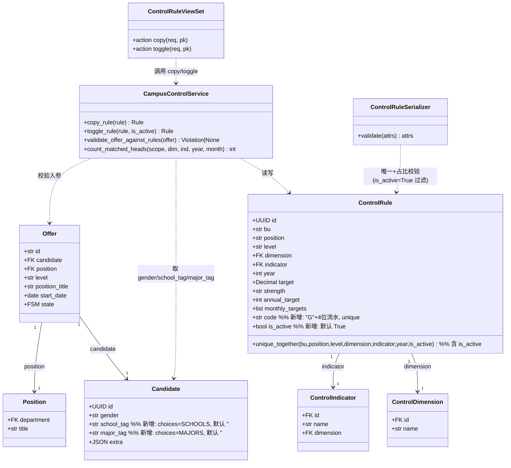
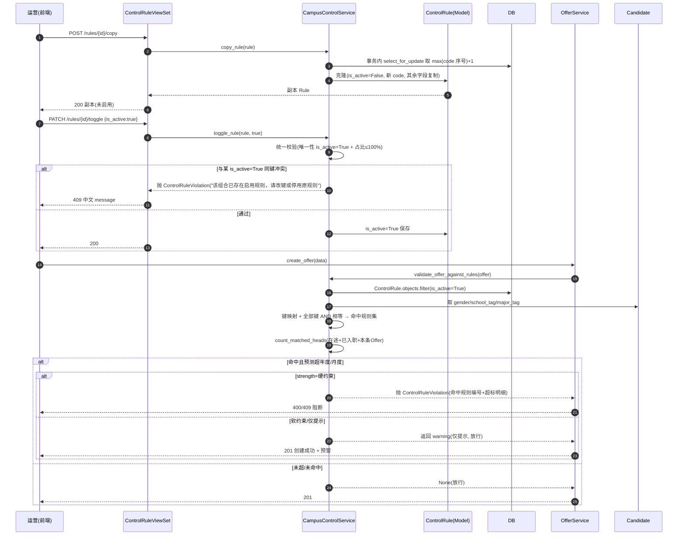
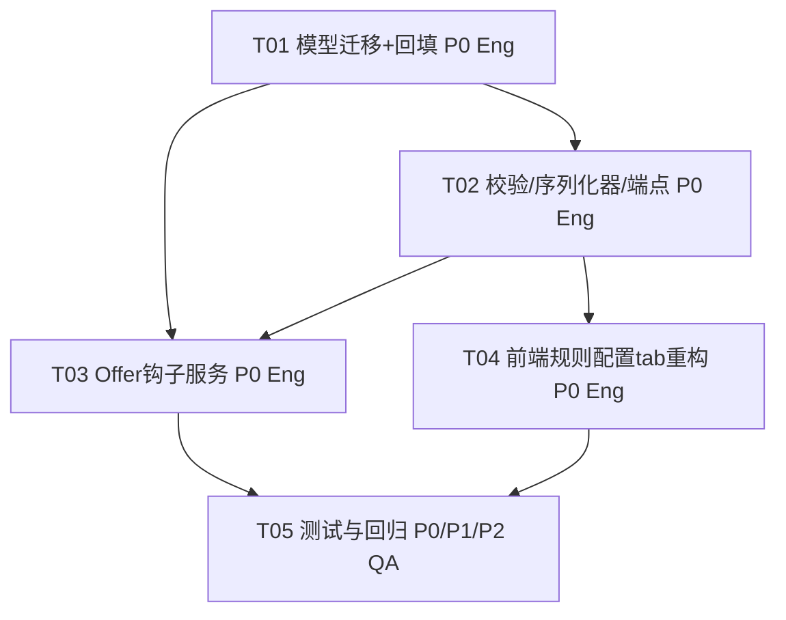

# 校招管控规则配置 — 系统设计与任务分解（设计文档）
> 最后更新：2026-09-07（依据 git 最后提交）

> 版本：v1.0 · 作者：架构师 高见远（Gao）· 语言：简体中文
> 基线：PRD（`docs/rule_config_prd.md`）+ 用户拍板的 **3 项修订决策**（权威，覆盖 PRD 中 `handling_method` 字段与「unique 不含 is_active」旧设定）。
> 代码事实已核查：`apps/django/apps/campus_control/`、`apps/django/apps/offer/`、`apps/django/apps/candidate/`、`web/app/src/pages/settings/CampusControl.vue`。

---

## 0. 修订决策基线（权威，覆盖 PRD 旧设定）

| # | 决策 | 对设计的影响 |
|---|------|--------------|
| 1 | **Offer 全维度命中**：`Candidate` 补齐 `school_tag`/`major_tag`（choices 对应 `SCHOOLS`/`MAJORS`，默认空），使「院校标签」「专业标签」维度可命中；性别仍用 `Candidate.gender`。从 `Person`/同步源映射本期至少落库，同步逻辑标 P2。 | 新增 `Candidate` 两字段 + 迁移；`validate_offer_against_rules` 映射三维度。 |
| 2 | **去掉「处理方式」字段**：不新增 `handling_method`。仅 `strength`（控制强度）单一字段驱动阻断逻辑：`硬约束`→阻断提交；`软约束`→仅提示（放行）；`仅提示`→仅提示（轻提示，放行）。详情「管控强度」仅展示控制强度；编辑表单无处理方式选择。 | 序列化器/模型均不含 `handling_method`；阻断语义由 `strength` 决定。 |
| 3 | **唯一约束含状态**：`ControlRule.unique_together` 改为 `(bu, position, level, dimension, indicator, year, is_active)`。允许「已启用原规则 + 未启用副本」共存；复制生成 `is_active=False` 副本（合法）；副本启用时若与某条 `is_active=True` 同键规则冲突 → 拦截并提示「该组合已存在启用规则，请改键或停用原规则」。 | 迁移改 `unique_together`；序列化器唯一校验改用 `is_active=True` 过滤；新增 `copy`/`toggle` 端点。 |

> PRD 中 `P0-1`（含 `handling_method`、`unique` 不含 `is_active`）与 `Q2/Q3` 旧结论以上述 3 项为准。

---

## 1. 实现方案概述

### 1.1 技术难点

1. **唯一约束含状态**：`unique_together` 加 `is_active` 后，DB 层允许「同键 + 不同 `is_active`」共存；业务层需在「启用」时校验是否已有 `is_active=True` 同键规则（避免两条启用规则并存）。
2. **Offer 全维度命中**：`Candidate` 缺院校/专业标签字段，需补字段并定义从 `Person`/`extra` 的可选映射路径（本期落库优先）。
3. **预测性超限计数口径**：Offer 创建时须「前瞻」——（在途 Offer + 已入职/待入职 Person + 本条 Offer）是否超年度/当月目标。需复用既有 ratio 引擎的「适用范围+维度+指标+月份」匹配，并补齐在途 Offer 计数。
4. **即时失效**：钩子每次实时 `ControlRule.objects.filter(is_active=True)`，不缓存规则集；停用/删除后新建 Offer 天然不再命中。

### 1.2 框架与库选型

- **后端**：沿用 Django + DRF（DefaultRouter、`ModelViewSet`）。**无新增第三方依赖包**。
- **前端**：沿用 Vue3 + Naive UI + UnoCSS；沿用项目 `useDialog` 二次确认组件。**无新增依赖包**。
- **架构模式**：后端「瘦 ViewSet + 厚 Service」——`campus_control/services.py` 承载克隆/启停/Offer 校验/计数；`offer/services.py::create_offer` 内调用钩子。前端「单页 tab 内嵌扁平列表 + 抽屉」。

---

## 2. 文件清单（相对路径）

### 后端（.py）

| 文件 | 变更类型 | 说明 |
|------|----------|------|
| `apps/django/apps/campus_control/models.py` | 修改 | `ControlRule` 加 `code`/`is_active`；`unique_together` 含 `is_active`。 |
| `apps/django/apps/campus_control/serializers.py` | 修改 | `ControlRuleSerializer`：唯一校验改 `is_active=True` 过滤；去 `handling_method`（本就无）；`code`/`is_active` 读写字段。 |
| `apps/django/apps/campus_control/views.py` | 修改 | `ControlRuleViewSet` 新增 `@action copy`、`@action toggle`；异常→中文 message。 |
| `apps/django/apps/campus_control/services.py` | **新增** | `copy_rule()`、`toggle_rule()`、`validate_offer_against_rules()`、`count_matched_heads()`。 |
| `apps/django/apps/campus_control/migrations/xxxx_controlrule_code_isactive.py` | **新增** | `ControlRule` 加 `code`/`is_active` + `unique_together` 含 `is_active` + 存量回填（code `G0001` 起、全部 `is_active=True`）。 |
| `apps/django/apps/candidate/models.py` | 修改 | 加 `school_tag`/`major_tag`（choices 对应 `SCHOOLS`/`MAJORS`，默认空）。 |
| `apps/django/apps/candidate/migrations/xxxx_candidate_school_major_tag.py` | **新增** | `Candidate` 两字段迁移。 |
| `apps/django/apps/offer/services.py` | 修改 | `create_offer` 内调用 `validate_offer_against_rules(offer)`。 |
| `apps/django/apps/offer/views.py` | 修改（可选） | 捕获 `ControlRuleViolation` 异常统一返回 400/409（或走全局异常中间件）。 |

### 前端（.vue / .ts）

| 文件 | 变更类型 | 说明 |
|------|----------|------|
| `web/app/src/pages/settings/CampusControl.vue` | 修改 | 「规则配置」tab 改为扁平列表（`n-data-table`）+ 详情 `n-drawer` + 编辑表单 + 操作列；复用 `useDialog`。 |
| `web/app/src/pages/settings/components/RuleConfigDrawer.vue` | **新增（建议抽取）** | 详情三模块（规则信息 / 管控目标年度+12月网格 / 管控强度仅控制强度）+ 编辑表单（除编号全改）。降低单文件体积。 |
| `web/app/src/pages/settings/composables/useRuleActions.ts` | **新增（建议抽取）** | 封装 复制/停用/删除/列表拉取/校验调用，统一错误与 loading 态。 |
| `docs/ui/SETTINGS_PAGE_STRUCTURE.md` | 遵循（不改） | 布局模型、`.page-container`/`.glass-panel`/`.table-wrap`、KPI 令牌、禁硬编码 hex、`body.dark` 变量集。 |

---

## 3. 数据结构与接口（classDiagram）



---

## 4. 程序调用流程（sequenceDiagram）



---

## 5. 模型迁移方案

### 5.1 `ControlRule` 变更

```python
# 仅描述字段变更，不写实现代码
code = models.CharField(max_length=8, unique=True, blank=True,
                        verbose_name='规则编号')          # "G" + 4 位流水, 如 G0001
is_active = models.BooleanField(default=True, verbose_name='启用')
# unique_together 改为含 is_active:
unique_together = [('bu','position','level','dimension','indicator','year','is_active')]
# 不加 handling_method
```

### 5.2 `Candidate` 变更（修订 1）

```python
# candidate/models.py 顶部: from apps.campus_control.constants import SCHOOLS, MAJORS
school_tag = models.CharField(max_length=16, choices=[(s,s) for s in SCHOOLS],
                              blank=True, default='', verbose_name='院校标签')
major_tag = models.CharField(max_length=16, choices=[(m,m) for m in MAJORS],
                             blank=True, default='', verbose_name='专业标签')
```
- `constants` 仅含枚举常量、无模型 import，跨 app 顶部 import 安全。
- 可选映射（**P2**）：从 `Person.school`/`Person.major` 或 `Candidate.extra`（Moka 同步）回填 `school_tag`/`major_tag` 的迁移/命令，本期至少落库字段。

### 5.3 存量回填迁移

- `ControlRule`：按 `Meta.ordering`（`bu,position,level,dimension,indicator,year`）遍历现有行，回填 `code = f"G{(i+1):04d}"`（从 `G0001` 起）、`is_active=True`。因存量全为 `True` 且原唯一键无重复，入新唯一约束（`+is_active`）后**不产生冲突**。
- `Candidate` 新字段默认 `''`（无需回填值）。

### 5.4 `code` 流水号并发安全（做法，不写代码）

- 在一个 `transaction.atomic()` 内，对 `ControlRule` 执行 `select_for_update()`（行锁/表锁）后取当前 `code` 最大序号（`ORDER BY code DESC LIMIT 1`，解析 `G` 后 4 位整数），`+1` 后用 `f"G{seq:04d}"` 生成；锁释放前写入，避免并发重复。
- 备选：独立序列表 `ControlRuleSeq` 自增；或 DB 序列。推荐「事务内 `select_for_update` 取 max+1」与现有 `submit_approval` 锁模式一致。

---

## 6. 新增端点设计（基于现有 `ControlRuleViewSet` 扩展）

| 方法 & 路径 | 行为 | 校验 / 返回 |
|-------------|------|-------------|
| `POST /api/v1/campus/rules/{id}/copy` | 克隆为 `is_active=False` 新 `code` 副本；维度/指标/范围/年度/目标/强度/月度全部复制。 | 成功 200 + 副本；若源已 `is_active=False` 再复制导致同键两条 `is_active=False` → DB `IntegrityError` → 捕获返回 409「该组合已存在未启用副本」。 |
| `POST /api/v1/campus/rules/{id}/toggle`（body `{is_active:bool}`）或 `PATCH is_active` | 停用（`False`）/启用（`True`）。停用直接置 `is_active=False`；**启用跑统一校验**。 | 启用冲突 → 409「该组合已存在启用规则，请改键或停用原规则」；占比超 100% → 400「该适用范围下此维度指标目标占比之和不得超过 100%」。 |

- **统一校验语义**（启用 / 新增 / 编辑共用 `ControlRuleSerializer.validate`）：
  1. 唯一性：`ControlRule.objects.filter(bu,position,level,dimension,indicator,year, is_active=True).exclude(pk=self.instance.pk)` 存在即冲突（保证「启用规则」唯一；未启用副本互不影响）。
  2. 占比：`同(bu,position,level,dimension,year)` 下 `target` 之和 ≤ 100%（排除自身）；超 → 400。
- 校验失败统一返回 **400（占比）/ 409（唯一冲突）** + 明确中文 `message`（沿用 DRF `ValidationError` / 自定义 `ControlRuleViolation`）。

---

## 7. Offer 钩子集成点设计（核心）

### 7.1 集成位置

- 新增 `apps/django/apps/campus_control/services.py::validate_offer_against_rules(offer)`。
- 在 `apps/django/apps/offer/services.py::create_offer`（`@transaction.atomic` 内，写库前）调用；抛 `ControlRuleViolation` 则回滚事务并返回 400/409。
- 实时查库，不缓存规则集 → 停用/删除即时失效。

### 7.2 命中映射（候选属性 → 规则键）

| 规则键 | 来源 | 备注 |
|--------|------|------|
| 维度/指标（性别） | `offer.candidate.gender` → `SEXES` | 男/女 |
| 维度/指标（院校标签） | `offer.candidate.school_tag` → `SCHOOLS` | 修订 1 新增字段 |
| 维度/指标（专业标签） | `offer.candidate.major_tag` → `MAJORS` | 修订 1 新增字段 |
| `level` | `offer.level` | 空=全局 |
| `position` | `offer.position_title`（或 `offer.position.position_title`） | 须属 `POSITIONS`；空=全局 |
| `bu` | `offer.position.department` | 须与 `DEPTS` 对齐；名称体系不同则需映射层（P2） |
| `year` | `offer.start_date.year` | 预计入职年度 = 规则生效年度 |

- 规则侧 `bu/position/level` 空 = 「全局」，匹配任意该维度组合。
- **全部键 AND 相等**才命中（维度名 + 指标值 + 适用范围 + 年度）。

### 7.3 判定（预测性超限）

- `count = count_matched_heads(scope, dimension, indicator, year, month)`，其中：
  - **已入职/待入职**：`Person`（`counted=True`，`status ∈ {在职, 在途待入职}`，按 `actual_entry_date`/`expected_entry_date` 归并到 `year`/`month`，且 `bu/position/level` 与 `dimension/indicator` 匹配）。
  - **在途 Offer**：`Offer`（`state ∈ {OFFER_SENT, ACCEPTED, PENDING_ONBOARDING}`，未删除，`start_date` 同年同月，候选标签命中同维度/指标）。
  - **本条 Offer**：`+1`。
- 命中且 `count > annual_target`（年度）或 `count > monthly_targets[month-1]`（当月）→ 按 `strength` 处置（修订 2）：
  - `硬约束` → 阻断（抛 `ControlRuleViolation`，附命中规则 `code` + 超标明细：维度/指标/适用范围/年度/月度/当前数/目标数）。
  - `软约束` / `仅提示` → 仅提示（放行，返回预警；严重程度标签不同）。
- 计数口径复用现有 ratio 引擎的「适用范围+维度+指标+月份」匹配逻辑，避免口径漂移。

### 7.4 即时失效

- 钩子每次 `ControlRule.objects.filter(is_active=True)` 实时查；停用/删除后新 Offer 天然不再命中。

---

## 8. 前端结构（`CampusControl.vue` 规则配置 tab）

- **扁平列表**：`n-data-table`，列 = 规则编号(`code` 可点击) / 维度 / 指标 / 适用范围(`bu·position·level`，全空显「全局」) / 生效年度 / 年度目标(人) / 控制强度(配色 `error/warning/default`) / 启用状态(标签或开关) / 操作(复制/停用/删除)。**整行 + 编号均可点击**打开详情；行 hover 高亮、focus 可见、回车打开（键盘可达）。
- **详情**：`n-drawer`（右侧）三模块：① 规则信息（编号/维度/指标/部门/职务/职级/生效年度）② 管控目标（年度目标人数大数字 + 12 月网格只读）③ 管控强度（**仅控制强度**，无处理方式）。
- **编辑表单**：除编号外全可改（维度/指标/范围/年度/占比/强度/年度目标/12 月）；保存复用后端校验；提供「均分年度」快捷（P1-1）；月度之和=年度目标提示（沿用 `redistributeDimMonthly`）。
- **操作列**：复制（生成未启用副本 + 引导提示 P1-3）/ 停用（`is_active=False`）/ 删除（`danger` 二次确认，**禁用原生 `confirm`，用项目 `useDialog`**）。
- **状态与可访问性（P0-10）**：空态 `n-empty`、加载态 `loading`、错误态 `n-alert`/`message` 全覆盖；focus 可见、键盘可达、对比度达标；切 `body.dark` 变量集正常；**禁止硬编码 hex**。
- **遵循**：`docs/ui/SETTINGS_PAGE_STRUCTURE.md`（布局模型二选一、`.page-container`/`.glass-panel`/`.table-wrap`/`.kpi-*`/`.toolbar`、KPI 令牌铁律）、`tokens.css`、`glass.css`。建议抽取 `RuleConfigDrawer.vue` 与 `useRuleActions.ts` 控文件体积。

---

## 9. 依赖包

- **后端**：无新增（沿用 Django / DRF / django-fsm / nanoid）。
- **前端**：无新增（沿用 Vue3 / Naive UI / UnoCSS / 项目 `useDialog`）。
- 若 `Position.department` 与 `DEPTS` 名称体系不一致，需映射层（**P2**，不引入新依赖）。

---

## 10. 任务列表（有序 · 依赖 · P0/P1/P2 · 归属）

> 标注：P0=必须；P1=应有；P2=可选。归属：Eng=后端/前端工程师；QA=测试。

### T01 · 后端模型迁移与数据回填  `【P0 · Eng】`
- 源文件：`campus_control/models.py`、`campus_control/migrations/xxxx_controlrule_code_isactive.py`、`candidate/models.py`、`candidate/migrations/xxxx_candidate_school_major_tag.py`
- 内容：`ControlRule` 加 `code`/`is_active`、`unique_together` 含 `is_active`；`Candidate` 加 `school_tag`/`major_tag`；存量 `ControlRule` 回填 `code(G0001…)`+`is_active=True`；`code` 流水用事务内 `select_for_update` 取 max+1。
- 依赖：无。

### T02 · 后端校验/序列化器/新增端点  `【P0 · Eng】`
- 源文件：`campus_control/serializers.py`、`campus_control/views.py`、`campus_control/services.py`(copy_rule/toggle_rule)
- 内容：`ControlRuleSerializer.validate` 唯一校验改 `is_active=True` 过滤 + 占比≤100%；`ControlRuleViewSet` 新增 `copy`/`toggle` action；统一返回 400/409 + 中文 message；去 `handling_method`。
- 依赖：T01。

### T03 · Offer 钩子集成服务  `【P0 · Eng】`
- 源文件：`campus_control/services.py`(validate_offer_against_rules/count_matched_heads)、`offer/services.py`(create_offer 调用)、`offer/views.py`(异常映射)
- 内容：实现 7.2 键映射 + 7.3 预测计数 + `strength` 处置；实时 `is_active=True` 查库；捕获 `ControlRuleViolation` 返回 400/409。
- 依赖：T01、T02。

### T04 · 前端「规则配置」tab 重构  `【P0 · Eng】`
- 源文件：`CampusControl.vue`、`components/RuleConfigDrawer.vue`、`composables/useRuleActions.ts`
- 内容：扁平列表（`n-data-table` 九列、整行+编号点击）+ 详情 `n-drawer` 三模块（管控强度仅控制强度）+ 编辑表单（除编号全改）+ 操作列（复制/停用/删除，`useDialog` 二次确认）+ 空/加载/错误态 + 键盘可达 + 禁硬编码 hex + `body.dark`；P1 折叠项：筛选/搜索(P1-2)、行内启停(P1-5)、权限显隐(P1-4)、均分年度(P1-1)、副本引导(P1-3)。
- 依赖：T02。

### T05 · 测试与回归验证  `【P0/P1/P2 · QA】`
- 源文件：后端单测（`campus_control/tests/`、`offer/tests/`）、前端联调清单、迁移回滚验证。
- 内容：唯一含状态（启用冲突提示）、复制副本未启用、停用/删除即时失效、Offer 三维度命中与阻断/提示、计数口径与 ratio 引擎一致性；P2：导入导出适配(P2-1)、模拟校验预览(P2-4)。
- 依赖：T03、T04。

---

## 11. 任务依赖图



---

## 12. 共享知识（供 Engineer）

- **中文 message 字典**：唯一冲突（启用）「该组合已存在启用规则，请改键或停用原规则」；占比超「该适用范围下此维度指标目标占比之和不得超过 100%」；Offer 阻断「命中管控规则 {code}，{维度}·{指标} 预计超{年度/月度}目标（当前 {n}/目标 {t}）」。
- **strength → 处置映射**：`硬约束`=阻断；`软约束`/`仅提示`=放行+提示（严重度标签不同）。
- **日期**：`year` 取 `offer.start_date.year`；月份角标 `monthly_targets[month-1]`。
- **即时失效铁律**：钩子每次实时 `filter(is_active=True)`，禁止缓存规则集。
- **返回值格式**：沿用现有 `{code, data, message}`。

---

## 13. 不明确点 / 假设

1. **计数口径**：假设复用现有 ratio 引擎的「适用范围+维度+指标+月份」匹配；在途 Offer 状态集合取 `{OFFER_SENT, ACCEPTED, PENDING_ONBOARDING}`（若产品需含 `PENDING_APPROVAL`/`SENT` 待确认）。
2. **`Position.department` ↔ `DEPTS` 对齐**：假设 `position.department` 取值可直接匹配 `DEPTS`；若名称体系不同需映射层（标 P2）。
3. **`school_tag`/`major_tag` 同步**：本期仅落库字段 + 空默认；从 `Person`/`extra` 回填同步逻辑标 P2。
4. **启用冲突提示文案**：采用修订 3 指定文案；副本启用冲突即 409。
5. **`code` 生成**：采用事务内 `select_for_update` 取 max+1（与 `submit_approval` 锁模式一致）。

---

## 14. 最关键的技术风险

1. **唯一约束含状态后的「启用冲突」边界**：`unique_together` 含 `is_active` 允许「激活原+未激活副本」共存，但启用副本须校验是否已有 `is_active=True` 同键——序列化器唯一校验须以 `is_active=True` 过滤（非旧的全量过滤），否则会误拦合法副本。
2. **预测计数口径漂移**：Offer 钩子的「在途+已入职+本条」计数须与现有 ratio 看板口径一致，否则会出现「看板未超、创建却被阻断」的矛盾。
3. **`Position.department` 与 `DEPTS` 名称对齐**：若部门命名体系不一致，命中 `bu` 会静默失效（维度命中但范围不中），需映射层兜底。
4. **并发 `code` 生成**：高并发下复制/新建须事务内 `select_for_update` 防重号。

> v2.10 增量（rollover）：参见 `rule_config_design_v2_10_rollover.md`
