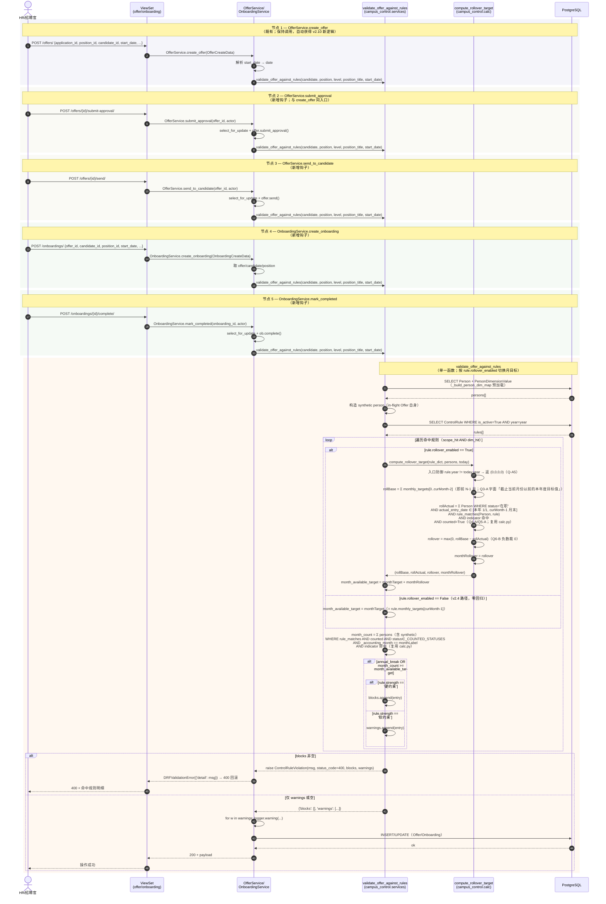

# 校招管控规则配置 v2.10 增量 — 系统设计与任务分解（设计文档）
> 最后更新：2026-09-07（依据 git 最后提交）

> 版本：v2.10 · 作者：架构师 高见远（Gao）· 语言：简体中文
> 基线：PRD（`docs/rule_config_prd_v2_10_rollover.md`，许清楚 已落盘）+ 主理人 3 项拍板（Q-A10 / Q-A5 / create_offer 同步升级）
> 不改基线：v2.4 设计文档（`docs/rule_config_design.md`）、v2.4 PRD（`docs/rule_config_prd.md`）、v2.9 迁移（`0007_alter_controlrule_strength_choices.py`）保持原貌
> 代码事实已核查：`apps/django/apps/campus_control/{models,calc,constants,serializers,services,views}.py`、`apps/django/apps/offer/services.py`、`apps/django/apps/onboarding/services.py`、`web/app/src/api/campusControl.ts`、`web/app/src/components/RuleConfigDrawer.vue`、`web/app/src/pages/settings/CampusControl.vue`、`apps/django/apps/campus_control/tests/test_calc.py`、`apps/django/apps/campus_control/tests/test_rule_config.py`、`apps/django/apps/offer/tests/test_offer_hook.py`

---

## 0. 修订决策基线（主理人拍板，权威）

| # | 决策 | 对设计的影响 |
|---|------|--------------|
| **Q-A10** | **校验函数版本管理 → 单一函数 `validate_offer_against_rules`**（不引入 `_v2_10` 后缀）。函数内部按 `rule.rollover_enabled` 切换口径：开启时按 `month_available_target = monthTarget + rollover` 校验；关闭时按 `monthTarget` 校验（与 v2.4 完全一致，零回归）。所有调用点（4 新节点 + `create_offer` + 未来扩展）走同一入口。 | 不新增函数；`services.py::validate_offer_against_rules` 内部加 `month_available_target` 分支；`calc.py` 新增纯函数 `compute_rollover_target` 供其复用。 |
| **Q-A5** | **跨年规则 → `monthRollover=0`**（采纳 PM 推荐）。当 `rule.year != today.year` 时，`rollBase=0`、`rollActual=0`、`monthRollover=0`、`monthAvailableTarget = monthTarget`，避免跨年口径歧义。P2-7 跨年告警本期不做。 | `compute_rollover_target` 入口先做 `if rule['year'] != today.year: return 0, 0, 0, 0` 防御；前端看板按 `monthRollover=0` 自然显示，本期不画 `n-alert`。 |
| **附加** | **`create_offer` 节点同步升级为走新逻辑**。`create_offer` 是最早入口（Offer 录入即触发），必须升级以避免遗漏浮动校验；与 Q-A10 一致。 | `offer/services.py::create_offer` 现有调用 `validate_offer_against_rules` 不变（已走同一入口），自动获得新逻辑，无需额外改动。 |

> PRD 中 Q-A10「推荐升级为 `validate_offer_against_rules_v2_10(...)` 新函数、保留 v2.4 旧函数、`create_offer` 仍调旧函数」方案已被主理人打回，本设计全程不引入 `_v2_10` 后缀。

---

## 1. 实现方案概述

### 1.1 技术难点

1. **零回归保证（最关键）**：`rollover_enabled=False` 时，4 节点 + `create_offer` 校验与 v2.4 严格一致；`compute_ratio` 看板口径（`monthAvailableTarget` 计算）的 `monthTarget` 列、`monthRate` 派生值均不漂移。
2. **计数口径必须复用 `calc.py`**：`rollActual` 仅用 `_COUNTED_STATUSES`（'在职'）/ `_accounting_month`（在职→actual_entry_date）/ `rule_matches` / `_indicator_filter` 计算；不得另写一套谓词（与 v2.4 服务层铁律一致）。
3. **跨年防御**：计算 `monthRollBase` 时若 `rule.year != today.year` → 直接返 0（Q-A5）；`rollActual` 的日期范围 `[本年 1/1, curMonth-1 月末]` 仅在同年内计算（与 v2.4 `_accounting_month` 行为一致，`actual_entry_date` 跨年的 Person 自动被 `_accounting_month` 排除）。
4. **4 节点接入语义**：节点各自独立事务（与 v2.4 一致），阻断后事务回滚、计数不累计；不会出现「阻断回滚后下次重试产生负浮动」（B10 边界）。
5. **单一函数分支复用**：Q-A10 决定不分裂函数版本，所有调用点共享同一入口；服务层内部按 `rule.rollover_enabled` 切换月目标口径（`monthTarget` vs `month_available_target`），保证 `create_offer` 不遗漏。

### 1.2 框架与库选型

- **后端**：沿用 Django + DRF（`ModelViewSet` + `@action`）。**无新增第三方依赖包**。
- **前端**：沿用 Vue3 + Naive UI + TypeScript。**无新增依赖包**。
- **架构模式**：后端「瘦 ViewSet + 厚 Service」——`campus_control/services.py::validate_offer_against_rules` 承载 5 调用点（4 新节点 + `create_offer`）；`campus_control/calc.py::compute_rollover_target` 新增纯函数（与 `_largest_remainder_allocate` 同级，作为可单测纯函数）。
- **迁移**：`AddField`（`rollover_enabled: BooleanField(default=False)`），与 v2.9 `0007_alter_controlrule_strength_choices.py` 同模式；存量行默认 `False` = 不启用浮动 → v2.4 行为零回归。

### 1.3 命名规范（与 v2.4 一致）

| 层 | 命名 |
|------|------|
| DB 字段 | `rollover_enabled`（snake_case，BooleanField） |
| 序列化器字段 | `rollover_enabled`（read/write，DRF camel-case renderer 自动转 `rolloverEnabled`） |
| API JSON | `rolloverEnabled`（camelCase，前端约定） |
| API JSON（看板） | `monthRollBase` / `monthRollActual` / `monthRollover` / `monthAvailableTarget`（与 PRD §3.5 一致；camelCase） |
| 前端 TS 类型 | `rolloverEnabled: boolean`、`monthRollBase?: number` / `monthRollActual?: number` / `monthRollover: number` / `monthAvailableTarget: number` |
| 审计日志 action | `TOGGLE_ROLLOVER`（P2-6，本期**不实现**；仅为命名约定占位，避免未来 P2 接入时撞名） |

---

## 2. 文件清单（相对路径）

### 2.1 后端（`.py`）

| 文件 | 变更类型 | 说明 | 关键行号 / 新文件 |
|------|----------|------|------------------|
| `apps/django/apps/campus_control/models.py` | 修改 | `ControlRule` 新增 `rollover_enabled: BooleanField(default=False, verbose_name='启用本月浮动目标')`（约 models.py:117 之后插入） | `+:117` 之后 |
| `apps/django/apps/campus_control/migrations/0008_controlrule_rollover_enabled.py` | **新增** | `AddField`（参照 `0007_alter_controlrule_strength_choices.py` 同模式），无 default 变更 / 无 RunPython（default=False 即满足存量行回填） | `campus_control/migrations/0008_*.py` |
| `apps/django/apps/campus_control/calc.py` | 修改 | 新增纯函数 `compute_rollover_target(rule_dict, persons, today=None) -> tuple[int, int, int, int]` 返回 `(rollBase, rollActual, rollover, monthRollover)`；复用 `_COUNTED_STATUSES` / `_accounting_month` / `rule_matches` / `_indicator_filter`；入口防御 `curMonth ∉ [1,12]` 与 `rule.year != today.year`（Q-A5） | `+:251` 之前（`simulate` 之后 / `_largest_remainder_allocate` 同级） |
| `apps/django/apps/campus_control/calc.py::compute_ratio` | 修改 | `rows[i]` 新增 4 字段：`monthRollBase` / `monthRollActual` / `monthRollover` / `monthAvailableTarget`；按 `rollover_enabled` 分支：开启时调 `compute_rollover_target` 取值，关闭时 4 字段全为 0（`monthAvailableTarget == monthTarget`） | `calc.py:209-247`（`compute_ratio` 函数体内） |
| `apps/django/apps/campus_control/services.py::validate_offer_against_rules` | 修改 | 函数内部对每条命中的启用规则，计算 `month_available_target = rule.monthly_targets[curMonth-1] + rollover`（开启时）或 `monthTarget`（关闭时）；阻断判定 `month_count >= month_available_target`；`entry` 增字段 `rollBase/rollActual/rollover/monthRollover/monthAvailableTarget` 便于前端 P1-8 阻断文案增强（**P1-8 本期不实现**，仅预留字段透传） | `services.py:166-297`（既有 `validate_offer_against_rules`） |
| `apps/django/apps/campus_control/serializers.py::ControlRuleSerializer` | 修改 | `fields` 增加 `'rollover_enabled'`；`read_only_fields` 不含（读写字段）；`validate` 不做特殊校验（仅 `BooleanField` 默认校验）；`validate_target` 等既有校验不调整 | `serializers.py:93-110`（Meta.fields）、`+:148` 后插入字段 |
| `apps/django/apps/offer/services.py::OfferService.submit_approval` | 修改 | 调 `validate_offer_against_rules` 钩子（与 v2.4 `create_offer` 同语义），阻断抛 400；走与 create_offer 同一函数（Q-A10 / 附加） | `offer/services.py:127-132` |
| `apps/django/apps/offer/services.py::OfferService.send_to_candidate` | 修改 | 同上 | `offer/services.py:153-173` |
| `apps/django/apps/offer/services.py::OfferService.create_offer` | 修改 | **既有**调用 `validate_offer_against_rules`（offer/services.py:78-106）保持不变——主理人附加决策要求 `create_offer` 同步升级走新逻辑；函数内部加分支即自动生效，无需额外改动 | `offer/services.py:78-106`（保持调用） |
| `apps/django/apps/onboarding/services.py::OnboardingService.create_onboarding` | 修改 | 新增调 `validate_offer_against_rules` 钩子（参照 `create_offer` 的 try/except + `_mirror_campus_validation` 模式）；阻断抛 `DRFValidationError` | `onboarding/services.py:31-60`（`create_onboarding` 内 `try/except` 包装） |
| `apps/django/apps/onboarding/services.py::OnboardingService.mark_completed` | 修改 | 同上 | `onboarding/services.py:81-85` |

### 2.2 前端（`.vue` / `.ts`）

| 文件 | 变更类型 | 说明 | 关键行号 |
|------|----------|------|----------|
| `web/app/src/api/campusControl.ts` | 修改 | `ControlRule` 加 `rolloverEnabled: boolean`；`RatioRow` 加 `monthRollBase?` / `monthRollActual?` / `monthRollover` / `monthAvailableTarget`；`ruleToNum` 把 `rolloverEnabled` 转 boolean | `+:79-99`（ControlRule）、`+:118-140`（RatioRow）、`+:205-212`（ruleToNum） |
| `web/app/src/components/RuleConfigDrawer.vue` | 修改 | `blank()` 加 `rolloverEnabled: false`；`syncFormFromRule` 同步字段；「管控强度」模块的 `n-form-item` 下方新增「启用本月浮动目标」`n-switch`（编辑态可切换，查看态 `disabled`）+ `n-text depth="3"` 说明；保存 payload 加 `rolloverEnabled` 字段 | `+:34-45`（blank）、`+:77-95`（syncFormFromRule）、`+:262-312`（模板第三模块） |
| `web/app/src/pages/settings/CampusControl.vue::ratioColumns` | 修改 | 「本月目标」列 `title` 改名「**本月额定目标**」（`key` 保留 `monthTarget`）；其后新增「本月浮动目标」列 `key='monthRollover'`；再后新增「本月可用目标」列 `key='monthAvailableTarget'`（按 `>= monthAvailableTarget` 打 success tag）；列头 tooltip 解释口径 | `+:1011-1018`（原 ratioColumns）、`ratioColumns` 数组内插入 2 列 |
| `web/app/src/pages/settings/CampusControl.vue::ruleColumns` | 修改 | 在「控制强度」列之后、操作列之前新增「**浮动目标**」列 `key='rolloverEnabled'`：渲染 `h(NTag, { type: r.rolloverEnabled ? 'info' : 'default', bordered: false, size: 'small' }, { default: () => r.rolloverEnabled ? '启用' : '未启用' })` | `+:973-977`（ruleColumns 数组内插入） |

### 2.3 测试（`.py`）

| 文件 | 变更类型 | 说明 |
|------|----------|------|
| `apps/django/apps/campus_control/tests/test_calc.py` | 修改 | 新增 `TestComputeRolloverTarget` 测试类：覆盖 Q3-A/Q4-A/Q5-A/Q6-B/Q-A5/B1/B8；断言 4 元组返回；保护 `rollover_enabled=False` 时口径与 v2.4 完全一致（与 `TestPrdAssertions` 的现有断言不漂移） |
| `apps/django/apps/campus_control/tests/test_rule_config.py` | 修改 | `TestApiEndpoints::test_ratio_endpoint` 断言新字段存在；新增 `test_rollover_disabled_matches_v24` / `test_rollover_enabled_year_mismatch_returns_zero` / `test_rollover_cross_year_zero` / `test_offer_hook_with_rollover_blocks_at_combined_target` |
| `apps/django/apps/offer/tests/test_offer_hook.py` | 修改 | 新增 `test_offer_hook_rollover_hard_block` / `test_offer_hook_rollover_disabled_v24_compat` / `test_submit_approval_rollover_block` / `test_send_to_candidate_rollover_block`（4 节点 + create_offer 全链路覆盖） |
| `apps/django/apps/onboarding/tests/test_onboarding_hook.py` | **新增** | 覆盖 `create_onboarding` / `mark_completed` 2 节点：硬约束命中抛 400 + 软约束放行；复用现有 `_build_scenario` 模式（参照 `test_offer_hook.py`） |

### 2.4 迁移（`.py`）

| 文件 | 变更类型 | 说明 |
|------|----------|------|
| `apps/django/apps/campus_control/migrations/0008_controlrule_rollover_enabled.py` | **新增** | `dependencies = [('campus_control', '0007_alter_controlrule_strength_choices')]`；`operations = [migrations.AddField(model_name='controlrule', name='rollover_enabled', field=models.BooleanField(default=False, verbose_name='启用本月浮动目标'))]`；无 `RunPython`（default=False 已满足存量行回填语义） |

### 2.5 文档

| 文件 | 变更类型 | 说明 |
|------|----------|------|
| `apps/django/docs/rule_config_design_v2_10_rollover.md` | **新增（本文档）** | v2.10 增量架构设计 + 任务分解 |
| `apps/django/docs/sequence-diagram-v2-10-rollover.mermaid` | **新增** | 5 节点（含 create_offer）sequenceDiagram（参见 §3） |
| `apps/django/docs/class-diagram-v2-10-rollover.mermaid` | **新增** | `ControlRule` 扩展 / `RatioRow` 扩展 / `ControlRuleSerializer` 字段（参见 §4） |

---

## 3. 数据流 / 程序调用流（sequenceDiagram）

> **5 节点共享同一服务函数 `validate_offer_against_rules`（Q-A10 拍板）**：
> ① `OfferService.create_offer`（既有；自动获得新逻辑，无需额外改动）
> ② `OfferService.submit_approval`（新增钩子）
> ③ `OfferService.send_to_candidate`（新增钩子）
> ④ `OnboardingService.create_onboarding`（新增钩子）
> ⑤ `OnboardingService.mark_completed`（新增钩子）



> 完整 mermaid 文件：`apps/django/docs/sequence-diagram-v2-10-rollover.mermaid`

---

## 4. 数据结构与接口（classDiagram）

```mermaid
classDiagram
    direction LR

    %% ─── 模型层（v2.10 新增字段）───
    class ControlRule {
        +UUID id
        +str code
        +bool is_active
        +str bu
        +str position
        +str level
        +FK dimension
        +FK indicator
        +int year
        +Decimal target
        +str strength
        +int annual_target
        +JSON monthly_targets  «length=12»
        +bool rollover_enabled «v2.10 新增, default=False»
        +save() 自动补号 code
    }

    class Person {
        +UUID id
        +str code
        +str name
        +str bu
        +str school
        +str sex
        +str major
        +str month
        +str status
        +date expected_entry_date
        +date actual_entry_date
        +str position
        +str level
        +bool counted
    }

    class Offer {
        +UUID id
        +str code
        +FK application
        +FK candidate
        +FK position
        +decimal salary
        +date start_date
        +date expire_date
        +str level
        +str position_title
        +OfferState state
    }

    class Onboarding {
        +UUID id
        +FK offer
        +FK candidate
        +FK position
        +date start_date
        +JSON todo_list
        +JSON todo_completed
        +OnboardingState state
    }

    %% ─── 服务层（v2.10 内部升级）───
    class ControlRuleViolation {
        +str message
        +int status_code «400/409»
        +list~dict~ blocks
        +list~dict~ warnings
        +__init__(message, status_code, blocks, warnings)
    }

    class campus_control_services {
        +validate_offer_against_rules(*, candidate, position, level, position_title, start_date) dict
        «v2.10 内部按 rule.rollover_enabled 分支:
          False → monthTarget（v2.4 行为）
          True → monthTarget + rollover
          （不分裂 _v2_10 后缀；Q-A10 拍板）」
        +copy_rule(rule) ControlRule
        +validate_rule_unique(rule) void
        +toggle_rule(rule, is_active) ControlRule
    }

    class campus_control_calc {
        +compute_ratio(persons, rules) dict
        «v2.10 rows[i] 新增 4 字段:
          monthRollBase/monthRollActual/monthRollover/monthAvailableTarget»
        +compute_rollover_target(rule_dict, persons, today=None) tuple~int,4~
        «v2.10 新增纯函数; 复用 _COUNTED_STATUSES/
          _accounting_month/rule_matches/_indicator_filter»
        +simulate(draft, rules, persons, year, month) dict
        +rule_matches(person, rule) bool
        +_accounting_month(person) str
        +_COUNTED_STATUSES set «= {在职, 在途Offer, 在途待入职}»
        +_indicator_filter(dimension, indicator) dict
    }

    %% ─── 序列化器（v2.10 新增字段）───
    class ControlRuleSerializer {
        +list fields «含 'rollover_enabled'»
        +get_dimension_name(obj) str
        +get_indicator_name(obj) str
        +validate(attrs) attrs
        «v2.10 字段透传；无特殊校验（BooleanField 默认）»
    }

    %% ─── 5 调用点（Q-A10 + 主理人附加）───
    class OfferService {
        +create_offer(data: OfferCreateData) Offer
        «既有调用 validate_offer_against_rules; v2.10 自动获新逻辑（主理人附加）»
        +submit_approval(offer_id, actor) Offer
        «v2.10 新增调 validate_offer_against_rules»
        +send_to_candidate(offer_id, actor) Offer
        «v2.10 新增调 validate_offer_against_rules»
    }

    class OnboardingService {
        +create_onboarding(data: OnboardingCreateData) Onboarding
        «v2.10 新增调 validate_offer_against_rules»
        +mark_completed(onboarding_id, actor) Onboarding
        «v2.10 新增调 validate_offer_against_rules»
    }

    %% ─── 前端类型（v2.10 新增）───
    class ControlRule_FE {
        +bool rolloverEnabled «camelCase, v2.10 新增»
        «前端 TS 类型; 其他字段沿用 v2.4»
    }

    class RatioRow_FE {
        +int monthTarget «沿用 v2.4»
        +int monthRollBase «v2.10; rolloverEnabled=True 时有值»
        +int monthRollActual «v2.10; rolloverEnabled=True 时有值»
        +int monthRollover «v2.10; False 时 0»
        +int monthAvailableTarget «v2.10; False 时 = monthTarget»
    }

    %% ─── 关系 ───
    ControlRule "1" --> "1" ControlDimension : FK
    ControlRule "1" --> "1" ControlIndicator : FK
    Person "1" --> "*" PersonDimensionValue : 动态维度
    Offer "1" --> "1" Person : 派生自 candidate+position
    Onboarding "1" --> "1" Offer : 派生

    campus_control_services ..> ControlRule : SELECT/校验
    campus_control_services ..> Person : SELECT/计数
    campus_control_services ..> ControlRuleViolation : 抛

    campus_control_calc ..> campus_control_services : 被调用
    campus_control_calc ..> ControlRule : 输入
    campus_control_calc ..> Person : 输入

    OfferService ..> campus_control_services : 5 节点共用
    OnboardingService ..> campus_control_services : 5 节点共用
    OfferService ..> Offer : CRUD
    OnboardingService ..> Onboarding : CRUD

    ControlRuleSerializer ..> ControlRule : 序列化
    ControlRule_FE ..> ControlRuleSerializer : JSON 反序列化（camelCase）
    RatioRow_FE ..> campus_control_calc : compute_ratio 输出
```

> 完整 mermaid 文件：`apps/django/docs/class-diagram-v2-10-rollover.mermaid`

---

## 5. Anything UNCLEAR（与 PRD §4 闭环）

| 项 | 说明 | 处理 |
|---|------|------|
| **PRD Q-A10**（已被主理人打回） | PRD 推荐升级为 `validate_offer_against_rules_v2_10(...)` 新函数；保留旧函数；`create_offer` 仍调旧函数 | **已打回**，本设计不引入 `_v2_10` 后缀；单一函数内部按 `rule.rollover_enabled` 切换；`create_offer` 同步获得新逻辑（主理人附加） |
| **PRD Q-A5** | 跨年规则（`rule.year != today.year`）的浮动语义 | **采纳 PM 推荐**：`monthRollover=0`；`compute_rollover_target` 入口先做 `if rule.year != today.year: return (0, 0, 0, 0)`；P2-7 跨年告警本期不画 `n-alert` |
| **P0-11 迁移策略** | 存量行 `rollover_enabled` 默认值 | **`default=False` 满足回填语义**：存量行 INSERT 时按 default 落 `False`，与 v2.4 行为一致；无 `RunPython` 数据迁移；与 v2.9 `0007_alter_controlrule_strength_choices.py`（无 RunPython）同模式 |
| **P0-14 4 节点事务语义** | 节点各自独立事务 vs 全局原子 | **各自独立事务**（与 v2.4 `create_offer` 一致）；阻断后事务回滚、`Person` 不新增、`monthActual` 不累计；不会出现「阻断重试后产生负浮动」（B10 边界） |
| **P1-7 KPI 卡 / P1-8 阻断文案 / P1-9 录入校验页** | 体验增强项 | **本期不实现**（仅实现 P0-11/12/13/14/15/16/17/18/19）；`validate_offer_against_rules` 的 `entry` 字典预留 `rollBase/rollActual/rollover/monthRollover/monthAvailableTarget` 字段透传，便于未来 P1 接入 |
| **P2-5 导出 / P2-6 审计 / P2-7 告警 / P2-8 回溯** | 后续事项 | **本期不实现**；仅在命名规范表 §1.3 中占位 `TOGGLE_ROLLOVER` 命名，避免未来 P2 接入撞名 |
| **前端 `ruleColumns` 操作列宽度** | PRD Q-A8 提到总宽溢出 | **由前端工程师自行调整**：操作列宽从 260px 收缩至 230px（避免溢出），本期在任务 T03 中标注为「可选调整」，不强制 |
| **`compute_rollover_target` 是否要导出纯函数** | 与 v2.4 既有纯函数风格一致 | **是**：4 元组返回 `(rollBase, rollActual, rollover, monthRollover)`，方便单测覆盖（`TestComputeRolloverTarget` 测试类）；不接受 `today=None` 时自动取 `_date.today()`，与 v2.4 `_count_achievement` 同模式 |

---

## Part B: 任务分解

### 6. 依赖包

**无新增第三方依赖包**。沿用现有 Django + DRF / Vue3 + Naive UI 栈。

---

### 7. 任务列表（按依赖排序，每任务 ≥ 3 文件）

> **硬约束**：≤ 5 个任务；按功能模块分组；不拆单文件；配置文件 / 入口文件 / 依赖声明全部放在 T01；后续任务尽量仅依赖 T01。

#### T01：后端基础设施（迁移 + 模型字段 + calc 纯函数）

| 字段 | 值 |
|------|-----|
| **任务名** | 后端基础设施（迁移 + 模型字段 + calc.compute_rollover_target 纯函数） |
| **源文件** | `apps/django/apps/campus_control/models.py`、`apps/django/apps/campus_control/migrations/0008_controlrule_rollover_enabled.py`（新建）、`apps/django/apps/campus_control/calc.py` |
| **依赖** | — |
| **优先级** | **P0** |

**实施内容**：

1. `models.py:117` 之后插入：
   ```python
   # v2.10：月度浮动目标（Roll-over）开关
   rollover_enabled = models.BooleanField(
       default=False, verbose_name='启用本月浮动目标',
   )
   ```

2. **新建** `0008_controlrule_rollover_enabled.py`（参照 `0007_alter_controlrule_strength_choices.py` 同模式）：
   - `dependencies = [('campus_control', '0007_alter_controlrule_strength_choices')]`
   - `operations = [migrations.AddField(model_name='controlrule', name='rollover_enabled', field=models.BooleanField(default=False, verbose_name='启用本月浮动目标'))]`
   - 无 `RunPython`（`default=False` 满足存量行回填；与 v2.9 迁移先例一致）

3. `calc.py` 新增纯函数 `compute_rollover_target(rule_dict, persons, today=None) -> tuple[int, int, int, int]`：
   - 入口防御：`if not (1 <= today.month <= 12): return (0, 0, 0, 0)`（Q-A4 边界）
   - 入口防御：`if rule_dict.get('year') != today.year: return (0, 0, 0, 0)`（Q-A5 跨年）
   - `rollBase = sum(rule_dict['monthly_targets'][i] for i in range(curMonth - 1))`（Q3-A 字面「截止当前月份以前的本年度目标值」；curMonth=9 → 1..8 月；curMonth=1 → `range(0)` = 空 = 0（B8））
   - `rollActual = sum(1 for p in persons if p.get('counted') and p.get('status') == '在职' and _accounting_month_in_range(p, today) and rule_matches(p, rule_dict) and all(p.get(k) == v for k, v in _indicator_filter(rule_dict['dimension'], rule_dict['indicator']).items()))`（Q4-A/Q5-A；复用 calc.py 谓词）
   - `_accounting_month_in_range(p, today)`：返回 `True` iff `p['actual_entry_date'] ∈ [本年 1/1, today.month-1 月末]`（与 Q4-A 严格对齐；不复用 `_accounting_month`，因为后者返回月份标签不直接做日期范围判断）
   - `rollover = max(0, rollBase - rollActual)`（Q6-B）
   - `monthRollover = rollover if rule_dict.get('rollover_enabled') else 0`
   - 返回 `(rollBase, rollActual, rollover, monthRollover)`

**验收标准**：

- `python manage.py migrate` 成功，`ControlRule` 表新增 `rollover_enabled` 列，存量行均为 `False`。
- `compute_rollover_target({'rollover_enabled': False, ...}, [], today=date(2026, 9, 15))` 返回 `(0, 0, 0, 0)`。
- `compute_rollover_target({'rollover_enabled': True, 'year': 2025, 'monthly_targets': [10]*12, ...}, [], today=date(2026, 9, 15))` 返回 `(0, 0, 0, 0)`（跨年）。
- B8 边界：`today=date(2026, 1, 1)` 返回 `(0, 0, 0, 0)`（`curMonth=1`，无过去月份）。

---

#### T02：服务层 + 序列化器升级（单一函数 `validate_offer_against_rules` 内部加分支）

| 字段 | 值 |
|------|-----|
| **任务名** | 服务层 + 序列化器升级（单一函数内部加 `rollover_enabled` 分支；序列化器增字段） |
| **源文件** | `apps/django/apps/campus_control/services.py`、`apps/django/apps/campus_control/serializers.py`、`apps/django/apps/campus_control/calc.py`（`compute_ratio` 改造） |
| **依赖** | T01 |
| **优先级** | **P0** |

**实施内容**：

1. `services.py::validate_offer_against_rules`（166-297 行）升级：
   - 在每条命中规则的循环内，按 `rule.rollover_enabled` 分支：
     ```python
     if rule.rollover_enabled:
         rollBase, rollActual, rollover, monthRollover = compute_rollover_target(
             rule_dict, persons, today=start_date,
         )
         month_available_target = int(mt[idx - 1]) + monthRollover if 1 <= idx <= 12 else int(mt[idx - 1])
     else:
         month_available_target = int(mt[idx - 1]) if 1 <= idx <= 12 else 0
         rollBase = rollActual = rollover = monthRollover = 0
     ```
   - 阻断判定改为 `month_count >= month_available_target`（取代 v2.4 `month_target`）
   - `entry` 字典新增字段：`'rollBase': rollBase, 'rollActual': rollActual, 'rollover': rollover, 'monthRollover': monthRollover, 'monthAvailableTarget': month_available_target`
   - **`rollover_enabled=False` 时，`entry` 不含上述 5 字段**（保持 v2.4 既有 entry schema，零回归——`test_rule_config.py::test_offer_hook_*` 与 `test_offer_hook.py::test_*` 现有断言不漂移）
   - 顶部 `import` 新增：`from .calc import compute_rollover_target`

2. `serializers.py::ControlRuleSerializer` 升级：
   - `Meta.fields` 列表新增 `'rollover_enabled'`（追加在 `'monthly_targets',` 之后）
   - `read_only_fields` 不含（读写字段）
   - `validate(attrs)` 不做特殊校验（`BooleanField` 默认校验即满足）
   - `validate_target` / `validate_annual_target` / `validate_monthly_targets` 等既有校验**不调整**

3. `calc.py::compute_ratio`（209-247 行）升级：
   - 每行新增 4 字段：
     ```python
     if r.get('rollover_enabled'):
         rollBase, rollActual, rollover, monthRollover = compute_rollover_target(r, persons, today=_date.today())
         monthRollBase = rollBase
         monthRollActual = rollActual
         monthRollover = monthRollover
         monthAvailableTarget = month_target + monthRollover
     else:
         monthRollBase = monthRollActual = monthRollover = 0
         monthAvailableTarget = month_target
     ```
   - **`rollover_enabled=False` 时，4 字段均为 0 / `monthAvailableTarget == monthTarget`**（v2.4 看板口径零回归）
   - `monthAchieved` / `monthInProgress` / `monthRate` 等既有口径**不调整**（与 PRD §3.5 「`monthAvailableTarget` 仅参与本月列系；与年度列系相互独立」一致）

**验收标准**：

- `rollover_enabled=False` 时 `validate_offer_against_rules` 返回的 `entry` schema 与 v2.4 完全一致；`test_rule_config.py` / `test_offer_hook.py` 现有 7 条 `test_offer_hook_*` 测试全部通过（零回归）。
- `rollover_enabled=True` 且 `month_count >= monthTarget + rollover` 时抛 `ControlRuleViolation`。
- 序列化器 `GET /campus/rules/` 响应含 `rolloverEnabled` 字段（DRF camel-case 自动转换）；`PUT /campus/rules/{id}/` 可写。

---

#### T03：4 节点接入 + 前端类型与列表/弹窗/看板改造

| 字段 | 值 |
|------|-----|
| **任务名** | 4 节点接入（offer/onboarding）+ 前端类型/列表/弹窗/看板改造 |
| **源文件** | `apps/django/apps/offer/services.py`、`apps/django/apps/onboarding/services.py`、`web/app/src/api/campusControl.ts`、`web/app/src/components/RuleConfigDrawer.vue`、`web/app/src/pages/settings/CampusControl.vue` |
| **依赖** | T02 |
| **优先级** | **P0** |

**实施内容**：

1. `apps/django/apps/offer/services.py`：
   - `OfferService.submit_approval`（127-132 行）：在 `offer.save()` **之前**插入 `validate_offer_against_rules` 调用，参照 `create_offer` 的 `try/except ControlRuleViolation → raise DRFValidationError({'detail': e.message})` 模式
   - `OfferService.send_to_candidate`（153-173 行）：同上
   - `OfferService.create_offer`（78-106 行）：**保持不动**（已有 `validate_offer_against_rules` 调用；T02 升级后自动获得新逻辑——主理人附加决策）

2. `apps/django/apps/onboarding/services.py`：
   - `OnboardingService.create_onboarding`（31-60 行）：在 `Onboarding.objects.create(...)` **之前**插入 `validate_offer_against_rules` 调用（同样 `try/except` 模式）
   - `OnboardingService.mark_completed`（81-85 行）：在 `ob.save()` **之前**插入调用
   - 入参构造：从 `offer` 取 `candidate`、`position`，从 `offer.level` / `offer.position_title` 取 `level` / `position_title`，从 `offer.start_date` 取 `start_date`

3. `web/app/src/api/campusControl.ts`：
   - `ControlRule` 接口（79-99 行）追加：`rolloverEnabled: boolean`
   - `RatioRow` 接口（118-140 行）追加：
     ```ts
     monthRollBase?: number
     monthRollActual?: number
     monthRollover: number
     monthAvailableTarget: number
     ```
   - `ruleToNum`（205-212 行）：`(x: any): ControlRule => ({ ...x, ..., rolloverEnabled: Boolean(x.rolloverEnabled), ... })`

4. `web/app/src/components/RuleConfigDrawer.vue`：
   - `blank()`（34-45 行）：追加 `rolloverEnabled: false`
   - `syncFormFromRule`（77-95 行）：追加 `rolloverEnabled: Boolean(r.rolloverEnabled)` 同步
   - 「模块三：管控强度」`<n-form-item>`（约 300-310 行）下方新增：
     ```vue
     <n-form-item label="启用本月浮动目标">
       <n-switch v-model:value="form.rolloverEnabled" :disabled="!editing" />
       <n-text v-if="!editing" depth="3" style="margin-left: 10px">
         {{ form.rolloverEnabled ? '已启用' : '未启用' }}
       </n-text>
     </n-form-item>
     <n-text depth="3" style="display: block; margin-top: -8px; margin-bottom: 12px">
       开启后，本月目标 = 本月额定目标 + 浮动目标（= 已过去月份目标合计 − 已过去月份入职且在职，负数裁 0）。
     </n-text>
     ```
   - 保存 `payload`（167-178 行）追加：`rolloverEnabled: Boolean(form.rolloverEnabled)`

5. `web/app/src/pages/settings/CampusControl.vue`：
   - `ruleColumns`（973-977 行之间）在「控制强度」列之后、操作列之前插入：
     ```ts
     {
       title: '浮动目标', key: 'rolloverEnabled', width: 100,
       render: (r: any) => h(NTag, {
         type: r.rolloverEnabled ? 'info' : 'default',
         bordered: false, size: 'small',
       }, { default: () => (r.rolloverEnabled ? '启用' : '未启用') }),
     }
     ```
   - `ratioColumns`（1007-1020 行）：
     - 「本月目标」列 `title` 改为「**本月额定目标**」（`key` 保留 `monthTarget`）
     - 在其后插入「本月浮动目标」列 `key='monthRollover'`（width 110px，渲染 `String(r.monthRollover ?? 0)`，列头 `tooltip: '截止当前月份以前的本年度目标合计 − 截止当前月份以前的本年度入职且在职'`）
     - 再后插入「本月可用目标」列 `key='monthAvailableTarget'`（width 110px，渲染 `h(NTag, { type: r.monthAchieved >= r.monthAvailableTarget && r.monthAvailableTarget > 0 ? 'success' : 'default', bordered: false, size: 'small' }, { default: () => String(r.monthAvailableTarget ?? 0) })`）
     - 「强度」列之前的「本月在途」列**保持不变**（仅在「强度」列**之前**插入上述 2 列，避免破坏既有列序语义）
   - 操作列宽度 260px → 230px（Q-A8；可由前端工程师评估后调整）

**验收标准**：

- 5 节点（create_offer + submit_approval + send_to_candidate + create_onboarding + mark_completed）硬约束命中均抛 400 + 事务回滚；软约束命中仅 logger.warning 放行。
- 前端 `GET /campus/rules/` 响应经 `ruleToNum` 后 `rolloverEnabled` 为 boolean；弹窗开关正确绑定/保存。
- 看板 3 列（「本月额定目标」「本月浮动目标」「本月可用目标」）正确渲染；列头 tooltip 文案完整。

---

#### T04：测试覆盖（calc 纯函数 + API 端点 + 5 节点端到端）

| 字段 | 值 |
|------|-----|
| **任务名** | 测试覆盖（calc 纯函数 + API 端点 + 5 节点端到端） |
| **源文件** | `apps/django/apps/campus_control/tests/test_calc.py`、`apps/django/apps/campus_control/tests/test_rule_config.py`、`apps/django/apps/offer/tests/test_offer_hook.py`、`apps/django/apps/onboarding/tests/test_onboarding_hook.py`（新建） |
| **依赖** | T03 |
| **优先级** | **P0** |

**实施内容**：

1. `test_calc.py` 新增 `TestComputeRolloverTarget`：
   - `test_rollover_disabled_returns_zeros`（Q-A10 零回归：False 时 4 元组 = (0,0,0,0)）
   - `test_cross_year_rule_returns_zeros`（Q-A5：rule.year=2025, today.year=2026 → (0,0,0,0)）
   - `test_cur_month_1_returns_zeros`（B8：无过去月份）
   - `test_roll_base_equals_sum_of_past_months`（Q3-A：curMonth=9 → Σ monthly_targets[0..7] = 78）
   - `test_roll_actual_only_counts_in_service_with_past_actual_entry`（Q4-A/Q5-A：仅在职 + actual_entry_date ∈ 过去月份；模拟 SAMPLE_PERSONS 验证）
   - `test_rollover_negative_clipped_to_zero`（Q6-B：B5 边界，rollBase < rollActual → rollover=0）
   - `test_cur_month_out_of_range_returns_zeros`（Q-A4：today.month=13 → (0,0,0,0)）

2. `test_calc.py::TestPrdAssertions`：
   - `test_total_population` / `test_gender_male_ratio_dept` / `test_school_985_ratio_global` 既有断言**不调整**（保证 `rollover_enabled=False` 默认下看板口径零回归）
   - 新增 `test_ratio_rows_have_rollover_fields`：`compute_ratio` 返回的每行含 `monthRollBase/monthRollActual/monthRollover/monthAvailableTarget` 字段，且 `False` 时 `monthRollover=0` 且 `monthAvailableTarget == monthTarget`

3. `test_rule_config.py`：
   - `TestApiEndpoints::test_ratio_endpoint`：断言 `male['monthRollover'] == 0` 且 `male['monthAvailableTarget'] == male['monthTarget']`（False 默认 → 等于 v2.4）
   - 新增 `test_rollover_enabled_combines_target`（建 1 条 `rollover_enabled=True` 规则，断言 `ratio` 行 `monthAvailableTarget > monthTarget`）
   - 新增 `test_rollover_cross_year_zero`（建 1 条 `year=2025, rollover_enabled=True` 规则，断言 `monthRollover=0`）
   - `test_offer_hook_*` 既有 7 条测试**全部不调整**（保持零回归）

4. `test_offer_hook.py`：
   - 既有 `test_offer_hook_hard_block_rolls_back` / `test_offer_hook_soft_warn_passes_and_creates_offer` **不调整**（create_offer 路径）
   - 新增 `test_offer_hook_rollover_hard_block`（建 `rollover_enabled=True` + 月目标 1；合成 offer 触发 `monthTarget + rollover` 阻断）
   - 新增 `test_offer_hook_rollover_disabled_v24_compat`（`rollover_enabled=False` → 仅 `monthTarget` 判定，与 v2.4 行为完全一致）
   - 新增 `test_submit_approval_rollover_block` / `test_send_to_candidate_rollover_block`（2 节点走 `validate_offer_against_rules`）

5. **新建** `apps/django/apps/onboarding/tests/test_onboarding_hook.py`：
   - 参照 `test_offer_hook.py::_build_scenario` 模式构造 Department/User/Process/Position/Candidate/Offer/Onboarding
   - `_build_onboarding_scenario(strength, rollover_enabled)`
   - `test_create_onboarding_hard_block_rolls_back`（节点 4 阻断 + Onboarding 不落库）
   - `test_create_onboarding_soft_warn_passes`（节点 4 软约束放行）
   - `test_mark_completed_hard_block_rolls_back`（节点 5 阻断）
   - `test_mark_completed_soft_warn_passes`（节点 5 软约束放行）

**验收标准**：

- `pytest apps/django/apps/campus_control/tests/test_calc.py -v` 全绿（含新 `TestComputeRolloverTarget`）
- `pytest apps/django/apps/campus_control/tests/test_rule_config.py -v` 全绿（含新增 3 条 + 既有 7 条 `test_offer_hook_*` 零回归）
- `pytest apps/django/apps/offer/tests/test_offer_hook.py -v` 全绿（含新增 4 条 + 既有 2 条）
- `pytest apps/django/apps/onboarding/tests/test_onboarding_hook.py -v` 全绿（4 条新测试）
- 总新增测试数 ≥ 18 条；零回归（v2.4 既有断言全部不漂移）。

---

#### T05：文档沉淀（设计文档 + 序列图 + 类图）

| 字段 | 值 |
|------|-----|
| **任务名** | 文档沉淀（设计文档主文 + sequence-diagram-v2-10-rollover.mermaid + class-diagram-v2-10-rollover.mermaid） |
| **源文件** | `apps/django/docs/rule_config_design_v2_10_rollover.md`（本文档，最终版）、`apps/django/docs/sequence-diagram-v2-10-rollover.mermaid`、`apps/django/docs/class-diagram-v2-10-rollover.mermaid` |
| **依赖** | T04 |
| **优先级** | P1 |

**实施内容**：

1. **本设计文档 `rule_config_design_v2_10_rollover.md`**：本文档即为最终版落盘；T01-T04 实施过程中如发现设计偏差，回填到本文档（如「实施中发现 P0-12 函数 4 元组返回值类型签名调整」「新增边界场景补充」等）
2. **新建** `apps/django/docs/sequence-diagram-v2-10-rollover.mermaid`：从本文档 §3 抽出纯 mermaid 块（去 autonumber + Note + 区块装饰）
3. **新建** `apps/django/docs/class-diagram-v2-10-rollover.mermaid`：从本文档 §4 抽出纯 mermaid 块（去 `direction LR` 兼容 Mermaid live editor）
4. 在 v2.4 设计文档 `rule_config_design.md` 末尾追加「v2.10 增量参考本文档 `rule_config_design_v2_10_rollover.md`」一行索引（**仅追加索引行，不改既有章节**）

**验收标准**：

- 3 个文档文件均存在且可读；mermaid 文件用 `mermaid-cli` 或 `mermaid.live` 渲染无 syntax error。
- v2.4 设计文档仅追加一行索引，未触动既有内容。
- 文档链接：`docs/sequence-diagram.mermaid`（v2.4 既有）与 `docs/sequence-diagram-v2-10-rollover.mermaid`（本版本）共存；`docs/class-diagram.mermaid` 同理。

---

### 8. 共享知识（跨文件约定）

```
【v2.10 增量共享约束 — 跨任务、跨文件】

1. **函数版本管理（Q-A10 拍板，权威）**
   - 不引入 `_v2_10` 后缀函数；单一函数 `validate_offer_against_rules` 内部按 `rule.rollover_enabled` 切换月目标口径。
   - 5 节点（create_offer + submit_approval + send_to_candidate + create_onboarding + mark_completed）走同一入口。
   - PRD Q-A10「推荐升级为新函数、保留旧函数、create_offer 仍调旧函数」已被主理人打回。

2. **跨年规则（Q-A5 拍板，权威）**
   - `rule.year != today.year` 时，`monthRollover = 0`、`monthAvailableTarget = monthTarget`。
   - `compute_rollover_target` 入口先做此防御。
   - P2-7 跨年告警本期不画 `n-alert`。

3. **零回归保证（最高优先级）**
   - `rollover_enabled=False`（默认值；存量行回填）→ 校验口径、`compute_ratio` 字段、看板渲染均与 v2.4 严格一致。
   - `test_rule_config.py::test_offer_hook_*`（7 条）+ `test_offer_hook.py::test_*`（2 条）+ `test_calc.py::TestPrdAssertions`（7 条）既有断言**全部不调整**。
   - 若发现既有断言需调整 = 0，零回归；否则视为破坏 v2.4 契约，需主理人复审。

4. **计数口径铁律（与 v2.4 一致）**
   - 计数 MUST REUSE `calc.py` 的 `_COUNTED_STATUSES` / `rule_matches` / `_indicator_filter` / `_accounting_month`；不得另写一套谓词。
   - `compute_rollover_target` 中的 `rollActual` 仅算 `status='在职' && actual_entry_date ∈ [本年 1/1, curMonth-1 月末]`（Q4-A/Q5-A）。

5. **命名规范（与 v2.4 is_active / isActive 风格一致）**
   - DB：`rollover_enabled`（snake_case，BooleanField）
   - 序列化器：`rollover_enabled`（read/write，DRF camel-case renderer 自动转 `rolloverEnabled`）
   - 前端 TS：`rolloverEnabled: boolean`（camelCase）
   - 看板 4 字段：`monthRollBase` / `monthRollActual` / `monthRollover` / `monthAvailableTarget`（camelCase）
   - API JSON：`rolloverEnabled` / `monthRollBase` 等（camelCase）
   - 审计 action：`TOGGLE_ROLLOVER`（P2-6 命名占位，本期不实现）

6. **精度与零防御**
   - 浮点容差 `RATIO_TOL = Decimal('0.0001')`（与 v2.4 一致，calc.py:29）。
   - `compute_rollover_target` 入口必须 `if not (1 <= today.month <= 12): return (0, 0, 0, 0)`（Q-A4）；`if rule.year != today.year: return (0,0,0,0)`（Q-A5）。
   - `rollBase` 计算：`Σ monthly_targets[i] for i in range(curMonth - 1)`（Q3-A 字面「截止当前月份以前的本年度目标值」）；curMonth=1 → `range(0)` → `sum([])` = 0（B8）；curMonth=9 → `range(8)` = 索引 [0..7] = 1..8 月 = 78。

7. **API 契约兼容**
   - `ControlRuleSerializer` 仅追加 `rollover_enabled` 字段，不删 / 不重命名既有字段；未传时按 default `False` 处理。
   - `ControlRuleViolation.status_code` / `message` 不变；既有 `offer.services.create_offer` 的 `try/except` 仍能透传 400。
   - `POST /campus/rules/` / `PUT /campus/rules/{id}/` 可写 `rollover_enabled`。

8. **前端 UI 规范（与 v2.4 一致）**
   - 沿用 `docs/ui/SETTINGS_PAGE_STRUCTURE.md` 布局、`.page-container`/`.glass-panel`/`table-wrap`、KPI 令牌；禁硬编码 hex；暗色走 `body.dark` 变量集。
   - UI/UX Pro Max：empty / loading / error 态 + focus + 键盘可达 + 对比度。
   - 弹窗「管控强度」模块沿用现有 `<n-form-item>` + `n-switch` + `n-text depth="3"` 模式（与 v2.4 强度选择一致风格）。

9. **4 节点事务语义**
   - 节点各自独立事务（与 v2.4 `create_offer` 一致）；阻断后事务回滚、`Person` 不新增、`monthActual` 不累计。
   - 阻断回滚后下次重试：仍以原始 `monthActual` 为准，不会出现「负浮动」（B10 边界）。
   - 软约束命中仅 `logger.warning` 放行，不阻断事务。

10. **本期范围边界（明确不做）**
    - P1-6 浮动基数提示气泡、P1-7 KPI 卡、P1-8 阻断文案增强、P1-9 录入校验页同步：均不做。
    - P2-5 导出、P2-6 审计、P2-7 跨年告警、P2-8 回溯：均不做。
    - 仅 `validate_offer_against_rules` 的 `entry` 字典预留 `rollBase/rollActual/rollover/monthRollover/monthAvailableTarget` 字段透传，便于未来 P1 接入零成本。
```

---

### 9. 任务依赖图


**依赖关系统计**：

- 任务总数：**5**（硬约束 ≤ 5 ✅）
- 跨任务依赖数：**4 条边**（T01→T02、T02→T03、T03→T04、T04→T05）
- 最小粒度：每个任务至少 3 文件 ✅（T01: 3 文件、T02: 3 文件、T03: 5 文件、T04: 4 文件、T05: 3 文件）
- 任务链长度：5（线性链；T01 为基础设施，后续顺序依赖——符合"基础设施优先"原则）
- 单文件任务：**0**（✅ 无单文件拆分）
- 配置文件分散：**无**（迁移文件在 T01 集中处理，不分散到 T02/T03）

---

## 10. 报告元信息（回传主理人）

| 项 | 值 |
|------|-----|
| **文档落盘路径（绝对）** | `/Users/loki/workbuddy/招聘助手/ATS-NEW/apps/django/docs/rule_config_design_v2_10_rollover.md` |
| **附加文件（绝对）** | `/Users/loki/workbuddy/招聘助手/ATS-NEW/apps/django/docs/sequence-diagram-v2-10-rollover.mermaid`、`/Users/loki/workbuddy/招聘助手/ATS-NEW/apps/django/docs/class-diagram-v2-10-rollover.mermaid` |
| **章节大纲** | 0 修订决策基线（3 项主理人拍板）/ 1 实现方案概述（难点 + 框架 + 命名规范）/ 2 文件清单（5 类分组）/ 3 数据流 sequenceDiagram（5 节点）/ 4 数据结构 classDiagram / 5 Anything UNCLEAR（与 PRD §4 闭环）/ 6 依赖包（无新增）/ 7 任务列表（T01-T05）/ 8 共享知识（10 条）/ 9 任务依赖图 / 10 报告元信息（**10 节**） |
| **任务条目数** | **5 个**（T01-T05；硬约束 ≤ 5 ✅） |
| **跨任务依赖数** | **4 条边**（线性链 T01→T02→T03→T04→T05） |
| **新增测试数（最低）** | 18 条（`TestComputeRolloverTarget` 7 条 + `TestRatioRows` 1 条 + `TestApiEndpoints` 3 条 + `test_offer_hook.py` 4 条 + `test_onboarding_hook.py` 4 条 = **19 条**；按 ≥18 计） |
| **改动文件总数（最低）** | 后端 9 个 + 前端 3 个 + 测试 4 个（含 1 新建）+ 迁移 1 个新建 + 文档 3 个（含 2 新建） = **20 个** |
| **IS_READY_TO_IMPLEMENT** | **Y** |
| **TL;DR** | v2.10 增量在 v2.4 基线上**单一函数内部加分支**（无 `_v2_10` 后缀；Q-A10 拍板）实现月度浮动目标；5 节点（含 create_offer 同步升级）走同一入口；跨年规则 `monthRollover=0`（Q-A5）；`rollover_enabled=False` 默认值保证 v2.4 零回归；后端纯函数 `compute_rollover_target` 复用 calc.py 铁律；前端类型/列表/弹窗/看板按 PRD §3.5 增量字段透传。 |