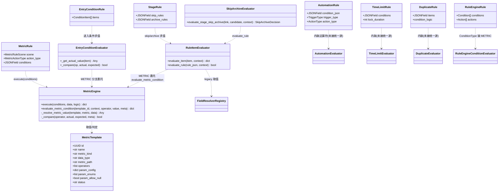
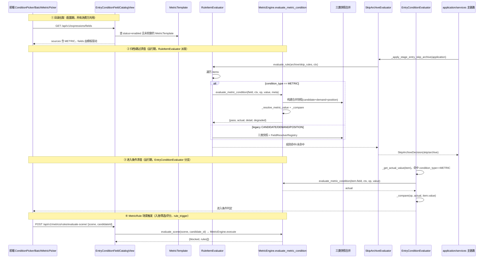

# 设计文档：「指标 / 指标模板 / 规则管理」统一应用到全系统规则场景

| 项 | 内容 |
|---|---|
| 文档类型 | 架构设计咨询（仅设计 + 文档，不改业务代码 / 测试） |
| 系统 | ATS-NEW（Django + DRF / Vue3 + Naive UI 招聘管理系统） |
| 作者 | 高见远（架构师 / software-architect） |
| 关联文档 | `docs/PRD_指标作为条件源.md`、`docs/ARCH_指标作为条件源.md` |
| 语言 | 简体中文 |
| 现状核实日期 | 2026-10-05（基于真实代码 `git` 工作区） |

> ⚠️ 重要前提：相比 `PRD_指标作为条件源` / `ARCH_指标作为条件源` 两份前置文档，本次核实发现**统一条件源基础设施已经实质落地**（远超前置文档的"待实现"状态）。本文所有结论均以**当前代码真实状态**为准，并标注 `文件:行号` 证据。

---

## 0. TL;DR（一句话结论）

**统一条件源（`METRIC` 源 + `MetricEngine.evaluate_metric_condition` + `RuleItemEvaluator` 派发器 + `MetricTemplate` 模板库）已经建成，并已在「归档规则 / 自动跳过 / 阶段进入条件」三大场景真实落地；但系统内仍存在至少 4 套**未接入统一源**的独立规则/条件引擎（`automation`、`rule_engine`、`time_limit`、`duplicate_rule`、`campus_control`），且「简历评分（4 维公式）」与「权限开通」两场景尚未使用统一条件源。**"指标管理能力应用到所有规则定义的地方"的真正难点，不在求值层（已建成），而在"触发执行编排层"与"存量平行引擎的并入"——后者需作为独立立项处理。**

---

## 1. 场景清单 + 现状盘点表

| # | 用户原话场景 | 当前条件/规则载体 | 是否复用统一机制 | 缺失点（关键证据） |
|---|---|---|---|---|
| 1 | **归档规则** | `StageRule.archive_rules`（`process/models.py:458`，JSONField）→ `skip_archive_evaluator.py:114` 遍历 → `RuleItemEvaluator.evaluate_rule` | ✅ **已复用** | 触发编排已真实落地（`application/services/__init__.py:1259` `_apply_stage_entry_skip_archive` 调 `evaluate_stage_skip_archive`，接入 advance/jump 主链路）；`referral/urls_stubs.py:225` 的 501 stub 已成**死代码**（注释明确说明）。无缺失，仅待编排层统一（见 §4）。 |
| 2 | **自动进入** | `EntryConditionRule` + `ConditionItem`（`entry_condition/models.py:54/117`），`condition_type` 已含 `METRIC`（`models.py:32`） | ✅ **已复用** | `EntryConditionEvaluator._get_actual_value` 已含 METRIC 分支（`entry_condition/services.py:361`），委托 `MetricEngine.evaluate_metric_condition`；目录 `EntryConditionFieldCatalogView` 已含 METRIC 源（`process/views.py:793` + `_build_metric_template_catalog:901`）。无缺失。 |
| 3 | **自动跳过** | `StageRule.skip_rules`（`process/models.py:453`，JSONField）→ `skip_archive_evaluator.py:99` 遍历 → `RuleItemEvaluator.evaluate_rule` | ✅ **已复用** | 与归档规则同源同路（同一 `RuleItemEvaluator`）。无缺失。 |
| 4 | **简历评分** | ① `add_candidate/services/scoring.py:ScoringService`——**4 维硬编码公式**（Jaccard 技能匹配 / 经验 / 学历 / 综合素质），输入 `resume`+`position_jd` dict，**不走条件源**；② `metrics/MetricRule`（scene=`SCORING`）+ `rule_trigger.evaluate_scene`——把"指标规则"挂到评分触发点做 VETO/DEDUCT/BONUS | ◐ **部分** | ① 主评分引擎（4 维公式）**未用**统一条件源，是独立打分算法；② MetricRule 的 SCORING scene 已用 METRIC 模板，但语义是"评分时按指标规则做准入/加权"，与 4 维打分是两件事。**缺：产品须拍板"4 维公式是否应表达为统一条件/派生指标"**（见 §8 #1）。 |
| 5 | **权限开通** | 无"满足条件→开通权限"的触发机制。相关静态配置：① `field_acl.FieldACL`（`field_acl/models.py:17`，role→entity.field→READ/MASK/NONE，静态）；② `data_permission.DataPermissionRule`（`data_permission/models.py:47`，维度 ROLE/DEPT/USER，静态 ACL）；③ `rule_engine.UnifiedActionType.SET_PERMISSION='设置字段权限'`（`rule_engine/models.py:54`，**脚手架动作，未实现执行器**） | ❌ **未复用** | "权限开通"作为"条件驱动"的特性**不存在**。现有 ACL 都是静态配置（按角色/部门写死），没有"当候选人满足某指标条件时开通某权限"的求值链路。需新建触发场景（见 §5 #5 与 §8 #2）。 |
| + | （附）自动推进 / 定时巡检 | `automation.AutomationRule`（`automation/models.py:19`，`condition_json` 自由 JSON 子规则） | ❌ **自造第四套引擎** | `automation/services.py:293` `_match_conditions` + `:313` `_match_single_condition` 用**内联运算符**（EQ/NEQ/IN/NOT_IN/GT/GTE/LT/LTE/IS_EMPTY/IS_NOT_EMPTY），未用 `UnifiedOperator`/`MetricEngine`；`condition_json` 结构非 `ConditionGroup/ConditionItem` schema。是平行规则引擎。 |
| + | （附）阶段停留超时 | `time_limit.TimeLimitRule`（`time_limit/models.py:19`，`conditions` JSONField） | ❌ **自造第五套引擎** | `conditions` 为自由 JSON，独立 evaluator（`calc_time_limit`），未接统一源。 |
| + | （附）候选人查重 | `duplicate_rule.DuplicateRule`（`duplicate_rule/models.py:51`，`items` JSONField 查重项 + `condition_logic`） | ❌ **自造第六套引擎** | 查重项结构（key/strength）独立于条件源；`catalog.py`/`services.py` 独立计算器。 |
| + | （附）校招管控 | `campus_control.ControlRule`（`campus_control/models.py:66`，`ControlDimension`+`ControlIndicator`+`monthly_targets` JSON） | ❌ **自造指标类规则** | 自带"管控指标/维度"体系，与 `MetricTemplate` 平行，未打通。 |
| + | （附）统一规则引擎（收敛用） | `rule_engine`：`Rule`/`Condition`/`Action`/`RuleExecutionLog`（`rule_engine/models.py`）+ 完整 services（`ConditionEvaluator:130`/`RuleEngine:338`/`ActionExecutorRegistry:100`） | ◐ **未接 METRIC** | 本应是"统一收敛点"，但其 `ConditionType`（`rule_engine/models.py:79`）仅 `STAGE_STATUS/CANDIDATE/DEMAND/CUSTOM`，**无 METRIC、无 POSITION**；`ConditionEvaluator:_resolve_value` 自写取值，未委托 `MetricEngine`。已建从 `automation` 双写同步的 bridge（`source_app=automation`），但仍是第二套条件模型。 |
| + | （附）背调 | `integration.BackgroundCheckOrder`（integration app） | N/A | 属外部供应商集成工作流（订单/事件），**非规则引擎**，不纳入统一条件源范围。 |

### 1.1 核心机制现状核实（代码证据）

| 机制 | 文件:行号 | 状态 |
|---|---|---|
| `MetricTemplate` 模型（模板定义源） | `apps/metrics/models.py:138` | ✅ 存在（`operators`/`value_domain`/`param_enums`/`param_allow_null`/`param_config`/`metric_kind`/`data_type`/`metric_path`） |
| `MetricEngine._resolve_metric_value`（原子↔派生取值入口） | `apps/metrics/services/metric_engine.py:184` | ✅ 原子走 `FieldResolverRegistry.resolve`；派生走 `derived_compute` |
| `MetricEngine._compare`（14 运算符判定） | `apps/metrics/services/metric_engine.py:221` | ✅ 含 `CONTAINS/NOT_CONTAINS/REGEX_MATCH`（`:238/242/246`） |
| `MetricEngine.evaluate_metric_condition`（**统一指标条件求值器 INF-4**） | `apps/metrics/services/metric_engine.py:273` | ✅ 已落地（设计文档中本为"待新增方法"） |
| `UnifiedOperator`（运算符唯一真相源 = 14 种） | `apps/rule_engine/models.py:57` | ✅ `CONTAINS/NOT_CONTAINS/REGEX_MATCH` 已扩（`:74-76`） |
| `RuleItemEvaluator`（skip/archive 消费方派发器） | `apps/process/services/rule_item_evaluator.py:51` | ✅ 已落地：`METRIC`→`MetricEngine.evaluate_metric_condition`（`:72`）；legacy→快照+`FieldResolverRegistry`（`:146`）；`STAGE_STATUS`→不求值（`:77`） |
| 阶段规则目录 METRIC 源分支 | `apps/process/views.py:793` + `_build_metric_template_catalog:901` | ✅ 已落地 |
| 前端 `SourceKey` 含 `METRIC` | `web/app/src/pages/settings/stage-rule/types.ts:10` | ✅ |
| 前端 `OperatorKey` 已含 14 种 | `web/app/src/pages/settings/stage-rule/types.ts:13` | ✅ |
| 可复用指标选择器 | `web/app/src/pages/settings/stage-rule/components/BatchMetricPicker.vue` | ✅ 已存在，可复用 |
| 进入条件 METRIC 分支 | `apps/entry_condition/services.py:361` | ✅ 已落地 |
| 归档/跳过触发编排 | `apps/application/services/__init__.py:1259`（`_apply_stage_entry_skip_archive` → `evaluate_stage_skip_archive`） | ✅ 已真实接入 advance（`:490`）/ jump（`:601`） |
| MetricRule scene 触发（入池/筛选/评分/手动） | `apps/metrics/services/rule_trigger.py:76 evaluate_scene` + `apps/metrics/views.py:272 EvaluateSceneView`（HTTP `rules/evaluate-scene/`） | ✅ 求值 + HTTP 已暴露 |

---

## 2. 统一接入范式（消除"重复造第三套规则引擎"）

### 2.1 已建成的统一抽象（全系统唯一真相源）

```
                 MetricTemplate（指标模板库，唯一字段定义来源）
                          │ operators / value_domain / param_enums / param_config
                          ▼
   ┌──────────────────────────────────────────────────────────────┐
   │  统一条件 schema：ConditionGroup / ConditionItem              │
   │   { condition_type: 'METRIC'|'CANDIDATE'|'DEMAND'|'POSITION' │
   │     |'STAGE_STATUS',  field, operator, value, meta }          │
   └──────────────────────────────────────────────────────────────┘
                          │
                          ▼
   ┌──────────────────────────────────────────────────────────────┐
   │  消费方派发器 RuleItemEvaluator.evaluate_item / evaluate_rule  │
   │   （process/services/rule_item_evaluator.py:51）               │
   │     METRIC  → MetricEngine.evaluate_metric_condition(...)     │
   │     CANDIDATE/DEMAND/POSITION → 三类快照 + FieldResolverRegistry│
   │     STAGE_STATUS → 不求值                                      │
   │     表达式 AND/OR → process/expressions.evaluate               │
   └──────────────────────────────────────────────────────────────┘
                          │
                          ▼
        MetricEngine（_resolve_metric_value + _compare + 14 运算符）
        UnifiedOperator（运算符唯一真相源）
```

**所有规则消费方只需做两件事，绝不重写取值/比较/运算符逻辑：**
1. 把条件项存储为 `{condition_type, field, operator, value, meta}` schema，`field` 在 `METRIC` 时即 `MetricTemplate.id`；
2. 运行期调用 `RuleItemEvaluator.evaluate_item(item, context)`（或批量 `evaluate_rule`），由派发器统一路由。

**`MetricTemplate` 即"可复用的条件模板库"**：运营在「指标管理」增删改模板 → 目录（METRIC 源）自动同步 → 所有消费方下拉自动获得新选项；模板的 `operators`/`value_domain`/`param_enums`/`param_allow_null`/`param_config` 直接驱动前端运算符/值控件（复用 `FieldDef` 控件族，不新增控件）。

### 2.2 "消除重复造引擎"的判定标准

| 现状 | 判定 | 动作 |
|---|---|---|
| 已用 `RuleItemEvaluator` + `MetricEngine.evaluate_metric_condition` | ✅ 已统一 | 保持不变（场景 1/2/3） |
| 自带 `{condition_json / conditions / items}` + 内联运算符 + 自写 evaluator | ❌ 平行引擎 | 改造：把条件项收敛为统一 schema，METRIC 项委托 `MetricEngine.evaluate_metric_condition`（场景 4②/5、附录 automation/time_limit/duplicate_rule/campus_control/rule_engine） |

---

## 3. 两层分离：条件求值层（已建成） vs 触发执行编排层（待立项）

这是本次设计最关键的结构性澄清——**用户感知的"规则没真实跑起来"主要卡在编排层，而非求值层。**

### 3.1 条件求值层（Condition Evaluation Layer）—— ✅ 已基本建成

- 职责：给定 `(条件项, 上下文)`，返回 `pass / actual / expected / detail / error / degraded`。
- 实现：`RuleItemEvaluator` + `MetricEngine.evaluate_metric_condition` + `MetricTemplate`。
- 状态：**可复用、可测试、统一降级（FAIL-not-500）**，已被归档/跳过/进入条件三场景共用。
- 结论：**本层不是瓶颈**，新场景接入几乎零成本（只需会调用 `RuleItemEvaluator`）。

### 3.2 触发执行编排层（Trigger Orchestration Layer）—— ⚠️ 分散 / 未统一，需独立立项

- 职责：**何时**真正跑规则（阶段进入 / 停留超时 / 状态变更 / 定时巡检 / 评价提交 / 业务事件）+ **命中后做什么动作**（跳过 / 归档 / 推进 / 提醒 / 开通权限）。
- 当前现状（代码核实）：
  - 归档/跳过触发：**已真实接入**主链路（`application/services/__init__.py:1259` → `skip_archive_evaluator`）。
  - `MetricRule` 场景触发：求值+HTTP 已暴露（`EvaluateSceneView`），但是否在「入池/筛选/评分」业务点真正调用 `evaluate_scene` 仍待确认（属业务接入，非求值能力问题）。
  - `automation` 触发：`run_automation_for_trigger`（`automation/services.py:543`），自带 trigger_type/timing 调度。
  - `time_limit` 触发：`calc_time_limit` 接入 `create_application`/advance/jump 主链路。
  - **表达式引擎 `process/expressions.py` 仅支持 AND/OR 组合**——它只负责单条规则内条件项的布尔组合，**不负责"哪些业务事件触发哪组规则"**。
- 缺口：**没有一个中央"触发总线"把"业务事件 → 规则集 → 动作"串起来**；触发逻辑散落在 `application/services`、`automation/services`、`time_limit/services`、`metrics/rule_trigger` 各自实现。
- **立项边界**：触发执行编排层（含调度、熔断、动作执行、审计）属于**独立大项**，不在「统一条件源」本次范围。本文只负责把"求值能力"准备好并指明各场景的接入点，编排层单独立项。

---

## 4. 分场景接入点（file:line 级落点）

> 约定：场景 1/2/3 已落地，仅列"验证点 + 后续打磨"；场景 4/5 及附录平行引擎列出"要改什么"。

### 4.1 归档规则（✅ 已接入，仅待编排统一）
- 数据模型：无需改（`StageRule.archive_rules` JSONField 已支持 `condition_type='METRIC'`）。
- 求值：`skip_archive_evaluator.py:114` 已委托 `RuleItemEvaluator.evaluate_rule`。
- 前端 picker：复用 `BatchMetricPicker.vue`（`web/.../components/BatchMetricPicker.vue`），`ArchiveRuleEditModal.vue` 已可拉 METRIC 源。
- migration：无（JSONField + `condition_type` 为 schema 内部字符串）。
- 下一步（编排立项）：把"何时触发归档"从 `application/services/_apply_stage_entry_skip_archive` 收敛进统一触发总线。

### 4.2 阶段自动进入（✅ 已接入）
- 数据模型：`entry_condition/models.py:32` 已加 `METRIC`；`ConditionItem.condition_type` 为 `CharField(choices=)`（无 DB 迁移）。
- 求值：`entry_condition/services.py:361` METRIC 分支已委托统一求值器。
- 目录：`process/views.py:793` + `_build_metric_template_catalog:901`。
- 前端：`EntryRuleEditModal.vue` 已可拉 METRIC 源；`SourceKey`/`OperatorKey`（`types.ts:10/13`）已同步。

### 4.3 自动跳过（✅ 已接入，与 4.1 同源）
- 同 4.1，`skip_archive_evaluator.py:99` 遍历 `skip_rules`。

### 4.4 简历评分（◐ 部分——需产品拍板）
- **现状 A（主评分引擎）**：`add_candidate/services/scoring.py:ScoringService` 是 4 维公式（`_score_skill_match` Jaccard / `_score_experience_match` / `_score_education_match` / `_score_comprehensive`）。**未用统一条件源**。
- **现状 B（评分触发点规则）**：`metrics/MetricRule` scene=`SCORING` + `rule_trigger.evaluate_scene` 已实现"评分时按指标规则做 VETO/DEDUCT/BONUS"。
- **接入点（若产品决定把 4 维公式上提为指标）**：
  - 把"工作年限""学历等级""技能命中率"等表达为 `AtomicMetric`/`DerivedMetric` + `MetricTemplate`；
  - 评分逻辑改调 `MetricEngine.evaluate_metric_condition`（或 `MetricRule` scene=`SCORING`）；
  - `ScoringService.score` 改为"组装条件项 → `RuleItemEvaluator`/`MetricEngine` 求值 → 汇总"。
- **若产品决定保持 4 维公式为独立算法**：则评分引擎**不并入**统一条件源，仅在"评分准入/加权"层复用 MetricRule（现状 B 已支持）。见 §8 #1。

### 4.5 权限开通（❌ 未建——需新建触发场景）
- 现状：权限均为静态配置（`field_acl.FieldACL` / `data_permission.DataPermissionRule`），无"条件→开通"链路。
- **建议接入范式（不新建引擎）**：
  - 模型：复用 `MetricRule`，新增 `scene='PERMISSION_GRANT'`（或复用 `rule_engine` 的 `SET_PERMISSION` 动作 + 新增 METRIC `ConditionType`）。
  - 求值：复用 `RuleItemEvaluator` + `MetricEngine.evaluate_metric_condition`；命中后执行"开通某字段/数据权限"动作。
  - 触发点：在"候选人满足某指标（如通过背调、达到某评分）→ 开通 HR/用人经理权限"的业务事件挂 `evaluate_scene('PERMISSION_GRANT', candidate_id)`，动作执行器落到 `field_acl`/`data_permission`。
- 文件:line 落点：`metrics/models.py:286 MetricRuleScene` 加 `PERMISSION_GRANT`；`metrics/services/rule_trigger.py:76 evaluate_scene` 已通用（按 scene 过滤），无需大改；`rule_engine/models.py:54` 的 `SET_PERMISSION` 动作需补 `ActionExecutor`（属编排层立项）。

### 4.6 附录：平行引擎并入落点（统一条件源推广）
| 引擎 | 要改的文件:行 | 改造动作 |
|---|---|---|
| `automation` | `automation/models.py:77 condition_json`；`automation/services.py:293/313` | `condition_json` 子规则收敛为统一 schema；METRIC 项委托 `MetricEngine.evaluate_metric_condition`；运算符统一走 `UnifiedOperator`。 |
| `rule_engine` | `rule_engine/models.py:79 ConditionType`（加 `METRIC`/`POSITION`）；`rule_engine/services.py:215 _resolve_value` | `Condition.condition_type=METRIC` 时委托 `MetricEngine.evaluate_metric_condition`；成为真正收敛点。 |
| `time_limit` | `time_limit/models.py:49 conditions` | `conditions` JSON 收敛为统一 schema；METRIC 项委托统一求值器。 |
| `duplicate_rule` | `duplicate_rule/models.py:74 items` | 查重项结构特殊（key/strength），建议保留其专属语义但把"是否命中查重"作为统一条件源的一个 `METRIC` 派生指标暴露（如"命中查重=是/否"），而非改造其存储。 |
| `campus_control` | `campus_control/models.py:66 ControlRule` + `ControlIndicator` | 把"管控指标"与 `MetricTemplate` 对齐（或双向同步），使校招管控条件可引用同一指标源。 |

---

## 5. 分阶段路线

### 阶段 A（现在就能接，求值层已支持，零新增求值代码）
- ✅ 归档规则 / 自动跳过 / 阶段进入条件：**已完成**，仅需编排层统一（属立项）。
- ✅ 任一新"消费方"想用 METRIC 源：只需（1）条件存储用统一 schema；（2）运行期调 `RuleItemEvaluator.evaluate_item`。**无需新建求值器/运算符/控件**。

### 阶段 B（等"触发执行编排层"立项后才能接）
- 简历评分主引擎（4 维公式）上提为指标（依赖 §8 #1 拍板）。
- 权限开通（需新建 `PERMISSION_GRANT` scene + 动作执行器）。
- automation / time_limit / rule_engine / campus_control 的"触发+动作"统一进中央触发总线（避免各服务散落触发逻辑）。

### 阶段 C（治理 / 体验，非阻塞）
- 运算符三套词表已对齐 14（已实现），无需再回填。
- 模板禁用/软删对存量规则的影响提示（`MetricEngine.evaluate_metric_condition:323` 已降级 `degraded=True`，前端据此拦启用）。
- `BETWEEN` 前端区间双输入（`ConditionPicker.vue` 现状仍为单值 `n-input-number`，若存在 METRIC 模板含 `BETWEEN` 需补）。

---

## 6. 待明确事项 / 风险（须产品 / 主理人拍板）

| # | 问题 | 现状 & 建议 |
|---|---|---|
| 1 | **简历评分 4 维公式是否纳入指标引擎？** | 现状：`ScoringService` 是独立 4 维算法，未用统一条件源；但 `MetricRule` scene=SCORING 已支持"评分时按指标规则准入/加权"。**建议**：4 维公式保持独立算法（属"打分模型"而非"规则条件"），统一条件源只负责"评分准入/加权"层；除非产品明确要求把公式表达为可配置指标。须拍板。 |
| 2 | **"权限开通"的触发时机与动作语义？** | 现状：无"条件→开通权限"链路，ACL 均为静态。建议新增 `MetricRule` scene=`PERMISSION_GRANT`（或 `rule_engine` SET_PERMISSION 动作 + METRIC 条件），复用统一求值 + 现有 `field_acl`/`data_permission`。须拍板触发事件（如"评分≥X 开通 HR 权限""背调通过开通用人经理权限"）。 |
| 3 | **存量平行引擎（automation/time_limit/duplicate_rule/campus_control）是否并入统一条件源？** | 现状：各自内联运算符 + 自由 JSON 条件。**建议**：METRIC 类条件统一委托 `MetricEngine.evaluate_metric_condition`（消除重复取值/比较）；其专属结构（查重项、管控指标）可保留语义但对外暴露为统一 `METRIC` 派生指标。**范围大，建议单独立项**。 |
| 4 | **`rule_engine` 是否成为统一收敛点？** | 现状：`rule_engine` 有完整 services 但 `ConditionType` 缺 `METRIC/POSITION`，且 `ConditionEvaluator` 自写取值未委托 `MetricEngine`。**建议**：把 `rule_engine` 作为"统一规则主表"，补 `METRIC`/`POSITION` 条件类型并委托统一求值器，automation 等通过 bridge 双写收敛。须拍板是否以 `rule_engine` 为唯一收敛点（与 `MetricRule` 的关系需理顺——二者目前并存）。 |
| 5 | **MetricRule 与 RuleItemEvaluator 的关系？** | 现状：`MetricRule`（metrics app）条件**只存指标模板**（`conditions:[{templateId,...}]`），用 `MetricEngine.execute`；而 skip/archive/进入条件用 `ConditionGroup/ConditionItem` schema（含 CANDIDATE/DEMAND/POSITION/METRIC）走 `RuleItemEvaluator`。**两套条件载体并存**。建议：长期以 `RuleItemEvaluator` 为统一派发器，`MetricRule` 也可复用其 METRIC 分支（或反之），避免两套取值逻辑长期分裂。 |
| 6 | **触发编排层的归属与范围？** | 现状：触发逻辑散落 `application/services`、`automation/services`、`time_limit/services`、`metrics/rule_trigger`。建议作为独立大项"统一触发总线"立项，本文不展开。 |
| 7 | **派生指标缺底层经历数据的降级语义** | `MetricEngine.evaluate_metric_condition:442` 已实现：非 `IS_EMPTY` 类判未命中 + 告警；`IS_EMPTY` 命中。与现有 FAIL-not-500 一致，无需改动，仅需在文档/产品侧明确告知运营。 |

---

## 7. 附录：Mermaid 类图（统一接入范式 + 现存平行引擎）



## 8. 附录：Mermaid 序列图（METRIC 条件从配置到求值的统一全链路）



---

*文档结束。所有结论均有 `文件:行号` 级代码证据；本次为架构设计咨询，未修改任何业务代码或测试。*
