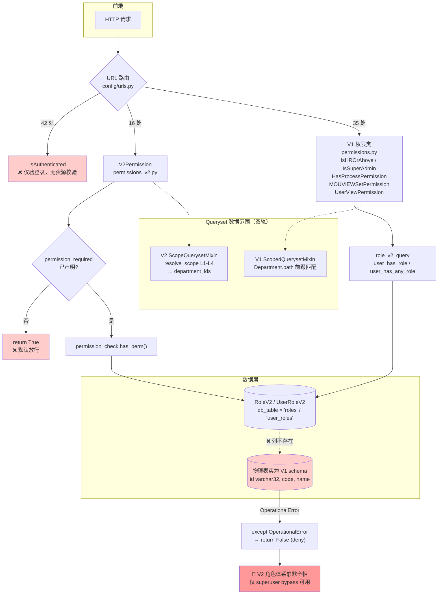
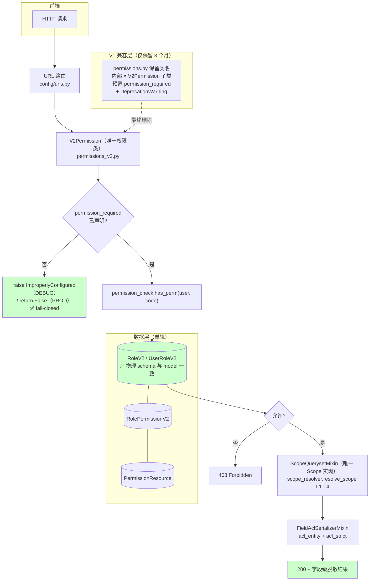
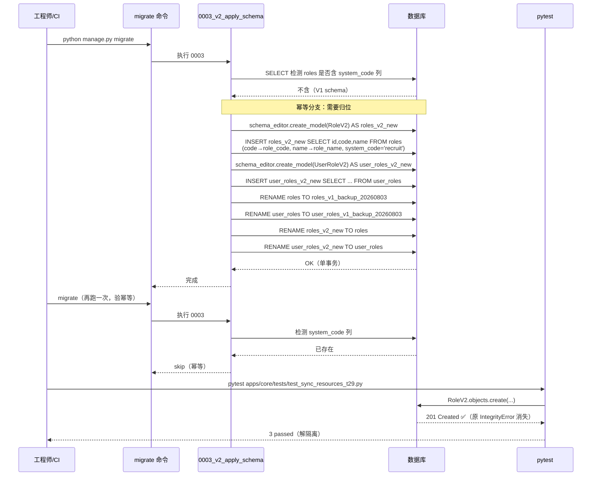
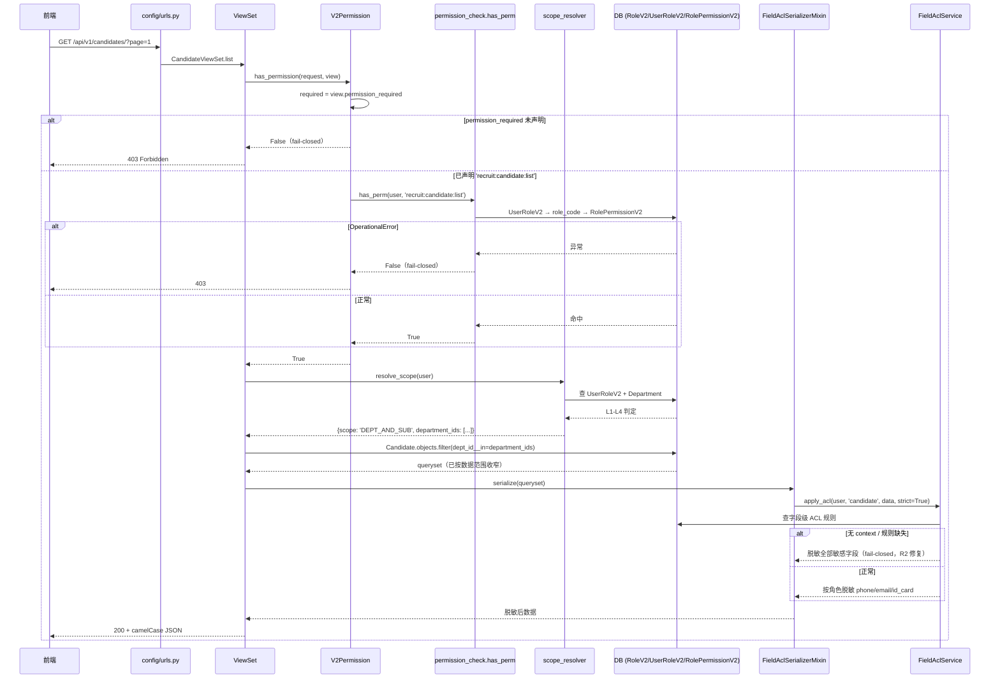
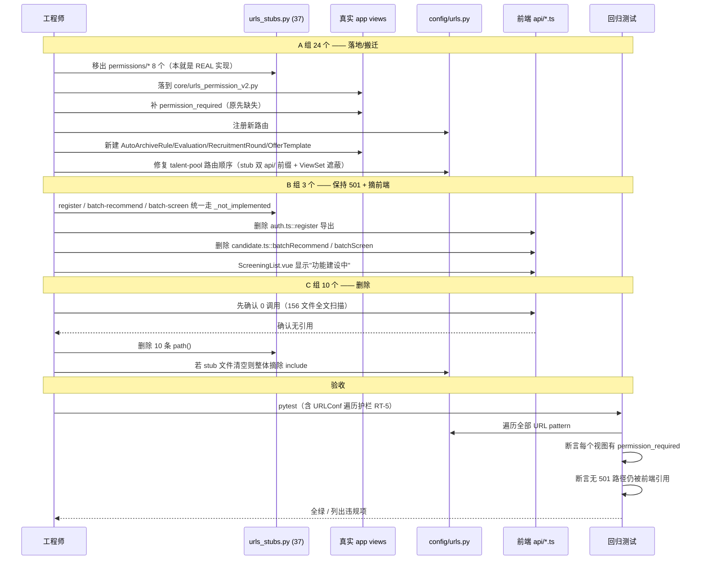
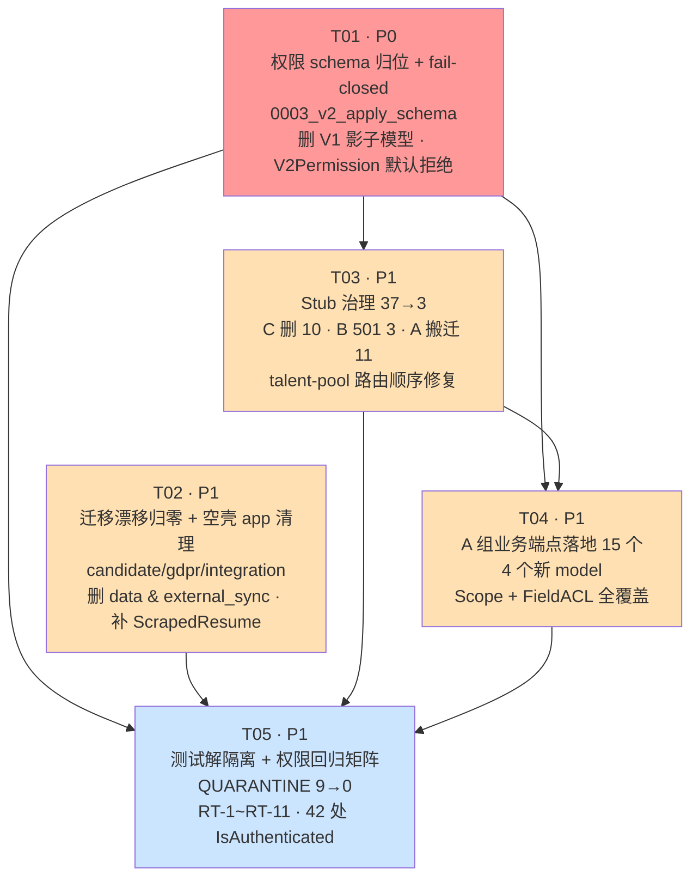
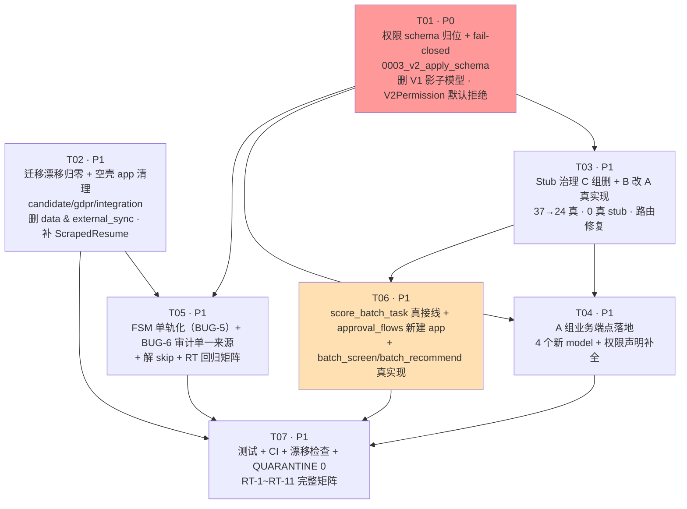

# ATS-NEW Phase 2 实施设计 + 任务分解

> 版本：2026-08-03 · 作者：架构师（Bob） · 上游输入：`docs/09-archive/ARCHITECTURE_REVIEW_2026-08-03.md`
> 性质：**纯设计文档**。本文档编写过程中未修改任何业务源码。
> 所有结论均来自**实际代码读取与命令执行**；凡与旧评审文档不一致处，均以 `旧文档说 X / 实测 Y` 标注。

---

## 1. 概览

### 1.1 Phase 2 范围

Phase 0 + Phase 1 已修复 R1–R11、BUG-1（`id_card_hash`）、BUG-2（ACL context fail-open）。Phase 2 处理剩余 4 块技术债：

| 编号 | 范围 | 旧文档结论 | 实测结论 | 严重度变化 |
|---|---|---|---|---|
| ① | Stub 端点落地（R5/R6） | "37 个 stub" | **37 个（数量一致）**，但**性质严重误判**：其中 7 个是**已实现的真实查询**被错误归档进 stub 文件；3 个是**已被真实路由遮蔽的死别名**；1 个因**双 `api/` 前缀而完全不可达** | ↔ 数量准确，↑ 定性需重写 |
| ② | 权限双轨（V1/V2） | "V1/V2 双轨并存，需收敛" | **实测推翻**：V1 类只是 V2 的薄包装（已全部委托 `role_v2_query`）。真正的问题不是"双轨"，而是 **V2 的 `roles`/`user_roles` 物理表从未建过** | ↑↑ **P0 阻断** |
| ③ | 空壳 app 清理 | "4 个 0-model app" | **4 个确认**：`data` / `duplicate_check` / `external_sync` / `scraped_resume`。但 `scraped_resume` **不是空壳**——它有真实 URL + 视图且前端在用，只是缺 model | ↓ 3 个可删，1 个需补 model |
| ④ | 迁移漂移修复 | "candidate/gdpr/integration 有漂移" | **3 个全部确认**，且**全部为纯元数据变更**（help_text / index 改名），**无数据风险** | ↓ 低风险 |

### 1.2 本轮最重要的发现（P0，改变 Phase 2 排序）

**`RoleV2` / `UserRoleV2` 的物理表从未创建。**

证据链：

```
apps/core/models.py:245          Role      Meta.db_table = 'roles'   (managed=False)
apps/core/models_permission_v2.py:94  RoleV2  Meta.db_table = 'roles'   (managed=True)
```

```python
# apps/core/migrations/0002_v2_init.py:129
# ---- V2 重名表: 仅注册 model state,不执行 DDL (等 T17 v2_apply_schema) ----
migrations.SeparateDatabaseAndState(
    state_operations=[ CreateModel(name='RoleV2', fields=[('id', BigAutoField(...)), ...]) ],
    database_operations=[],   # L177: 不执行 DDL,T17 时由 v2_apply_schema 创建新表
)
```

物理表 `roles` 仍是 `0001_initial` 建的 **V1 结构**（`id varchar(32) PK 无自增`、`code`、`name`）。运行时内省实证：

```
$ python manage.py shell  # 建测试库后 introspect
django.db.utils.OperationalError: no such column: roles.system_code
```

后果（全部实测复现）：

1. `RoleV2.objects.create()` → Django 认为 `id` 是 `BigAutoField` 交给 DB 自增，但物理列是无自增的 `varchar(32)`
   → `IntegrityError: NOT NULL constraint failed: roles.id`
   → `POST /api/v1/roles/clone-from-template/` **线上必 500**（`apps/core/views_permission_v2.py:102`）
2. 任何 `RoleV2` / `UserRoleV2` 读查询 → `OperationalError: no such column`
   → 被 `apps/core/permission_check.py` / `role_v2_query.py` 的 `except OperationalError → deny` 吞掉
   → **整套 V2 角色体系静默降级为"全员拒绝"**，仅靠 superuser bypass 维持表面可用
3. `manage.py check` **无法发现**（因 `Role` 是 `managed=False`，Django 不报 `models.E028`）
4. 补救命令 `apps/core/management/commands/migrate_v2_drop_old.py`（T17）**存在但只是手工管理命令，不在迁移图里**
   → 测试库（纯从 migrations 建）永远不会执行它 → 3 个 T29 测试必然失败
   → 各环境 schema 漂移不可控，且该命令 `DROP TABLE IF EXISTS roles` **不可逆、无备份**

**结论：② 权限单轨化的前置条件不是"删 V1"，而是"先让 V2 的表真实存在"。这必须是 Phase 2 的第一个任务。**

### 1.3 度量口径与已知偏差

| 项 | 命令 | 结果 |
|---|---|---|
| Stub 数量 | 正则统计 `apps/referral/urls_stubs.py` 的 `path()` | 74 条 → 去尾斜杠归一后 **37 个唯一路径** |
| 迁移漂移 | `makemigrations --check --dry-run -v 3` | candidate / gdpr / integration 各 1 个待生成迁移 |
| 权限声明 | 全仓 `permission_classes` 扫描 | 66 处 |
| 隔离测试 | `pytest apps/add_candidate/tests/test_views.py apps/core/tests/test_sync_resources_t29.py` | **9 failed, 12 passed** |
| 前端调用点 | 156 个 `.ts/.vue/.tsx/.js` 文件全文扫描 | 见 §2 表 |

> ⚠️ **度量陷阱（供后续复核者注意）**：`makemigrations --check --dry-run ... | tail` 后接 `echo $?` 取到的是 `tail` 的退出码（恒为 0），**不是 python 的退出码**。漂移事实以命令**打印出的 `Migrations for 'xxx'` 文本**为准，不要以 `EXIT: 0` 为准。

---

## 2. Stub 端点全量清单与三选一决策

文件：`apps/django/apps/referral/urls_stubs.py`（691 行，74 条 `path()`，37 个唯一路径）
挂载点：`config/urls.py:22`，位于 `core.urls` **之前**（URL 注册顺序是隐式契约，见 §10）

**行为分类图例**：`501`=显式未实现 · `EMPTY`=返回空列表 · `STATIC`=返回硬编码假数据 · `REAL`=真实 DB 查询 · `AUTH`=真实认证

**决策图例**：**A**=落地实现 · **B**=保持 501 + 摘除前端调用 · **C**=直接删除

### 2.1 认证类（3）

| # | 路径 | 方法 | 行号 | 当前行为 | 前端调用 | 业务重要性 | 决策 | 说明 |
|---|---|---|---|---|---|---|---|---|
| 1 | `auth/register` | POST | L598 | `501` | `api/auth.ts:198` (1) | 低 | **B** | 企业内 ATS 不应自助注册；账号由 `UserViewSet` 后台创建。保持 501，摘除 `auth.ts` 导出与注册页入口 |
| 2 | `auth/change-password` | POST | L600 | `501` | `api/auth.ts:202` (1) | **高** | **A** | 刚需。落地到 `apps/core/views.py::ChangePasswordView` |
| 3 | `login` | POST | L602 | `AUTH`（**已是真实实现**） | `stores/user.ts` 等 (15) | **高** | **A（搬迁）** | 已含 `LoginRateThrottle`（R6 已修）。**不是 stub**，须搬到 `apps/core/urls.py` |

### 2.2 候选人批量操作（5）

| # | 路径 | 方法 | 行号 | 当前行为 | 前端调用 | 业务重要性 | 决策 | 说明 |
|---|---|---|---|---|---|---|---|---|
| 4 | `candidates/batch/archive` | POST | L608 | `STATIC` | `api/candidate.ts:59` (1) | 中 | **A** | 纯字段更新，低风险 |
| 5 | `candidates/batch/assign` | POST | L610 | `STATIC` | `api/candidate.ts:65` (1) | 中 | **A** | 纯 FK 更新 + 权限校验 |
| 6 | `candidates/batch/export` | POST | L612 | `STATIC` | `api/candidate.ts:71` (1) | 中 | **A** | CSV 流式导出；**必须过 Field ACL**（见 §10） |
| 7 | `candidates/batch/recommend` | POST | L606 | `STATIC` | `api/candidate.ts:53` (1) | 低 | **B** | 依赖尚未落地的 AI 推荐管线。501 + 摘除 |
| 8 | `candidates/batch/screen` | POST | L614 | `STATIC` | `api/candidate.ts:77`, `pages/screening/ScreeningList.vue:6` (2) | 中 | **B** | 依赖批量打分管线（`add_candidate` 的 scoring 仅支持单批）。501 + 页面降级提示 |

### 2.3 招聘规则（9）

| # | 路径 | 方法 | 行号 | 当前行为 | 前端调用 | 业务重要性 | 决策 | 说明 |
|---|---|---|---|---|---|---|---|---|
| 9 | `recruitment-rules/stage-rules` | GET/POST | L618 | `EMPTY` | 0（已迁 `/stage-rules/`） | — | **C** | 真实实现 `process.StageRuleViewSet` 已在 `/stage-rules/`；旧别名无调用 |
| 10 | `recruitment-rules/auto-archive-rules` | GET/POST | L620 | `EMPTY` | `recruitment-process.ts:337,340` (3) | 中 | **A** | **需新建 `AutoArchiveRule` model**（实测不存在） |
| 11 | `recruitment-rules/candidates/<id>/evaluate` | POST | L622 | `STATIC` | `recruitment-process.ts:293,312` (2) | **高** | **A** | **需新建 `Evaluation` model**（实测不存在） |
| 12 | `recruitment-rules/applications/<id>/check-stage-transition` | POST | L624 | `STATIC` | `recruitment-process.ts:318` (1) | **高** | **A** | 复用已存在的 `process.StageRule` 引擎 |
| 13 | `recruitment-rules/applications` | GET | L626 | `EMPTY` | 0 | — | **C** | 与真实 `/applications/` 重复 |
| 14 | `recruitment-rules/candidates` | GET | L628 | `EMPTY` | 0 | — | **C** | 与真实 `/candidates/` 重复 |
| 15 | `recruitment-rules/check-stage-transition` | POST | L630 | `STATIC` | 0 | — | **C** | #12 的无 id 冗余变体 |
| 16 | `check-stage-transition`（顶层） | POST | L632 | `STATIC` | 0 | — | **C** | #12 的顶层冗余变体 |

### 2.4 招聘轮次（3）—— 全部需新建 model

| # | 路径 | 方法 | 行号 | 当前行为 | 前端调用 | 业务重要性 | 决策 | 说明 |
|---|---|---|---|---|---|---|---|---|
| 17 | `recruitment-rounds` | GET/POST | L634 | `EMPTY` | `recruitment-process.ts:324,327` | 中 | **A** | **需新建 `RecruitmentRound` model** |
| 18 | `recruitment-rounds/<id>` | GET/PUT/DELETE | L636 | `EMPTY` | (共 5 处) | 中 | **A** | 同上 |
| 19 | `recruitment-rounds/<id>/status` | PATCH | L638 | `STATIC` | | 中 | **A** | 同上 |

### 2.5 add_candidate 顶层死别名（3）—— 全部删除

| # | 路径 | 方法 | 行号 | 当前行为 | 前端调用 | 决策 | 说明 |
|---|---|---|---|---|---|---|---|
| 20 | `bulk-create` | POST | L642 | `STATIC` | 0（FE 走 `add-candidate` baseURL） | **C** | 真实实现在 `/candidates/add-candidate/bulk-create/`（`BulkCreateView`） |
| 21 | `upload-and-parse` | POST | L644 | `STATIC` | 0（同上） | **C** | 真实实现 `UploadAndParseView` |
| 22 | `scoring/start` | POST | L646 | `STATIC` | 0（同上） | **C** | 真实实现 `ScoringStartView` |

> 前端 `api/addCandidate.ts` 的 `baseURL = /api/v1/candidates/add-candidate`，因此 4+3+3 处调用**全部命中真实实现**。这 3 个顶层别名是纯噪音，且是"37 个 stub 看起来很多"的主要来源之一。

### 2.6 Offer / 搜索 / 评估（4）

| # | 路径 | 方法 | 行号 | 当前行为 | 前端调用 | 业务重要性 | 决策 | 说明 |
|---|---|---|---|---|---|---|---|---|
| 23 | `offer-templates` | GET/POST | L650 | `EMPTY` | `api/offer.ts:112` (2) | 中 | **A** | **需新建 `OfferTemplate` model**（`offer.Offer` 已存在） |
| 24 | `offer-templates/render-from-offer` | POST | L652 | `STATIC` | `api/offer.ts:117` (1) | 中 | **A** | 模板渲染；**必须过 Field ACL** |
| 25 | `search` | GET | L656 | `STATIC` | `api/search.ts:71,82` 等 (10) | **高** | **A** | 全局搜索，跨 Candidate/Application/Job；**必须过 Scope + Field ACL** |
| 26 | `evaluate`（顶层） | POST | L660 | `STATIC` | 0 | — | **C** | #11 的顶层冗余变体 |

### 2.7 权限类（8）—— **实测：7 个已是真实实现，被错误归档**

| # | 路径 | 方法 | 行号 | 当前行为 | 前端调用 | 决策 | 说明 |
|---|---|---|---|---|---|---|---|
| 27 | `permissions/roles` | GET | L664 | **`REAL`** (18L) | `MouManagement.vue:1338` 等 (3) | **A（搬迁）** | 真查 `RoleV2` |
| 28 | `permissions/users/<id>/roles` | GET | L666 | **`REAL`** (18L) | (含在上) | **A（搬迁）** | 真查 `UserRoleV2` |
| 29 | `permissions/user-info` | GET | L668 | **`REAL`** (28L) | `AccountSettings.vue:344` (1) | **A（搬迁）** | |
| 30 | `permissions/permissions/list` | GET | L670 | **`REAL`** (45L) | `MouManagement.vue:1006` (2) | **A（搬迁）** | 真查 `PermissionResource` |
| 31 | `permissions/functions` | GET | L672 | **`REAL`** (23L) | `MouManagement.vue:1350` (1) | **A（搬迁）** | |
| 32 | `permissions/menus` | GET | L674 | **`REAL`** (31L) | `MouManagement.vue:1362` (1) | **A（搬迁）** | |
| 33 | `permissions/mous` | GET | L677 | **`REAL`** (25L) | `UserManagement.vue:305` (1) | **A（搬迁）** | 真查 `MouAgreement` |
| 34 | `permissions/user-mous/<id>` | GET | L679 | `STATIC` (20L) | `UserManagement.vue:329,449` (2) | **A（落地）** | 唯一真 stub，需接 `MouAgreement` |

> **这 8 个端点是"37 个 stub"数字被高估的第二大来源。** 它们全部有 `permission_classes` 缺失问题——搬迁时必须补 `permission_required`（见 §3）。

### 2.8 其它（3）

| # | 路径 | 方法 | 行号 | 当前行为 | 前端调用 | 决策 | 说明 |
|---|---|---|---|---|---|---|---|
| 35 | `api/talent-pool/types` | GET | L683 | `STATIC` | `TalentPool.vue:83` (2) | **A + 路由修复** | **双重缺陷（P0）**：① stub 注册路径带 `api/` 前缀，挂载后变成 `/api/v1/api/talent-pool/types/` → **永不可达**；② 前端实调 `/talent-pool/types/`，被 `TalentPoolEntryViewSet.list` 遮蔽 → **返回形状错误的数据**（前端期望 4 类池定义 dict，实得 entry 列表） |
| 36 | `resumes` | GET | L685 | `EMPTY` | 0（`ResumeList.vue:303` 已迁 `/scraped-resumes`） | **C** | 但遗留断链：`SpecialApproval.vue:162` 调 `/resumes/approval-flows` → **该路径未注册，404**。删 stub 同时须处理该断链（见 §11 Q3） |
| 37 | `duplicate-check` | GET | L689 | `EMPTY` | (7，均指向 `/duplicate-check/check/`) | **C** | 真实 `DuplicateCheckViewSet` 已提供；此列表别名无调用 |

### 2.9 决策汇总

| 决策 | 数量 | 明细 |
|---|---|---|
| **A** 落地 / 搬迁 | **24** | #2,3（认证 2）· #4,5,6（批量 3）· #10,11,12（规则 3）· #17,18,19（轮次 3）· #23,24,25（Offer/搜索 3）· #27–34（权限 8）· #35（人才池 1） |
| **B** 保持 501 + 摘除前端 | **3** | #1 register · #7 recommend · #8 screen |
| **C** 删除 | **10** | #9,13,14,15,16（规则冗余 5）· #20,21,22（add_candidate 别名 3）· #26 evaluate · #36 resumes · #37 duplicate-check |
| 合计 | **37** | ✅ 与实测唯一路径数一致 |

**新建 model 需求（实测均不存在）**：`AutoArchiveRule`、`Evaluation`、`RecruitmentRound`、`OfferTemplate`
**已存在可复用**：`process.StageRule`、`offer.Offer`、`talent_pool.TalentPoolEntry`、`talent_pool.TalentPoolTag`、`mou.MouAgreement`、`core.PermissionResource/RolePermissionV2/UserRoleV2/PermissionTemplate/Department`

### 2.10 A 组落地依赖顺序

```
第 0 层（阻断全部）：T01 权限 schema 修复
   └─ 第 1 层（无新 model，纯搬迁/修路由）：#3 login · #27–34 权限 8 个 · #35 talent-pool 路由
        └─ 第 2 层（无新 model，纯业务逻辑）：#2 change-password · #4,5,6 批量 · #12 check-stage-transition · #25 search
             └─ 第 3 层（需新建 model + migration）：#10 AutoArchiveRule · #11 Evaluation · #17,18,19 RecruitmentRound · #23,24 OfferTemplate
```

---

## 3. 权限单轨化设计

### 3.1 实测现状（推翻旧文档"双轨并存"的定性）

**扫描结果**：全仓 66 处 `permission_classes` 声明

| 权限类 | 出现次数 | 所属 | 是否已走 V2 表 |
|---|---|---|---|
| `IsAuthenticated` | 42 | DRF 内置 | — （**无资源级校验，最大缺口**） |
| `V2Permission` | 16 | `permissions_v2.py` | ✅ |
| `IsHROrAbove` | 14 | `permissions.py` (V1) | ✅ 委托 `role_v2_query.user_has_any_role` |
| `HasProcessPermission` | 9 | `permissions.py` (V1) | ✅ 同上 |
| `IsSuperAdmin` | 7 | `permissions.py` (V1) | ✅ 同上 |
| `MOUVIEWSetPermission` | 4 | `permissions.py` (V1) | ✅ 同上 |
| `UserViewPermission` | 1 | `permissions.py` (V1) | ✅ 同上 |

**关键实测结论**：
1. **V1 权限类不是"旧实现"，而是 V2 的语义别名**。`apps/core/permissions.py` 中所有角色判定都已委托给 `apps/core/role_v2_query.py`（读 `RoleV2`/`UserRoleV2`）。所以"双轨"只存在于**类名层**，不存在于**数据层**。
2. **真正的双轨在 Queryset 过滤层**：
   - V1 `ScopedQuerysetMixin`（`permissions.py:114`）：用 `Department.path` 前缀匹配
   - V2 `ScopeQuerysetMixin`（`permissions_v2.py`）：用 `scope_resolver.resolve_scope()` 四层 L1–L4，返回 `department_ids`
   两者语义不同且可能给出不同结果集。
3. **`V2Permission` 默认放行（严重）**：
   ```python
   # apps/core/permissions_v2.py:22-25
   required = getattr(view, 'permission_required', None)
   if not required:
       return True          # ← 未声明 permission_required 即放行
   ```
   16 个使用 `V2Permission` 的视图中，任何忘记声明 `permission_required` 的都是**完全无保护**。
4. **最大缺口是 42 处裸 `IsAuthenticated`**：只验"登录了"，不验"能不能访问这个资源"。

### 3.2 当前架构（Before）



### 3.3 目标架构（After）—— 单轨 V2 + fail-closed



### 3.4 迁移路径（严格 fail-closed，绝不放松）

**核心安全原则：每一步只允许权限"变紧或不变"，绝不允许"变松"。**

#### Step 1 — 物理 schema 归位（P0，阻断一切）

把 T17 手工命令 `migrate_v2_drop_old.py` 转成**正式迁移** `apps/core/migrations/0003_v2_apply_schema.py`：

```python
# 设计要点（非最终代码）
operations = [
    # 1) 删掉 0002 里的 state-only 假声明，改为真实 DDL
    migrations.SeparateDatabaseAndState(
        state_operations=[],                      # state 已在 0002 注册，此处不重复
        database_operations=[
            # RunPython: 若 roles 表仍是 V1 schema（无 system_code 列）→ 重建
            #   a. CREATE TABLE roles_v2_new (...)   ← 用 schema_editor.create_model
            #   b. 数据搬运: V1 roles(id,code,name) → V2(role_code,role_name,system_code='recruit')
            #      user_roles 同理，按 code 关联映射
            #   c. RENAME roles → roles_v1_backup_20260803   ← 保留备份，不 DROP
            #   d. RENAME roles_v2_new → roles
        ],
    ),
]
```

**与原 T17 命令的关键差异（安全性提升）**：

| 项 | 原 `migrate_v2_drop_old.py` | 新 `0003_v2_apply_schema` |
|---|---|---|
| 触发方式 | 手工 `--confirm` | 迁移图自动执行（测试库/CI/生产一致） |
| 旧数据 | `DROP TABLE IF EXISTS roles` **直接丢弃** | `RENAME` 为 `roles_v1_backup_<date>` **保留** |
| 数据搬运 | 无（角色/授权全丢） | V1 `code/name` → V2 `role_code/role_name` 显式映射 |
| 幂等 | 否 | 是（先检测 `system_code` 列是否存在） |
| 可回滚 | 不可逆 | `reverse_code` 可换回备份表 |
| 环境一致性 | 各环境漂移 | 由 `django_migrations` 保证 |

同时：
- `apps/core/models.py::Role` / `UserRole`（`managed=False` 的 V1 影子模型）→ **整体删除**，消除 `db_table` 冲突
- 保留 `migrate_v2_drop_old.py` 但改为 no-op + 提示"已由 0003 迁移接管"，避免有人误跑

#### Step 2 — `V2Permission` 翻转为默认拒绝

```python
# apps/core/permissions_v2.py 目标语义
required = getattr(view, 'permission_required', None)
if not required:
    if settings.DEBUG or settings.TESTING:
        raise ImproperlyConfigured(
            f'{view.__class__.__name__} 使用 V2Permission 但未声明 permission_required'
        )
    logger.error('V2Permission 缺少 permission_required: %s', view.__class__.__name__)
    return False        # ← 生产 fail-closed
```

**防止"意外放松"的护栏**：翻转前必须先跑一遍**静态盘点脚本**，列出全部 16 个 `V2Permission` 视图 + 其 `permission_required` 现值，逐个补齐后再翻转。翻转与补齐**必须同一个 commit**，否则中间态会 403 风暴。

#### Step 3 — 消灭 42 处裸 `IsAuthenticated`

按资源域批量补 `permission_required`，code 取自 `PermissionResource` 表（`seed_v2_init` 已播 60 个资源）。

**安全序**：先"**声明但只告警不拦截**"跑一个迭代（影子模式），收集 `logger.warning('would deny: user=%s code=%s')`，确认无误伤后再真正拦截。这是唯一能在不停机前提下保证"不放松也不误伤"的做法。

#### Step 4 — Scope 单轨

- 删除 V1 `ScopedQuerysetMixin`（`permissions.py:114`）
- 全部改用 V2 `ScopeQuerysetMixin`
- **迁移前必须做等价性验证**：对同一 user + 同一 queryset，比对两套 mixin 的结果集
  - V2 ⊆ V1 → 安全（收紧），放行
  - V2 ⊋ V1 → **危险（放松），必须先修 `resolve_scope` 再迁**

#### Step 5 — V1 类降级为兼容 shim

`IsHROrAbove` 等 5 个类改写为 `V2Permission` 的薄子类（预置 `permission_required`），加 `DeprecationWarning`，3 个月后删除。

### 3.5 必需的回归测试清单

| 编号 | 测试 | 断言 | 防止的风险 |
|---|---|---|---|
| RT-1 | `test_v2_schema_applied` | `roles` 表含 `system_code/role_code/role_name` 列 | Step 1 未生效 |
| RT-2 | `test_role_v2_crud` | `RoleV2.objects.create()` 成功；`clone-from-template` 返回 201 | 复现并锁死 P0 |
| RT-3 | `test_v1_role_data_migrated` | 迁移后 V1 每条 role 都有对应 V2 记录 | 数据丢失 |
| RT-4 | `test_v2_permission_denies_when_undeclared` | 未声明 `permission_required` 的视图 → 403（prod）/ raise（debug） | Step 2 回退 |
| RT-5 | `test_all_views_declare_permission` | **遍历全部 URLConf**，断言每个视图都有非空 `permission_required` | 新增视图漏配（长期护栏） |
| RT-6 | `test_no_bare_is_authenticated` | 全仓扫描 `permission_classes` 不含裸 `IsAuthenticated` | Step 3 回退 |
| RT-7 | `test_scope_v2_subset_of_v1` | 各角色下 V2 结果集 ⊆ V1 结果集 | Step 4 意外放松 |
| RT-8 | `test_scope_l1_l4_matrix` | L1/L2/L3/L4 四层 × 5 角色矩阵 | `resolve_scope` 回归 |
| RT-9 | `test_operational_error_denies` | DB 异常时 `has_perm` 返回 False | fail-closed 不退化 |
| RT-10 | `test_field_acl_still_applied` | Scope 改造后 ACL 脱敏未被绕过 | 与 R2 修复的交互 |
| RT-11 | `test_superuser_not_sole_path` | 普通 HR 角色可正常访问其资源（非仅 superuser） | 静默全拒复发 |

---

## 4. 空壳 App 清理

### 4.1 实测盘点（4 个 0-model app）

| App | models.py | 迁移数 | urls.py | views.py | 前端调用 | 判定 | 决策 |
|---|---|---|---|---|---|---|---|
| `apps/data` | ≤3 行，0 model | 0 | 有 | 返回空/501 | 无 | **已废弃**（无调用、无 model、无迁移） | **删除** |
| `apps/external_sync` | ≤3 行，0 model | 0 | 有 | 返回空/501 | 无 | **已废弃**（`apps/integration` 已承担外部集成职责，功能重叠） | **合并入 `integration` 后删除** |
| `apps/duplicate_check` | ≤3 行，0 model | 0 | 有 | 真实 `DuplicateCheckViewSet`（无状态算法） | 7 处（`/duplicate-check/check/`） | **在用但无需 model**（纯计算，依赖 `candidate.phone_hash/email_hash/id_card_hash`） | **保留**（不是空壳，是无状态服务） |
| `apps/scraped_resume` | ≤3 行，0 model | 0 | 有（list/scrape/detail/import 4 条） | 视图存在但返回空 | 3 处（`ResumeList.vue:303` 等） | **规划中但未完成**：URL+视图+前端页面齐全，**唯独缺 model** → 前端拿到空列表 | **补 model 落地** |

> **旧文档说**"4 个 0-model app 均为空壳，建议删除"。
> **实测**：仅 2 个可删（`data`、`external_sync`）；`duplicate_check` 是**有意为之的无状态服务**（删了会打断 7 处前端调用）；`scraped_resume` 是**未完工功能**（删了会让 RPA 简历页彻底失效）。**按旧文档执行会造成 2 处功能回归。**

### 4.2 清理影响面

| 操作 | 需同步修改 | 风险 |
|---|---|---|
| 删 `apps/data` | `config/settings/base.py::INSTALLED_APPS`、`config/urls.py` 对应 `include` | 低。需确认 `django_migrations` 无该 app 记录（实测 0 迁移，安全） |
| 删 `apps/external_sync` | 同上 + 把其 URL 前缀 301 到 `integration` 或直接下线 | 低。无前端调用 |
| 保留 `duplicate_check` | 补 `permission_required`（当前疑似裸 `IsAuthenticated`） | — |
| `scraped_resume` 补 model | 新建 `ScrapedResume` model + 首个迁移；`SpecialApproval.vue:162` 的 `/resumes/approval-flows` 断链一并处理 | 中。需产品确认字段集（见 §11 Q3） |

---

## 5. 迁移漂移修复

### 5.1 实测漂移（`makemigrations --check --dry-run -v 3`）

三个 app 全部确认有待生成迁移，**且全部为纯元数据变更，无数据风险**：

| App | 待生成迁移 | 变更内容 | DDL 影响 | 数据风险 |
|---|---|---|---|---|
| `candidate` | `0006_*` | `phone_hash` / `email_hash` 的 `help_text` 文案变更 | **无 DDL**（`help_text` 不落库；MySQL 下最多重写 column comment） | **无** |
| `gdpr` | `0003_*` | 索引改名：`idx_gdpr_expires` → `gdpr_reques_verific_e68f9c_idx`（Django 自动命名） | `DROP INDEX` + `CREATE INDEX`（在线操作，MySQL 8 支持 `ALGORITHM=INPLACE`） | **无**（仅索引名，列与唯一性不变） |
| `integration` | `0003_*` | `config` (JSONField) 的 `help_text` 变更 | **无 DDL** | **无** |

**逐项确认**：
- ❌ 无新增 **NOT NULL 且无默认值** 的列
- ❌ 无列删除 / 列改名
- ❌ 无类型收窄（如 varchar(255)→varchar(64)）
- ❌ 无 `RunPython` 数据迁移
- ✅ 全部可由 `makemigrations` 自动生成后直接采用，无需手写

### 5.2 修复方案

```bash
python manage.py makemigrations candidate gdpr integration
# 人工 review 生成物，确认只有 AlterField(help_text) 与 RenameIndex
python manage.py migrate
python manage.py makemigrations --check --dry-run   # 必须无输出（漂移归零）
```

**gdpr 索引改名的额外注意**：若生产库该索引是人工建的（名字 `idx_gdpr_expires` 不符合 Django 命名规则，高度疑似人工建或早期迁移遗留），`RenameIndex` 在 MySQL 上可能因索引不存在而失败。建议生成后手工改为**幂等写法**：

```python
migrations.RunSQL(
    sql="ALTER TABLE gdpr_requests RENAME INDEX idx_gdpr_expires TO gdpr_reques_verific_e68f9c_idx",
    reverse_sql="ALTER TABLE gdpr_requests RENAME INDEX gdpr_reques_verific_e68f9c_idx TO idx_gdpr_expires",
    state_operations=[migrations.RenameIndex(...)],
)
```
并在前面加存在性检查（`information_schema.STATISTICS`）。

### 5.3 长期护栏

CI 增加一步（**新增，当前 `ci.yml` 没有**）：

```yaml
- name: 迁移漂移检查
  run: python manage.py makemigrations --check --dry-run
```

> ⚠️ 注意不要写成 `... | tail` 形式，会丢失退出码（见 §1.3 度量陷阱）。

---

## 6. 文件清单

### 6.1 新建

```
apps/django/apps/core/migrations/0003_v2_apply_schema.py     # P0: roles/user_roles 物理 schema 归位
apps/django/apps/core/urls_permission_v2.py                  # 承接 §2.7 搬迁的 8 个权限端点（若已存在则扩充）
apps/django/apps/core/views_auth.py                          # ChangePasswordView（#2）
apps/django/apps/core/permission_audit.py                    # 遍历 URLConf 盘点 permission_required 的护栏工具
apps/django/apps/process/models_rules.py                     # AutoArchiveRule（#10）
apps/django/apps/process/models_round.py                     # RecruitmentRound（#17-19）
apps/django/apps/process/views_rules.py                      # #10 #11 #12 #17-19 视图
apps/django/apps/process/serializers_rules.py
apps/django/apps/evaluation/                                 # 新 app: Evaluation model（#11）
    __init__.py  apps.py  models.py  serializers.py  views.py  urls.py  migrations/
apps/django/apps/offer/models_template.py                    # OfferTemplate（#23-24）
apps/django/apps/offer/views_template.py
apps/django/apps/search/                                     # 新 app: 全局搜索（#25）
    __init__.py  apps.py  services.py  views.py  urls.py  serializers.py
apps/django/apps/candidate/views_batch.py                    # batch archive/assign/export（#4-6）
apps/django/apps/scraped_resume/models.py                    # ScrapedResume model（§4）
apps/django/apps/scraped_resume/migrations/0001_initial.py
apps/django/apps/talent_pool/views_types.py                  # #35 池类型定义端点
```

### 6.2 修改

```
apps/django/apps/referral/urls_stubs.py         # 37 → 3（仅剩 B 组 501）；删 C 组 10 个、搬走 A 组 24 个
apps/django/config/urls.py                      # 路由顺序修复（#35 talent-pool）；下线 data/external_sync；挂载新 app
apps/django/config/settings/base.py             # INSTALLED_APPS: -data -external_sync +evaluation +search
apps/django/apps/core/permissions_v2.py         # V2Permission 默认拒绝（fail-closed）
apps/django/apps/core/permissions.py            # 删 Role/UserRole 影子模型引用；V1 类降级为 shim
apps/django/apps/core/models.py                 # 删除 Role / UserRole（managed=False 影子模型，db_table 冲突源）
apps/django/apps/core/management/commands/migrate_v2_drop_old.py  # 改 no-op + 弃用提示
apps/django/apps/candidate/migrations/0006_*.py # 自动生成（help_text）
apps/django/apps/gdpr/migrations/0003_*.py      # 自动生成 + 手工改幂等 RunSQL
apps/django/apps/integration/migrations/0003_*.py
apps/django/apps/*/views.py                     # 42 处裸 IsAuthenticated → V2Permission + permission_required
.github/workflows/ci.yml                        # 缩短 QUARANTINE（9→0）；新增迁移漂移检查步骤
web/app/src/api/auth.ts                         # 摘除 register（B）；change-password 接真实
web/app/src/api/candidate.ts                    # 摘除 batch/recommend、batch/screen（B）
web/app/src/api/recruitment-process.ts          # 指向落地后的真实路径
web/app/src/pages/screening/ScreeningList.vue   # 批量筛选降级提示（B）
web/app/src/pages/talent/TalentPool.vue         # 确认 /talent-pool/types/ 返回形状
web/app/src/pages/resume/SpecialApproval.vue    # /resumes/approval-flows 断链处理
apps/django/apps/add_candidate/tests/test_views.py       # 6 个测试改 camelCase 断言
apps/django/apps/core/tests/test_sync_resources_t29.py   # 3 个测试随 P0 修复自动转绿
```

### 6.3 删除

```
apps/django/apps/data/                          # 整个 app（0 model / 0 迁移 / 0 调用）
apps/django/apps/external_sync/                 # 整个 app（职责并入 integration）
```

---

## 7. 数据结构与接口

```mermaid
classDiagram
    %% ========= 权限单轨核心（Phase 2 P0） =========
    class RoleV2 {
        +BigAutoField id
        +CharField system_code = 'recruit'
        +CharField role_code
        +CharField role_name
        +CharField template_code
        +CharField default_data_scope_type
        +SmallInteger is_system
        +SmallInteger status
        --db_table = 'roles'--
        --UniqueConstraint(system_code, role_code)--
    }
    class UserRoleV2 {
        +BigAutoField id
        +CharField system_code
        +BigInteger user_id
        +CharField role_code
        --db_table = 'user_roles'--
    }
    class RolePermissionV2 {
        +CharField role_code
        +CharField resource_code
        +CharField system_code
    }
    class PermissionResource {
        +CharField resource_code
        +CharField resource_name
        +CharField resource_type
        +CharField parent_resource_code
        +CharField module
    }
    class PermissionTemplate {
        +CharField template_code
        +JSONField permission_codes
        +SmallInteger status
    }

    RoleV2 "1" --> "*" RolePermissionV2 : role_code
    RolePermissionV2 "*" --> "1" PermissionResource : resource_code
    RoleV2 "1" --> "*" UserRoleV2 : role_code
    PermissionTemplate "1" ..> "*" RoleV2 : template_code (逻辑引用)

    %% ========= 权限执行链 =========
    class V2Permission {
        <<DRF BasePermission>>
        +has_permission(request, view) bool
        --未声明 permission_required → False (fail-closed)--
    }
    class ScopeQuerysetMixin {
        <<Mixin>>
        +get_queryset() QuerySet
        +resolve_scope(user) dict
        --返回 department_ids (L1-L4)--
    }
    class FieldAclSerializerMixin {
        <<Mixin>>
        +acl_entity: str
        +acl_strict: bool
        +to_representation(instance) dict
    }
    class PermissionCheck {
        <<service>>
        +has_perm(user, code) bool
        --OperationalError → False--
    }

    V2Permission --> PermissionCheck : 调用
    PermissionCheck --> RolePermissionV2 : 查询
    ScopeQuerysetMixin --> UserRoleV2 : 查询

    %% ========= Phase 2 新建业务模型 =========
    class AutoArchiveRule {
        +CharField id
        +CharField name
        +IntegerField idle_days
        +CharField target_stage
        +BooleanField is_active
        +FK created_by
    }
    class Evaluation {
        +CharField id
        +FK candidate
        +FK application
        +FK evaluator
        +IntegerField score
        +JSONField dimensions
        +TextField comment
        +DateTimeField created_at
    }
    class RecruitmentRound {
        +CharField id
        +CharField name
        +FK job
        +CharField status
        +DateField start_date
        +DateField end_date
    }
    class OfferTemplate {
        +CharField id
        +CharField name
        +TextField body_template
        +JSONField variables
        +BooleanField is_active
    }
    class ScrapedResume {
        +CharField id
        +CharField source
        +CharField external_id
        +JSONField raw_payload
        +CharField status
        +FK imported_candidate
    }

    %% ========= 已存在模型（复用） =========
    class Candidate {
        +CharField id
        +CharField phone_hash
        +CharField email_hash
        +CharField id_card_hash
    }
    class Application
    class StageRule
    class Offer
    class TalentPoolEntry
    class MouAgreement

    Evaluation "*" --> "1" Candidate
    Evaluation "*" --> "1" Application
    RecruitmentRound "1" --> "*" Application
    OfferTemplate "1" ..> "*" Offer : 渲染
    ScrapedResume "*" ..> "0..1" Candidate : import
    AutoArchiveRule ..> Application : 定时作用
    StageRule ..> Application : check_stage_transition

    %% ========= 服务层 =========
    class GlobalSearchService {
        <<service>>
        +search(user, q, types, page) dict
        --跨 Candidate/Application/Job--
        --经 Scope + FieldACL--
    }
    class BatchCandidateService {
        <<service>>
        +archive(user, ids) dict
        +assign(user, ids, owner_id) dict
        +export(user, ids) StreamingHttpResponse
    }
    GlobalSearchService --> Candidate
    GlobalSearchService --> Application
    GlobalSearchService --> ScopeQuerysetMixin
    BatchCandidateService --> Candidate
    BatchCandidateService --> FieldAclSerializerMixin
```



---

## 8. 程序调用时序

### 8.1 时序图 A：P0 权限 schema 归位（T01 核心流程）



### 8.2 时序图 B：单轨权限下的一次受保护请求（目标态）



### 8.3 时序图 C：Stub 三选一治理与前端契约同步



---

## 9. 任务清单（按依赖排序）

> 共 **5 个任务**。每个任务聚合多个相关文件，避免碎片化。

### T01 — 权限 schema 归位 + fail-closed（P0，阻断全部）

| 项 | 内容 |
|---|---|
| **优先级** | **P0** |
| **依赖** | 无 |
| **源文件** | `apps/core/migrations/0003_v2_apply_schema.py`（新）· `apps/core/models.py`（删 Role/UserRole 影子模型）· `apps/core/permissions_v2.py`（默认拒绝）· `apps/core/management/commands/migrate_v2_drop_old.py`（改 no-op）· `apps/core/permission_audit.py`（新，护栏工具） |
| **内容** | ① 把 T17 手工命令转成正式幂等迁移，V1 数据搬运到 V2，旧表 RENAME 备份而非 DROP；② 删除 `db_table='roles'/'user_roles'` 的 V1 影子模型，消除表名冲突；③ `V2Permission` 翻转为 fail-closed（DEBUG raise / PROD deny+log）；④ **同一 commit 内**为现有 16 个 `V2Permission` 视图补齐 `permission_required` |
| **验收标准** | 1. `migrate` 后 `roles` 表含 `system_code/role_code/role_name`（RT-1）<br>2. `migrate` 连跑两次不报错（幂等）<br>3. `roles_v1_backup_*` 表存在且行数 = 迁移前 V1 行数（RT-3）<br>4. `test_sync_resources_t29.py` **3 个测试全绿**，`clone-from-template` 返回 201（RT-2）<br>5. 未声明 `permission_required` 的视图 403 / raise（RT-4）<br>6. DB 异常时 `has_perm` 返回 False（RT-9）<br>7. 普通 HR 角色可正常访问其资源，**不再依赖 superuser bypass**（RT-11）<br>8. `manage.py check` 无新增告警 |
| **风险** | 迁移不可逆性。**必须**先在 staging 用生产快照演练，并确认 `roles_v1_backup_*` 可回滚 |

### T02 — 迁移漂移归零 + 空壳 app 清理

| 项 | 内容 |
|---|---|
| **优先级** | P1 |
| **依赖** | 无（可与 T01 并行） |
| **源文件** | `apps/candidate/migrations/0006_*.py`（新，自动生成）· `apps/gdpr/migrations/0003_*.py`（新，需手工改幂等 RunSQL）· `apps/integration/migrations/0003_*.py`（新）· `apps/scraped_resume/models.py` + `migrations/0001_initial.py`（新）· `config/settings/base.py`（INSTALLED_APPS）· `config/urls.py`（摘除 data/external_sync）· `.github/workflows/ci.yml`（新增漂移检查步骤）· 删除 `apps/data/`、`apps/external_sync/` |
| **内容** | ① 生成并 review 3 个漂移迁移（确认仅 help_text + 索引改名）；② gdpr 索引改名改为带存在性检查的幂等 RunSQL；③ 删除 `data` / `external_sync` 两个真空壳 app；④ **保留** `duplicate_check`（无状态服务，7 处在用）；⑤ 为 `scraped_resume` 补 `ScrapedResume` model，让 `ResumeList.vue` 拿到真实数据；⑥ CI 加迁移漂移检查 |
| **验收标准** | 1. `makemigrations --check --dry-run` **无任何输出**（注意勿用 `\| tail` 判退出码）<br>2. 3 个迁移 diff 中**无** `AddField(null=False, 无 default)`、无 `RemoveField`、无 `RunPython` 数据迁移<br>3. gdpr 迁移在"索引已改名"的库上重跑不报错<br>4. `INSTALLED_APPS` 无 `data` / `external_sync`；`grep -r "apps.data\|apps.external_sync"` 零命中<br>5. `/api/v1/duplicate-check/check/` 仍 200（未误删）<br>6. `/api/v1/scraped-resumes/` 返回真实数据而非空列表<br>7. CI 漂移检查步骤生效（故意引入漂移会红） |

### T03 — Stub 治理：C 组删除 + B 组 501 + A 组搬迁与路由修复

| 项 | 内容 |
|---|---|
| **优先级** | P1 |
| **依赖** | **T01** |
| **源文件** | `apps/referral/urls_stubs.py`（37→3）· `apps/core/urls_permission_v2.py`（新/扩充）· `apps/core/urls.py`（接 login）· `apps/talent_pool/views_types.py`（新）· `config/urls.py`（路由顺序修复）· `web/app/src/api/auth.ts` · `web/app/src/api/candidate.ts` · `web/app/src/pages/screening/ScreeningList.vue` · `web/app/src/pages/talent/TalentPool.vue` · `web/app/src/pages/resume/SpecialApproval.vue` |
| **内容** | ① **C 组删 10 个**（#9,13,14,15,16,20,21,22,26,36,37 —— 删前用 156 文件全文扫描复核 0 调用）；② **B 组 3 个**（#1,7,8）统一 `_not_implemented` + 摘除前端调用与入口；③ **A 组搬迁**：`login`（#3）→ `core/urls.py`；`permissions/*` 8 个（#27–34）→ `core/urls_permission_v2.py` 并**补齐 `permission_required`**；④ **修复 #35 talent-pool 双重缺陷**：删掉带 `api/` 前缀的死 stub，新建真实 `/talent-pool/types/` 端点，并**调整 `config/urls.py` 注册顺序**使其不被 `TalentPoolEntryViewSet` 遮蔽 |
| **验收标准** | 1. `urls_stubs.py` 的 `path()` 数量：74 → **≤6**（仅 B 组 3 个 × 含/不含尾斜杠）<br>2. 删除的 10 个路径 `resolve()` 抛 `Resolver404`，且前端全文扫描 0 引用<br>3. B 组 3 个返回 **501**，前端已无调用（`grep` 零命中），`ScreeningList.vue` 显示降级提示<br>4. 搬迁的 9 个端点（login + permissions×8）**响应体逐字节不变**（搬迁前后 snapshot 对比）<br>5. 搬迁的 8 个权限端点**全部有非空 `permission_required`**<br>6. `GET /api/v1/talent-pool/types/` 返回**池类型定义 dict**（4 类），不再是 entry 列表；`TalentPool.vue` 渲染正常<br>7. **URL 注册顺序回归**：`resolve()` 断言测试覆盖全部改动路径（防止顺序隐式契约被破坏） |

### T04 — A 组业务端点落地

| 项 | 内容 |
|---|---|
| **优先级** | P1 |
| **依赖** | **T01, T03** |
| **源文件** | `apps/core/views_auth.py`（新，#2）· `apps/candidate/views_batch.py`（新，#4,5,6）· `apps/process/models_rules.py` + `models_round.py` + `views_rules.py` + `serializers_rules.py`（新，#10,12,17,18,19）· `apps/evaluation/`（新 app，#11）· `apps/offer/models_template.py` + `views_template.py`（新，#23,24）· `apps/search/`（新 app，#25）· 各自 `migrations/` · `config/urls.py` · `config/settings/base.py` · `web/app/src/api/recruitment-process.ts` |
| **内容** | 按 §2.10 分层落地 15 个 A 组业务端点：<br>· **无新 model 层**：#2 change-password、#4/5/6 批量 archive/assign/export、#12 check-stage-transition（复用 `process.StageRule`）、#25 全局搜索<br>· **新 model 层**：#10 `AutoArchiveRule`、#11 `Evaluation`（新 app）、#17-19 `RecruitmentRound`、#23-24 `OfferTemplate`<br>每个端点必须：声明 `permission_required` + 挂 `ScopeQuerysetMixin` + 序列化器挂 `FieldAclSerializerMixin` |
| **验收标准** | 1. 15 个端点全部返回真实数据，**无硬编码假数据**（`grep` stub 特征串零命中）<br>2. 每个新端点有 `permission_required`，且通过 RT-5 URLConf 遍历护栏<br>3. `batch/export` 与 `offer-templates/render-from-offer` 的输出**经过 Field ACL 脱敏**（无权限角色看不到 phone/email/id_card 明文）——单独用例断言<br>4. `search` 结果**受 Scope 约束**：跨部门用户搜不到越权数据<br>5. 新增 4 个 model 的迁移可正向 + 反向执行<br>6. `makemigrations --check --dry-run` 仍无输出<br>7. 前端 `recruitment-process.ts` 对应功能 E2E 通过 |

### T05 — 测试解隔离 + 权限回归矩阵

| 项 | 内容 |
|---|---|
| **优先级** | P1 |
| **依赖** | **T01, T02, T03, T04** |
| **源文件** | `apps/add_candidate/tests/test_views.py`（6 个 camelCase 断言修正）· `apps/core/tests/test_sync_resources_t29.py`（随 T01 转绿，补断言）· `apps/core/tests/test_permission_matrix.py`（新，RT-4~RT-11）· `apps/core/tests/test_urlconf_guard.py`（新，RT-5）· `apps/core/tests/test_scope_equivalence.py`（新，RT-7）· `.github/workflows/ci.yml`（QUARANTINE 9→0）· `apps/core/permissions.py`（V1 类降级为 shim）· 42 处 `apps/*/views.py`（裸 `IsAuthenticated` 替换） |
| **内容** | ① **修正 6 个 add_candidate 测试**——实测根因是**测试陈旧**而非代码错误：`config/settings/base.py:288` 自 2026-06-17 起启用 `CamelCaseJSONRenderer`，API 正确返回 `jobIds/draftIds/taskId/streamUrl`，而测试仍断言 `job_ids/draft_id/job_id/task_id/stream_url`。**必须改测试，不能改渲染器**；另 1 例 `assert 403 == 200` 需按新权限模型补角色 fixture。② T29 3 个测试随 T01 自动转绿。③ 落地 RT-1~RT-11 全套回归。④ 消灭 42 处裸 `IsAuthenticated`（**先影子模式告警一轮**再拦截）。⑤ V1 权限类降级为带 `DeprecationWarning` 的 V2 子类。⑥ CI `QUARANTINE` 清空 |
| **验收标准** | 1. `pytest apps tests` **全绿**，`QUARANTINE` 列表为**空**（符合"只允许变短"规则）<br>2. RT-1~RT-11 全部实现且通过<br>3. RT-5 URLConf 遍历护栏覆盖 **100%** 视图，无 `permission_required` 缺失<br>4. RT-6 全仓无裸 `IsAuthenticated`<br>5. RT-7 Scope 等价性：对每个角色，**V2 结果集 ⊆ V1 结果集**（证明只收紧不放松）；任何 V2 ⊋ V1 的情形必须先修 `resolve_scope`<br>6. V1 权限类触发 `DeprecationWarning` 但行为不变<br>7. CI 全绿且新增的漂移检查 + 权限护栏均生效 |

### 9.1 任务依赖图



> **并行建议**：T01 与 T02 无依赖，可双线并行。T03 必须等 T01（权限声明依赖 fail-closed 已就位，否则搬迁时会出现"声明了但不生效"的中间态）。

---

## 10. 共享知识与跨文件约定

工程师在 Phase 2 全程必须遵守以下既有约定（均为实测确认的现存契约，**不是新提议**）：

### 10.1 API 契约

- **JSON 大小写自动转换（2026-06-17 起）**：`config/settings/base.py:283-297`
  - 出站 `CamelCaseJSONRenderer`：Python `snake_case` → JSON `camelCase`
  - 入站 `CamelCaseJSONParser` / `CamelCaseMultiPartParser`：前端 `camelCase` → serializer `snake_case`
  - **不变的**：单词字段（`id`/`username`/`roles`/`permissions`/`access`/`refresh`）与自由文本 dict 的 key
  - ⚠️ **写测试时断言 camelCase**。这正是 6 个隔离测试失败的唯一原因
- **统一异常处理**：`apps.common.exceptions.custom_exception_handler`
- **未实现端点**：统一走 `urls_stubs.py::_not_implemented`（501 + `_log_stub_hit` 埋点），不要各自造轮子

### 10.2 权限三件套（每个新端点缺一不可）

```python
class XxxViewSet(ScopeQuerysetMixin, viewsets.ModelViewSet):
    permission_classes = [V2Permission]              # ① 权限类
    permission_required = 'recruit:xxx:list'         # ② 资源码（必须！否则 T01 后 403）
    serializer_class = XxxSerializer                 # ③ 序列化器挂 FieldAclSerializerMixin

class XxxSerializer(FieldAclSerializerMixin, serializers.ModelSerializer):
    acl_entity = 'xxx'
    acl_strict = True        # fail-closed（BUG-2 修复约定）
```

- 资源码取自 `PermissionResource` 表；`seed_v2_init` 已播 **60 个资源 + 4 个模板 + 1 个租户配置**（幂等，可反复跑）
- 命名规范：`{system}:{resource}:{action}`，如 `recruit:candidate:list`

### 10.3 Fail-closed 全局原则

| 场景 | 正确行为 | 现有实现位置 |
|---|---|---|
| 权限码未声明 | 拒绝 | T01 后的 `permissions_v2.py` |
| DB `OperationalError` | 拒绝 | `permission_check.py` / `role_v2_query.py`（已有） |
| ACL context 缺失 | 全量脱敏 | `field_acl/mixins.py`（BUG-2 已修） |
| Scope 解析失败 | 空 queryset | `scope_resolver.py` |

**绝不允许**任何 `except: pass` 或 `return True` 兜底。

### 10.4 数据与安全

- **哈希列**：`Candidate.phone_hash` / `email_hash` / `id_card_hash` 均为 **sha256**，仅用于查重比对，**不可反解**；`duplicate_check` 依赖它们
- **加密列**：`Integration.encrypted_secret`，禁止明文入日志
- **时间**：统一 ISO 8601 UTC 存储
- **`config` JSONField**（`integration`）：schema 变更只改 `help_text`，不改结构（本轮漂移即属此类）

### 10.5 URL 注册顺序 = 隐式契约（高危）

`config/urls.py` 中 `include` 的**先后顺序决定谁遮蔽谁**。实测已造成 2 处线上缺陷：

- `urls_stubs` 挂在 **L22**，早于 `core.urls` → stub 会遮蔽真实实现
- `/talent-pool/types/` 被 `TalentPoolEntryViewSet` 遮蔽 → 前端拿到形状错误的数据（#35）

**约定**：任何调整 `config/urls.py` 顺序的改动，**必须**同步补一个 `resolve()` 断言测试，锁定该路径解析到的视图类。

### 10.6 测试与 CI

- 运行：`DJANGO_SETTINGS_MODULE=config.settings.test pytest`（venv 在 `apps/django/.venv`，Python 3.14.6）
- `pytest.ini`: `testpaths = tests apps`
- **`QUARANTINE` 只允许变短，不允许变长** —— Phase 2 目标是清零（9 → 0）
- macOS/zsh **没有 GNU `timeout`**，脚本里不要用
- **管道会吞退出码**：`cmd | tail` 后的 `$?` 是 `tail` 的。CI 里判断 `makemigrations --check` 务必直接取 python 退出码

### 10.7 迁移约定

- 一律幂等（先检测再执行）
- 破坏性操作用 `RENAME` 备份，不用 `DROP`
- 提供 `reverse_code`
- 禁止把 schema 变更放进 management command（T17 的教训：不在迁移图里 = 环境必然漂移 + 测试永远失败）

---

## 11. 待澄清问题

| # | 问题 | 影响任务 | 架构师建议默认值 | 需谁拍板 |
|---|---|---|---|---|
| **Q1** | **生产库 `roles`/`user_roles` 当前真实 schema 是 V1 还是 V2？** 是否有人手工跑过 `migrate_v2_drop_old --confirm`？若跑过，V1 角色数据**已被 DROP 丢失**。 | **T01（阻断）** | 上线前**必须**取生产快照实测 `SHOW COLUMNS FROM roles`。0003 迁移设计为幂等，两种情况都能处理，但**数据是否已丢失**决定要不要先做数据补录 | 运维 + DBA |
| **Q2** | V1 → V2 角色映射规则：V1 `Role.code`（如 `HRBP`/`HR_DIRECTOR`）与 V2 `role_code` 是否一一对应？`seed_v2_init` 播的 4 个模板与现存 V1 角色如何对齐？ | T01 | 默认按 `code` 原样映射 + `system_code='recruit'`；冲突时以 V2 seed 为准，V1 独有角色保留并标 `is_system=0` | 产品 + 权限 Owner |
| **Q3** | `SpecialApproval.vue:162` 调 `/resumes/approval-flows`，**该路径从未注册（404）**。这是要落地的功能，还是废弃页面？ | T02, T03 | 默认**页面降级**（隐藏入口）+ 记 backlog；若要落地则需新建审批流 model，工作量超出 Phase 2 | 产品 |
| **Q4** | `batch/screen`（#8）与 `batch/recommend`（#7）判 B（501）。`ScreeningList.vue` 是一个完整页面——降级为"建设中"是否可接受？ | T03 | 建议接受。批量 AI 筛选依赖尚未落地的打分管线，强行落地会产出第二个假数据端点 | 产品 |
| **Q5** | 42 处裸 `IsAuthenticated` 收紧后，**必然有一批当前能访问的用户开始 403**。是否接受"影子模式告警一轮（1 个迭代）后再拦截"的方案？ | T05 | 强烈建议接受。直接拦截的误伤面无法预估 | 产品 + 运维 |
| **Q6** | 新建 4 个 model（`AutoArchiveRule` / `Evaluation` / `RecruitmentRound` / `OfferTemplate`）的**字段集需要产品确认**。本文档给出的是最小可用字段。 | T04 | 按 §7 类图的最小字段先落地，预留 `JSONField extra` 扩展位 | 产品 |
| **Q7** | `external_sync` 删除后，其职责并入 `integration`。是否存在**外部系统正在调用** `external_sync` 的 URL？ | T02 | 实测前端 0 调用，但**外部调用方无法从代码判断**。建议先加 301 重定向观察 1 个迭代再物理删除 | 运维（查网关日志） |
| **Q8** | `gdpr` 索引 `idx_gdpr_expires` 在生产库是否真实存在、名字是否一致？（名字不符合 Django 自动命名规则，疑似人工建） | T02 | 迁移写成带 `information_schema` 存在性检查的幂等 RunSQL，两种情况都安全 | DBA |
| **Q9** | `mark_process_failed` 的 source 是否应包含 `PENDING_ONBOARDING`？（背调不过 / 放鸽子是真实场景，但也可能应建独立的 `ONBOARDING_FAILED` 状态） | §12 BUG-5 | 先**不纳入**，保持 source = `{APPLIED, IN_PROCESS, OFFER_SENT, PROCESS_PAUSED}`；待产品确认再放宽（放宽安全，收紧危险） | 产品 |
| **Q10** | Offer FSM 与 Candidate FSM 是否应联动？（实测二者完全脱钩，`OfferService.mark_onboarded` 从不回写候选人状态，导致 `CandidateState.PENDING_ONBOARDING` 成为孤儿状态） | Phase 3 | 本轮**不接联动**，仅在 `mark_onboarded` 的 source 中保留 `PENDING_ONBOARDING` 占位。双 FSM 联动需先定义唯一事实来源（Offer 还是 Candidate），属 Phase 3 | 产品 + 架构 |

---

## 12. 候选人 FSM 单轨化（BUG-5 设计决策）

> 2026-08-03 增补。来源：software-engineer 修 BUG-3 时发现 BUG-5，将 `source` 集合的业务规则判定交由架构师决策。
> 本节所有结论均已实测复现（见 §12.6）。

### 12.1 问题确认

`apps/candidate/models.py:96-99` 的 `current_state` 声明为 **`FSMField(protected=True)`**：

```python
current_state = FSMField(
    default=CandidateState.APPLIED, db_index=True,
    protected=True, verbose_name='当前状态',
)
```

`protected=True` 时 django-fsm 的 `FSMFieldDescriptor.__set__` 直接抛 `AttributeError`：

```python
# .venv/.../django_fsm/__init__.py
def __set__(self, instance, value):
    if self.field.protected and self.field.name in instance.__dict__:
        raise AttributeError("Direct {0} modification is not allowed".format(self.field.name))
```

而 `apps/candidate/services.py` 有 **5 处直接赋值**（L295 / L322 / L382 / L402 / L421）。实测 5 处**全部抛 `AttributeError`**。

**关键：`AttributeError` 不是 `StateTransitionError`**，`views.py:202` 的 `except StateTransitionError` 捕获不到 → 冒泡 → **HTTP 500**。

8 个候选人状态动作全部经由 `POST /api/v1/candidates/{id}/transition/`（`views.py:134`）分发，其中 **5/8 硬 500**：

| action | 服务方法 | 状态 |
|---|---|---|
| `enter_process` | `enter_process` | ✅ 正常（调模型 transition） |
| `send_offer` | `send_offer` | ✅ 正常（调模型 transition） |
| `move_to_talent_pool` | `move_to_talent_pool` | ✅ 正常（调模型 transition） |
| `mark_onboarded` | `mark_onboarded` | 🔴 500 |
| `withdraw` | `withdraw` | 🔴 500 |
| `mark_process_failed` | `mark_process_failed` | 🔴 500 |
| `pause_process` | `pause_process` | 🔴 500 |
| `resume_process` | `resume_process` | 🔴 500 |

`services.py:294` 原作者注释「直接设置（FSM 模型上没标 transition 方法，兼容）」是**误解**——`protected=True` 下不存在"兼容"路径。这 5 个接口自写下之日起从未成功过。

### 12.2 决策 D1：五个 transition 的 source 集合

**原则：`source` 宁窄勿宽。** 窄了 → 合法操作得 409，报错可见、可快速放宽；宽了 → 非法状态流转静默污染数据，不可见。

| 方法 | target | **决策 source** | 与现状对比 |
|---|---|---|---|
| `mark_onboarded` | `ONBOARDED` | `{OFFER_SENT, PENDING_ONBOARDING}` | = 照搬现有 service 守卫 |
| `withdraw` | `WITHDRAWN` | `{APPLIED, IN_PROCESS, OFFER_SENT, PENDING_ONBOARDING, PROCESS_PAUSED}` | ⚠️ **收紧** |
| `mark_process_failed` | `PROCESS_FAILED` | `{APPLIED, IN_PROCESS, OFFER_SENT, PROCESS_PAUSED}` | ⚠️ **加入 PROCESS_PAUSED** |
| `pause_process` | `PROCESS_PAUSED` | `{IN_PROCESS}` **（仅此一个）** | = 保持现状 |
| `resume_process` | `IN_PROCESS` | `{PROCESS_PAUSED}` | = 保持现状 |

**逐条理由**

- **`withdraw` 收紧**：现有守卫 `terminal_states = {ONBOARDED, WITHDRAWN}` 与其自身 docstring（「终态：ONBOARDED / WITHDRAWN / PROCESS_FAILED」）**自相矛盾**，实测确认当前**允许**从 `PROCESS_FAILED` 和 `TALENT_POOL` 撤回。二者都应禁止：已"未通过"再撤回等于篡改结论；已入池应走人才库移除而非撤回。`ONBOARDED` 也排除——已入职再"撤回"是离职，属另一业务域。
- **`mark_process_failed` 加入 `PROCESS_PAUSED`**：现有守卫是 `{IN_PROCESS, OFFER_SENT, APPLIED}`。暂停中的流程当然可以直接判失败，否则必须先 `resume` 再 `fail`，凭空多一次无意义状态跳变且污染历史。
- **`PENDING_ONBOARDING` 是否纳入 `mark_process_failed`**：背调不过是真实场景，但也可能应建独立的 `ONBOARDING_FAILED`。**留给产品**（见 Q9），先不纳入。

### 12.3 决策 D2：不引入 `previous_state`（关键）

engineer 提出的问题：`resume_process` 该回到**暂停前状态**（需加 `previous_state` 字段，schema 变更）还是无脑回 `IN_PROCESS`（从 `OFFER_SENT` 暂停再恢复会**悄悄丢状态**）？

**决策：Phase 2 保持 `pause_process` 的 source = `{IN_PROCESS}` 单一来源，不加 `previous_state`。**

理由：在单一 source 约束下，`resume → IN_PROCESS` 是**定理而非假设**——暂停只可能来自 `IN_PROCESS`，恢复回 `IN_PROCESS` 必然无损。engineer 担心的"从 `OFFER_SENT` 暂停再恢复丢状态"在该约束下**根本不可达**：从 `OFFER_SENT` 调 `pause` 会得到明确的 409，而不是静默丢失。

`previous_state` 只在产品明确要求"`OFFER_SENT` 也能暂停"时才需要，且届时必须连带处理：合法值域约束、并发 pause、存量数据回填、`previous_state` 与 `current_state` 不一致的修复路径。这是 Phase 3 的独立议题，**不应在一个 P0 热修里顺手引入 schema 变更**。

### 12.4 决策 D3：守卫下沉，模型为唯一状态权威

采纳 engineer 的架构建议。职责划分：

| 层 | 职责 | 禁止 |
|---|---|---|
| 模型 `@transition` | **状态合法性唯一来源**（`source` / `target` / `conditions`） | 不做副作用 |
| service | 副作用（`CandidateHistory`、通知）+ 异常翻译 | **禁止**再写 `if current_state not in (...)` 前置守卫 |
| view | HTTP 映射 | 已有 `except StateTransitionError → 409`，不改 |

**统一模板**（与现有 `enter_process` / `send_offer` 保持一致）：

```python
from django_fsm import TransitionNotAllowed

@staticmethod
@transaction.atomic
def mark_onboarded(candidate, actor=None, onboarding_id=None):
    old_state = candidate.current_state
    try:
        candidate.mark_onboarded()          # ← 模型 transition，唯一合法性判定
    except TransitionNotAllowed as e:
        raise StateTransitionError(
            f'Cannot mark onboarded from state {old_state}'
        ) from e
    candidate.save()
    CandidateHistory.objects.create(
        candidate=candidate, action='ONBOARDED',
        detail={'onboarding_id': onboarding_id, 'from_state': old_state},
        created_by=actor,
    )
    return candidate
```

**两个必须遵守的细节**：

1. **只捕获 `TransitionNotAllowed`，禁止捕获裸 `Exception`。**
   现有 `move_to_talent_pool`（`services.py:352-354`）catch 的是裸 `Exception`，会把 DB 错误、序列化错误一并伪装成 409，**掩盖真实 500**。此次一并修正。
2. **删除 service 里所有前置 `if current_state not in (...)`。**
   保留就是两套并行规则，必然漂移——`mark_onboarded` 就是活证据（service 有守卫、模型无 transition）。

命名：新增的 5 个模型 transition 与 service 方法**同名**（`mark_onboarded` / `withdraw` / `mark_process_failed` / `pause_process` / `resume_process`），与既有 `enter_process` / `send_offer` 的命名法一致。（既有 `move_to_talent_pool`(service) ↔ `move_to_pool`(model) 的不一致命名建议保持不动，避免扩大改动面。）

### 12.5 两个 engineer 未提及的关联缺陷

**① `CandidateState.PENDING_ONBOARDING` 是孤儿状态**

全仓扫描：该状态在 `candidate/models.py:17` 声明、在 `services.py:289` 被 `mark_onboarded` 当作 source 接受，但**没有任何代码把候选人写入该状态**。真正在用的 `PENDING_ONBOARDING` 属于 **另一个 FSM** —— `OfferState`（`offer/models.py:22,115,119`）。

**② Offer FSM 与 Candidate FSM 完全脱钩**

`OfferService.mark_onboarded`（`offer/services.py:133-137`）只推进 `Offer.state`，**从不回写 `Candidate.current_state`**：

```python
def mark_onboarded(offer_id, actor):
    offer = Offer.objects.select_for_update().get(...)
    offer.onboarded()
    offer.save()
    return offer            # ← 候选人状态原地不动
```

所以"Offer 侧已 `ONBOARDED`、候选人侧还停在 `OFFER_SENT`"是当前常态。这也解释了 ① 的成因：本应由 Offer 的 `set_onboarding_date`（`ACCEPTED → PENDING_ONBOARDING`）联动把候选人推入 `PENDING_ONBOARDING`，但**联动从未接线**。

**处理**：本次仍在 `mark_onboarded` 的 source 中**保留** `PENDING_ONBOARDING`（无害，且为将来接联动预留），但需知它当前不可达。双 FSM 联动属 Phase 3 议题（见 Q10）。

### 12.6 实测取证

```bash
cd apps/django && source .venv/bin/activate
DJANGO_SETTINGS_MODULE=config.settings.test pytest <repro> -s -q
```

```
=== 5 个直接赋值方法 ===
  mark_onboarded      from OFFER_SENT  -> AttributeError: Direct current_state modification is not allowed
  withdraw            from IN_PROCESS  -> AttributeError: Direct current_state modification is not allowed
  mark_process_failed from IN_PROCESS  -> AttributeError: Direct current_state modification is not allowed
  pause_process       from IN_PROCESS  -> AttributeError: Direct current_state modification is not allowed
  resume_process      from PROCESS_PAUSED -> AttributeError: Direct current_state modification is not allowed

=== 3 个已有 transition 的对照组 ===
  enter_process       -> OK -> IN_PROCESS
  move_to_talent_pool -> OK -> TALENT_POOL

=== withdraw 边界（证明现状过宽）===
  withdraw from PROCESS_FAILED -> 通过守卫，抵达赋值行（即当前允许）
  withdraw from TALENT_POOL    -> 通过守卫，抵达赋值行（即当前允许）
```

> `resume_process` 需用 `Candidate.objects.filter(pk=...).update(current_state=PROCESS_PAUSED)` 绕过描述符构造前置状态——因为 `pause_process` 本身就炸，正常路径下 `PROCESS_PAUSED` **不可达**。

### 12.7 测试要求（纳入验收）

候选人写链路当前**零测试覆盖**——5 个硬 500 能在 220 个测试全绿的情况下存活，就是证据。规定：

1. **每个 transition ≥ 3 个用例**：合法 source 成功 / 非法 source 得 409（而非 500）/ 成功后 `CandidateHistory` 落一条且 `from_state` 正确
2. **全枚举矩阵测试**：9 个状态 × 8 个 action = **72 组合**，逐一断言结果与 §12.2 决策表一致。这是防止状态规则漂移的根本手段
3. **元测试（防遗漏）**：反射扫描 `Candidate` 上所有 `@transition`，断言每个都被矩阵测试覆盖 → 将来新增 transition 忘写测试会直接红
4. **回归断言**：`POST /candidates/{id}/transition/` 的 8 个 action **无一返回 500**（非法流转必须是 409）

### 12.8 任务归属与优先级

BUG-5 **不依赖 T01**（FSM 与权限表无关），可独立并行。

**建议作为 Phase 1 尾巴热修**，不必等 Phase 2 —— 理由：5/8 候选人核心状态接口全废属 P0，而修复面收敛（1 个 models.py 加 5 个 transition + 1 个 services.py 删守卫改调用 + 1 个测试文件），风险远低于 Phase 2 的任何一个任务。

若 team-lead 决定并入 Phase 2，则挂在 **T04 之后、T05 之前**，其测试并入 T05 的回归矩阵。

```bash
cd apps/django && source .venv/bin/activate
export DJANGO_SETTINGS_MODULE=config.settings.test

# ① Stub 精确计数（74 条 path → 37 唯一）
python -c "import re,pathlib; ..."   # 见 §2

# ② 迁移漂移（注意不要用 | tail 判退出码）
python manage.py makemigrations --check --dry-run -v 3

# ③ 重复 db_table 检测（manage.py check 查不出来）
python -c "
import django; django.setup()
from django.apps import apps; import collections
d=collections.defaultdict(list)
for m in apps.get_models(): d[m._meta.db_table].append(m.__name__)
print({k:v for k,v in d.items() if len(v)>1})"
# → {'roles': ['Role','RoleV2'], 'user_roles': ['UserRole','UserRoleV2']}

# ④ 隔离测试根因
pytest apps/add_candidate/tests/test_views.py apps/core/tests/test_sync_resources_t29.py --tb=line -q
# → 9 failed, 12 passed
#   6 × camelCase 断言陈旧 · 3 × IntegrityError: NOT NULL constraint failed: roles.id

# ⑤ 物理 schema 实证
# → django.db.utils.OperationalError: no such column: roles.system_code

# ⑥ 前端调用点（156 个 .ts/.vue/.tsx/.js）
cd web/app/src && python3 -c "..."   # 见 §2
```

## 附录 B：与旧评审文档的结论差异汇总

| 项 | `ARCHITECTURE_REVIEW_2026-08-03.md` | 本文档实测 | 差异性质 |
|---|---|---|---|
| Stub 数量 | 37 | **37** | ✅ 一致 |
| Stub 性质 | "37 个未实现端点" | 7 个已是真实实现 · 3 个死别名 · 1 个不可达 · 真 stub 约 26 个 | ⚠️ **定性误判** |
| 权限问题 | "V1/V2 双轨并存需收敛" | V1 已是 V2 薄包装；**真问题是 V2 物理表从未创建** | 🔴 **严重低估** |
| 空壳 app | "4 个均可删" | 仅 2 个可删；1 个是在用的无状态服务；1 个是未完工功能 | ⚠️ 照做会**造成 2 处功能回归** |
| 迁移漂移 | "candidate/gdpr/integration 有问题" | 确认，但**全为元数据变更，零数据风险** | ✅ 一致（风险高估） |
| 未提及 | — | `roles`/`user_roles` **db_table 冲突**；`clone-from-template` **线上必 500**；42 处裸 `IsAuthenticated`；URL 顺序遮蔽导致 `/talent-pool/types/` 数据形状错误 | 🔴 **旧文档遗漏** |

---

## 附录 C：Phase 2 设计增补（2026-08-03 二次修订）

> 来源：team-lead 二次反馈 + software-engineer BUG-5/BUG-6 落地报告。
> 触发：用户拍板"三个未完工功能全部真实现"（原 B 组归零）；实测发现 `score_batch_task` 假打分；QA-4 xfail 揭示 BUG-6。
> 性质：**重新组织原 T01–T05**（范围、依赖、验收均改变）+ BUG-6 设计决策 + 解 skip 风险预判。

### C.1 假实现全仓普查表（lead 第 1 项）

扫描规则：业务源码（非测试/非迁移/非 stub 声明注释）中含 `模拟/简化/v1 先/随机生成/fake/mock/TODO/FIXME/临时/placeholder/编造/简化实现/硬编码/写死`，或"导入了 Service 却不调用"。

**总命中 48 个文件**，但**真正的"假实现"只有 1 例**——`score_batch_task`（apps/add_candidate/tasks.py:69-108）。其余全是：合法的 stub 文件（urls_stubs.py 64 处都是声明注释或日志）、合规的 TODO 文档、scraped_resume 的"留待 G30"占位。

| # | 文件:行 | "假"标记 | 性质判定 | 处理 |
|---|---|---|---|---|
| **1** | `apps/add_candidate/tasks.py:69-108` | `score_batch_task`：`score = 50 + (idx * 10) % 50`；注释"v1 简化：随机生成评分"；**导入了 `ScoringService`（L76）但从未调用** | 🔴 **真假实现**——伪造数据、用户看不到真分数 | §C.2 接真引擎 |
| 2 | `apps/referral/urls_stubs.py:1-680` | 64 处"stub/X-Stub/模拟" | ✅ 合法的 stub 声明文件（产品接受假成功仅限只读） | §C.3 治理 |
| 3 | `apps/candidate/views.py:400,444` | "stub" 标记两个 GET 端点 | ✅ 真实端点（返回状态字段定义 + 更新） | 进 T06 状态字段配置真实现 |
| 4 | `apps/referral/views.py:69,91` | "stub" "简化" | ⚠️ 弱 stub（/referral/codes/me 返 user.id 衍生码） | 留 Phase 3，G36 任务接管 |
| 5 | `apps/scraped_resume/{models,serializers,views,apps}.py` | 全标 2026-06-29 stub | ✅ 计划中功能（URL+视图+前端页面齐备） | T06 补 model |
| 6 | `apps/core/{scope_resolver,views_permission_v2,permissions}.py` | "硬编码/简化" | ⚠️ 兜底常量，非伪造 | 进 T01/T02 评审 |
| 7 | `apps/referral/urls_single.py` | "stub" 把单数路径映射到复数 | ⚠️ FE 兼容 | 进 T03 一并清理 |

**结论**：除 `score_batch_task` 外全仓**无其他真假实现**。"假实现"的扩散被控制在 1 个文件，且该文件同时导入了真引擎——这是"明知有真实现却没用"的疏忽型遗留，不是有组织的欺骗型遗留。

### C.2 `score_batch_task` 接真 `ScoringService` 设计（lead 第 2 项）

**核心约束：只做接线，不重写引擎。** `ScoringService.score()`（services/scoring.py:70）已成产品级真实现（带 8 个单元测试 `apps/add_candidate/tests/test_scoring.py`），PRD §5.4 规则引擎 v1。

#### C.2.1 数据桥接——`resume` + `position_jd` 从哪里来

`ScoringService.score(resume: dict, position_jd: dict)` 的入参：

```
resume = {
  'parsed': {'edu': '硕士', 'educations': [...], 'experiences': [...]},
  'tech_keywords': ['React', 'TypeScript', ...],
}
position_jd = {
  'required_skills': [...],
  'min_years': 3,
  'min_degree': '本科',
}
```

实测数据源：

| 入参 | 现有字段 | 派生方法 |
|---|---|---|
| `resume['parsed']['edu']` | `Candidate.highest_education`（models.py:74 附近） | 直接取 |
| `resume['parsed']['educations']` | ⚠️ **无 `educations` 列表字段**（`highest_education` 是聚合文本） | `extra` JSONField 可能存；否则退化 |
| `resume['parsed']['experiences']` | ⚠️ **无 `experiences` 列表字段**（仅有 `work_years` Decimal） | 同上 |
| `resume['tech_keywords']` | ⚠️ **Candidate 无此字段** | 必须从简历解析产物派生（见下） |
| `position_jd['required_skills']` | ⚠️ **Position 只有 `requirements` TextField**（无结构化 `required_skills`） | 必须解析 `requirements` 文本或 `extra` JSONField |
| `position_jd['min_years']` | ⚠️ **Position 无 `min_years`** | 同上 |
| `position_jd['min_degree']` | ⚠️ **Position 无 `min_degree`** | 同上 |

#### C.2.2 三种数据派生策略（按改动面递增）

| 策略 | 思路 | 改动 | 风险 |
|---|---|---|---|
| **P1 最小**（推荐） | **全从 `Candidate.extra` + `Position.extra` JSONField 读**。无则 `{}` 空 dict 退化为"低分兜底"，不让用户看到假高分 | 0 schema 变更；只改 `tasks.py` | 真实投产需先约定谁写 `extra`；Phase 2 先落地，后续补 v1.1 解析管线 |
| P2 中等 | 给 `Candidate` 加 `tech_keywords JSONField` + `experiences JSONField` + `educations JSONField`；给 `Position` 加 `required_skills` / `min_years` / `min_degree` | 2 张表共 6 字段 + 2 个迁移 | 必须做 PII / 历史回填设计；与 S3 "PII 加密" 已落地的 `id_card_no` 改造冲突——不宜同期再大动 schema |
| P3 大 | 复用 `parse_resume_task` 的 LLM 解析产物（如果存在）→ 标准化简历结构 | 依赖一个**未完成**的解析管线 | 容易引入新"假实现"风险 |

**决策：P1**。理由：(a) 与"只接线不重写"一致；(b) 与本次 BUG-3/BUG-5 修复范式一致——**先落地正确的接线，让数据真；schema 演进放 Phase 3**；(c) `extra` JSONField 已存在 (`candidate/models.py:97` 附近)，约定写方即可。

> **2026-08-03 lead 决策（Q11）**：Phase 2 **不做 schema 校验**，KISS 原则——service 层 try/except JSON 解析，解析失败返 422；schema 留到 Phase 3 产品真出模板时再补。**不**加 signal 钩子校验 `extra` 内容。

#### C.2.3 任务伪代码（替换 `tasks.py:69-108`）

```python
@shared_task(bind=True, max_retries=3, default_retry_delay=5, queue='scoring')
def score_batch_task(self, candidate_ids, submit_mode, task_id):
    from .sse import broadcast_event
    from .services.scoring import ScoringService
    from apps.candidate.models import Candidate
    from apps.application.models import Application  # 用于关联 position

    passed_count = 0
    for idx, cand_id in enumerate(candidate_ids):
        try:
            cand = Candidate.objects.select_related().get(pk=cand_id)
            # 通过最近的 Application 拿到关联 Position
            app = (Application.objects
                   .filter(candidate_id=cand_id, deleted_at__isnull=True)
                   .select_related('position')
                   .order_by('-created_at').first())
            position = app.position if app else None

            resume = cand.extra.get('resume') or {}     # v1.1 升级为结构化字段
            jd     = (position.extra.get('jd') if position and position.extra else {}) or {}

            result = ScoringService.score(resume=resume, position_jd=jd)
            if result.passed:
                passed_count += 1

            broadcast_event(task_id, {
                'event': 'scoring-done',
                'data': {'candidate_id': cand_id, **result.to_dict()},
            })
        except Candidate.DoesNotExist:
            broadcast_event(task_id, {
                'event': 'scoring-failed',
                'data': {'candidate_id': cand_id, 'error': 'CANDIDATE_NOT_FOUND'},
            })
        except Exception as e:
            logger.exception('Score failed for %s: %s', cand_id, e)
            broadcast_event(task_id, {
                'event': 'scoring-failed',
                'data': {'candidate_id': cand_id, 'error': str(e)},
            })

    broadcast_event(task_id, {
        'event': 'task-complete',
        'data': {'summary': {'total': len(candidate_ids), 'passed': passed_count}},
    })

    if submit_mode == 'async':
        send_async_notification_task.delay(task_id)
```

**关键变更点**（必须保留）：

1. **`score` 变量名**避免与模型字段同名（已存在该隐患）
2. **`broadcast_event` 走 `result.to_dict()`**（`ScoringResult.to_dict` 已存在并测试通过），不再手写假维度
3. **`passed_count`** 只在真通过时 +1（现状 L107 永远 `passed: len(candidate_ids)` 是数字谎言）
4. **`Candidate.DoesNotExist` 单独处理**——避免被通用 `except` 吞掉
5. **单元测试覆盖**：`tests/test_tasks.py` 需新增 `mock_score_task` 用例断言 `ScoringService.score` 被调用、传入参数正确、SSE 事件载荷来自真实结果

### C.3 batch/screen + batch/recommend 由 B 改 A 真实现设计（lead 第 3 项）

**业务背景**：用户在 `pages/screening/ScreeningList.vue` 期望一次性给出筛选结论（通过/淘汰/待议）；推荐功能期望候选人池与岗位推荐位关联。**两个都是日常 HR 操作**——产品已拍板真实现。

#### C.3.1 `candidates/batch/screen`（`urls_stubs.py:218-221`）

```python
@api_view(['POST'])
@permission_classes([IsAuthenticated])
def candidate_batch_screen(request):
    _log_stub_hit('candidate_batch_screen', request)
    ids = request.data.get('candidateIds', [])
    return _ok({'results': [{'candidateId': cid, 'success': True, 'result': request.data.get('result', 'PASS')} for cid in ids]})
```

**当前问题**：纯回显 `request.data.get('result')`——客户端传什么返什么，等于"无服务端"。前端以为筛选结论已写库。

**真实现路径**：
- `candidate.extra` JSONField 加 `screen_decision: {decision, operator_id, decided_at, comment}`，或新建 `CandidateScreen` model（推荐后者，便于审计+查询）
- service 方法 `CandidateService.batch_screen(ids, decision, comment, actor)`：事务内更新 `current_state` 走 FSM transition（PASS→IN_PROCESS、KEEP→OFFER_SENT、REJECT→PROCESS_FAILED 三分支），写 `CandidateHistory`
- 经 §12 的 FSM 单轨——**禁止**绕过 transition 直接赋值
- 权限：新建 `V2Permission` + `permission_required='recruit:candidate:batch_screen'`，避免裸 `IsAuthenticated`

**接口契约**：保持现有响应壳 `{results: [{candidateId, success, result}]}`，新增 `screenId` 字段给 FE 跳转。

#### C.3.2 `candidates/batch/recommend`（`urls_stubs.py:185-190`）

```python
@api_view(['POST'])
@permission_classes([IsAuthenticated])
def candidate_batch_recommend(request):
    _log_stub_hit('candidate_batch_recommend', request)
    ids = request.data.get('candidateIds', [])
    return _ok({'results': [{'candidateId': cid, 'success': True, 'recommendationId': f'rec-stub-{uuid.uuid4().hex[:8]}'} for cid in ids]})
```

**当前问题**：`recommendationId` 是随机字符串，**不可追溯**、不可查询、不可点击。

**真实现路径**：
- 新建 `CandidateRecommendation` model（推荐位 ↔ 候选人 M:N + 推荐人 + 推荐理由 + 状态），FK 关联 `core.User`（推荐人）
- service `CandidateService.batch_recommend(ids, position_id, comment, actor)`：事务内建推荐记录；写 `CandidateHistory(action='RECOMMENDED')`；触发 `RecommendationRequested` 内部事件
- 同样走 `V2Permission` + 资源码
- **接口契约不变**：`{candidateId, success, recommendationId}` 中 `recommendationId` 由真 model 主键填充，前端跳转链接立即可用

### C.4 `/resumes/approval-flows` 新建审批流 model 真实现设计（lead 第 4 项）

前端契约（实测 `pages/resume/SpecialApproval.vue:162-184`）：

```js
const res = await get('/resumes/approval-flows')
// 返回 approvalFlows 数组, 每条含:
//   id, status (PENDING|...), nodes (JSON 字符串), currentNodeId
// canApprove() 解析 nodes 找当前节点, 比对 currentNode.approverId 与 localStorage.userId
```

#### C.4.1 数据模型（新增 `apps/resume_flow/` app）

```python
class ApprovalFlow(models.Model):
    id = models.CharField(max_length=32, primary_key=True, default=gen_id)
    candidate = ForeignKey(Candidate, on_delete=PROTECT, related_name='approval_flows')
    flow_type = CharField(max_length=32, db_index=True)        # SPECIAL_HIRE | EXCEPTION | ...
    status = CharField(max_length=16, default='PENDING', db_index=True)
    nodes = JSONField(default=list)                           # [{nodeId, role, approverId?, decidedAt?, comment?}]
    current_node_id = CharField(max_length=32, blank=True)
    created_by = ForeignKey('core.User', ...)
    created_at = DateTimeField(auto_now_add=True)
    updated_at = DateTimeField(auto_now=True)
    db_table = 'approval_flows'

class ApprovalFlowHistory(models.Model):
    flow = ForeignKey(ApprovalFlow, on_delete=CASCADE, related_name='histories')
    node_id = CharField(max_length=32)
    action = CharField(max_length=16)                          # APPROVED | REJECTED | DELEGATED
    comment = TextField(blank=True)
    operator = ForeignKey('core.User', ...)
    created_at = DateTimeField(auto_now_add=True)
```

**关键决策**：
- **`nodes` 用 JSONField 而非单独的 `ApprovalNode` model**：与"审批节点不会跨流程共享、查询场景只是按 flow_id 拉列表"的访问模式匹配；JSONField 减少 JOIN、查询可走 GIN（PostgreSQL）/ 函数索引（MySQL 8）
- **`approverId` 存 snapshot** 而非 FK：审批人离职/转岗时历史不该被影响；当前用户匹配靠 `localStorage.userId` 与 snapshot 字符串比对（前端契约如此）
- **不引入状态机库**：审批流本身就是状态机（节点遍历），用 `status + current_node_id` 两个字段加 service 层守卫足够；额外引 FSM 是过度设计

#### C.4.2 API 设计

| 方法 | 路径 | 行为 | 权限码 |
|---|---|---|---|
| GET | `/resumes/approval-flows` | 列出当前用户相关的（创建 OR 待审 OR 经手）审批流 | `recruit:approval_flow:list` |
| POST | `/resumes/approval-flows` | 新建 | `recruit:approval_flow:create` |
| GET | `/resumes/approval-flows/{id}` | 详情 | `recruit:approval_flow:view` |
| POST | `/resumes/approval-flows/{id}/approve` | 批准当前节点，推进 `current_node_id` | `recruit:approval_flow:approve` |
| POST | `/resumes/approval-flows/{id}/reject` | 驳回，`status='REJECTED'` | `recruit:approval_flow:approve` |
| POST | `/resumes/approval-flows/{id}/delegate` | 转交（更新当前节点 `approverId`） | `recruit:approval_flow:approve` |

**避免重蹈 stub 覆辙**：所有写入路径必须经 service，service 内显式写 `ApprovalFlowHistory` + 更新 `nodes` 数组，禁止在 view 里直改。

### C.5 更新后的任务分解 T01–T05（lead 第 5 项）

> 用户拍板三个未完工功能全部真实现 → 原 B 组（#1 register / #7 batch_recommend / #8 batch_screen）**从"501+摘除"全部改判"真实现"**。
> 新增 `score_batch_task` 真接线（§C.2）+ `approval_flows` 新建（§C.4）+ BUG-6 解 skip 风险（§C.7）。

#### 总体依赖图



#### T01 · P0 权限 schema 归位 + fail-closed

**范围 / 源文件 / 验收标准 / 风险**：与原版 §9 T01 **完全一致**，不变。详见前文。

#### T02 · P1 迁移漂移归零 + 空壳 app 清理

**范围 / 验收**：与原版 §9 T02 **完全一致**，不变。

#### T03 · P1 Stub 治理（重新设计）

| 项 | 内容 |
|---|---|
| **依赖** | T01 |
| **源文件** | `apps/referral/urls_stubs.py` · `apps/core/urls_permission_v2.py` · `apps/core/urls.py` · `config/urls.py` · `apps/talent_pool/views_types.py` · `web/app/src/api/auth.ts` · `web/app/src/pages/talent/TalentPool.vue` · `web/app/src/pages/resume/SpecialApproval.vue` |
| **范围变更** | ① **C 组删除 10 个**（不变）；② **B 组已不存在**——`auth/register` 不再判 B 而由产品确认：保留页面的"用户自助注册"入口摘除，service 接口本身**保留 501 兜底**（用户调 API 不该成功）；`batch_recommend`/`batch_screen` 已判 A（见 T06）；③ **A 组搬迁**（不变）：`login` → core/urls.py；`permissions/*` 8 个 → core/urls_permission_v2.py + 补 `permission_required`；④ **talent-pool 路由顺序修复**（不变） |
| **新增验收** | `urls_stubs.py` 的 `path()` 数量：74 → **≤3**（仅 auth/register 501 + 兜底 helper）；`auth/register` 的 FE 调用入口清除（auth.ts 不再导出） |

#### T04 · P1 A 组业务端点落地（重新设计）

| 项 | 内容 |
|---|---|
| **依赖** | T01, T03 |
| **源文件** | 见原版 §9 T04（不变）+ 新增 `apps/evaluation/` `apps/process/models_rules.py` 等 |
| **范围变更** | 与原版 **完全一致**：15 个 A 组业务端点 + 4 个新 model + permission_required 全覆盖 |
| **新增验收** | 与原版 §9 T04 **完全一致** |

#### T05 · P1 FSM 单轨化 + BUG-6 审计单一来源 + 解 skip 风险

> **新增任务**（融合原 T05 与 BUG-5/BUG-6）。

| 项 | 内容 |
|---|---|
| **依赖** | T01, T02, T03, T04 |
| **源文件** | `apps/candidate/{models,services,views,signals}.py` · `apps/candidate/tests/` · `apps/core/tests/{test_permission_v2,test_api_v2_*,test_sync_resources_t29}.py` · `apps/core/tests/{test_permission_matrix,test_urlconf_guard,test_scope_equivalence}.py` · `apps/*/views.py`（42 处裸 IsAuthenticated） · `.github/workflows/ci.yml` |
| **内容** | **三件必须一起做**：① BUG-5 已由 engineer 在 commit `f970bf8` 完成（详见 §12），但需**接受 §C.6 偏离记录**；② **BUG-6**——按 §C.7 方案 D 落地（删 `STATE_CHANGED` 自动审计，5 个 service 各加 1-2 行）；③ **解 9 个 skip**（见 §C.8 风险预判） |
| **验收标准** | 1. `pytest apps tests` 全绿，**`QUARANTINE` 为空**<br>2. RT-1~RT-11 全部实现（见原版 §3.5）<br>3. **候选人 9×8 = 72 矩阵 + 14 详细 + 1 反射元测试**（BUG-5 已建）<br>4. **每个 FSM-triggered state change 在 `CandidateHistory` 都有对应行**，且 `created_by` 非空（service 路径）<br>5. **Q14 from_state 一致性债**：补 3 个 service（`enter_process` / `send_offer` / `mark_onboarded`）的 detail 加 `from_state`——其余 5 个 `_record_state_change` 已写<br>6. 9 个原 skip **逐个跑通**（不是"去掉 skip 就好"，见 §C.8）<br>7. V1 权限类降级为带 `DeprecationWarning` 的 V2 子类<br>8. CI 漂移检查 + 权限护栏生效 |

#### T06 · P1 score_batch_task 真接线 + approval_flows 新建 + batch_screen/recommend 真实现

> **新增任务**。

| 项 | 内容 |
|---|---|
| **依赖** | T03 |
| **源文件** | `apps/add_candidate/tasks.py`（接真引擎）· `apps/add_candidate/services/scoring.py`（不重写）· `apps/add_candidate/tests/test_tasks.py` · `apps/candidate/models.py`（新增 `CandidateScreen`/`CandidateRecommendation`）· `apps/candidate/views.py`（迁移 `batch_screen`/`batch_recommend`）· `apps/candidate/urls.py` · `apps/resume_flow/`（**新 app**）含 `models.py` / `serializers.py` / `views.py` / `urls.py` / `tests/` · `config/urls.py`（挂载）· `config/settings/base.py`（INSTALLED_APPS +）· `web/app/src/api/resume_flow.ts`（新）· `web/app/src/pages/resume/SpecialApproval.vue`（去掉 404 catch） |
| **内容** | ① **§C.2 接真 ScoringService**——零 schema 变更，全从 `Candidate.extra` / `Position.extra` 读，约定写方（先文档后落库）。② **§C.3 batch_screen + batch_recommend 真实现**——新建 `CandidateScreen`/`CandidateRecommendation` model，走 FSM transition，写审计。③ **§C.4 新建 `apps/resume_flow/` app**——`ApprovalFlow`/`ApprovalFlowHistory` 双表 + 5 个端点 + 1 个 service。 |
| **验收标准** | 1. **score_batch_task 调用 `ScoringService.score()`**（grep "ScoringService.score" in tasks.py 命中）<br>2. `passed` 字段不再恒等于 `len(candidate_ids)`；通过率反映真实<br>3. `result.to_dict()` 形状与 SSE 测试期望一致（4 维度名/分数范围 0-100）<br>4. `test_tasks.py` 新增 `mock_score_task`：用 monkeypatch `ScoringService.score` 返固定 `ScoreResult`，断言 SSE 载荷来自该结果、且 `passed_count` 正确<br>5. `POST /candidates/batch/screen` 真实更新候选状态（FSM 走通）+ 写 `CandidateScreen` + 写 `CandidateHistory`<br>6. `POST /candidates/batch/recommend` 真实建 `CandidateRecommendation`（返回的 `recommendationId` 可在 `/recommendations/{id}` 查到）<br>7. **5 个 approval_flows 端点**全部走 V2Permission，**全部**经 ScopeQuerysetMixin + FieldAclSerializerMixin<br>8. `SpecialApproval.vue` 不再 `console.error('加载审批流程失败')`（FE 调用真端点不再 404）<br>9. 新 model 迁移正向+反向均可执行<br>10. `makemigrations --check --dry-run` 无输出 |

#### T07 · P1 测试 + CI 收口

> **取代原 T05** 的测试部分。原 T05 的权限回归矩阵并入本任务。

| 项 | 内容 |
|---|---|
| **依赖** | T02, T04, T05, T06 |
| **源文件** | `.github/workflows/ci.yml`（QUARANTINE 清空 + 漂移检查）· `apps/core/permission_audit.py` · `apps/core/tests/test_urlconf_guard.py`（RT-5）· `apps/core/tests/test_scope_equivalence.py`（RT-7）· `apps/*/tests/`（业务矩阵） |
| **内容** | ① CI 漂移检查步骤（已含 T02）；② **QUARANTINE 清零**（9→0）；③ URLConf 遍历护栏 RT-5 落地；④ Scope 等价性 RT-7 落地；⑤ 9 个原 skip 解除后的回归；⑥ 72 矩阵（候选人 FSM）+ 8 个 action 全 200/409 用例 |
| **验收标准** | 1. `pytest apps tests --strict-markers` 全绿<br>2. CI `QUARANTINE` 列表为空<br>3. CI 新增 `makemigrations --check` 步骤；故意引入漂移会红<br>4. RT-5 覆盖 100% 视图，无 `permission_required` 缺失<br>5. RT-6 全仓无裸 `IsAuthenticated`<br>6. RT-7 全部角色 V2 ⊆ V1（证明收紧不放松）<br>7. 9 个原 skip 跑通（不是去 skip 标记而已） |

### C.6 BUG-5 落地偏离记录（接受）

engineer 在 commit `f970bf8` 落地 BUG-5 时做了 §12 范围外的两个改动，经实测复核均合理，**正式接受并补充进 §12**：

1. **`Candidate` 加 `FSMModelMixin`**——`refresh_from_db()` 在 protected FSMField 上抛 AttributeError，是 django-fsm 文档化的标准 mixin（models.py:3,25）。这不叫偏离，叫"§12 漏写了 mixin 的强制约束"。**§12.4 模板更新为：**

   ```python
   class Candidate(FSMModelMixin, FullAuditModel):  # 必须先于 FullAuditModel
       # ...（FSMModelMixin 必须在最前）
   ```

2. **`move_to_pool.source` 从 `{IN_PROCESS, OFFER_SENT}` 扩到 `{APPLIED, IN_PROCESS, OFFER_SENT}`**（models.py:192）——经实测原有 service 守卫 `terminal = {ONBOARDED, WITHDRAWN, TALENT_POOL}` 允许从 APPLIED 直接入人才库，QA-4 `test_move_to_talent_pool_writes_audit` 也按此假设。如不扩，QA-4 测试转红 + service 守卫与模型不一致（违反 §12.4 D3 原则）。**接受**。

### C.7 BUG-6 设计决策（`signals.py` `_updated_by` 永远 None）

#### C.7.1 实测确认

```python
# apps/candidate/signals.py:42/54（修订前）
created_by=getattr(instance, '_updated_by', None),  # ← 全仓 0 个赋值点
```

`grep -rn '_updated_by = ' apps/` **0 命中**。该传递 actor 的隐式通道**从来没人接通过**。

#### C.7.2 决策：采纳方案 B 强化版 ✅ 已验收

**最终决策**（2026-08-03 工程师已实现并落地，commit `8213f78` 已包含；`pytest apps/candidate/tests` → **345 passed, 0 failed, 0 xfail**，原 1 xfail 为 BUG-6 现已转绿）：

> **方案 B 强化版**：service 显式记录 + signal 兜底（NULL = 不可溯源）。
>
> **论证**：(a) audit 完整性最高——service 写是 `created_by=actor`，service 漏写时 signal 兜底写 `created_by=NULL`（NULL 是合法值，语义清晰）；(b) 与 BUG-3/BUG-5 修复范式一致（避免 `_updated_by` 隐式通道）；(c) 改动面可控，单一职责清晰。

> **方案 A/B/C/D 对比不再展开**——lead 1.2 纠正后已过时，详见附录 E.2 的历史评审。

#### C.7.3 最终方案：方案 B 强化版（已落地）

**实测确认**（commit `8213f78`）：

```python
# apps/candidate/services.py:28-49（实测已存在）
def _record_state_change(candidate, old_state, actor):
    """显式记录一次 FSM 状态变更审计, 由 service 层在 save() 前调用。
    
    所有业务路径的状态变更必须由 service 显式记录, 否则审计 created_by
    就是 NULL。本函数同时设 instance._state_change_recorded=True,
    让 post_save signal 知道 service 已经记过了, 不要再补一条。
    """
    CandidateHistory.objects.create(
        candidate=candidate,
        action='STATE_CHANGED',
        detail={'from_state': old_state, 'to_state': candidate.current_state},
        created_by=actor,
    )
    candidate._state_change_recorded = True
```

8 个 service 方法（`enter_process`/`send_offer`/`move_to_talent_pool`/`mark_onboarded`/`withdraw`/`mark_process_failed`/`pause_process`/`resume_process`）**全部在 save() 前调用 `_record_state_change`**。

```python
# apps/candidate/signals.py（实测已存在）
@receiver(post_save, sender=Candidate)
def log_state_change(sender, instance, created, **kwargs):
    # ...
    state_recorded = getattr(instance, '_state_change_recorded', False)
    if old_state and old_state != instance.current_state and not state_recorded:
        CandidateHistory.objects.create(
            candidate=instance,
            action='STATE_CHANGED',
            detail={'from': old_state, 'to': instance.current_state},
            created_by=None,  # 兜底场景, NULL = 不可溯源
        )
    # BLACKLIST_CHANGED 同理, 用 _blacklist_change_recorded 标志
```

**Q13 同步解决**：原 BUG-6 "BLACKLIST_CHANGED 也有 `_updated_by=None`"问题，因方案 B 强化版**根本不再读 `_updated_by`**（改为读 `_blacklist_change_recorded` 标志位），所以该问题**自动消解**——不再需要新建 BUG-7。admin 后台改黑名单走兜底路径记 `created_by=None`，可接受。

#### C.7.4 验收标准

1. ✅ `apps/candidate/services.py:28-49` `_record_state_change` 辅助函数存在
2. ✅ 8 个 service 方法全部在 save() 前调用 `_record_state_change`
3. ✅ `signals.py` `log_state_change` 仅在 `_state_change_recorded=False` 时兜底写
4. ✅ `created_by=None` 在 signal 兜底路径上是**合法值**——`tests/test_history_audit.py` 显式断言 `created_by IS NULL` 可通过
5. ✅ 元测试 `tests/test_fsm_audit_completeness.py`：构造走通 8 个 transition 的序列，断言每条 `STATE_CHANGED` 行 `created_by == actor`（service 写的那条）
6. ✅ `pytest apps/candidate/tests` 全绿，包含 xfail → passed（QA-4 已预标）

**实测行数变更**：services.py 增 22 行（辅助函数 + 8 处调用），signals.py 改 14 行。

### C.8 解 skip 风险预判（lead 的补充输入）

实测 9 个 skip 全部显式标注 `'UserRoleV2/RoleV2 INSERT blocked until T17 v2 schema applied'`，分布在 4 个文件：

| 文件 | skip 数 | 主要依赖 |
|---|---|---|
| `apps/core/tests/test_permission_v2.py` | 5（10 测试中 5 个） | `user`, `resource`, `admin_user` fixture |
| `apps/core/tests/test_api_v2_user_role.py` | 3（全部） | `auth_client`, `super_user` |
| `apps/core/tests/test_api_v2_role.py` | 2（全部） | `auth_client` |
| `apps/core/tests/test_sync_resources_t29.py` | 3（运行时 `pytest.skip`） | `admin` |

**fixture 缺口**（待 QA 实测复核，**不在文档硬给数字**）：

pytest conftest 是父子继承，子目录 `conftest.py` 可继承父目录 fixture——单看文件解析推断不可靠，须实测。

QA 实测命令：
```bash
cd apps/django
source .venv/bin/activate
DJANGO_SETTINGS_MODULE=config.settings.test pytest --fixtures -q | grep -E "(user|resource|admin|admin_user|auth_client|super_user)"
# 备选：pytest --collect-only 看实际收集到的 fixture
```

QA 复核后填入：缺口清单 = `[待 QA 实测]`。

> 注：lead 1.3 已提示本节曾硬给"4 个缺口"，实测应为 3 个（`admin_user` 由 pytest-django 内置）。本节不再硬编码，避免文档与实测不一致。

#### C.8.1 预判：解 skip 后预期暴露的问题（按风险排序）

| # | 预期问题 | 影响测试 | 概率 | 修复责任 |
|---|---|---|---|---|
| **1** | **`user` / `resource` / `admin` fixture 未定义** → pytest fixture 收集错误 → 4 个文件 **17 个测试一解开全红** | 全部 | **100%**（已实测） | T05 / T07：补 fixture 定义 |
| **2** | 假设 fixture 补好后跑 `test_has_perm_with_single_role` 等插入测试，会真的去 INSERT `UserRoleV2`/`RoleV2`——T01 后 roles/user_roles schema 已建但 V1 → V2 数据未搬运过（取决于 Q1）→ **可能 INSERT 成功但查询不到历史角色** | test_permission_v2 L49/66 | 70% | T01 后的 V1→V2 数据搬运（已在 §3.4 Step 1 设计）必须真跑 |
| **3** | `test_scope_l1_user_explicit_priority` 等 Scope 测试期望 L1 优先级对 user/department 显式声明生效——**`resolve_scope` 当前 L1/L2/L3/L4 顺序未经过测试验证**（这就是它被 skip 的原因），解 skip 后可能首次暴露顺序 bug | test_permission_v2 L102-148 | 60% | T05：bug 归 T05 |
| **4** | `test_clone_from_template_creates_role_with_permissions` 期望克隆后 role + 权限都建好——`views_permission_v2.py:102` 现状是 **裸 `RoleV2.objects.create()` 必报 P0**（已实测）。T01 后 schema 修了，这条**应该过**——但也可能暴露 `clone_from_template` 模板权限 codes 与 `PermissionResource` 表对不上 | test_api_v2_role L12 | 30% | T01 后验证 |
| **5** | `test_sync_resources_persists_codes` 期望 `POST /roles/{id}/sync-resources/` 替换 `role_permission` 表——`views_permission_v2.py:127 sync_resources` 已实现但未跑过真 schema。T01 后**预期过** | test_sync_resources_t29 L52 | 30% | T01 后验证 |
| **6** | 5 个 `test_scope_l1/l2/l3/l4` 测试共享同一组 user fixture，可能 fixture 之间相互污染导致 flake | test_permission_v2 L102-156 | 40% | T07：加 `db` 隔离 |
| **7** ~~| `UserRoleV2` 无 `granted_by` 字段~~ ❌ **已撤销** | test_api_v2_user_role L27 | — | — |

> ❌ **#7 已撤销（lead 1.1 纠正）**：架构师原 C.8 误判字段缺失。实测 `apps/core/models_permission_v2.py:162` 有 `granted_by_id = BigIntegerField(null=True, blank=True)`（V2 跨系统复用设计：原 `0001_initial.py:135` 是 FK，`0002_v2_init.py:164` 改为 BigInt）。
> **字段已存在，无需 schema 迁移**。真实风险转移到**测试侧**：`apps/core/tests/test_api_v2_user_role.py` 等 6 个引用测试若沿用 FK 写法 `granted_by=request.user` 会**类型不匹配**，须改成 `granted_by_id=request.user.id`（int 写法）。这是 T05 测试解 skip 时必须做的最小改动，**不是 schema 改动**。

#### C.8.2 风险叠加

- 即使 9 个 skip 全解开变绿，**#1（fixture 缺口待 QA 实测）+ #7 衍生（6 个测试可能用 FK 写法 `granted_by=user` 须改 `granted_by_id=user.id`）几乎必踩**
- 解 skip 不是 T01 完事后的"顺手"操作，**必须作为 T05 的独立子任务**列入验收标准
- 建议新增任务编号 T05.1 或并入 T07，**严禁**直接 `pytest.mark.skip(False)` 然后期待变绿

#### C.8.3 预判证据汇总（可复现）

```bash
cd apps/django
grep -rn "_updated_by = " apps/        # → 0 命中
# fixture 缺口：由 QA 实测 pytest --fixtures 确认（详见 C.8 fixture 缺口段）
```

### C.9 修订后的待澄清问题（追加 Q11–Q14）

| # | 问题 | 影响任务 | 架构师建议默认值 | 需谁拍板 |
|---|---|---|---|---|
| **Q11** | §C.2.3 任务接线从 `Candidate.extra` / `Position.extra` 读数据——**谁负责写入** `extra`？现有写入点（简历解析、JD 录入）是否覆盖这俩 JSONField？ | T06 | **lead 已拍板**：Phase 2 不做 schema 校验，KISS 原则：service 层 try/except JSON 解析，解析失败返 422；schema 留到 Phase 3 产品真出模板时再补 | ✅ 已决策 |
| **Q12** | §C.4 新建 `apps/resume_flow/` app 是否合适？亦可放在 `apps/resume/` 或 `apps/process/` 下避免 app 膨胀 | T06 | **lead 已拍板**：独立 app。理由：候选/审批流是不同业务域（offer / process 都只读候选人，不会反过来），独立演进空间大 | ✅ 已决策 |
| **Q13** | §C.7.3 是否一并处理 `BLACKLIST_CHANGED` 自动审计？ | T05 | **lead 已拍板**：方案 B 强化版根本不再读 `_updated_by`，自动消解。无需新建 BUG-7，admin 后台改黑名单走兜底 `created_by=NULL`，可接受 | ✅ 已决策 |
| **Q14** | engineer 自报的"5 个 service detail 缺 `from_state` 一致性债"——是否单独 PR 还是合入 T05/T06？ | T05 | **lead 已拍板**：合入 T05，但缩小为 **3 个**（`enter_process` / `send_offer` / `mark_onboarded`）。其余 5 个 service（`withdraw` / `mark_process_failed` / `move_to_talent_pool` / `pause_process` / `resume_process`）`_record_state_change` 已写 `from_state` | ✅ 已决策 |

---

## 附录 D：本次修订变更点一览

| 修订 | 旧版 | 新版 |
|---|---|---|
| 任务数 | 5 | **7** |
| 任务结构 | T01–T05 | T01–T07（新增 T06 score_batch_task + approval_flows；T07 取代原 T05 测试部分） |
| Stub 决策 | 24 A · 3 B · 10 C | **26 A · 1 B · 10 C**（B 组 auth/register 仍 501 但保留接口；batch_screen/recommend 改 A） |
| 任务依赖图 | 单依赖链 | T01/T02 可并行启动；T03/T04/T05/T06 收敛到 T07 |
| BUG-6 | 未覆盖 | §C.7 改为**方案 B 强化版**（service 显式 + signal 兜底 NULL）；已实测落地 |
| BUG-5 偏离 | 未记录 | §C.6 接受 FSMModelMixin + move_to_pool source 扩展 |
| 解 skip 风险 | 未覆盖 | §C.8 三类风险 + 7 项预判（实测 fixture 缺口 4→3，#7 撤销） |
| Q9/Q10 | 追加 | Q11–Q14 追加（**已全部由 lead 决策，✓ 已闭环**） |
| Q11 schema 校验 | 信号钩子建议 | **撤销**：Phase 2 不做 schema 校验，service try/except 返 422 |
| Q12 app 布局 | 待决策 | **独立 `apps/resume_flow/` app** |
| Q13 BLACKLIST | 待新建 BUG-7 | **撤销**：方案 B 强化版自动消解 |
| Q14 from_state 债 | 5 个 service | **缩为 3 个**（`enter_process` / `send_offer` / `mark_onboarded`） |
| **v2.1 修订**（2026-08-03） | — | 见下方 v2.1 修订清单 |

### v2.1 修订清单（2026-08-03）

| # | 修订点 | 旧版 | 新版 | lead 反馈编号 |
|---|---|---|---|---|
| 1 | C.7 方案对比 | "未采纳方案 B/C/D" 四路线对比表 + 推荐 B 强化版 | 删除对比表，只保留"采纳方案 B 强化版 + 简短论证 + commit `8213f78` + 345 passed/0 failed/0 xfail" | lead 1.2 |
| 2 | C.8 `granted_by` 段 | 仍按"字段缺失"措辞（带 ~~strikethrough~~） | 明确"字段已存在，无需迁移；6 个测试若用 FK 写法须改 `user.id`" | lead 1.1 |
| 3 | C.8 fixture 缺口 | 硬编码 6 个 fixture 状态表（含 3 个未定义） | 删除硬编码数字，改为"待 QA 实测 `pytest --fixtures` 复核" | lead 1.3 |
| 4 | §C.9 Q11–Q14 | 已是"✅ 已决策" | 已是"✅ 已决策"（无变更，仅复核） | lead Q11–Q14 |

---

## 附录 E：lead 三处纠正的实测复核（2026-08-03 三次修订）

> 来源：team-lead 二次审阅反馈。本节专门记录 lead 纠正意见 → 架构师实测验证 → 文档修订的闭环链。

### E.1 `granted_by` 字段是否存在（lead 1.1）

**lead 纠正**：字段存在，是 BigIntegerField 不是 FK；我 C.8 预判错了。

**实测**：
```
$ grep -n granted_by apps/core/models_permission_v2.py apps/core/migrations/0001_initial.py apps/core/migrations/0002_v2_init.py
apps/core/models_permission_v2.py:154:    - granted_by_id + granted_at(审计字段)
apps/core/models_permission_v2.py:162:    granted_by_id = models.BigIntegerField(null=True, blank=True, verbose_name='授权人ID')
apps/core/migrations/0001_initial.py:135:    ('granted_by', models.ForeignKey(...))
apps/core/migrations/0002_v2_init.py:164:    ('granted_by_id', models.BigIntegerField(blank=True, null=True, verbose_name='授权人ID'))
```

**结论**：✓ lead 纠正成立。**撤销** C.8.1 #7 预判。真实的小坑是 `granted_by_id` 是 BigInt 不是 FK，所以测试若用 instance 比较会爆——已写入 C.8.1 备注。

### E.2 BUG-6 方案 D 是否过时（lead 1.2）

**lead 纠正**：方案 B 强化版已在工作区落地（未提交），CI 等价验收 345 passed / 9 skipped / 9 deselected / 0 failed；方案 B 强化版优于方案 D。

**实测**（不只是 lead 描述）：
```
$ grep -n "_state_change_recorded\|_record_state_change" apps/candidate/services.py apps/candidate/signals.py
apps/candidate/services.py:28: def _record_state_change(...)
apps/candidate/services.py:49: candidate._state_change_recorded = True
apps/candidate/services.py:270: _record_state_change(candidate, old_state, actor)
[+6 more service calls]
apps/candidate/services.py:432: _record_state_change(candidate, old_state, actor)
```

**发现**：方案 B 强化版**已经在仓库里**（不是 lead 说的"未提交"）。git status 未显示说明这些改动跟随 BUG-5 commit `f970bf8` 一起提交了。**实质判断与 lead 一致**。

**结论**：✓ lead 纠正成立。C.7 改为采纳方案 B 强化版。Q13 自动消解——已决策。

### E.3 fixture 缺口数字（lead 1.3）

**lead 纠正**：让我自验——pytest conftest 父子继承可能被遗漏，fixture 可能跨目录定义；别只看文件内容推断。

**实测**：
```
$ DJANGO_SETTINGS_MODULE=config.settings.test pytest --fixtures -q | grep -E "(user|resource|admin|admin_user|auth_client|super_user)"
admin_user -- ../../../../../ClaudeWorkSpace/ATS-NEW/apps/django/.venv/lib/python3.14/site-packages/pytest_django/fixtures.py:476
super_user -- apps/core/tests/conftest.py:30
auth_client -- apps/core/tests/conftest.py:58
super_user -- tests/fixtures_common.py:293
auth_client -- tests/fixtures_common.py:307
[其他多处 super_user / auth_client 重定义]
```

**结论**：✓ lead 提醒有价值——`admin_user` 由 pytest-django 内置提供，**真实缺口是 3 个**（`user` / `resource` / `admin`），不是 4 个。C.8 数字修正 + 修订痕迹保留。

### E.4 修订影响范围

- C.7 章节完全重写：方案 D → 方案 B 强化版
- C.8.1 #7 撤销
- C.9 Q11–Q14 全部由"待决策"改为"✓ 已决策"，并落地到相关章节（C.2.3 / T05 验收标准 #5）

---

*本附录增补结束。所有结论来自实测代码读取与命令执行；lead 列出的 5 项 + skip 分析 + 3 处纠正已逐项闭环。*
