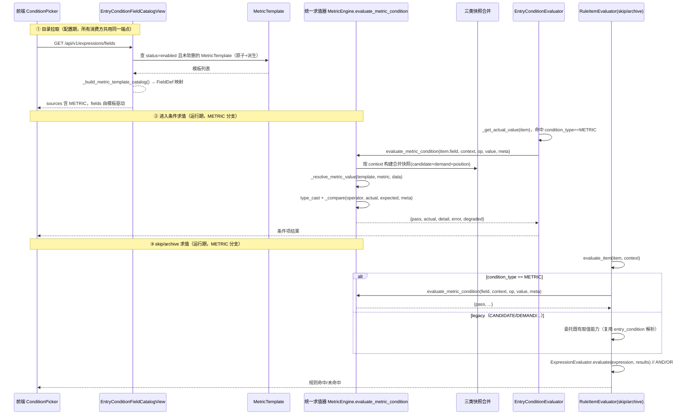
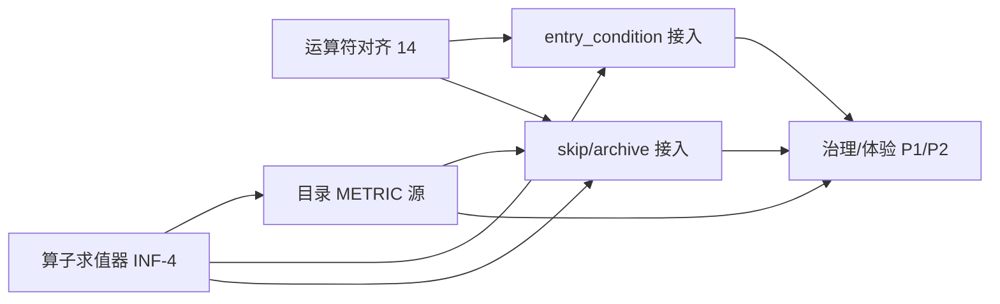

# 架构设计：「指标作为条件源」通用能力（ARCH）

| 项 | 内容 |
|---|---|
| 文档类型 | 系统架构设计 + 任务分解 |
| 系统 | ATS-NEW（Django + DRF / Vue3 + Naive UI 招聘管理系统） |
| 作者 | 高见远（架构师） |
| 版本 | v1.0（草案，待兵哥评审） |
| 关联 PRD | `docs/PRD_指标作为条件源.md` |
| 语言 | 简体中文 |

---

## 0. 设计铁律落实总览

| 铁律 | 本方案落地方式 |
|---|---|
| **全局通用**：METRIC 是第 5 个通用条件源，由通用抽象层提供，消费方「接入」而非「重新实现」 | METRIC 在 `EntryConditionFieldCatalogView` 作为独立 source 分支注册；统一指标条件求值器 `MetricEngine.evaluate_metric_condition` 为**唯一**指标取值+判定入口；skip/archive、entry_condition 均只做"派发+委托"，**绝不在消费方写死指标逻辑**。 |
| **不重复造轮子**：不新建第三套规则引擎 / 运算符词表 / 指标取值机制 / 条件模板概念 / 前端控件 | 复用：`MetricTemplate`（字段定义）、`MetricEngine._resolve_metric_value`+`_compare`（取值+判定）、`UnifiedOperator`（运算符真相源）、三类快照、`EntryConditionFieldCatalogView` 目录契约、`FieldDef`/现有控件族。新增代码仅 1 个方法（INF-4）+ 1 个消费方求值派发器（CON-1/2）。 |
| **运算符唯一真相源** | `UnifiedOperator`（14 种）为准，回填 `entry_condition.ConditionOperator`（11→14）与前端 `OperatorKey`（11→14）。 |

> 关键现状核实（影响方案）：`referral/urls_stubs.py:225 auto_archive_rules` 与 `stage_rules` POST **仍返 501**；`process/expressions.py` 仅提供表达式 AND/OR 求值（`ExpressionEvaluator`），**不负责单条条件项取值**。即 skip/archive 的"条件项求值"链路尚未真实落地——这是 CON-1/CON-2 必须新建消费方求值器的根本原因（见 §4.2 与待明确 #3）。

---

## 1. 实现方案 + 框架选型（沿用既有资产清单）

**本系统既定技术栈**：Django 5 + DRF（后端）、Vue3 + Naive UI（前端）。**无需重选框架**，以下为直接复用的既有资产与本次零新增依赖说明。

### 1.1 直接复用资产（不做任何改写，仅调用）

| 资产 | 位置 | 本次角色 |
|---|---|---|
| `MetricTemplate`（指标模板） | `apps/metrics/models.py:137` | METRIC 源的**唯一字段定义来源**。其 `operators`/`value_domain`/`param_enums`/`param_allow_null`/`param_config` 天然等价于 `FieldDef`，直接驱动目录下拉/运算符/值控件。 |
| `MetricEngine._resolve_metric_value` | `apps/metrics/services/metric_engine.py:180` | 指标取值**唯一入口**（原子走 `FieldResolverRegistry.resolve`；派生走 `derived_compute`）。 |
| `MetricEngine._compare` | `apps/metrics/services/metric_engine.py:217` | 运算符**唯一判定实现**（已覆盖 14 种 UnifiedOperator，含 CONTAINS/NOT_CONTAINS/REGEX_MATCH）。 |
| `UnifiedOperator` | `apps/rule_engine/models.py:57` | 运算符词表**唯一真相源**（14 种）。 |
| 三类快照 | `apps/metrics/services/candidate_snapshot.py` | `build_candidate_snapshot` / `build_demand_snapshot` / `build_position_snapshot` 作为数据上下文，合并后供指标点路径解析。 |
| `EntryConditionFieldCatalogView` | `apps/process/views.py:723` | 复用 `source→field→operator→value` 字典树契约，**仅新增 METRIC source 分支**（不另起端点）。 |
| 前端 `FieldDef` / `ConditionPicker.vue` | `web/.../components/ConditionPicker.vue` | 完全数据驱动（下拉/运算符/值控件均由目录渲染），METRIC 仅多一个源，**不新增控件**。 |
| `ExpressionEvaluator` | `apps/process/expressions.py:193` | 规则级 AND/OR 表达式求值（skip/archive 复用）。 |

### 1.2 新增/改动（最小集）

- **新增 1 个方法**：`MetricEngine.evaluate_metric_condition(...)`（INF-4，统一指标条件求值器）。
- **新增 1 个消费方求值派发器**（CON-1/2 必须）：`apps/process/services/rule_item_evaluator.py` 的 `RuleItemEvaluator`，负责 skip/archive JSON 条件项的派发与组合；对 `METRIC` 项**委托** `MetricEngine.evaluate_metric_condition`，对 legacy 项（CANDIDATE/DEMAND/POSITION/STAGE_STATUS）调用既有取值能力（建议复用 entry_condition 解析函数，**不新造**）。
- **改动**：目录视图加 METRIC 分支；`ConditionFieldType`/`ConditionOperator` 扩值（**纯 Python 层，无 DB 迁移**）；`EntryConditionEvaluator._get_actual_value` 加 METRIC 分支；前端 `SourceKey`/`OperatorKey`/`AR_*` 常量扩值。

### 1.3 选型结论

- 不引入任何新第三方依赖（见 §6）。
- 不新建平行规则引擎、不新建运算符枚举、不新建指标取值层、不新建条件模板表、不新建前端控件。

---

## 2. 文件列表及相对路径

> 路径相对仓库根：`apps/django/`（后端）、`web/app/`（前端）。

### 2.1 新建文件

| 文件 | 说明 |
|---|---|
| `apps/django/apps/metrics/services/__init__.py` | 已存在；仅导出新求值器（若需）。 |
| `apps/django/apps/process/services/rule_item_evaluator.py` | **消费方求值派发器** `RuleItemEvaluator`：对 skip/archive 的 `items[]` 逐条派发，`METRIC`→`MetricEngine.evaluate_metric_condition`，legacy→既有取值；用 `ExpressionEvaluator` 做 AND/OR 组合。**这是 CON-1/CON-2 真正落点，且是 skip/archive 执行链路从 501 stub 走向真实的必要一环。** |
| `apps/django/apps/metrics/tests/test_metric_condition_evaluator.py` | 统一求值器单测：原子/派生取值、运算符 14 种、缺数据降级、禁用/软删未命中。 |
| `apps/django/apps/process/tests/test_rule_item_evaluator.py` | skip/archive 求值派发测试：METRIC 命中/未命中、legacy 兼容、表达式组合。 |
| `apps/django/apps/process/tests/test_catalog_metric_source.py` | 目录 METRIC 分支测试：仅列 enabled+未软删模板、FieldDef 映射正确、分组标签。 |

### 2.2 修改文件

| 文件 | 改动点 |
|---|---|
| `apps/django/apps/metrics/services/metric_engine.py` | **新增类方法** `evaluate_metric_condition(template_id, context, operator, value, meta=None) -> dict`（INF-4）。内部：合并快照 → `_resolve_metric_value` → `_compare`，沿用现有降级（FAIL/None→未命中+记日志）。 |
| `apps/django/apps/process/views.py` | `EntryConditionFieldCatalogView`：新增 `METRIC` source 分支（新方法 `_build_metric_template_catalog()`），`common_operators` 扩至 14 种。 |
| `apps/django/apps/entry_condition/models.py` | `ConditionFieldType` 增加 `METRIC = 'METRIC','指标'`；`ConditionOperator` 增加 `CONTAINS/NOT_CONTAINS/REGEX_MATCH`（纯 choices 扩值）。 |
| `apps/django/apps/entry_condition/services.py` | `EntryConditionEvaluator._get_actual_value` 增加 `METRIC` 分支（委托 `MetricEngine.evaluate_metric_condition`）；`_compare` 补齐 3 个字符串运算符（或直接委托 `MetricEngine._compare` 以保证 14 种一致）。 |
| `apps/django/apps/process/serializers.py` | 轻量校验：skip/archive item 的 `condition_type` 白名单含 `METRIC`，`operator` 接受 14 种之一；`field` 允许为模板 id（长度 32）。**非阻塞，可后置**。 |
| `web/app/src/pages/settings/stage-rule/types.ts` | `SourceKey` 增加 `'METRIC'`；`OperatorKey` 增加 `'CONTAINS'\|'NOT_CONTAINS'\|'REGEX_MATCH'`。 |
| `web/app/src/pages/settings/stage-rule/constants.ts` | `AR_SOURCE_LABELS` 增加 `METRIC: '指标'`；`AR_OPERATOR_LABELS` 增加 3 个字符串运算符中文文案。 |
| `web/app/src/pages/settings/stage-rule/components/ConditionPicker.vue` | **通常无需改动**（完全数据驱动）。唯一需确认：`BETWEEN` 当前渲染单值 `n-input-number`，若 METRIC 模板含 `BETWEEN` 需区间双输入（属预存缺陷，见 §8 #6）。 |

### 2.3 迁移文件命名建议

- **无需新建任何 DB 迁移**。原因：`ConditionItem.condition_type` 与 `operator` 均为 `CharField(choices=...)`，**`choices` 仅影响 Python 校验层，不生成 DB 约束**（无 CHECK、无外键）。扩值即改代码，不需 `makemigrations`。
- 若工程师在验证时发现确有 DB 级约束需迁移，则命名：`apps/django/apps/entry_condition/migrations/000X_condition_field_type_metric.py`（`AddField`/无，实际为无操作占位，仅作记录）。
- skip_rules / archive_rules 为 `JSONField`，**零迁移**；存量 JSON 向后兼容（未知 `condition_type` 判未命中，见 §7）。

---

## 3. 数据结构与接口

### 3.1 类图（关键类 / 函数 / 关系）

```mermaid
classDiagram
    class MetricTemplate {
        +UUID id
        +str name
        +FK atomic_metric
        +FK derived_metric
        +list operators
        +dict param_config
        +dict value_domain
        +list param_enums
        +bool param_allow_null
        +str status
        +metric_kind: str
        +data_type: str
        +metric_path: str
    }

    class MetricEngine {
        +execute(conditions, data, logic) dict
        +evaluate_metric_condition(template_id, context, operator, value, meta) dict
        -_resolve_metric_value(template, metric, data) Any
        -_compare(operator, actual, expected, meta) bool
    }

    class EntryConditionFieldCatalogView {
        +get(request)
        -_build_metric_template_catalog() list
    }

    class EntryConditionEvaluator {
        +_get_actual_value(item) Any
        +_compare(op, actual, expected) bool
    }

    class RuleItemEvaluator {
        +evaluate_item(item, context) dict
        +evaluate_rule(rule_json, context) bool
    }

    class ConditionItem {
        +str condition_type
        +str field
        +str operator
        +JSON value
    }

    EntryConditionFieldCatalogView ..> MetricTemplate : 列出 enabled+未软删
    MetricEngine ..> MetricTemplate : 取值
    MetricEngine ..> FieldResolverRegistry : 点路径解析
    EntryConditionEvaluator ..> MetricEngine : evaluate_metric_condition (METRIC 分支)
    RuleItemEvaluator ..> MetricEngine : evaluate_metric_condition (METRIC 分支)
    RuleItemEvaluator ..> ExpressionEvaluator : AND/OR 组合
    ConditionItem ..> EntryConditionEvaluator : 输入(ORM)
    RuleItemEvaluator ..> ConditionItem : 输入(JSON dict)
```



### 3.2 统一指标条件求值器函数签名（INF-4，落点 `metric_engine.py`）

```python
@classmethod
def evaluate_metric_condition(
    cls,
    template_id: str,                       # MetricTemplate.id（ConditionItem.field / skip_rules item.field 即此值）
    context: Dict[str, Any],                # 求值上下文：至少含 candidate_id；可选 demand_id / position_id
    operator: str,                          # UnifiedOperator 取值（14 种之一）
    value: Any,                             # 期望值（BETWEEN 用 meta 承载 min/max）
    meta: Optional[Dict[str, Any]] = None,  # {min, max} 等（BETWEEN/分段用）
) -> dict:
    """返回契约（对齐 MetricEngine.execute 的 step 结构）：
    {
        'pass': bool,            # 是否命中
        'template_id': str,
        'template_name': str,
        'operator': str,
        'operator_label': str,
        'actual': Any,           # 解析到的实际值（已 JSON 化）
        'expected': Any,         # 期望值展示
        'detail': str,           # 人话描述
        'error': str,            # 非空表示降级/未命中原因（模板失效/缺数据）
        'degraded': bool,        # 是否降级（派生缺数据 / 模板禁用软删）
    }
    """
```

**内部流程**：
1. 查 `MetricTemplate`（含 `atomic_metric`/`derived_metric`，`select_related`）；不存在 → `pass=False, error='模板不存在/已失效', degraded=True`（覆盖禁用/软删：目录只列启用模板，存量引用失效即走此分支）。
2. 校验 `operator in template.operators`；不合法 → `pass=False, error='模板不支持该运算符'`。
3. 构建**合并快照** `data = {**build_candidate_snapshot(cid), **build_demand_snapshot(did), **build_position_snapshot(pid)}`（缺哪个就跳过，保证任意前缀点路径都能解析）。
4. `_resolve_metric_value(template, metric, data)`；异常 → 降级 `pass=False + 记日志`。
5. `type_cast(actual, template.data_type)` → `_expected` → `_compare(operator, actual, expected, meta)`。

**降级语义（派生缺数据 / 模板失效）**：
- 派生指标（跳槽频率/工作时长）依赖 `workExperience`/`education`，项目无独立结构模型 → `_resolve_metric_value` 返回 `None`。
- 非 `IS_EMPTY`/`IS_NOT_EMPTY` 类运算符：实际值 `None` → 判**未命中**（`pass=False`），`detail` 标注"指标无值（缺底层数据）"，**记日志，不在规则级报错**。
- `IS_EMPTY`：命中（`None` 视为空）；`IS_NOT_EMPTY`：未命中。
- 模板禁用/软删：第 1 步即判未命中 + `degraded=True` + `error`；前端据此显眼提示（EXP-5）。

### 3.3 目录返回结构 JSON Schema（METRIC 分支示例）

`EntryConditionFieldCatalogView.get()` 的 `data.sources` 新增一项，`fields` 直接由 `MetricTemplate` 映射为 `FieldDef`：

```json
{
  "source": "METRIC",
  "key": "METRIC",
  "label": "指标",
  "condition_type": "METRIC",
  "fields": [
    {
      "field": "<metric_template_id_1>",
      "key": "<metric_template_id_1>",
      "label": "跳槽频率〔派生〕",
      "metricKind": "derived",
      "operators": ["GT", "LT", "EQ", "BETWEEN"],
      "value_type": "number",
      "options": null,
      "min": 0, "max": 100, "step": 1
    },
    {
      "field": "<metric_template_id_2>",
      "key": "<metric_template_id_2>",
      "label": "性别〔原子〕",
      "metricKind": "atomic",
      "operators": ["EQ", "IN", "IS_EMPTY"],
      "value_type": "enum",
      "options": [{"label": "男", "value": "男"}, {"label": "女", "value": "女"}]
    }
  ]
}
```

**MetricTemplate → FieldDef 映射规则**（INF-3，落点 `_build_metric_template_catalog()`）：

| MetricTemplate 字段 | FieldDef 字段 | 规则 |
|---|---|---|
| `id` | `field` / `key` | 模板 id 即字段标识，也是 `ConditionItem.field` / skip_rules item `field` 的存储值 |
| `name` + `metric_kind` 标签 | `label` | 如 "跳槽频率〔派生〕" / "年龄〔原子〕"（EXP-1 分组展示） |
| `metric_kind` | `metricKind` | `atomic` / `derived`，供前端分组 |
| `operators` | `operators` | 直接透传（UnifiedOperator 白名单子集，已 14 种对齐） |
| `data_type` | `value_type` | `number/string/boolean/date` 直通；当 `param_enums` 非空 → `enum` |
| `param_enums` | `options` | `[{label, value}]` 下拉；空则 `null` |
| `param_config{min,max,step}` | `min`/`max`/`step` | 数值步进/区间控件参数 |
| `value_domain.segments` | （可选透传） | 分段值域，P0 可原样附带，前端暂按 min/max 处理 |
| `param_allow_null` | （约束 `IS_EMPTY` 是否可选） | 为 `false` 时前端可禁用空值运算符 |

**筛选**：仅 `status='enabled'` 且 `deleted_at__isnull=True` 的模板（禁用/软删不进目录；存量引用失效由求值器降级处理）。

### 3.4 消费方存储契约（INF-6，零迁移）

skip_rules / archive_rules JSON item：
```json
{
  "id": "ci_xxx", "item_seq": 1,
  "condition_type": "METRIC",
  "field": "<metric_template_id>",
  "operator": "GT",
  "value": 3,
  "meta": {"min": null, "max": null}
}
```
`ConditionItem`（进入条件 ORM）：`condition_type='METRIC'`、`field='<metric_template_id>'`、`operator`/`value` 同构。

### 3.5 运算符三套词表分裂 → 统一至 14（PRD §6 #5）

| 运算符 | `UnifiedOperator`(rule_engine) | `ConditionOperator`(entry_condition) | 前端 `OperatorKey` | 本次动作 |
|---|---|---|---|---|
| EQ/NEQ/GT/GTE/LT/LTE/BETWEEN/IN/NOT_IN/IS_EMPTY/IS_NOT_EMPTY | ✅ | ✅(11) | ✅(11) | 保持 |
| CONTAINS / NOT_CONTAINS / REGEX_MATCH | ✅(14) | ❌缺 | ❌缺 | **回填至两套**，以 UnifiedOperator 为唯一真相源 |

- 文件：`entry_condition/models.py`（`ConditionOperator` +3）、`entry_condition/services.py`（`_compare` +3 分支，建议直接委托 `MetricEngine._compare`）、`web/types.ts`（`OperatorKey` +3）、`web/constants.ts`（`AR_OPERATOR_LABELS` +3）。
- 目录 `common_operators` 同步扩至 14（`process/views.py`）。

---

## 4. 程序调用流程（Mermaid 时序）

### 4.1 METRIC 条件项：从目录拉取到两端求值全链路



### 4.2 关键说明

- **目录端**：一次返回 METRIC 源，前端 `sourceOptions` 自动多出"指标"一项（`ConditionPicker` 由 `catalog.sources` 驱动），skip/archive/进入条件三处编辑器零改动即获得 METRIC 源。
- **求值端**：
  - 进入条件：`EntryConditionEvaluator._get_actual_value` 新增 `METRIC` 分支 → 委托统一求值器。
  - skip/archive：`RuleItemEvaluator.evaluate_item` 按 `condition_type` 派发，`METRIC` → 委托统一求值器；legacy → 既有取值。**两处共用同一个 `MetricEngine.evaluate_metric_condition`**（CON-4 落地方式：保留两处编排层，但指标取值都调同一函数）。
- **降级一致性**：派生缺数据 / 模板禁用软删 的降级逻辑只在 `MetricEngine.evaluate_metric_condition` 一处实现，全局一致、可统一审计（EXP-4）。

---

## 5. 任务列表（有序、含依赖、P0/P1/P2）

> 依赖顺序遵循「先基础设施、后消费方接入、再治理」；前端扩值与运算符对齐贯穿 P0，确保 14 词表同步。

| 任务 | 名称 | 优先级 | 依赖 | 涉及文件 |
|---|---|---|---|---|
| **T01** | 统一指标条件求值器（INF-4） | **P0** | 无 | `apps/metrics/services/metric_engine.py`（新增 `evaluate_metric_condition`）；`apps/metrics/tests/test_metric_condition_evaluator.py` |
| **T02** | 目录新增 METRIC 源分支（INF-1/2/3） | **P0** | T01 | `apps/process/views.py`（`EntryConditionFieldCatalogView` 增 METRIC + `_build_metric_template_catalog`，`common_operators` 扩 14）；`apps/process/tests/test_catalog_metric_source.py` |
| **T03** | 运算符三套词表对齐至 14（PRD §6 #5） | **P0** | 无（可与 T01 并行） | `apps/entry_condition/models.py`（`ConditionOperator` +3）、`apps/entry_condition/services.py`（`_compare` +3 或委托 `MetricEngine._compare`）、`web/types.ts`（`OperatorKey` +3）、`web/constants.ts`（`AR_OPERATOR_LABELS` +3）、`apps/process/views.py`（`common_operators` 已在 T02 处理） |
| **T04** | entry_condition 接入 METRIC（INF-6 / CON-3） | **P0** | T01, T03 | `apps/entry_condition/models.py`（`ConditionFieldType` +`METRIC`）、`apps/entry_condition/services.py`（`_get_actual_value` 加 METRIC 分支）、`apps/metrics/tests/test_entry_condition_integration.py`（追加 METRIC case） |
| **T05** | skip/archive 接入 METRIC（CON-1/2 / INF-6） | **P0** | T01, T02, T03 | `apps/process/services/rule_item_evaluator.py`（**新建** `RuleItemEvaluator`）、`apps/process/serializers.py`（轻量校验 condition_type/operator 白名单）、`apps/process/tests/test_rule_item_evaluator.py` |
| **T06** | 治理与体验（EXP-1~5）+ 生命周期预留（LIFE-1~3） | **P1 / P2** | T02,T04,T05 | `apps/process/views.py`（原子/派生分组标签）、`web/.../ConditionPicker.vue` 或 constants（空值运算符隐藏值控件已支持；分组展示）、前端引用失效模板提示 + 保存/启用拦截（`AR_SOURCE_LABELS`/`types` 已含 METRIC）、统一执行日志（EXP-4，落 `MetricEngine.evaluate_metric_condition` 日志点）；LIFE 系列为 P2 非目标，本版仅预留接口 |

### 5.1 依赖图



### 5.2 任务要点（给工程师）

- **T01**：`evaluate_metric_condition` 复用 `_resolve_metric_value` + `_compare` + 三类快照合并；降级语义见 §3.2。
- **T02**：`_build_metric_template_catalog()` 仅查 `status='enabled'` 且 `deleted_at__isnull=True`；按 §3.3 映射。
- **T03**：`ConditionOperator` 与 `OperatorKey` 补齐 `CONTAINS/NOT_CONTAINS/REGEX_MATCH`；`entry_condition._compare` 建议直接 `return MetricEngine._compare(...)` 以保 14 种一致。
- **T04**：`ConditionFieldType.METRIC` 为纯 choices 扩值（无迁移）；`_get_actual_value` 命中后 `context={'candidate_id':..., 'demand_id':..., 'position_id':...}` 传给统一求值器。
- **T05**：`RuleItemEvaluator.evaluate_item` 按 `condition_type` 派发；`METRIC`→统一求值器；legacy→复用 entry_condition 取值函数（不新造）；`evaluate_rule` 调 `ExpressionEvaluator.evaluate`。
- **T06**：EXP-5 前端拦截依赖目录/规则加载时校验模板是否仍 enabled；LIFE 系列标注 P2，本版不做实装。

---

## 6. 依赖包列表

**无新增第三方依赖**。全部复用既有栈（Django / DRF / Vue3 / Naive UI / Mermaid 仅文档用）。本次为纯存量代码扩展与一处方法新增。

---

## 7. 共享知识（跨文件约定）

1. **`condition_type` 枚举值**：后端 `ConditionFieldType`（entry_condition）与目录 `condition_type`、前端 `SourceKey` 三者必须同步含 `METRIC`。存量 JSON（skip/archive）`condition_type` 为自由字符串，**未知 source 一律判"未命中"**（`pass=False`），不抛错。
2. **目录 `FieldDef` ↔ `MetricTemplate` 字段映射**：`field/key = template.id`、`label = name + 〔原子/派生〕`、`operators = template.operators`、`value_type = data_type`（枚举特例→`enum`）、`options = param_enums`、`min/max/step = param_config`。
3. **统一求值器入参约定**：`evaluate_metric_condition(template_id, context, operator, value, meta)`；`context` 至少含 `candidate_id`，可选 `demand_id`/`position_id`；`field` 存储的就是 `template_id`（进入条件 ORM 与 skip/archive JSON 同构）。
4. **降级语义**（唯一实现点 = 统一求值器）：
   - 派生缺数据 → 实际值 `None` → 非 `IS_EMPTY` 类判未命中 + 记日志；`IS_EMPTY` 命中。
   - 模板不存在/禁用/软删 → `pass=False` + `degraded=True` + `error`（目录不列失效模板，存量引用走此分支）。
5. **运算符真相源**：`UnifiedOperator`（14）唯一；`ConditionOperator`/`OperatorKey` 必须与其同构（T03 补齐）。字符串类 3 运算符（CONTAINS/NOT_CONTAINS/REGEX_MATCH）在 METRIC 源完全可用（引擎已支持）；legacy 源是否启用由 `template.operators` 白名单控制。
6. **求值结果契约**：统一返回 `{pass, template_id, template_name, operator, operator_label, actual, expected, detail, error, degraded}`，供三处消费方与 EXP-4 统一日志复用。
7. **快照合并**：METRIC 求值前合并 `candidate+demand+position` 三类快照，保证任意前缀点路径（`candidate.*`/`demand.*`/`position.*`）都能解析。

---

## 8. 待明确事项（引用 PRD §6 五问 + 推荐方案）

| # | PRD 问题 | 推荐方案（架构师建议，待兵哥拍板） |
|---|---|---|
| **1** | 派生指标缺底层经历数据时的行为 | **采纳 PRD 建议**：派生算不出 → 实际值 `None` → 非 `IS_EMPTY` 类判"未命中"+记日志，规则级不报错；`IS_EMPTY` 可命中。与 `MetricEngine` 现有 FAIL/None 处理完全一致。 |
| **2** | 模板禁用/软删对存量规则影响 | **采纳 PRD 建议**：禁用→该条件判未命中 + 前端显眼提示；软删→保存/启用拦截（EXP-5）。落地：目录不列失效模板；统一求值器第 1 步查不到即 `degraded=True`；前端加载规则时校验引用模板仍 enabled，否则拦截启用。 |
| **3** | entry_condition 与 skip/archive 是否统一一套求值器 | **采纳 PRD 建议（CON-4）**：统一"指标取值函数"=`MetricEngine.evaluate_metric_condition`；skip/archive 与 entry_condition 保留各自编排层（前者吃 JSON dict、后者吃 ORM `ConditionItem`），但 METRIC 项都调同一函数。**归属**：求值器落在 `metrics` app（与 `_resolve_metric_value`/`_compare` 同文件），不新建平行模块。**skip/archive 求值器实际位置**：目前**无真实实现**（`referral/urls_stubs.py:225` 与 `stage_rules` POST 返 501；`process/expressions.py` 只做 AND/OR）。故本次需新建 `RuleItemEvaluator`（消费方派发器，非第三套引擎）填补执行链路，METRIC 委托统一求值器、legacy 复用 entry_condition 取值。 |
| **4** | `condition_type` 命名与存储迁移策略 | **命名 `METRIC`**（与 CANDIDATE/DEMAND/POSITION/STAGE_STATUS 并列，风格一致）。**存量 JSON 向后兼容**：未知 `condition_type` 视为"未命中"，无需迁移。进入条件 `ConditionItem.condition_type` 扩值**无 DB 迁移**（`choices` 非 DB 约束）。存量「裸路径」指标条件迁移到 METRIC 源列为 **P2（LIFE-3）**，本版不做。 |
| **5** | 运算符三套词表分裂 | **以 `UnifiedOperator`(14) 为唯一真相源**，回填 `entry_condition.ConditionOperator` 与前端 `OperatorKey` 至 14（含 CONTAINS/NOT_CONTAINS/REGEX_MATCH）。**纳入本次 P0（T03）**，避免 METRIC 源引入更多分裂。`entry_condition._compare` 建议直接委托 `MetricEngine._compare` 以保证 14 种语义一致。 |

### 额外需兵哥确认（架构师补充）

- **#6 `BETWEEN` 前端区间双输入**：现有 `ConditionPicker.vue` 对 `BETWEEN` 仍渲染单值 `n-input-number`，若 METRIC 模板 `operators` 含 `BETWEEN`，需补区间双输入控件（预存缺陷，影响所有源）。建议：若 P0 模板不含 `BETWEEN` 可后置为 P1；否则随 T02 一并处理。
- **#7 skip/archive 执行触发点**：`RuleItemEvaluator` 建好后，真正的"何时触发自动跳过/归档"（阶段进入/停留超时等）仍在 `referral/urls_stubs.py` 的 501 stub 与阶段流转主链路中未落地——本方案只交付"条件求值能力"，触发编排属更大范围的自动化执行链路，建议单独立项（P0 验收口径仅要求"可被引用并正确求值"，见 PRD §7）。

---

*文档结束。所有结论均基于已核实代码（`metrics/models.py:137`、`metric_engine.py:180/217`、`candidate_snapshot.py`、`process/views.py:723`、`entry_condition/models.py:34/112`、`entry_condition/services.py:328/379/521`、`rule_engine/models.py:57`、`web/.../types.ts:9/11`、`web/.../constants.ts:13/21`）。不重复造轮子、全局通用两条铁律已在本方案中贯彻。*
