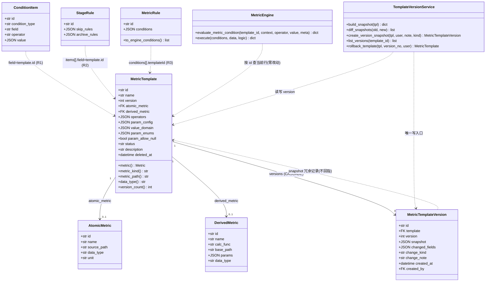
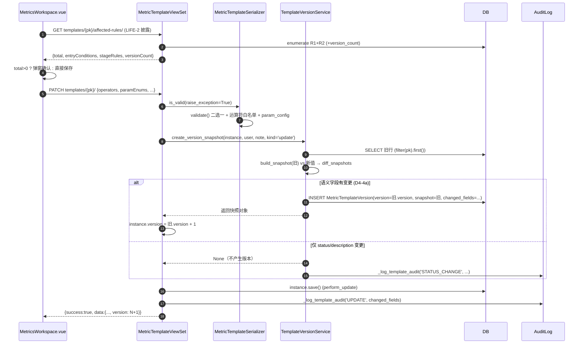
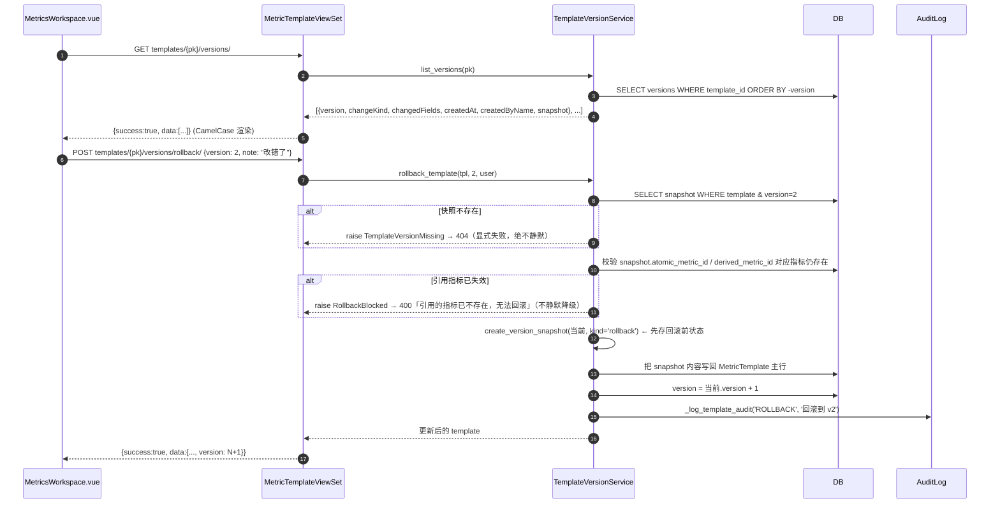
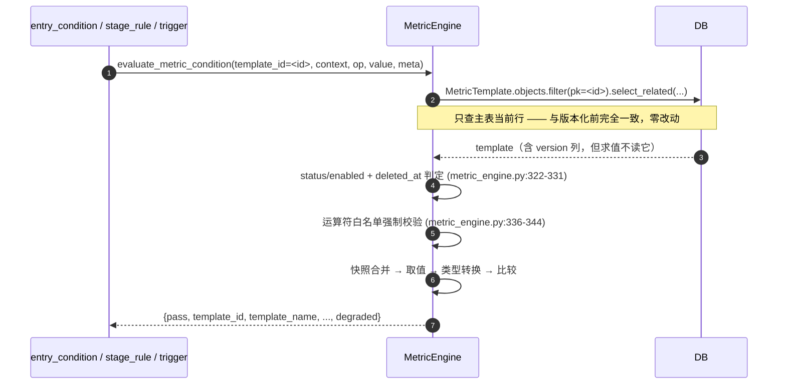
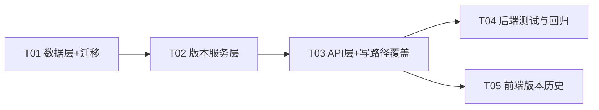

# LIFE-1 指标模板版本化 —— 架构设计与任务分解

> 阶段：指标模板生命周期治理 P2 第三项（前两项 LIFE-2 `36381466` / LIFE-3 `f0406905` 已交付）
> 作者：架构师 高见远 ｜ 性质：**只读调研 + 设计**，未修改任何业务代码
> 基线 commit：`f0406905`（main）
> 状态：**待兵哥拍板决策点 D1–D8 后方可进入实现**

---

## 0. 一句话结论

**推荐方案 C：主表加 `version` 计数器 + 新建 `MetricTemplateVersion` 不可变快照表；引用方（存模板 id）零改动、求值路径零改动；本期交付「追溯 + 回滚」，「引用锁定」留到二期并已在数据模型上预留接口。**

---

## 1. 现状盘点（全部基于真实代码，文件:行号）

### 1.1 `MetricTemplate` 模型全貌

`apps/django/apps/metrics/models.py:137-225`

| 字段 | 定义位置 | 说明 |
|---|---|---|
| `id` | 继承 `UUIDModel`（`apps/common/models.py:66-77`） | `CharField(max_length=32)`，nanoid `size=21` |
| `name` | models.py:143 | `CharField(64)` **unique=True**（DB 级唯一，非软删安全） |
| `atomic_metric` | models.py:144-147 | FK → `AtomicMetric`，`PROTECT`，可空 |
| `derived_metric` | models.py:148-151 | FK → `DerivedMetric`，`PROTECT`，可空 |
| `operators` | models.py:152-155 | JSON，UnifiedOperator 子集 |
| `param_config` | models.py:158-162 | JSON `{min,max,step,prefix,suffix,allOption}` |
| `value_domain` | models.py:163-166 | JSON `{segments:[{min,max,step,label}]}` |
| `param_enums` | models.py:167-170 | JSON list |
| `param_allow_null` | models.py:171 | Boolean |
| `status` | models.py:172-175 | `MetricStatus` = `enabled` / `disabled` |
| `description` | models.py:176-178 | CharField(255) |

**无 `version` 字段 —— 痛点确认成立。**

状态枚举 `MetricStatus`：`apps/django/apps/metrics/models.py:37-39`，仅 `enabled` / `disabled` 两值（**没有 `archived` / `draft`**）。

继承链：`FullAuditModel`（`apps/common/models.py:45-63`）= `TimestampedModel(created_at/updated_at)` + `SoftDeleteModel(deleted_at, soft_delete(), restore())` + `created_by/updated_by`。
**注意**：模板**有** `deleted_at` 列（求值层会判软删，见 1.4），但 DRF 删除是**硬删**（见 1.6）。

二选一约束在 `clean()`（models.py:189-198）与 serializer `validate()`（serializers.py:89-109）双重实现。

### 1.2 `AtomicMetric` / `DerivedMetric` 与模板的关系

- `AtomicMetric`：`apps/django/apps/metrics/models.py:42-88`，`related_name='templates'`（models.py:146）
- `DerivedMetric`：`apps/django/apps/metrics/models.py:91-134`，`related_name='templates'`（models.py:150）
- 模板通过 `metric` / `metric_kind` / `metric_path` / `data_type` / `unit` 五个 property（models.py:200-225）把两种指标**抹平成统一视图**，求值层只依赖这五个 property。
- 删除保护：指标被模板引用时禁止删除（`_RefCheckMixin.destroy`，`views.py:82-96`），因此**模板快照中引用指标不会出现"指标已消失"的悬空**（除非绕过 ViewSet）。

### 1.3 引用模板 id 的落点（**共 4 处，含 1 处 LIFE-2 未覆盖**）

| # | 落点 | 位置 | 存储形态 | LIFE-2 已覆盖？ |
|---|---|---|---|---|
| R1 | 进入条件 ORM | `apps/entry_condition/models.py:143` `ConditionItem.field = CharField(max_length=64)`，`condition_type='METRIC'` 时存模板 id | 字符串 id（21 字符，64 上限余量 43） | ✅ `template_impact.py:74-84` |
| R2 | 阶段规则 JSON | `apps/process/models.py:453-462` `StageRule.skip_rules` / `archive_rules`，`items[].field` 存模板 id | JSON 内字符串 | ✅ `template_impact.py:103-140` |
| R3 | **指标规则 JSON** | `apps/metrics/models.py:273-276` `MetricRule.conditions = [{templateId, operator, value, meta}]` | JSON 内 `templateId` | ❌ **未覆盖**（`get_template_affected_rules` 只扫 R1/R2） |
| R4 | 条件目录 API | `apps/process/views.py:901-990` `_build_metric_template_catalog()`，`'field'/'key' = str(tpl.id)` | 运行时生成，不落库 | — |

补充引用路径（非落点，但解析模板 id）：
- `apps/metrics/services/rule_validators.py`：`template_id` → `MetricTemplate.objects.filter(pk=...).first()`，不存在则报错
- `apps/metrics/serializers.py`：`MetricTemplate.objects.filter(pk=template_id).exists()`
- `apps/metrics/services/metric_engine.py:82-92` `execute_rule()`：`'templateId': cond.field`

### 1.4 求值入口（运算符白名单强制校验点）

- **主入口**：`MetricEngine.evaluate_metric_condition()` — `apps/django/apps/metrics/services/metric_engine.py:273-...`
  - 模板存在性 + 软删判定：line 311-331（禁用/软删 → `degraded=True`，**绝不 500**）
  - **运算符白名单强制校验**：line 336-344（`operator not in allowed` → `'模板不支持该运算符'`）
  - 快照合并：line 346-369；取值：line 371-380；类型转换：line 382-391
- **批量入口**：`MetricEngine._evaluate_condition()` — line 97-178（白名单校验在 line 126-130）
- **契约**：`{pass, template_id, template_name, operator, operator_label, actual, expected, detail, error, degraded}`
- **关键**：两处都只按 `template_id` 查**主表当前行**，不含任何版本概念。

### 1.5 前端消费点

| 文件 | 用途 |
|---|---|
| `web/app/src/api/metrics.ts:77-91` | `MetricTemplate` TS 类型（**无 version**） |
| `web/app/src/api/metrics.ts:325-345` | `listMetricTemplates` / `create` / `update` / `delete` |
| `web/app/src/api/metrics.ts:349-351` | `getTemplateAffectedRules`（LIFE-2） |
| `web/app/src/api/metrics.ts:431-480` | 导入导出（8 列契约） |
| `web/app/src/pages/settings/MetricsWorkspace.vue:1196-1290` | LIFE-2 删除/禁用披露弹窗 + 8s 撤销 Toast |
| `web/app/src/pages/settings/MetricsWorkspace.vue:1355-1364` | 模板列表加载 |
| `web/app/src/pages/settings/stage-rule/modals/SkipRuleEditModal.vue`、`ArchiveRuleEditModal.vue`、`EntryRuleEditModal.vue`、`composables/useEntryRuleEditor.ts`、`components/BatchMetricPicker.vue`、`pages/settings/RuleAuthoring.vue` | 三处条件编辑器消费 R4 目录 |
| `web/app/src/locales/metrics.ts:254+` | `metrics.life2.*` 文案键（LIFE-1 新增键放此处） |

### 1.6 迁移现状

- 最新：`apps/django/apps/metrics/migrations/0018_seed_safe_set_templates.py`
- 下一个可用编号：**`0019_`**
- 0001–0018 **均已应用，严禁修改**（项目历史教训：工程师直接编辑已应用迁移被撤销）
- 项目约定见 `migrations/0018` 头部注释：seed 数据直写 `.get_or_create`，不走 `clean()`

### 1.7 导入/导出对模板的影响

`apps/django/apps/metrics/io_template.py`
- `TEMPLATE_HEADERS`（line 39）固定 **8 列**：`模板名称 / 指标类型 / 引用指标名称 / 支持的运算符 / 参数枚举 / 允许为空 / 状态 / 说明`
- 导入按 **name** 聚合（line 520 `existing_by_name = {t.name: t ...}`），`mode=update` 直接改已有行（line 491-500 文档串）
- **结论**：导入是第 2 条「模板写入路径」，版本化必须显式覆盖它，否则出现「改了但没快照」的假绿

### 1.8 删除语义现状（与 LIFE-2 的耦合点，重要）

- `MetricTemplateViewSet` **未覆写 `destroy`** → 继承 `ModelViewSet.destroy` → `obj.delete()` **硬删**
- 前端 LIFE-2 撤销 Toast 会 `createMetricTemplate(restorePayload)` **用同名重建**（`MetricsWorkspace.vue:1219-1241`）
- **硬约束**：`name` 是 DB 级 unique。**若把删除改成软删，撤销重建会撞唯一键失败** → 这是"删除改软删"方案的最大地雷，下文 D5 展开

### 1.9 测试规模（实测）

| 范围 | 测试文件数 | 测试函数数 |
|---|---|---|
| 项目全量（排除 `.venv`） | 203 | **1858** |
| `apps/metrics` | 18 | **225** |
| metrics + process + entry_condition + application | 43 | — |

> 即：任何触碰**引用存储格式**的方案，影响面是 1858 个用例级别；任何只加字段/加表的方案，影响面≈0。

---

## 2. 方案对比与推荐

### 2.1 候选方案

| | **A 只加 `version` 列** | **B 只建快照表** | **C `version` 列 + 快照表（推荐）** | **D 版本化主键（模板组）** |
|---|---|---|---|---|
| 做法 | 主表加 `version` int，原地更新递增 | 新建 `MetricTemplateVersion`，主表零改动 | B + 主表一个只读 `version` 计数器 | `(template_group, version)` 复合主键，每次修改产生新行 |
| Schema 变更 | 1 列 | 1 表 | **1 列 + 1 表** | 1 表重构 + 全部引用方改造 |
| 数据回填 | 存量 `version=1` | 可选补基线快照 | 同 B | 存量全部迁移成 v1 行 |
| 引用方改动 | 无 | **无** | **无** | **有**（R1/R2/R3 全改） |
| 求值路径改动 | 无 | **无** | **无** | **有**（需按 group 取 latest） |
| 目录 API 改动 | 无 | 无 | 无 | **有**（同 group 去重） |
| 前端改动 | 列表加 1 列 | 新增历史抽屉 | **新增历史抽屉** | 三个条件编辑器全改 |
| **追溯能力** | ❌ 只有版本号，无内容 → **追溯是假的** | ✅ | ✅ | ✅ |
| **回滚能力** | ❌ **做不到** | ✅ | ✅ | ✅ |
| 已有测试影响面 | ≈0 | **0** | **0** | 大（R1–R4 全链路） |
| 回滚/下线难度 | 极低 | 极低（drop 表） | **极低（additive）** | 高 |
| 一致性风险覆盖 | 仅"知情" | 知情 + 可恢复 | **知情 + 可恢复** | 强隔离（引用锁定） |

### 2.2 推荐：方案 C —— `version` 列 + 不可变快照表

**理由（5 条，按权重排序）**

1. **引用方零改动 = 风险归零。** R1/R2/R3 存的都是 `str(template.id)`，方案 C 不动它 → 目录 API、求值引擎、三处前端条件编辑器、1858 个用例全不受影响。**这是"最小 DB 变更"纪律下能拿到的最大收益。**
2. **只有快照表能真正兑现"追溯"。** 方案 A 只存一个数字，"知道现在是第 3 版"但不知道第 1 版长什么样 —— 那是**看起来有用的假实现**，违反「真实可靠」纪律。
3. **只有快照表能回滚**，而回滚正是"模板改坏了引用方怎么办"这一痛点的实际救济手段。
4. **`version` 列成本极低且解决实际问题**：列表页要显示"当前第几版"，否则每次 `SELECT COUNT(*)` 子查询。1 个 int 列、`default=1`、additive，风险可忽略。
5. **为二期的"引用锁定"预留数据基础**：一旦有了快照表，二期只需给 R1/R2/R3 加一个可空 `template_version` 列（NULL=跟随当前），求值层按版本回退快照即可，**不会返工**。方案 A/D 做不到这点。

**方案 C 明确不做什么（边界，避免范围蔓延）**
- ❌ 不做"引用锁定"（D1 拍板后可作二期）
- ❌ 不改删除语义（保持硬删，见 D5）
- ❌ 不改导出 8 列契约（见 D6）
- ❌ 不动 `MetricEngine` 任何一行（求值路径零改动是本方案的验收硬指标）

---

## 3. 关键产品决策点（**需兵哥拍板**）

> 每项给出选项、影响、架构推荐。D1/D5 是阻塞项，其余有默认推荐值可先按推荐执行。

### D1（阻塞）引用方语义：跟随当前版本，还是锁定到创建时的版本？

| 选项 | 做法 | 成本 | 影响 |
|---|---|---|---|
| **1a 跟随当前（推荐）** | 引用方仍只存 template id，模板一改所有引用立即生效；保存前用 LIFE-2 的 `get_template_affected_rules` 披露"本次改动波及 N 条规则"并要求确认 | 零改动 | 保留一致性风险，但**风险被显式告知**（不静默）；改坏可用回滚（D3）急救 |
| 1b 锁定创建时版本 | R1 `field` 改为 `id@vN` 或新增 `template_version` 列；R2/R3 JSON 同步；`MetricEngine` 解析版本并读快照；目录 API 按版本出条目；三个条件编辑器加"版本"选择器 | 大（≈全部落点 + 求值 + 前端） | 彻底消除一致性风险，但运营配置心智负担陡增（"我该选哪一版？"） |
| 1c 混合（可锁定） | 引用方加**可空** `template_version` 列，NULL=跟随，填值=锁定 | 中 | 灵活但 UI 复杂度最高 |

**架构推荐：1a（本期）+ 预留 1c（二期）**。理由：痛点的**急救手段是回滚**，不是锁定；锁定会把"选版本"的日常成本转嫁给每个配置规则的人。

### D2 模板修改语义：原地更新 + 版本递增，还是产生新版本记录？

- **2a 原地更新 + `version++` + 落快照（推荐）**：`id` 永不变，引用方零改动。
- 2b 每次修改产生新行（模板组）：`id` 变化 → 等于方案 D，全链路改造。

**推荐 2a。**（=方案 C 的题内之义；若选 2b 则回到方案 D，成本翻倍且收益相同）

### D3 历史版本可否回滚？

- **3a 可回滚（推荐）**：把快照内容写回主表，`version+1`，再落一条 `kind='rollback'` 快照（记录回滚前状态），全程审计。**历史永不丢失**。
- 3b 只读归档：只能看/对比，不能回滚 → 改坏了只能靠人工照着历史重配。

**推荐 3a。** 若选 3b，"版本化"的价值大幅缩水。

### D4 什么算"一个新版本"？

| 选项 | 触发 version+1 的字段 | 影响 |
|---|---|---|
| **4a 仅语义字段（推荐）** | `name` / `atomic_metric_id` / `derived_metric_id` / `operators` / `param_config` / `value_domain` / `param_enums` / `param_allow_null` | 版本号有意义，不被"改个说明"刷屏 |
| 4b 任意字段变更 | 上述 + `status` / `description` | 版本号噪音大（一次启停就 +1） |

**补充**：`name` 算语义，因为求值结果 `detail` 里直接拼了 `template.name`（`metric_engine.py:123`、`:175`），改名会改变规则展示文本。
`status` 切换**不** +1，但应写一条 `kind='status'` 的操作审计（复用 `_log_template_audit`，`io_template.py:442`）。
**推荐 4a。**

### D5（阻塞）禁用 / 删除时版本如何处理？与 LIFE-2 的衔接

现状：`destroy` 是**硬删**（`MetricTemplateViewSet` 未覆写），前端有 8s 撤销 Toast 用**同名重建**（`MetricsWorkspace.vue:1219-1241`），而 `name` 是 DB 级 unique。

| 选项 | 快照表 FK | 行为 | 风险 |
|---|---|---|---|
| **5a 保持硬删 + 快照 CASCADE（推荐）** | `on_delete=CASCADE` | 删模板连带删其版本历史；删除弹窗明示"将同时清除 N 条版本历史" | 历史随模板消失，但**与 LIFE-2 已交付行为零冲突**，撤销 Toast 仍可用 |
| 5b 硬删阻止（PROTECT） | `on_delete=PROTECT` | 有历史则拒绝删除 → 显式 400「请先停用」 | 保护最强；但**改变了已交付的删除 UX**（用户点删除会失败） |
| 5c 删除降级为软删 | `on_delete=PROTECT` | 只置 `deleted_at`，历史保留 | ⚠️ **地雷**：软删行仍在，`name` unique → 前端撤销 Toast 同名重建必然失败；且目录 API 已按 `deleted_at__isnull=True` 过滤（`views.py:928`）看似安全，但撤销路径会 500/400。**需同步改造前端撤销逻辑** |

**架构推荐 5a**：不破坏 LIFE-2 已验收行为、不撞唯一键、不引入 500。代价（历史随模板删除）用"删除前披露 + 8s 撤销"兜住，且 LIFE-2 的 `affected-rules` 返回体可直接加 `version_count` 字段把代价明示给用户 —— **不静默、不假绿**。
**若兵哥认为"模板历史必须永久留存"，请选 5c 并同时批准改造前端撤销 Toast 逻辑。**

### D6 导入（mode=update）是否产生新版本？

- **6a 产生（推荐）**：导入覆盖与手工修改等价，落 `kind='import'` 快照；导出保持现有 8 列契约不变（不加"版本"列，避免破坏既有导入文件）。
- 6b 不产生：导入成为"绕过版本化的后门" → **违反禁假绿**。

**推荐 6a。** 且导入快照的 `created_by` 取 `import_templates(user=...)` 传入的 user（`io_template.py:491`）。

### D7 前端本期范围？

- **7a 版本历史抽屉：列表 + 字段级 diff + 回滚按钮（推荐）**
- 7b 仅后端 API，前端下期
- 7c 只显示版本号，不做抽屉

**推荐 7a**（不做抽屉的话运营看不到价值），diff 用最简单的「字段名 + 旧值 → 新值」列表，不做可视化富对比。

### D8 是否为存量模板补 v1 基线快照？

- **8a 补（推荐）**：迁移里 `RunPython` 为每条存量模板写一条 `version=1` 基线快照 → 从此刻起任何修改都能 diff 出"改了什么"。
- 8b 不补：历史从上线后第一次修改才开始记录，第一次修改的 diff 无基线可对比。

**推荐 8a**（成本 = 一次迁移内循环，模板量级预计百级以内）。

---

## 4. 交付物结构（基于方案 C + 推荐决策）

### 4.1 文件列表

**后端（Django）**

| # | 路径 | 动作 | 说明 |
|---|---|---|---|
| 1 | `apps/django/apps/metrics/models.py` | 改 | ①`MetricTemplate` 增 `version` 列 + `version_count` property；②新增 `MetricTemplateVersion` 模型 |
| 2 | `apps/django/apps/metrics/migrations/0019_metric_template_version.py` | 新增 | `AddField(version)` → `RunPython` 回填 → `CreateModel(MetricTemplateVersion)` → `AddIndex`；**不触碰 0001–0018** |
| 3 | `apps/django/apps/metrics/services/template_version.py` | 新增 | 快照服务：`build_snapshot` / `diff_snapshots` / `create_version_snapshot` / `list_versions` / `rollback_template` |
| 4 | `apps/django/apps/metrics/serializers.py` | 改 | `MetricTemplateSerializer` 增 `version`(read_only)；新增 `MetricTemplateVersionSerializer` |
| 5 | `apps/django/apps/metrics/views.py` | 改 | `MetricTemplateViewSet`：`perform_create`/`perform_update` 落快照；新增 `versions` (GET) 与 `versions/rollback/` (POST) 两个 action |
| 6 | `apps/django/apps/metrics/services/template_impact.py` | 改 | 返回体增 `version_count`（D5-5a 删除披露用） |
| 7 | `apps/django/apps/metrics/io_template.py` | 改 | `mode=update` 分支落 `kind='import'` 快照；导出 8 列契约不变 |
| 8 | `apps/django/apps/metrics/tests/test_template_version.py` | 新增 | 快照/递增/回滚/边界/回归 |

**前端（D7-7a）**

| # | 路径 | 动作 | 说明 |
|---|---|---|---|
| 9 | `web/app/src/api/metrics.ts` | 改 | `MetricTemplate` 增 `version?: number`；新增 `MetricTemplateVersion` 类型 + `listTemplateVersions()` / `rollbackTemplateVersion()` |
| 10 | `web/app/src/pages/settings/MetricsWorkspace.vue` | 改 | 列表增「版本」列 + 「版本历史」抽屉（列表/diff/回滚） |
| 11 | `web/app/src/locales/metrics.ts` | 改 | 新增 `metrics.life1.*` 文案键（zh）；如 `en-US.ts` 存在同名键位需同步 |
| 12 | `web/app/src/pages/settings/MetricsWorkspace.vue` | 改 | 删除弹窗增「将同时清除 N 条版本历史」提示（读 `versionCount`） |

> 端点（router 自动生成，`urls.py:32` 已注册 `templates`）：
> `GET  /api/v1/metrics/templates/{pk}/versions/`
> `POST /api/v1/metrics/templates/{pk}/versions/rollback/`  body `{version: int, note?: string}`

### 4.2 数据结构

**① `MetricTemplate` 新增列**

```python
version = models.PositiveIntegerField(
    default=1, verbose_name='当前版本号',
    help_text='每次语义变更 +1；仅作展示计数，历史内容见 MetricTemplateVersion',
)
```

**② 新增 `MetricTemplateVersion`（不可变快照，只增不改不删）**

| 字段 | 类型 | 说明 |
|---|---|---|
| `id` | CharField(32) nanoid | 继承 `UUIDModel` |
| `template` | FK(MetricTemplate, `on_delete=CASCADE`(D5-5a), `related_name='versions'`) | |
| `version` | PositiveIntegerField | 该快照对应的版本号 |
| `snapshot` | JSONField | **完整配置快照**（见下），单 JSON 列，新增配置字段自动纳入（对齐 `param_config`/`value_domain` 的"非破坏性扩展"约定，models.py:156-170） |
| `changed_fields` | JSONField(default=list) | 本次变更字段名列表（diff 用），如 `["operators","param_enums"]` |
| `change_kind` | CharField(16) | `create` / `update` / `rollback` / `import` |
| `change_note` | CharField(255, blank) | 变更说明（前端可填） |
| `created_at` | DateTimeField(auto_now_add, db_index) | |
| `created_by` | FK(User, SET_NULL, null) | |

`snapshot` JSON 键（13 项，与 D4 语义字段集对齐）：

```json
{
  "name": "年龄",
  "atomic_metric_id": "xxx", "derived_metric_id": null,
  "metric_name": "年龄", "metric_kind": "atomic", "metric_path": "candidate.age",
  "data_type": "number", "unit": "岁",
  "operators": ["GT","LT","EQ","BETWEEN"],
  "param_config": {"min":16,"max":65,"step":1},
  "value_domain": {"segments":[]},
  "param_enums": [],
  "param_allow_null": false,
  "status": "enabled",
  "description": ""
}
```

> `metric_name` / `metric_kind` / `metric_path` / `data_type` / `unit` 为**冗余快照**：即使将来引用指标被改/被删，历史快照仍可读出"当时引用的是什么"。这是追溯价值的来源。
> `Meta`: `db_table='metrics_metric_template_version'`, `ordering=['-version']`, `indexes=[Index(['template','version'], unique=True)]`

**③ 类图**



### 4.3 程序调用流程

**场景 1：管理员更新模板 → 落快照 + version+1（含影响面披露）**



**场景 2：查看版本历史 + 回滚**



**场景 3：求值路径（证明零影响）**



> **验收硬指标**：`git diff f0406905..HEAD -- apps/django/apps/metrics/services/metric_engine.py` 应为空。

### 4.4 有序任务列表

| 任务 | 名称 | 文件 | 依赖 | 优先级 | 产出 / 验收 |
|---|---|---|---|---|---|
| **T01** | 数据层：模型 + 迁移 | `metrics/models.py`、`metrics/migrations/0019_metric_template_version.py` | — | P0 | `version` 列（default=1）+ `MetricTemplateVersion` 建表 + 存量 v1 基线回填；`python manage.py migrate` 通过；**0001–0018 未被修改**（`git status` 无这些文件） |
| **T02** | 版本服务层 | `metrics/services/template_version.py` | T01 | P0 | `build_snapshot` / `diff_snapshots` / `create_version_snapshot` / `list_versions` / `rollback_template`；纯函数可单测；回滚遇失效显式抛错 |
| **T03** | API 层 + 写路径覆盖 | `metrics/serializers.py`、`metrics/views.py`、`metrics/services/template_impact.py`、`metrics/io_template.py` | T02 | P0 | `version` 出现在模板响应；`versions/` 与 `versions/rollback/` 两个 action；`affected-rules` 返回 `versionCount`；导入 `mode=update` 落 `kind='import'` 快照 |
| **T04** | 后端测试与回归 | `metrics/tests/test_template_version.py` | T03 | P0 | 覆盖：创建/语义变更+1/非语义不+1/回滚成功/回滚快照缺失 404/回滚指标失效 400/删除连带历史/导入落快照；`apps/metrics` 225 个既有用例全绿 |
| **T05** | 前端版本历史 | `web/app/src/api/metrics.ts`、`web/app/src/pages/settings/MetricsWorkspace.vue`、`web/app/src/locales/metrics.ts` | T03 | P1 | 列表「版本」列 + 版本历史抽屉（列表/diff/回滚确认）+ 删除弹窗版本提示；`vue-tsc` / `eslint` 通过 |

> T04 与 T05 可在 T03 完成后并行。



### 4.5 依赖包

**零新增。** 全部使用项目既有：Django `JSONField` / `PositiveIntegerField` / `migrations.RunPython` / `AuditLog`（`io_template.py:447`）/ `EnvelopeWriteMixin`（`common/views.py:11`）/ 前端既有 `api` 与 Naive UI。

### 4.6 共享知识（跨文件约定，工程师必读）

1. **求值路径零改动**：R1/R2/R3 一律仍存 `str(template.id)`，语义 =「跟随当前版本」。`MetricEngine` 一行不许改。
2. **快照不可变**：`MetricTemplateVersion` **只允许 INSERT**，禁止 UPDATE/DELETE；`TemplateVersionService` 是唯一写入口。
3. **版本号单调递增、不复用**：回滚产生 `version+1` 的新快照（`kind='rollback'`），**不**把版本号拨回旧值。
4. **禁假绿**：回滚时快照缺失 → 404；引用指标已失效 → 400 并给明文原因；**绝不允许"回滚了但内容没变/部分变了"却返回成功**。
5. **语义字段集（唯一真源）**：`services/template_version.py` 内 `SEMANTIC_FIELDS`，models / views / io_template 全部引用它，禁止各处硬编码。
6. **写路径清单（必须逐条覆盖，漏一条即为假绿）**：① DRF create ② DRF update ③ 导入 `mode=update` ④ 迁移 seed（`0018` 及未来 seed **不**产生快照，属基线数据，需在设计文档显式声明豁免）。绕开这些路径的 `QuerySet.update()` 不产生快照 —— 当前代码库无此路径，测试需锁定。
7. **对外 camelCase**（全局 `CamelCaseJSONRenderer`），内部 snake_case（对齐 `serializers.py:1-6` 约定）。
8. **审计**：所有版本写操作复用 `_log_template_audit(user, action, detail, request)`（`io_template.py:442`），action 取值 `CREATE` / `UPDATE` / `ROLLBACK` / `IMPORT` / `DELETE`。
9. **迁移纪律**：只新增 `0019_*`，**严禁修改 0001–0018**。
10. **导出契约冻结**：`TEMPLATE_HEADERS` 保持 8 列（`io_template.py:39`），不加"版本"列。

### 4.7 风险评估与回滚方案

| # | 风险 | 等级 | 缓解 |
|---|---|---|---|
| R1 | 写路径漏覆盖 → 改了没快照（假绿） | 高 | 显式 service + 4 条路径逐条测试锁定（T04）；不做隐式信号，避免"以为覆盖了其实没有" |
| R2 | 回滚时引用指标已删除 → 内容错乱 | 中 | 显式校验 + 400 明文原因，绝不静默 |
| R3 | `version` 列迁移锁表 | 低 | `metrics_metric_template` 行数百级；`AddField(default=1)` + `RunPython` 回填，毫秒级；additive 无数据重写 |
| R4 | 删除模板 CASCADE 连带删历史 | 中 | 删除弹窗明示 `versionCount`（T03/T05），用户知情后确认；保留 8s 撤销 |
| R5 | 前端撤销 Toast 重建同名模板 | 低 | 保持硬删（D5-5a）→ 不撞 `name` unique；重建后 `version=1`，语义正确 |
| R6 | 快照表无限增长 | 低 | 每次语义变更 1 行；`versions/` 接口默认返回最近 50 条并分页 |
| R7 | `name` 变更影响历史引用展示 | 低 | 快照冗余存 `name` + `metric_name`，历史可读 |

**回滚方案（三个层次，均可独立执行）**

1. **代码回滚**：LIFE-1 建议单 commit 交付 → `git revert <sha>` 一步到位；若按 T01–T05 分提交，逆序 revert（T05 → T01）。
2. **迁移回滚**：`0019` 是**纯 additive**（AddField + CreateModel + AddIndex），反向操作为 DropModel + RemoveField，**主表业务数据零改动、零丢失风险**。执行 `python manage.py migrate metrics 0018` 即可安全下线。
3. **前端回滚**：版本历史抽屉为新增 UI，删除入口即恢复原状；`version` 列在列表中的展示去掉即可。

**回滚后状态**：与 `f0406905` 完全等价（仅多一个已 drop 的表 + 已 remove 的列的历史记录）。

### 4.8 待明确事项

| # | 事项 | 需要谁 |
|---|---|---|
| Q1 | D1 引用语义（阻塞） | 兵哥 |
| Q2 | D5 删除与历史的关系（阻塞） | 兵哥 |
| Q3 | `metrics.life1.*` 是否需要英文文案（`en-US.ts` 是否含 metrics 键位） | 前端确认 |
| Q4 | 存量模板实际行数（回填耗时评估） | DBA / 主理人提供环境计数 |
| Q5 | R3（`MetricRule.conditions`）是否要纳入 LIFE-2 的 `affected-rules` 枚举（本次调研发现的**既有缺口**，不在 LIFE-1 范围，建议单开一张卡） | 主理人 |
| Q6 | 版本历史是否需要导出/审计报表 | 兵哥（可放二期） |

---

## 5. 下一步：需要兵哥拍板什么

**必须拍板（阻塞开工）**

1. **D1 —— 引用方是否跟随当前版本？**
   - 选 1a（跟随 + 保存前披露）：LIFE-1 按本文档全量执行，成本 ≈ 5 个任务。
   - 选 1b（锁定到创建时版本）：需要重做设计，R1/R2/R3 + 求值引擎 + 三个条件编辑器全改，成本翻数倍，且需重新评估测试影响面。

2. **D5 —— 删除模板时版本历史怎么处理？**
   - 选 5a（硬删 + 快照 CASCADE + 弹窗明示）：与 LIFE-2 已交付行为零冲突，推荐。
   - 选 5c（软删保留历史）：**必须同时批准改造前端撤销 Toast**（否则同名重建必失败）。

**建议一并确认（有推荐默认值，不阻塞）**

3. D3 回滚：推荐「可回滚」。
4. D4 版本触发条件：推荐「仅语义字段（8 项）变更才 +1，`status`/`description` 不 +1」。
5. D6 导入：推荐「`mode=update` 产生新版本，导出 8 列契约不变」。
6. D7 前端范围：推荐「版本历史抽屉 = 列表 + 字段级 diff + 回滚」。
7. D8 基线：推荐「为存量模板补 v1 基线快照」。

**另需主理人决策**

8. **Q5**：本次调研发现 `get_template_affected_rules` **未枚举 `MetricRule.conditions`（R3 落点）** —— 这是 LIFE-2 的既有缺口（不是 LIFE-1 引入的）。是否单开一张修复卡？

---

*文档落盘：`docs/ARCH_指标模板版本化_LIFE-1.md` ｜ 未修改任何业务代码 ｜ 未执行任何 commit*
