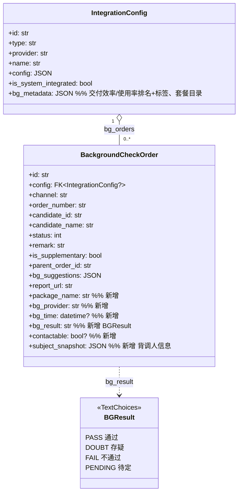
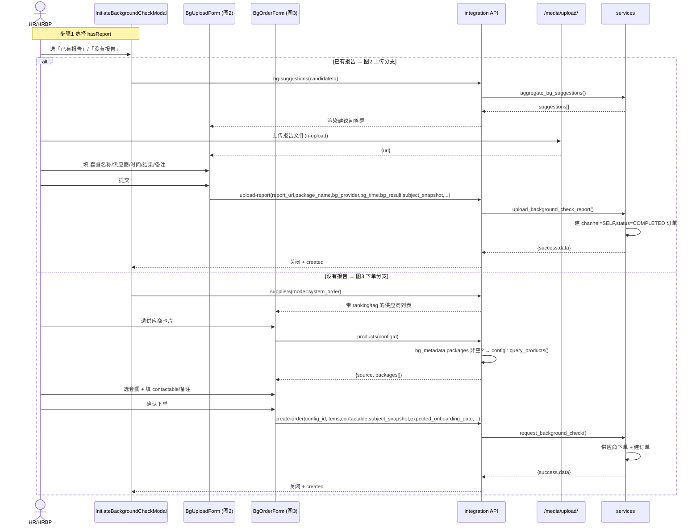

# 背调弹窗两分支 · 增量设计 + 任务分解

- 文档版本：v1.0
- 作者：架构师 高见远（software-architect）
- 日期：2026-10-08
- 范围：修复 `InitiateBackgroundCheckModal` 双「下一步」Bug + 扩展「上传分支（图2 添加背调信息）」与「下单分支（图3 供应商优选）」+ 后端可配置元数据 + 迁移。
- 约束来源：`AGENTS.md`（UI 交互约束）、既有 `integration` 模型/序列化/视图/服务、迁移纪律（新迁移、不动已应用迁移、不用 pandas）、`CamelCaseJSONRenderer`（响应体 snake→camel，query string 不转）。

---

## 0. 结论摘要（给主理人 / 工程师一句话）

1. **双按钮 Bug 根因已确认**：`InitiateBackgroundCheckModal.vue` 底部 L440 `v-if="step < 3 && !hasReport"` 与 L443 `v-if="step === 1"` 在 `step===1 && hasReport===null` 时**同时命中**（`!null === true`）。**修法**：删掉 L440 那一支，仅保留 `v-if="step === 1"` 的单一「下一步」按钮（详见 §4.5）。
2. **报告上传落地方案**：全仓已存在通用上传端点 `POST /api/v1/media/upload/`（`apps/common/views.MediaUploadView`），multipart 字段名 `file`，返回 `{success, data:{id,name,url,size,contentType}}`。**前端先调它拿到 `url`，再传 `upload-report` 的 `report_url`**；无需新增端点。
3. **可配置元数据落点**：`IntegrationConfig` 新增一个 `bg_metadata` JSON 字段（非列），存放「交付效率排名/标签、使用率排名/标签、套餐目录」，避免污染既有 `config` 且免迁移拆列。**未配置时优雅降级**（供应商列表不显示排名/标签，套餐回退到 `supplier.query_products()`）。
4. **新增模型字段**：在 `BackgroundCheckOrder` 上新增 `package_name / bg_provider / bg_time / bg_result / contactable / subject_snapshot`（详见 §1）。其中 `bg_provider` 是对你初稿的补充（图2 表单含「背调供应商」项）。

---

## 1. 数据模型设计

### 1.1 `BackgroundCheckOrder` 新增字段（校验/修订你的初稿）

| 字段 | 类型 | 可空 | max_length | choices | verbose_name | help_text | 适用分支 |
|---|---|---|---|---|---|---|---|
| `package_name` | `CharField` | blank | 100 | — | 套餐名称 | 上传分支填写的背调套餐名；下单分支冗余存选中套餐名 | 上传 / 下单 |
| `bg_provider` | `CharField` | blank | 100 | — | 背调供应商 | **补充你的初稿**：图2「背调供应商」项（自主上传时由用户填写，非 `IntegrationConfig` FK） | 上传 |
| `bg_time` | `DateTimeField` | null, blank | — | — | 背调时间 | 上传分支填写的「背调完成时间」 | 上传 |
| `bg_result` | `CharField` | blank | 16 | `BGResult`(见下) | 背调结果 | 上传分支人工结论（与供应商 `risk_level` 解耦） | 上传 |
| `contactable` | `BooleanField` | null, blank | — | — | 是否可以联系候选人 | 下单分支「其他信息」单选；`null`=未选 | 下单 |
| `subject_snapshot` | `JSONField` | default=dict, blank | — | — | 背调人信息快照 | `{name,phone,id_card_no,email,position,expected_onboarding_date}` | 上传 / 下单 |

**对初稿的修订说明**
- 你的初稿没有 `bg_provider`，但图2「添加背调信息」表单明确有「背调供应商」字段。**自主上传分支无 `IntegrationConfig` 关联**（`config=None`），该供应商只是元数据，故用 `CharField(100)` 自由文本，不建外键。
- `bg_result` 采用 `TextChoices` + `get_BG_RESULT_display()`，与既有 `BGOrderStatus/BGRiskLevel` 风格一致；**语义独立于 `risk_level`**（risk_level 是供应商回调风险评级，bg_result 是 HR 对自持报告的人工结论）。
- `subject_snapshot` 用 `JSONField`（非列），与既有 `bg_suggestions` 同套路；不建 `Candidate` 新列，避免迁移扩散。

**`BGResult` 枚举（建议值，可微调文案）**

```python
class BGResult(models.TextChoices):
    PASS = 'PASS', '通过'
    DOUBT = 'DOUBT', '存疑'
    FAIL = 'FAIL', '不通过'
    PENDING = 'PENDING', '待定'
```

> 注：`bg_result` 默认空串 `''`（非 `PENDING`），以便区分「未填」与「待定」。

**`subject_snapshot` JSON 形态（落库即存，前端 camelCase 传入）**

```json
{
  "name": "张三",
  "phone": "13800001111",
  "id_card_no": "110101199001011234",
  "email": "zhangsan@example.com",
  "position": "后端工程师",
  "expected_onboarding_date": "2026-11-01"   // 或 null
}
```

### 1.2 `IntegrationConfig` 新增可配置元数据字段

```python
bg_metadata = models.JSONField(
    default=dict, blank=True, verbose_name='背调展示元数据',
    help_text='交付效率/使用率排名与标签、套餐目录；前端未配置时优雅降级',
)
```

**为什么是 JSON 而非拆列**（取舍已判定）
- 这些是**展示用元数据**，不参与 WHERE/ORDER BY/索引，无需独立列。
- 与既有 `config` JSON 字段风格统一；但**不放进 `config`**，以免与 API URL/签名名混淆，且 `bg_metadata` 单独语义更清晰、便于管理端编辑。
- 单 JSON 字段免迁移拆列、易于整体读写与校验。

**`bg_metadata` JSON 形态（契约）**

```json
{
  "delivery_rank": 1,          // int|null  交付效率排名 #N
  "delivery_tag": "最快",       // str       交付效率标签
  "usage_rank": 1,             // int|null  使用率排名 #N
  "usage_tag": "最受欢迎",       // str       使用率标签
  "packages": [                // 套餐目录（空数组=回退 query_products）
    { "name": "面试预检套餐", "workdays": 1, "features": ["身份验证", "信贷风险信息"] },
    { "name": "人才审计套餐", "workdays": 3, "features": ["失信记录", "个人涉诉记录", "商业利益冲突"] },
    { "name": "一履套餐",   "workdays": 5, "features": ["教育经历", "工作履历", "不良记录查询"] }
  ]
}
```

> ⚠️ **严禁伪造数据**：仓库中不存在「猎查查/91背调/八方锦程」「面试预检/人才审计/一履套餐」等字符串（已三次全仓检索确认，均来自外部旧系统）。这些全部由管理员在 `IntegrationConfig.bg_metadata` 中自行配置；**代码层只消费、不内置默认值文本**。

### 1.3 迁移纪律

- 新建迁移 `0009_backgroundcheckorder_bg_fields_and_more.py`（依赖 `0008_*`），用 `AddField` 新增上述 6 个字段 + `IntegrationConfig.bg_metadata`。
- **不改** `0008` 及之前已应用迁移；**不用 pandas**。
- `bg_metadata` 默认 `dict`，旧数据无需回填（读时 `or {}` 降级）。

---

## 2. 可配置元数据设计：暴露方式

### 2.1 `suppliers` 接口暴露排名/标签

在 `BackgroundCheckOrderViewSet.suppliers` 中，把每条 `IntegrationConfig` 的 `bg_metadata` 展开进返回项：

```
GET /background-check/orders/suppliers/?mode=self_order|system_order
→ data: [
  {
    "id": "cfg-xxx", "name": "猎查查", "provider": "liecha",
    "isSystemIntegrated": true,
    "deliveryRank": 1, "deliveryTag": "最快",     // 来自 bg_metadata；缺失则为 null
    "usageRank": 1,   "usageTag": "最受欢迎"       // 缺失则为 null
  },
  ...
]
```

- `bg_metadata` 缺失/部分缺失 → 对应字段为 `null`，**前端不渲染排名/标签**（优雅降级）。
- `self_order` 伪选项 `__SELF__` 无 `bg_metadata` → 全部 `null`。

### 2.2 `products` 接口：配置优先 + 回退

```
GET /background-check/orders/products/?config_id=<cfg-id>
→ { "success": bool, "message": str, "data": { "source": "config"|"supplier", "packages": [...] } }
```

**决策流程（后端）**
1. 取 `config.bg_metadata.get('packages')`。
2. **非空** → `source="config"`，直接返回标准化套餐列表（不调供应商，离线可用）。
3. **为空** → 调 `supplier.query_products()`（既有逻辑，`BackgroundCheckResult`）：
   - 成功 → `source="supplier"`，把 `res.data` 规范化为 `{token, name, workdays:null, features:[]}`。
   - 失败/空 → `success=false`（或 `packages=[]` + 提示文案），前端走已有 `useManual` 手动填检查项降级。

**`packages` 元素标准化形态（camelCase）**

```json
{ "token": "pkg-token-or-name", "name": "面试预检套餐", "workdays": 1, "features": ["身份验证", "信贷风险信息"] }
```

- `config` 来源：`token` 取 `name`（或 slug）；`workdays`/`features` 取自配置。
- `supplier` 来源：`token` 取产品 token，`name` 取产品名，`workdays`/`features` 供应商未提供则为 `null`/`[]`。

**套餐目录为空时的契约（你的问题）**：**回退到 `query_products()`**。若两者皆空 → 返回 `packages=[]`，前端保留「手动填写检查项」兜底（现有 `manualItems` 路径）。

---

## 3. API 契约（请求/响应 JSON Schema，camelCase 形态）

> 响应体经 `CamelCaseJSONRenderer` 转 camel；请求体后端按 snake 解析（DRF）。下列响应均带统一信封 `{success, message, data}`（写操作）或分页信封（列表）。

### 3.1 `GET /background-check/orders/suppliers/`

请求 query：`mode=self_order | system_order | （空）`
响应 `data`：
```json
[
  {
    "id": "string", "name": "string", "provider": "string",
    "isSystemIntegrated": true,
    "deliveryRank": 1, "deliveryTag": "最快",
    "usageRank": 1, "usageTag": "最受欢迎"
  }
]
```
（排名/标签字段可能为 `null`）

### 3.2 `GET /background-check/orders/products/`

请求 query：`configId=string`（必填）
响应：
```json
{
  "success": true,
  "message": "",
  "data": {
    "source": "config",
    "packages": [
      { "token": "面试预检套餐", "name": "面试预检套餐", "workdays": 1, "features": ["身份验证"] }
    ]
  }
}
```

### 3.3 `POST /background-check/orders/create-order/`（下单分支）

请求体（新增字段加 `*`）：
```json
{
  "candidate_id": "string", "candidate_name": "string", "phone": "string",
  "config_id": "string", "items": ["pkg-token"], "channel": "SYSTEM_ORDER",
  "remark": "string", "parent_order_id": "string", "bg_suggestions": [],
  "has_existing_report": false,
  "package_name": "面试预检套餐",            // * 冗余存选中套餐名
  "bg_result": "",                          // * 下单分支一般空
  "contactable": true,                      // * 图3「是否可以联系候选人」
  "subject_snapshot": {                     // * 背调人信息快照
    "name": "张三", "phone": "13800001111", "id_card_no": "110...",
    "email": "z@x.com", "position": "后端工程师", "expected_onboarding_date": "2026-11-01"
  },
  "expected_onboarding_date": "2026-11-01"  // * 透传给供应商 CreateOrderRequest.expect_entry_time
}
```
响应：`{ "success": true, "data": { <BackgroundCheckOrderSerializer> } }`

### 3.4 `POST /background-check/orders/upload-report/`（上传分支）

请求体（新增字段加 `*`）：
```json
{
  "candidate_id": "string", "candidate_name": "string", "phone": "string",
  "report_url": "https://.../file.pdf",     // 由 /media/upload/ 返回的 url
  "remark": "备注", "answers": [], "bg_suggestions": [], "parent_order_id": "string",
  "package_name": "面试预检套餐",            // * 图2 套餐名称
  "bg_provider": "猎查查",                   // * 图2 背调供应商
  "bg_time": "2026-10-01T10:00:00Z",        // * 图2 背调时间
  "bg_result": "PASS",                       // * 图2 背调结果（BGResult）
  "subject_snapshot": { "name": "...", "phone": "...", "id_card_no": "...", "email": "...", "position": "...", "expected_onboarding_date": null }
}
```
响应：`{ "success": true, "data": { <BackgroundCheckOrderSerializer> } }`

> 后端落库：`upload_background_check_report` 创建 `channel=SELF, status=COMPLETED(1)` 订单，并写入 `package_name/bg_provider/bg_time/bg_result/subject_snapshot`。

### 3.5 `POST /api/v1/media/upload/`（通用文件上传，复用）

请求：multipart，字段名 `file`（PDF/Word/图片，≤20MB，见 `apps/common/storage.ALLOWED_EXT`）。
响应：
```json
{ "success": true, "data": { "id": "uploads/.../uuid.pdf", "name": "报告.pdf", "url": "/media/uploads/.../uuid.pdf", "size": 12345, "contentType": "application/pdf" } }
```
- 鉴权：`IsAuthenticated`。失败返回 `{success:false, message}`，前端 `message.error` 不静默。

---

## 4. 前端组件结构

### 4.1 是否抽子组件 —— 推荐「抽两个子表单」

| 方案 | 结论 |
|---|---|
| 维持单文件 `InitiateBackgroundCheckModal.vue` | ❌ 现有已 460 行，再加图2/图3 字段会失控，难测 |
| 抽 `BgUploadForm.vue` + `BgOrderForm.vue`，弹窗做编排器 | ✅ **推荐**：每个子表单独立校验/测试，弹窗只管步骤路由与提交 |

- `InitiateBackgroundCheckModal.vue`：**编排器**。步骤1 单选「是否已有报告」+ 底部 取消/上一步/下一步/提交 路由 + 加载 `suppliers/products/suggestions` + 调 API。
- `BgUploadForm.vue`：**图2 添加背调信息**（上传分支）。props `{ candidate, suggestions, submitting }`，emit `submit(payload)` / `cancel`。
- `BgOrderForm.vue`：**图3 供应商优选**（下单分支）。props `{ candidate, suppliers, submitting }`，内部按选中供应商拉 `products`，emit `submit(payload)` / `cancel`。

### 4.2 Props 扩展（推荐：扩展 props，不弹窗内自拉）

`CandidateDetail.vue` 已 `onMounted` 拉取 `candidateDetail`（含 `id_card_no/email/current_position`），直接透传最省事：

```ts
interface BgCandidate {
  id: string
  name: string
  phone: string
  idCardNo?: string      // candidateDetail.id_card_no（注意脱敏，见 §7）
  email?: string         // candidateDetail.email
  position?: string      // candidateDetail.current_position
  expectedOnboardingDate?: string | null  // 来自 Offer.start_date（若有）；否则 ''，表单内可编辑
}
```

`CandidateDetail.vue` L472 改为：
```ts
:candidate="{ id: candidateData.id, name: candidateData.name, phone: candidateData.phone,
              idCardNo: candidateDetail?.id_card_no, email: candidateDetail?.email,
              position: candidateDetail?.current_position, expectedOnboardingDate: '' }"
```
> 预计入职日期：Candidate 模型**无此字段**（仅在 `Offer.start_date` / `Onboarding.start_date`）。推荐表单内作为**可编辑输入**（默认空），落入 `subject_snapshot.expected_onboarding_date`。若主理人要求从 Offer 预填，需 `CandidateDetail` 额外拉最新 Offer——见 §7 待明确。

### 4.3 状态机（折叠为 2 阶段，贴合参考图）

```
step=1  choose     : 单选 hasReport (null|true|false)
  ├─ hasReport=true  → step=2 渲染 BgUploadForm（图2）
  └─ hasReport=false → step=2 渲染 BgOrderForm（图3，单屏，无 step3）
step=2  branch     : 提交即终态（upload-report / create-order）
```

- 底部按钮随阶段切换（见 §4.5）。
- `goBack`：从 step=2 回到 step=1（重置分支选择，保留候选人信息）。
- `resetAll`：关闭弹窗时重置 `hasReport=null`、清空子表单（敏感字段 `idCardNo` **不进草稿**，见 §7）。

### 4.4 校验规则

**BgUploadForm（图2）**
- 套餐名称 `packageName`：必填（n-input）。
- 背调供应商 `bgProvider`：必填（n-input）。
- 背调时间 `bgTime`：必填（n-date-picker，date→ISO）。
- 背调结果 `bgResult`：必填（n-select，`BG_RESULT` 选项）。
- 背调报告：必填——先 `n-upload` → `/media/upload/` 拿 `url`，或粘贴 `report_url`；二选一。
- 备注 `remark`：选填，计数器 0/200（超长禁用提交）。

**BgOrderForm（图3）**
- 背调人信息：预填展示，`expectedOnboardingDate` 可编辑（n-date-picker）。
- 选择背调供应商：必选（卡片单选，带排名/标签降级）。
- 套餐信息：必选 ≥1（卡片多选/单选，带 workdays+features）。
- 是否可以联系候选人 `contactable`：必选（n-radio 可以/不可以，带 tooltip 说明）。
- 订单备注：选填，0/200。

### 4.5 双「下一步」Bug 的确切修法

**现状（L432–455  footer）**：
```html
<n-button v-if="step > 1" ... @click="goBack">上一步</n-button>
<n-button v-if="step < 3 && !hasReport" type="primary" ... @click="goNext">下一步</n-button>   <!-- L440 -->
<n-button v-if="step === 1" type="primary" ... @click="goNext">下一步</n-button>               <!-- L443 -->
<n-button v-if="(step === 2 && hasReport) || step === 3" ... @click="handleSubmit">…</n-button>  <!-- L446 -->
```
`step===1` 时 `hasReport===null` → `!hasReport` 为 `true` → L440 与 L443 **同时渲染** → 两个「下一步」。

**修复后 footer（删 L440，统一为单按钮；提交条件随新状态机调整）**：
```html
<n-space justify="end">
  <n-button :disabled="submitting" @click="emit('update:show', false)">
    {{ t('pages.candidate.InitiateBgCheck.cancel') }}
  </n-button>
  <n-button v-if="step > 1" :disabled="submitting" @click="goBack">
    {{ t('pages.candidate.InitiateBgCheck.back') }}
  </n-button>
  <n-button v-if="step === 1" type="primary" :disabled="submitting" @click="goNext">
    {{ t('pages.candidate.InitiateBgCheck.next') }}
  </n-button>
  <n-button v-if="step === 2 && hasReport" type="primary" :loading="submitting" @click="handleUpload">
    {{ t('pages.candidate.InitiateBgCheck.submitUpload') }}
  </n-button>
  <n-button v-if="step === 2 && !hasReport" type="primary" :loading="submitting" @click="handleOrder">
    {{ t('pages.candidate.InitiateBgCheck.confirmOrder') }}
  </n-button>
</n-space>
```
> 即：步骤1 只有「下一步」；步骤2 按 `hasReport` 显示「上传并创建」或「确认下单」；不再有 `step===3`。同步把 `goNext`/`handleSubmit` 逻辑收敛（`handleSubmit` 删除或保留为别名）。

### 4.6 UI 约束自检要点（交付给工程师，援引 AGENTS.md）

- 品牌色/语义色一律走 CSS 变量（`--brand`/`--c-warning` 等），**不手写**；`n-button type="primary"` 已全局接管渐变。
- 文案走 vue-i18n 双写；微文案「动词+宾语」：`确认下单`/`上传并创建`/`提交`（备注）/`取消`，不用「确定/是/否」。
- 异步四态：loading（按钮 `:loading`+disabled）、空态（无供应商/无套餐）、成功（`message.success`）、失败（`message.error` 不静默，带三层式文案）。
- 输入不丢失：`idCardNo` 属敏感字段，**整体禁用草稿**（R-105 敏感字段清单命中 `idcard`）。
- 图标统一 `@vicons/ionicons5`，尺寸分档；无文字图标加 `title`/`aria-label`。

---

## 5. 文件级任务列表（有序 + 依赖，后端→前端→i18n）

| Task | 名称 | 依赖 | 优先级 | 改动文件（相对仓库根） |
|---|---|---|---|---|
| **T1** | 后端：模型 + 迁移 + 序列化 | — | P0 | `apps/django/apps/integration/models.py`<br>`apps/django/apps/integration/migrations/0009_backgroundcheckorder_bg_fields_and_more.py`<br>`apps/django/apps/integration/serializers.py` |
| **T2** | 后端：API + 服务层扩展 | T1 | P0 | `apps/django/apps/integration/views.py`<br>`apps/django/apps/integration/services.py` |
| **T3** | 前端：API 层 + 组件重构 + 双按钮修复 | T2 | P0 | `web/app/src/api/integration.ts`<br>`web/app/src/pages/candidate/InitiateBackgroundCheckModal.vue`<br>`web/app/src/pages/candidate/BgUploadForm.vue`（新建）<br>`web/app/src/pages/candidate/BgOrderForm.vue`（新建）<br>`web/app/src/pages/candidate/CandidateDetail.vue` |
| **T4** | 国际化：双语文案 | T3 | P1 | `web/app/src/locales/zh-CN.ts`<br>`web/app/src/locales/en-US.ts` |
| **T5** | 联调与验证（交接 QA #3 做运行时取证） | T1–T4 | P1 | 后端 `manage.py check` + `migrate --dry-run`；前端 `npm run typecheck` + `build`；QA 任务 #3 负责浏览器运行时取证（三档视口/对比度/命中区） |

**各文件改动要点**

- **T1 `models.py`**：新增 `BGResult` TextChoices；`BackgroundCheckOrder` 加 `package_name/bg_provider/bg_time/bg_result/contactable/subject_snapshot`；`IntegrationConfig` 加 `bg_metadata` JSONField。
- **T1 迁移 `0009_*`**：6 个 `AddField` + `bg_metadata`；`dependencies=['integration','0008_...']`；**不触及旧迁移**。
- **T1 `serializers.py`**：`BackgroundCheckOrderSerializer` 字段列表补 `package_name/bg_provider/bg_time/bg_result/contactable/subject_snapshot`；新增 `BGResult` display 方法；`suppliers` 列表项在视图层拼排名（序列化器无需改，视图直接 `values` + 合并 `bg_metadata`）。
- **T2 `views.py`**：`suppliers` 展开 `bg_metadata` 排名/标签；`products` 配置优先 + 回退 `query_products()`，返回 `{source, packages}`；`create_order`/`upload_report` 解析并透传新字段（`package_name/bg_provider/bg_time/bg_result/contactable/subject_snapshot/expected_onboarding_date`）。
- **T2 `services.py`**：`upload_background_check_report` 接收并落库上述字段；`create_background_check_order`/`request_background_check` 透传 `contactable`/`subject_snapshot`/`expected_onboarding_date`（后者进 `CreateOrderRequest.expect_entry_time`/`contact_candidate`）。
- **T3 `integration.ts`**：`BackgroundCheckSupplier` 补 `deliveryRank?/deliveryTag?/usageRank?/usageTag?`；新增 `BgPackage {token,name,workdays,features}` 类型；`getBackgroundCheckProducts` 返回 `{success,message,data:{source,packages}}`；`createBackgroundCheckOrder`/`uploadBackgroundCheckReport` payload 补新字段；新增 `uploadMedia(file): Promise<{id,name,url,size,contentType}>` 封装 `/media/upload/`。
- **T3 `InitiateBackgroundCheckModal.vue`**：状态机折叠为 choose/branch；**§4.5 双按钮修复**；改为渲染 `BgUploadForm`/`BgOrderForm` 并桥接提交；props 扩展 `BgCandidate`。
- **T3 `BgUploadForm.vue` / `BgOrderForm.vue`**：按 §4.1/§4.4 实现表单与校验，调 `uploadMedia` + 对应 API。
- **T3 `CandidateDetail.vue`**：L472 props 透传 `idCardNo/email/position/expectedOnboardingDate`。
- **T4 i18n**：在 `pages.candidate.InitiateBgCheck.*` 命名空间补 `confirmOrder`、`bgResult*`、`bgProvider`、`bgTime`、`packageName`、`contactable*`、`expectedOnboardingDate`、`deliveryRank`/`usageRank` 标签、`supplierCard`/`packageCard` 等键，中英双写。

---

## 6. 共享约定（跨文件一致）

| 类别 | 约定 |
|---|---|
| `bg_result` 枚举 | DB 值 `PASS/DOUBT/FAIL/PENDING`；前端常量 `BG_RESULT = [{value:'PASS',label:...},...]`；i18n `InitiateBgCheck.bgResultPass` 等 |
| 排名/标签 | 字段名 `deliveryRank/deliveryTag/usageRank/usageTag`（camel）；后端 `bg_metadata` 键 `delivery_rank/delivery_tag/usage_rank/usage_tag` |
| 套餐 | `packages:[{name, workdays, features}]`；前端元素 `{token, name, workdays, features}` |
| i18n key 前缀 | 全部 `pages.candidate.InitiateBgCheck.*`（沿用既有命名空间，不新建） |
| CSS class 前缀 | 沿用 `bg-`（`bg-field-label`/`bg-candidate`/`bg-muted`/`bg-q__ask`），新表单复用同前缀，禁止新造 |
| 颜色令牌 | 仅用 `--brand`/`--c-warning`/`--c-info-soft`/`--text-color-*`/`--border-hairline` 等既有变量 |
| 报告上传 | 统一走 `/media/upload/` → `report_url`；禁止在前端硬编码对象存储路径 |
| 敏感字段 | `idCardNo` 全程不进 localStorage 草稿；列表/快照存储按用户输入（见 §7） |

---

## 7. 待明确事项（无法从现有代码判定 / 需主理人拍板）

1. **预计入职日期来源（影响 T3/T4）**
   - 事实：`Candidate` 模型**无**「预计入职日期」字段；该值在 `Offer.start_date` / `Onboarding.start_date`。
   - 推荐：表单内作为可编辑输入（默认空），落入 `subject_snapshot.expected_onboarding_date`，**不给 Candidate 加列**。
   - 待定：是否要 `CandidateDetail` 额外拉「最新 Offer」预填？若需，T3 增加一次 `getOffer` 调用。

2. **身份证号脱敏（影响 T1/T3 数据正确性）**
   - 事实：`CandidateDetailSerializer` 对**非超管**将 `id_card_no` 脱敏（`110***********1234`）。`CandidateDetail.vue` 当前 `candidateDetail.id_card_no` 拿到的是**脱敏串**。
   - 风险：若直接把脱敏串存进 `subject_snapshot.id_card_no`，背调订单里就是 `*` 星号，无业务价值。
   - 推荐：把图3「背调人信息」的 `id_card_no` 当作**可编辑输入框**（预填脱敏值，用户可改填真实号），即快照存用户输入。
   - 待定：是否需新增「特权端点」返回明文身份证给 HRBP？若无，按「可编辑输入」实现。

3. **`bg_result` 枚举文案（影响 T1/T4）**
   - 我建议 `通过/存疑/不通过/待定`（值 `PASS/DOUBT/FAIL/PENDING`）。若主理人想用别的标签，请在 T1 开工前确认，避免迁移后改 choices。

4. **下单分支 `package_name` 是否冗余落库**
   - `create-order` 已用 `items`（套餐 token）表达选择；`package_name` 仅作人类可读冗余。建议**冗余存储**（便于订单列表直接显示），T2 由前端把选中套餐 `name` 一并传入。

5. **套餐多选 vs 单选（图3）**
   - 参考图未明确。建议：**单选套餐**（一次背调下一单套餐），`items=[selectedToken]`。若实际要多选，T3 `BgOrderForm` 改为多选 + `items` 数组，其余不变。

6. **报告上传是否必填文件 vs 允许纯链接**
   - 现有 `upload-report` 只收 `report_url`。建议**两者皆可**：`n-upload` 走 `/media/upload/` 拿 url，或粘贴链接；前端统一成 `report_url` 提交。已在 §3.5/§4.4 写明。

---

## 附录 A：类图（Mermaid classDiagram）



## 附录 B：调用时序（Mermaid sequenceDiagram）


